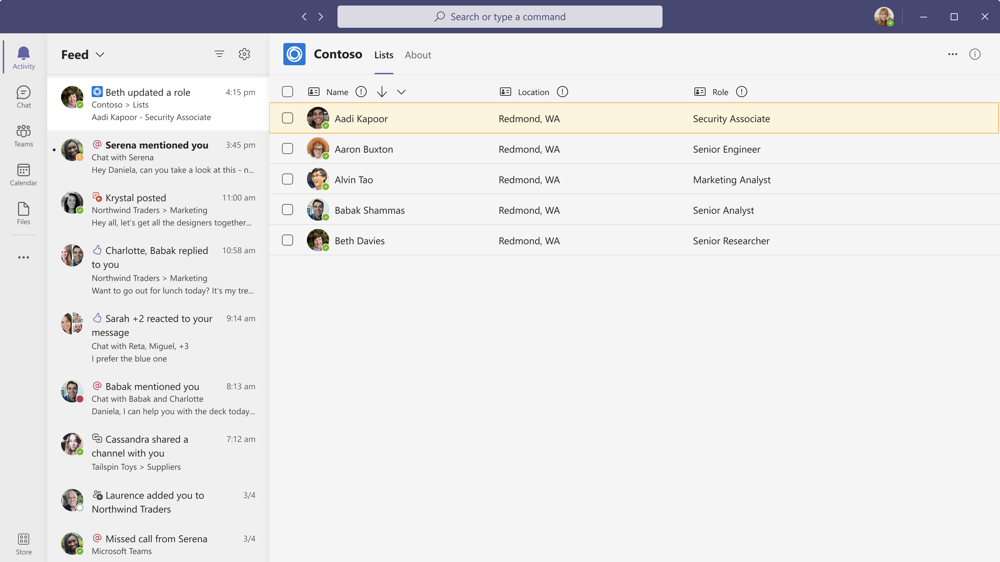

# 使用活动源Microsoft Teams的最佳实践Best practices for using Microsoft Teams activity feed notifications

本文介绍了在 Microsoft Microsoft Teams 中使用活动源Graph。This article covers best practices for using Microsoft Teams activity feed notifications in Microsoft Graph. 这些最佳做法适用于：These best practices apply to:
* 创建行动号召通知Creating call-to-action notifications
* 请求通知响应Requesting responses to notifications
* 创建有关外部事件的通知Creating notifications about external events

下图显示了活动源通知中Teams：The following image shows an example of an activity feed notification in Teams:

实现活动源通知时，请记住以下几点：When you implement activity feed notifications, keep the following points in mind:
* Toast 通知将用户重定向到活动源，而不是应用。Toast notifications redirect users to the activity feed, not to the app. 若要查看其他活动，用户必须在活动源中选择关联的通知。To see another activity, users must select the associated notification in the activity feed.
* 只有在选定应用发送通知后，用户才能管理通知设置。Users can manage notification settings only after the selected app sends a notification.
* 每个通知的图标都包含在应用清单中。The icon for each notification is included in the app manifest. Microsoft Graph不支持自定义图标。Microsoft Graph does not support customizing the icon.
* 不支持优先级通知。Priority notifications are not supported.

## 增强通知体验Enhance the notification experience

Microsoft Teams以活动源和 Toast 格式显示通知。Microsoft Teams displays notifications in both activity feed and toast formats. 用户通过聊天、频道、会议或其他应用接收来自多个源的通知。Users receive notifications from multiple sources across chats, channels, meetings, or other apps. 若要增强用户体验，请应用以下建议：To enhance the user experience, apply the following recommendations:

* 本地化通知 toast 或源中的内容。Localize the content in a notification toast or feed. 本地化仅在应用内容本地化 [时发生](/microsoftteams/platform/concepts/build-and-test/apps-localization)。The localization happens only if the app’s content is [localized](/microsoftteams/platform/concepts/build-and-test/apps-localization).
* 为活动类型提供适当的标题 **和说明**。Provide appropriate titles and descriptions for your **Activity Types**. 使用短标题，如 **@mention\*\*\*\*和通知**。Use short titles, such as **@mention** and **Announcements**. 避免使用长标题，例如"提到 **的用户"活动和** " **创建后"活动**。Avoid long titles, such as **User at-mentioned activity** and **Post creation activity**.
* 通知应传达与用户相关的重要信息。Notifications should convey important information that is relevant to the user. 例如 *，在 一个销售票证分配给你* 时，是一条相关消息; *Joni 未离开* 销售团队。For example, *Diego assigned a sales ticket to you* is a relevant message; *Joni left the sales team* is not.
* 避免发送本质上是促销性的通知，例如尝试循环 *应用中的新功能*。Avoid sending notifications that are promotional in nature, such as *Try the new feature in the Cycling app*.
* 避免来自自动程序消息和活动源通知的重复通知。Avoid duplicate notifications from bot messages and activity feed notifications. 有关详细信息，请参阅活动 [源通知或自动程序框架消息](#activity-feed-notifications-or-bot-framework-messages)。For more information, see [activity feed notifications or bot framework messages](#activity-feed-notifications-or-bot-framework-messages).
* 使用 **通知中的** 文本预览部分。Use the **text preview** section in notifications. 提供可帮助用户确定通知重要性的信息，并在必要时采取措施。Provide information to help the user determine the importance of the notification and take action, if necessary.
* 请勿在通知标题末尾添加一个时间段，以与通知标题中的所有其他通知设置Teams。Don't add a period at the end of the notification title, to be consistent with with all other notification settings in Teams.
* 让用户清楚通知及其内容之间的关系。Make the relationship between the notification and its content clear to the user. 例如，当用户收到批准请假的通知时，通知应将其重定向到应用的相应部分。For example, when a user receives a notification for approving a leave, the notification should redirect them to the corresponding section of the app. 如果通知与删除实体（如用户和任务）相关，请引导收件人访问内容并指示所需操作。If the notification pertains to removal or deletion of entities, such as users and tasks, direct the recipient to the content and indicate the required action.
* 确保源体验是自包含的。Make sure that the feed experience is self-contained. 例如，任何弹出窗口和模式必须保留在应用中。For example, any pop-ups and modals must remain in the app.
* 验证你的应用每分钟每个用户发送的通知数是否不超过 10 个。Verify that your app does not send more than 10 notifications per minute, per user. 如果计数超过 10，将自动限制通知。Notifications will be automatically throttled if the count exceeds 10.
* 确保应用的加载时间不会对用户在源中的通知之间切换时的体验产生负面影响。Ensure that the load time of your app does not negatively affect the experience for users when they switch between notifications in the feed.
* 通知用户活动源中的通知存储周期。Inform the user about the notifications storage period in the activity feed. 在Microsoft Teams中，存储期限为 30 天。In Microsoft Teams, the storage period is 30 days.
    > [!NOTE]
    > 30 天存储限制适用于所有通知。The 30 day storage limit applies to all notifications. 它并不特定于通过活动源通知 API 发送的通知。It's not specific to notifications sent through the activity feed notifications API.

## 活动源通知或自动程序框架消息Activity feed notifications or bot framework messages

可以使用活动源通知或自动程序框架消息，但请勿同时使用这两种通知类型。You can use either activity feed notifications or bot framework messages, but don't use both notification types. 以下各节介绍通知类型以及何时使用每一种通知类型。The following sections describe the notification types and when to use each. 

### 活动源通知Activity feed notifications

活动源通知显示在活动Teams中，并可以包含指向不同位置的链接。Activity feed notifications appear in the Teams activity feed and can include links to various locations. 这些通知：These notifications: 
* 允许用户采取措施或对通知进行会审。Allow the user to take action or triage the notification.
* 将用户引导到聊天或频道、个人应用、聊天或频道消息中的选项卡。Lead the user to a tab in a chat or channel, a personal app, or a chat or channel message. 

活动源通知 API 允许用户根据通知设置为每个 **通知类型** 配置通知。The activity feed notifications API allows users to configure notifications for each **notification type** from notification settings.

如果使用活动源通知，请注意，如果应用向聊天或频道以及活动源发送自动程序通知，则应用可能会发送双重通知。If you use activity feed notifications, be aware that your app might send double notifications, if it sends bot notifications to chats or channels and also to the activity feed. 仅在方案需要时发送双重通知。Only send double notifications if your scenario requires it. 

使用委派通知创建更好的通知体验。Use delegated notifications to create a better notification experience. 活动源通知 API 可以发送委托调用或仅应用程序调用。The activity feed notification API can send either delegated or application-only calls. 在委派呼叫中，通知的发件人显示为启动通知的用户，在仅应用程序呼叫中，发件人显示为应用程序。In delegated calls, the sender of the notification appears as the user who initiated the notification, and in application-only calls, the sender appears as the app. 

可以更新现有活动源通知，而不是使用 *chainId* 参数创建新的通知。You can update an existing activity feed notification instead of creating a new notification by using the *chainId* parameter.

### 自动程序框架消息Bot framework messages

自动程序消息作为聊天或频道消息传递。Bot messages are delivered as chat or channel messages. 如果用户打开聊天或频道通知，则触发的通知将作为聊天或频道消息发送。If the user turns on chat or channel notifications, the notifications that are triggered are sent as chat or channel messages. 若要发送自动@mention，请指定通知显示在活动源中的用户名称。To send bot messages, *@mention* the name of the user for the notification to appear in the activity feed.

将警报用作聊天或频道消息非常有用;例如，所有频道成员使用的消息。It is useful for the alert to be consumed as a chat or channel message; for example, a message that is consumed by all channel members.
