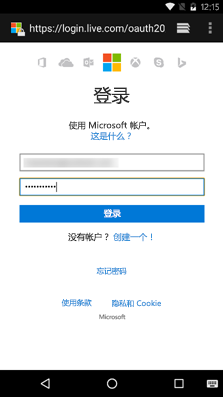

# <a name="get-started-with-microsoft-graph-in-an-android-app"></a>在 Android 应用中开始使用 Microsoft Graph

> **为企业客户生成应用？**如果企业客户启用企业移动性安全功能，如<a href="https://azure.microsoft.com/en-us/documentation/articles/active-directory-conditional-access-device-policies/" target="_newtab">条件性设备访问</a>，应用可能无法运行。在这种情况下，你可能不知道，而且客户可能会遇到错误。 

> 若要在**所有企业方案**中支持**所有企业客户**，必须使用 Azure AD 终结点并使用 [Azure 管理门户](https://aka.ms/aadapplist)管理应用。有关详细信息，请参阅 [在 Azure AD 和 Azure AD v2.0 终结点之间进行选择](../concepts/auth_overview.md#deciding-between-the-azure-ad-and-azure-ad-v20-endpoints)。

本文介绍了从 Azure AD v2.0 终结点获取访问令牌和调用 Microsoft Graph 所需的任务。介绍了生成 [Android 连接示例](https://github.com/microsoftgraph/android-java-connect-sample)的步骤，并说明实现在面向 Android 的应用中使用 Microsoft Graph 的主要概念。本文还介绍如何通过使用[用于 Android 的 Microsoft Graph SDK](https://github.com/microsoftgraph/msgraph-sdk-android) 或原始 REST 调用来访问 Microsoft Graph。

若要在面向 Android 的应用中使用 Microsoft Graph，则需要向用户显示 Microsoft 登录页，如以下屏幕截图中所示。



**不想生成一个应用吗？**通过下载本文所基于的 [Android 连接示例](https://github.com/microsoftgraph/android-java-connect-sample)快速准备就绪并开始运行。


## <a name="prerequisites"></a>先决条件

若要开始，将需要以下各项： 

- 一个 [Microsoft 帐户](https://www.outlook.com/) 或者一个[工作或学校帐户](http://dev.office.com/devprogram)
- Android Studio 2.0 或更高版本


## <a name="configure-a-new-project"></a>配置新项目

如果已下载 [Android 连接示例](https://github.com/microsoftgraph/android-java-connect-sample)，请跳过此步骤。 

在 Android Studio 中开始一个新项目。可以保留大多数向导的默认值，只需确保选择下列选项：

* 目标 Android 设备 - **电话和平板电脑**
    * 最小 SDK - **API 16：Android 4.1 (Jelly Bean)**
* 将活动添加到移动电话 - **基本活动**
 
这为你提供一个带有活动和按钮的 Android 项目，可以用来对用户进行身份验证。


## <a name="register-the-application"></a>注册应用程序

需要在 [Microsoft 应用注册门户](https://apps.dev.microsoft.com/)中注册应用，无论是已下载连接示例还是创建了新项目。

在 Microsoft 应用注册门户上注册一个应用。这会生成用于配置此应用的应用 ID。

1. 使用个人或工作或学校帐户登录到 [Microsoft 应用注册门户](https://apps.dev.microsoft.com/)。

2. 选择“**添加应用**”。

>提示：如果已下载 [Android 连接示例](https://github.com/microsoftgraph/android-java-connect-sample)且正在为其创建注册，请在关闭“创建”****按钮前先取消选中“引导设置”****。

3. 输入应用的名称，并选择“创建”****。 
    
    对于“引导设置”****流：
 
    a.选择“移动和桌面应用”****来定义要创建的应用的类型。

    b.选择“Android”****来定义要使用的移动技术。

    c.查看介绍性主题，完成后，单击页面底部的“设置”****按钮。

    d.根据有关“设置”****步骤的说明，将 MSAL 库添加到应用 build.gradle 中。

    e.根据有关“使用”****步骤的指示，将 MSAL 逻辑添加到新项目中

    f.在“配置”****页上，门户已为你创建唯一的应用程序 ID。使用它来配置应用。

    对于非引导流：

    将显示注册页，其中列出应用的属性。

    a.复制应用程序 ID。这是应用的唯一标识符。 

    b.选择“添加平台”****和“本机应用程序”****。

    > **注意：**应用程序注册门户提供值为 *msalYOUR NEW APP ID://auth* 的重定向 URI。不要使用内置重定向 URI。[Android 连接示例](https://github.com/microsoftgraph/android-java-connect-sample)实现需要此重定向 URI 的 MSAL 身份验证库。如果使用[受支持的第三方库](https://docs.microsoft.com/en-us/azure/active-directory/develop/active-directory-v2-libraries#compatible-client-libraries)或 **ADAL** 库，则必须使用内置重定向 URI。

    对于引导设置流和非引导流

    a.添加委派权限。将需要**配置文件**、**Mail.ReadWrite**、**Mail.Send**、**Files.ReadWrite** 和 **User.ReadBasic.All**。 
   
    b.选择“保存”****。


## <a name="authenticate-the-user-and-get-an-access-token"></a>对用户进行身份验证并获取一个访问令牌

> **注意：**如果已按照应用程序注册门户中“引导设置”****流中的说明创建一个新的应用程序，则可以跳过这些步骤。转到[使用 Microsoft Graph SDK 调用 Microsoft Graph](#call-microsoft-graph-using-the-microsoft-graph-sdk) 以了解有关 Graph API 的详细信息。

让我们展示一下 [Android 连接示例](https://github.com/microsoftgraph/android-java-connect-sample)的整个过程以了解我们已经添加的 MSAL 和 Microsoft Graph 代码。

### <a name="add-the-dependency-to-appbuildgradle"></a>向 app/build.gradle 添加依赖项

在应用模块中打开 `build.gradle` 文件，并查找以下依赖项：

```gradle
    compile ('com.microsoft.identity.client:msal:0.1.+') {
        exclude group: 'com.android.support', module: 'appcompat-v7'
    }
    compile 'com.android.volley:volley:1.0.0'

```

### <a name="start-the-authentication-flow"></a>启动身份验证流

1. 打开 **AuthenticationManager** 文件并查找 **PublicClientApplication** 对象声明，然后查找 **getInstance** 方法中的站内实例。

   ```java
    private static PublicClientApplication mPublicClientApplication;
    ....

    public static synchronized AuthenticationManager getInstance() {
        if (INSTANCE == null) {
            INSTANCE = new AuthenticationManager();
            if (mPublicClientApplication == null) {
                mPublicClientApplication = new PublicClientApplication(Connect.getInstance());
            }
        }
        return INSTANCE;
    }

   ```


2. 在 **ConnectActivity** 类中，找到 **mConnectButton** 的 click 事件的事件处理程序。查找 **onClick** 方法并审查相关代码。
  
    **connect** 方法支持个人身份信息 (PII) 日志记录，获取示例帮助程序类 **AuthenticationManager** 的实例，并获取 MSAL 平台对象用户集合。如果没有用户，会对新用户执行 Azure AD 身份验证和授权流。否则，以静默方式获取身份验证令牌。

   ```java
    @Override
    public void onClick(View view) {
        ....
        connect();
    }

        private void connect() {

        if (mEnablePiiLogging) {
            Logger.getInstance().setEnablePII(true);
        } else {
            Logger.getInstance().setEnablePII(false);
        }

        AuthenticationManager mgr = AuthenticationManager.getInstance();

        List<User> users = null;

        try {
            users = mgr.getPublicClient().getUsers();

            if (users != null && users.size() == 1) {
                mUser = users.get(0);
                mgr.callAcquireTokenSilent(mUser, true, this);
            } else {
                mgr.callAcquireToken(
                        this,
                        this);
            }
        } catch (MsalClientException e) {
            Log.d(TAG, "MSAL Exception Generated while getting users: " + e.toString());

        } catch (IndexOutOfBoundsException e) {
            Log.d(TAG, "User at this position does not exist: " + e.toString());
        }
    }

   ```
3. 查找处理当用户关闭身份验证对话框时由 Azure AD 生成的 Azure AD 重定向响应的事件处理程序。该处理程序位于 **ConnectActivity** 类中。

   ```java
       /**
     * Handles redirect response from https://login.microsoftonline.com/common and
     * notifies the MSAL library that the user has completed the authentication
     * dialog
     * @param requestCode
     * @param resultCode
     * @param data
     */
    @Override
    protected void onActivityResult(int requestCode, int resultCode, Intent data) {
        super.onActivityResult(requestCode, resultCode, data);
        if (AuthenticationManager
                .getInstance()
                .getPublicClient() != null) {
            AuthenticationManager
                    .getInstance()
                    .getPublicClient()
                    .handleInteractiveRequestRedirect(requestCode, resultCode, data);
        }
    }

   ```    
3. 查找缓存用于 Graph API 调用的身份验证令牌的身份验证回调方法。

 

```java
    /* Callback used for interactive request.  If succeeds we use the access
         * token to call the Microsoft Graph. Does not check cache
         */
    private AuthenticationCallback getAuthInteractiveCallback() {
        return new AuthenticationCallback() {
            @Override
            public void onSuccess(AuthenticationResult authenticationResult) {
            /* Successfully got a token, call graph now */
                Log.d(TAG, "Successfully authenticated");
                Log.d(TAG, "ID Token: " + authenticationResult.getIdToken());

            /* Store the auth result */
                mAuthResult = authenticationResult;
                if (mActivityCallback != null)
                    mActivityCallback.onSuccess(mAuthResult);
            }

            @Override
            public void onError(MsalException exception) {
            /* Failed to acquireToken */
                Log.d(TAG, "Authentication failed: " + exception.toString());
                if (mActivityCallback != null)
                    mActivityCallback.onError(exception);
            }

            @Override
            public void onCancel() {
            /* User canceled the authentication */
                Log.d(TAG, "User cancelled login.");
            }
        };
    }

```
    
连接示例应用在主活动上具有“连接”****按钮。如果按下该按钮，首次使用时，应用会使用设备浏览器显示身份验证页。下一步是处理授权服务器发送到重定向 URI 的代码，并用它来交换访问令牌。

### <a name="exchange-the-authorization-code-for-an-access-token"></a>用授权代码交换访问令牌

需要让应用准备就绪，以处理授权服务器的响应，其中包含用于交换访问令牌的代码。

1. 我们需要告诉 Android 系统，Connect 应用可以处理应用程序注册中所配置的重定向 URL 的请求。若要执行此操作，请打开 **AndroidManifest** 文件并将以下子项添加到项目 **\<application/\>** 元素中。
    ```xml
        <uses-sdk tools:overrideLibrary="com.microsoft.identity.msal" />
        <application ...>
            ...
            <activity
                android:name="com.microsoft.identity.client.BrowserTabActivity">
                <intent-filter>
                    <action android:name="android.intent.action.VIEW" />
                    <category android:name="android.intent.category.DEFAULT" />
                    <category android:name="android.intent.category.BROWSABLE" />
                    <data android:scheme="msalENTER_YOUR_CLIENT_ID"
                        android:host="auth" />
                </intent-filter>
            </activity>
            <meta-data
                android:name="https://login.microsoftonline.com/common"
                android:value="authority string"/>
            <meta-data
                android:name="com.microsoft.identity.client.ClientId"
                android:value="ENTER_YOUR_CLIENT_ID"/>
        </application>
    ```
2. **MSAL** 库需要访问由注册门户分配的应用程序 ID。**MSAL 库将应用程序 ID 称为“客户端 ID”**。从传入库构造函数的应用程序上下文获取应用程序 ID（客户端 ID）。 

   >注意：还可以通过将字符串参数传递给构造函数来在运行时提供客户端 ID。 

3. 授权服务器发送响应时，将调用活动。使用授权服务器的响应请求一个访问令牌。转到 **AuthenticationManager** 并在类中查找以下代码。

   ```java
    /**
     * Authenticates the user and lets the user authorize the app for the requested permissions.
     * An authentication token is returned via the getAuthInteractiveCalback method
     * @param activity
     * @param authenticationCallback
     */
    public void connect(Activity activity, final MSALAuthenticationCallback authenticationCallback){
        mActivityCallback = authenticationCallback;
        mPublicClientApplication.acquireToken(
                activity, Constants.SCOPES, getAuthInteractiveCallback());
    }


     /* Callback used for interactive request.  If succeeds we use the access
         * token to call the Microsoft Graph. Does not check cache
         */
    private AuthenticationCallback getAuthInteractiveCallback() {
        return new AuthenticationCallback() {
            @Override
            public void onSuccess(AuthenticationResult authenticationResult) {
            /* Successfully got a token, call graph now */
                Log.d(TAG, "Successfully authenticated");
                Log.d(TAG, "ID Token: " + authenticationResult.getIdToken());

            /* Store the auth result */
                mAuthResult = authenticationResult;
                if (mActivityCallback != null)
                    mActivityCallback.onSuccess(mAuthResult);
            }

            @Override
            public void onError(MsalException exception) {
            /* Failed to acquireToken */
                Log.d(TAG, "Authentication failed: " + exception.toString());
                if (mActivityCallback != null)
                    mActivityCallback.onError(exception);
            }

            @Override
            public void onCancel() {
            /* User canceled the authentication */
                Log.d(TAG, "User cancelled login.");
            }
        };
    }

     /**
     * Returns the access token obtained in authentication
     *
     * @return mAccessToken
     */
    public String getAccessToken() throws AuthenticatorException, IOException, OperationCanceledException {
        return  mAuthResult.getAccessToken();
    }

   ```


## <a name="call-microsoft-graph"></a>调用 Microsoft Graph
可以 [使用 Microsoft Graph SDK](#call-microsoft-graph-using-the-microsoft-graph-sdk) 或 [Microsoft Graph REST API](#call-microsoft-graph-using-the-microsoft-graph-rest-api) 调用 Microsoft Graph。

### <a name="call-microsoft-graph-using-the-microsoft-graph-sdk"></a>使用 Microsoft Graph SDK 调用 Microsoft Graph
[适用于 Android 的 Microsoft Graph SDK](https://github.com/microsoftgraph/msgraph-sdk-android) 提供可从 Microsoft Graph 生成请求和处理结果的类。请按照以下步骤使用 Microsoft Graph SDK。

1. 将 Internet 权限添加到应用打开 **AndroidManifest** 文件并将以下子级添加到清单元素。
    ```xml
    <uses-permission android:name="android.permission.INTERNET" />
    <uses-permission android:name="android.permission.ACCESS_NETWORK_STATE" />
    <uses-permission android:name="android.permission.READ_EXTERNAL_STORAGE" />
    <uses-permission android:name="android.permission.WRITE_EXTERNAL_STORAGE" />

    ```

2. 将依赖项添加到 Microsoft Graph SDK 和 GSON。
   ```gradle
    compile 'com.microsoft.graph:msgraph-sdk-android:1.3.2'
    compile 'com.google.code.gson:gson:2.7'
   ```


3. 使用 **uthenticateRequest** 帮助程序方法将身份验证令牌添加到新请求。此方法从 Microsoft Graph 身份验证 **IAuthenticationProvider** 接口实现同样的方法
    
   ```java
    /**
     * Appends an access token obtained from the {@link AuthenticationManager} class to the
     * Authorization header of the request.
     * @param request
     */
    @Override
    public void authenticateRequest(IHttpRequest request)  {
        try {
            request.addHeader("Authorization", "Bearer "
                    + AuthenticationManager.getInstance()
                    .getAccessToken());
            // This header has been added to identify this sample in the Microsoft Graph service.
            // If you're using this code for your project please remove the following line.
            request.addHeader("SampleID", "android-java-connect-sample");
        } catch (AuthenticatorException e) {
            e.printStackTrace();
        } catch (IOException e) {
            e.printStackTrace();
        }  catch (OperationCanceledException e) {
            e.printStackTrace();
        } catch (NullPointerException e) {
            e.printStackTrace();
        }
    }
   ```

4. 创建草稿电子邮件，并使用以下帮助程序方法从 **GraphServiceController** 帮助程序类发送此电子邮件。

   ```java
    /**
     * Creates a draft email message using the Microsoft Graph API on Office 365. The mail is sent
     * from the address of the signed in user.
     *
     * @param senderPreferredName The mail senders principal user name (email addr)
     * @param emailAddress        The recipient email address.
     * @param subject             The subject to use in the mail message.
     * @param body                The body of the message.
     * @param callback            The callback method to invoke on completion of the POST request
     */
    public void createDraftMail(
            final String senderPreferredName,
            final String emailAddress,
            final String subject,
            final String body,
            ICallback<Message> callback
    ) {
        try {
            // create the email message
            Message message = createMessage(subject, body, emailAddress);
            mGraphServiceClient
                    .getMe()
                    .getMessages()
                    .buildRequest()
                    .post(message, callback);

        } catch (Exception ex) {
            showException(ex, "exception on send mail","Send mail failed", "The send mail method failed");
        }
    }

        /**
     * Creates a new Message object 
     */
    Message createMessage(
            String subject,
            String body,
            String address) {

        if (address == null || address.isEmpty()) {
            throw new IllegalArgumentException("The address parameter can't be null or empty.");
        } else {
            // perform a simple validation of the email address
            String addressParts[] = address.split("@");
            if (addressParts.length != 2 || addressParts[0].length() == 0 || addressParts[1].indexOf('.') == -1) {
                throw new IllegalArgumentException(
                        String.format("The address parameter must be a valid email address {0}", address)
                );
            }
        }
        Message message = new Message();
        EmailAddress emailAddress = new EmailAddress();
        emailAddress.address = address;
        Recipient recipient = new Recipient();
        recipient.emailAddress = emailAddress;
        message.toRecipients = Collections.singletonList(recipient);
        ItemBody itemBody = new ItemBody();
        itemBody.content = body;
        itemBody.contentType = BodyType.html;
        message.body = itemBody;
        message.subject = subject;
        return message;
    }
    /**
     * Sends a draft message to the specified recipients
     *
     * @param messageId String. The id of the message to send
     * @param callback
     */
    public void sendDraftMessage(String messageId,
                                 ICallback<Void> callback) {
        try {

            mGraphServiceClient
                    .getMe()
                    .getMessages(messageId)
                    .getSend()
                    .buildRequest()
                    .post(callback);

        } catch (Exception ex) {
            showException(ex, "exception on send draft message ","Send draft mail failed", "The send draft mail method failed");
        }
    }

   ```
### <a name="call-microsoft-graph-using-the-microsoft-graph-rest-api"></a>使用 Microsoft Graph REST API 调用 Microsoft Graph
[Microsoft Graph REST API](http://developer.microsoft.com/en-us/graph/docs) 通过一个 REST API 终结点从 Microsoft 云服务公开了多个 API。按照下列步骤使用 REST API。

1. 将 Internet 权限添加到应用打开 **AndroidManifest** 文件并将以下子级添加到清单元素。
    ```xml
    <uses-permission android:name="android.permission.INTERNET" />
    ```

2. 将依赖项添加到 Volley HTTP 库。

    ```gradle
    compile 'com.android.volley:volley:1.0.0'
    ```
   
3. 用以下代码替换行`String accessToken = tokenResponse.accessToken;`。将电子邮件地址插入标记为 **\<YOUR_EMAIL_ADDRESS\>** 的占位符中。
   ```java
    final String accessToken = tokenResponse.accessToken;

    final RequestQueue queue = Volley.newRequestQueue(getApplicationContext());
    String url ="https://graph.microsoft.com/v1.0/me/sendMail";
    final String body = "{" +
        "  Message: {" +
        "    subject: 'Sent using the Microsoft Graph REST API'," +
        "    body: {" +
        "      contentType: 'text'," +
        "      content: 'This is the email body'" +
        "    }," +
        "    toRecipients: [" +
        "      {" +
        "        emailAddress: {" +
        "          address: '<YOUR_EMAIL_ADDRESS>'" +
        "        }" +
        "      }" +
        "    ]}" +
        "}";

    final StringRequest stringRequest = new StringRequest(Request.Method.POST, url,
        new Response.Listener<String>() {
            @Override
            public void onResponse(String response) {
                Log.d("Response", response);
            }
        },
        new Response.ErrorListener() {
            @Override
            public void onErrorResponse(VolleyError error) {
                Log.d("ERROR","error => " + error.getMessage());
            }
        }
    ) {
        @Override
        public Map<String, String> getHeaders() throws AuthFailureError {
            Map<String,String> params = new HashMap<>();
            params.put("Authorization", "Bearer " + accessToken);
            params.put("Content-Length", String.valueOf(body.getBytes().length));
            return params;
        }
        @Override
        public String getBodyContentType() {
            return "application/json";
        }
        @Override
        public byte[] getBody() throws AuthFailureError {
            return body.getBytes();
        }
    };

    AsyncTask.execute(new Runnable() {
        @Override
        public void run() {
            queue.add(stringRequest);
        }
    });
   ```

## <a name="run-the-app"></a>运行应用
可以尝试运行 Android 应用。

1. 启动 Android 仿真程序或将物理设备连接至计算机。
2. 在 Android Studio 中，按 Shift + F10 运行应用。
3. 从部署对话框中选择 Android 仿真程序或设备。
4. 点击主要活动上的浮动操作按钮。
5. 使用你的个人、工作或学校帐户登录，并授予所请求的权限。
6. 在“应用选择”对话框中，点击应用以继续。

请检查在 [调用 Microsoft Graph](#call-microsoft-graph) 中配置的电子邮件地址的收件箱。你应该会收到一封用于登录该应用的帐户所发送的电子邮件。

## <a name="next-steps"></a>后续步骤
- 试用 [Microsoft Graph 资源管理器](https://developer.microsoft.com/graph/graph-explorer)。
- 在 [Android 的代码段示例](https://github.com/microsoftgraph/android-java-snippets-sample)中查找常见操作的示例，或浏览 GitHub 上的其他 [Android 示例](https://github.com/microsoftgraph?utf8=%E2%9C%93&query=android)。


## <a name="see-also"></a>另请参阅
- [适用于 Android 的 Microsoft Graph SDK](https://github.com/microsoftgraph/msgraph-sdk-android) 
- [获取访问令牌以调用 Microsoft Graph](https://developer.microsoft.com/en-us/graph/docs/concepts/auth_overview)
- [代表用户获取访问权限](https://developer.microsoft.com/en-us/graph/docs/concepts/auth_v2_user)
- [不代表用户获取访问权限](https://developer.microsoft.com/en-us/graph/docs/concepts/auth_v2_service)
