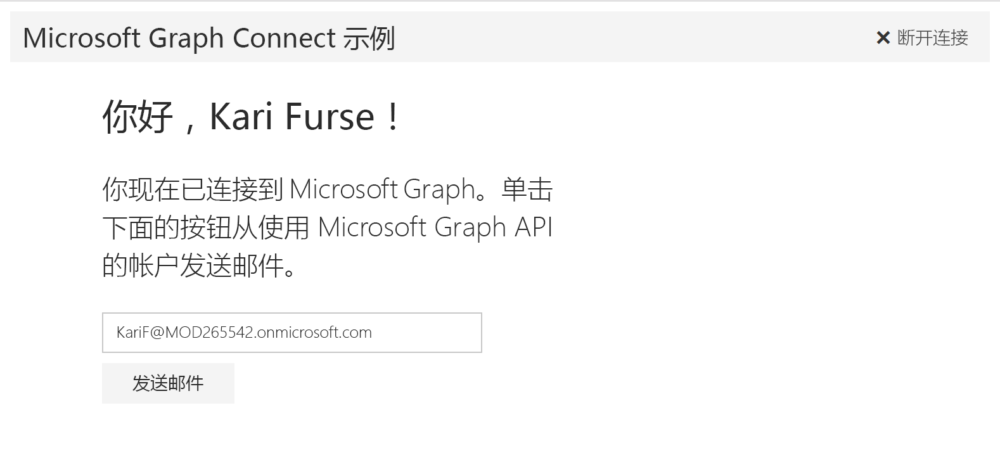

# 在 AngularJS 应用中使用 Microsoft Graph 入门

本文介绍了从 Azure AD v2.0 终结点获取访问令牌和调用 Microsoft Graph 所需的任务。介绍了生成[适用于 AngularJS 的 Microsoft Connect 示例](https://github.com/microsoftgraph/angular-connect-rest-sample)的步骤，并说明使用 Microsoft Graph 要实施的主要概念。本文还介绍如何通过使用 [Microsoft Graph JavaScript SDK](https://github.com/microsoftgraph/msgraph-sdk-javascript) 或原始 REST 调用来访问 Microsoft Graph。

下图显示了将要创建的应用。 

**不想生成一个应用？** 那就使用 [Microsoft Graph 快速入门](https://graph.microsoft.io/zh-CN/getting-started) 快速准备就绪并开始运行吧。

若要下载使用 Azure AD 终结点的 Connect 示例版本，请参阅 [适用于 AngularJS 的 Microsoft Graph Connect 示例](https://github.com/microsoftgraph/angular-connect-rest-sample/releases/tag/last_v1_auth)。

## 先决条件

若要开始，将需要以下各项： 

- 一个 [Microsoft 帐户](https://www.outlook.com/) 或者一个[工作或学校帐户](https://docs.microsoft.com/zh-CN/office/developer-program/office-365-developer-program-faq#account-types)
- [Node.js with npm](https://nodejs.org/en/download/)
- [Bower](https://bower.io)
- [适用于 AngularJS 的 Microsoft Connect 示例](https://github.com/microsoftgraph/angular-connect-sample)。将使用此次演练示例文件中的 **starter-project** 文件夹。

## 注册应用程序
在 Microsoft 应用注册门户上注册一个应用。这会生成在 Visual Studio 中配置此应用要使用的应用程序 ID 和密码。

1. 使用个人或工作或学校帐户登录到 [Microsoft 应用注册门户](https://apps.dev.microsoft.com/)。

2. 选择“**添加应用**”。

3. 输入应用的名称，并选择“**创建应用程序**”。 
    
    将显示注册页，其中列出应用的属性。

4. 复制应用程序 ID。这是配置该应用要使用的应用唯一标识符。

5. 在“平台”**** 下，依次选择“添加平台”**** > “Web”****。

6. 请确保已选中“允许隐式流”**** 复选框，并输入 *http://localhost:8080* 作为重定向 URI。 

7. 选择“保存”****。

## 配置项目
1. 打开示例文件中的 **starter-project** 文件夹。
2. 在命令提示符中，运行初学者项目的根目录中的以下命令。这将安装项目依赖项。

        npm install  
        bower install
    
3. 在初学者项目文件的“public/scripts”**** 文件夹中，打开 config.js。
4. 在“clientID”**** 字段中，将 **ENTER_YOUR_CLIENT_ID** 占位符值替换为刚复制的应用程序 ID。

## 使用 SDK 调用 Microsoft Graph
应用调用 Microsoft Graph 以获取用户信息并代表用户发送电子邮件。这些调用从 MainController 中启动用于响应 UI 事件。

打开 app.js 并将以下代码添加到文件底部。此操作将初始化 SDK。

    var authToken;
    var graphClient = MicrosoftGraph.Client.init({
        authProvider: function(done) {
        if (typeof authToken === "undefined") {
          done({err: "No auth token"})
        } else {
          done(null, authToken); //first parameter takes an error if you can't get an access token
        }
        }
    });

### 使用 SDK
1. 在 graphHelper.js 中，将“*//获取当前用户的个人资料*”替换为以下代码。这将配置 GET 请求并将其发送至 */me* 终结点，然后处理该响应。

        // Get the profile of the current user.
        me: function me() {
          return graphClient.api('/me').get();
        },
  
2. 将“*//代表当前用户发送电子邮件*”替换为以下代码。这将配置 POST 请求并将其发送至 */me/sendMail* 终结点，然后处理该响应。

        // Send an email on behalf of the current user.
        sendMail: function sendMail(email) {
          return graphClient.api('/me/sendMail').post({ 'message' : email, 'saveToSentItems': true });
        }

3. 在“**public/controllers**”文件夹中，打开 mainController.js。

4. 将“*//设置默认标题和用户属性*”替换为以下代码。这将向 HTTP 请求添加访问令牌，调用 **GraphHelper.me** 获取当前用户的个人资料并处理该响应。

        // Set the default headers and user properties.
        function processAuth() {

        // let the authProvider access the access token
        authToken = localStorage.token;

        if (localStorage.getItem('user') === null) {

          // Get the profile of the current user.
          GraphHelper.me().then(function(user) {

            // Save the user to localStorage.
            localStorage.setItem('user', angular.toJson(user));

            vm.displayName = user.displayName;
            vm.emailAddress = user.mail || user.userPrincipalName;
          });
        } else {
          let user = angular.fromJson(localStorage.user);

          vm.displayName = user.displayName;
          vm.emailAddress = user.mail || user.userPrincipalName;
        }

        }

5. 将“*//代表当前用户发送电子邮件*”替换为以下代码。这将生成电子邮件、调用 **GraphHelper.sendMail** 并处理该响应。

        // Send an email on behalf of the current user.
        function sendMail() {

          authToken = localStorage.token;       

          // Build the HTTP request payload (the Message object).
          var email = {
          Subject: 'Welcome to Microsoft Graph development with Angular and the Microsoft Graph Connect sample',
          Body: {
            ContentType: 'HTML',
            Content: getEmailContent()
          },
          ToRecipients: [
            {
              EmailAddress: {
            Address: vm.emailAddress
              }
            }
          ]
          };

          // Save email address so it doesn't get lost with two way data binding.
          vm.emailAddressSent = vm.emailAddress;
          GraphHelper.sendMail(email)
        .then(function (response) {
          $log.debug('HTTP request to the Microsoft Graph API returned successfully.', response);
          vm.requestSuccess = true;
          vm.requestFinished = true;
          $scope.$apply();
        }, function (error) {
          $log.error('HTTP request to the Microsoft Graph API failed.');
          vm.requestSuccess = false;
          vm.requestFinished = true;
          $scope.$apply();
        });

        };

6. 保存所有更改。

## 运行应用

1. 在命令提示符中，运行初学者项目的根目录中的以下命令。

        npm start

2. 在浏览器中，导航至 *http://localhost:8080* 然后选择“连接”**** 按钮。

3. 登录并授予所请求的权限。 

4. 还可以编辑收件人的电子邮件地址，然后选择“**发送邮件**”按钮。在邮件发送后，按钮下方将显示成功消息。 

## 后续步骤
- 使用 [Graph 浏览器](https://developer.microsoft.com/graph/graph-explorer)试用 REST API。
- 在 GitHub 上了解我们的其他 [AngularJS 示例](https://github.com/search?utf8=%E2%9C%93&q=angular+sample+user%3Amicrosoftgraph&type=Repositories&ref=searchresults)。

## 另请参阅
- [Azure AD v2.0 协议](https://azure.microsoft.com/zh-CN/documentation/articles/active-directory-v2-protocols/)
- [Azure AD v2.0 令牌](https://azure.microsoft.com/zh-CN/documentation/articles/active-directory-v2-tokens/)
