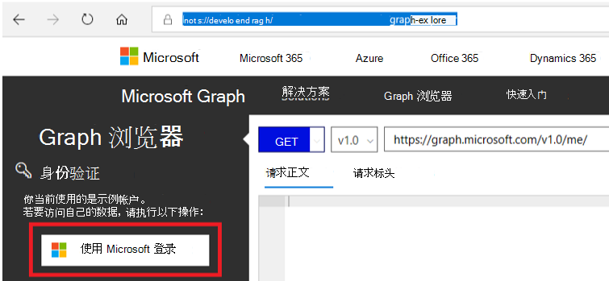

# <a name="configure-provisioning-using-microsoft-graph-apis"></a>使用 Microsoft Graph Api 配置预配

Azure 门户是一种一次配置单个应用的预配的便捷方式。 但是，如果你要创建多个甚至数百个应用程序实例，则使用 Microsoft Graph API 自动创建和配置应用会更容易。 本文概述了如何通过 API 自动执行预配配置。 此方法通常用于应用程序，如 [Amazon Web Services](/azure/active-directory/saas-apps/amazon-web-service-tutorial#configure-azure-ad-sso)。

**使用 Microsoft Graph API 自动执行预配配置的步骤概述**


|步骤  |详细信息  |
|---------|---------|
|[步骤 1.创建库应用程序](#step-1-create-the-gallery-application)     |登录到 API 客户端 <br> 检索库应用程序模板 <br> 创建库应用程序         |
|[步骤 2.创建基于模板的预配作业](#step-2-create-the-provisioning-job-based-on-the-template)     |检索预配连接器的模板 <br> 创建设置作业         |
|[步骤 3.授权访问](#step-3-authorize-access)     |测试与应用程序的连接 <br> 保存凭据         |
|[步骤 4.开始设置作业](#step-4-start-the-provisioning-job)     |启动作业         |
|[步骤 5.监视预配](#step-5-monitor-provisioning)     |检查预配作业的状态 <br> 检索设置日志         |

## <a name="step-1-create-the-gallery-application"></a>第 1 步：创建库应用程序

### <a name="sign-in-to-microsoft-graph-explorer-recommended-postman-or-any-other-api-client-you-use"></a>登录到 Microsoft Graph Explorer（推荐），Postman 或使用的任何其他 API 客户端

1. 启动 [Microsoft Graph 浏览器](https://developer.microsoft.com/graph/graph-explorer)。
1. 选择"使用 Microsoft 登录"按钮，然后使用 Azure AD 全局管理员或应用管理员凭据登录。

    

1. 成功登录后，将在左侧窗格中看到用户帐户详细信息。

### <a name="retrieve-the-gallery-application-template-identifier"></a>检索库应用程序模板标识符
Azure AD 应用程序库中的每个应用程序都有一个[应用程序模板](/graph/api/applicationtemplate-list?tabs=http&view=graph-rest-beta)，用于描述该应用程序的元数据。 使用此模板，可以在租户中创建应用程序和服务主体的实例以进行管理。

#### <a name="request"></a>请求


# <a name="http"></a>[HTTP](#tab/http)
<!-- {
  "blockType": "request",
  "name": "get_applicationtemplates"
}-->

```msgraph-interactive
GET https://graph.microsoft.com/beta/applicationTemplates
```
# <a name="c"></a>[C#](#tab/csharp)
[!INCLUDE [sample-code](../includes/snippets/csharp/get-applicationtemplates-csharp-snippets.md)]
[!INCLUDE [sdk-documentation](../includes/snippets/snippets-sdk-documentation-link.md)]

# <a name="javascript"></a>[JavaScript](#tab/javascript)
[!INCLUDE [sample-code](../includes/snippets/javascript/get-applicationtemplates-javascript-snippets.md)]
[!INCLUDE [sdk-documentation](../includes/snippets/snippets-sdk-documentation-link.md)]

# <a name="objective-c"></a>[Objective-C](#tab/objc)
[!INCLUDE [sample-code](../includes/snippets/objc/get-applicationtemplates-objc-snippets.md)]
[!INCLUDE [sdk-documentation](../includes/snippets/snippets-sdk-documentation-link.md)]

---


#### <a name="response"></a>响应

<!-- {
  "blockType": "response",
  "truncated": true,
  "@odata.type": "microsoft.graph.applicationTemplate",
  "isCollection": true
} -->

```http
HTTP/1.1 200 OK
Content-type: application/json

{
  "value": [
  {
    "id": "8b1025e4-1dd2-430b-a150-2ef79cd700f5",
        "displayName": "Amazon Web Services (AWS)",
        "homePageUrl": "http://aws.amazon.com/",
        "supportedSingleSignOnModes": [
             "password",
             "saml",
             "external"
         ],
         "supportedProvisioningTypes": [
             "sync"
         ],
         "logoUrl": "https://az495088.vo.msecnd.net/app-logo/aws_215.png",
         "categories": [
             "developerServices"
         ],
         "publisher": "Amazon",
         "description": null    
  
}
```

### <a name="create-the-gallery-application"></a>创建库应用程序

使用在上一步中为应用程序检索的模板 ID，[](/graph/api/applicationtemplate-instantiate?tabs=http&view=graph-rest-beta)在租户中创建应用程序和服务主体的实例。

#### <a name="request"></a>请求


# <a name="http"></a>[HTTP](#tab/http)
<!-- {
  "blockType": "request",
  "name": "applicationtemplate_instantiate"
}-->

```msgraph-interactive
POST https://graph.microsoft.com/beta/applicationTemplates/{id}/instantiate
Content-type: application/json

{
  "displayName": "AWS Contoso"
}
```
# <a name="c"></a>[C#](#tab/csharp)
[!INCLUDE [sample-code](../includes/snippets/csharp/applicationtemplate-instantiate-csharp-snippets.md)]
[!INCLUDE [sdk-documentation](../includes/snippets/snippets-sdk-documentation-link.md)]

# <a name="javascript"></a>[JavaScript](#tab/javascript)
[!INCLUDE [sample-code](../includes/snippets/javascript/applicationtemplate-instantiate-javascript-snippets.md)]
[!INCLUDE [sdk-documentation](../includes/snippets/snippets-sdk-documentation-link.md)]

# <a name="objective-c"></a>[Objective-C](#tab/objc)
[!INCLUDE [sample-code](../includes/snippets/objc/applicationtemplate-instantiate-objc-snippets.md)]
[!INCLUDE [sdk-documentation](../includes/snippets/snippets-sdk-documentation-link.md)]

---


#### <a name="response"></a>响应


<!-- {
  "blockType": "response",
  "truncated": true,
  "@odata.type": "microsoft.graph.applicationServicePrincipal"
} -->

```http
HTTP/1.1 201 OK
Content-type: application/json


{
    "application": {
        "objectId": "cbc071a6-0fa5-4859-8g55-e983ef63df63",
        "appId": "92653dd4-aa3a-3323-80cf-e8cfefcc8d5d",
        "applicationTemplateId": "8b1025e4-1dd2-430b-a150-2ef79cd700f5",
        "displayName": "AWS Contoso",
        "homepage": "https://signin.aws.amazon.com/saml?metadata=aws|ISV9.1|primary|z",
        "replyUrls": [
            "https://signin.aws.amazon.com/saml"
        ],
        "logoutUrl": null,
        "samlMetadataUrl": null,
    },
    "servicePrincipal": {
        "objectId": "f47a6776-bca7-4f2e-bc6c-eec59d058e3e",
        "appDisplayName": "AWS Contoso",
        "applicationTemplateId": "8b1025e4-1dd2-430b-a150-2ef79cd700f5",
        "appRoleAssignmentRequired": true,
        "displayName": "My custom name",
        "homepage": "https://signin.aws.amazon.com/saml?metadata=aws|ISV9.1|primary|z",
        "replyUrls": [
            "https://signin.aws.amazon.com/saml"
        ],
        "servicePrincipalNames": [
            "93653dd4-aa3a-4323-80cf-e8cfefcc8d7d"
        ],
        "tags": [
            "WindowsAzureActiveDirectoryIntegratedApp"
        ],
    }
}
```

## <a name="step-2-create-the-provisioning-job-based-on-the-template"></a>步骤 2：基于模板创建预配作业

### <a name="retrieve-the-template-for-the-provisioning-connector"></a>检索预配连接器的模板

库中启用了预配的应用程序具有用于简化配置的模板。 使用以下请求 [检索预配配置的模板](/graph/api/synchronization-synchronizationtemplate-list?tabs=http&view=graph-rest-beta)。 请注意，你将需要提供 ID。 ID 引用上一个资源，本例中为 servicePrincipal 资源。 

#### <a name="request"></a>请求


# <a name="http"></a>[HTTP](#tab/http)
<!-- {
  "blockType": "request",
  "name": "get_synchronizationtemplate"
}-->
```msgraph-interactive
GET https://graph.microsoft.com/beta/servicePrincipals/{id}/synchronization/templates
```
# <a name="c"></a>[C#](#tab/csharp)
[!INCLUDE [sample-code](../includes/snippets/csharp/get-synchronizationtemplate-csharp-snippets.md)]
[!INCLUDE [sdk-documentation](../includes/snippets/snippets-sdk-documentation-link.md)]

# <a name="javascript"></a>[JavaScript](#tab/javascript)
[!INCLUDE [sample-code](../includes/snippets/javascript/get-synchronizationtemplate-javascript-snippets.md)]
[!INCLUDE [sdk-documentation](../includes/snippets/snippets-sdk-documentation-link.md)]

# <a name="objective-c"></a>[Objective-C](#tab/objc)
[!INCLUDE [sample-code](../includes/snippets/objc/get-synchronizationtemplate-objc-snippets.md)]
[!INCLUDE [sdk-documentation](../includes/snippets/snippets-sdk-documentation-link.md)]

---


#### <a name="response"></a>响应
<!-- {
  "blockType": "response",
  "truncated": true,
  "@odata.type": "microsoft.graph.synchronizationTemplate",
  "isCollection": true
} -->
```http
HTTP/1.1 200 OK

{
    "value": [
        {
            "id": "aws",
            "factoryTag": "aws",
            "schema": {
                    "directories": [],
                    "synchronizationRules": []
                    }
        }
    ]
}
```

### <a name="create-the-provisioning-job"></a>创建设置作业
若要启用预配，你首先需要 [创建一个作业](/graph/api/synchronization-synchronizationjob-post?tabs=http&view=graph-rest-beta)。 使用以下请求创建设置作业。 指定要用于作业的模板时，请使用上一步中的 templateId。

#### <a name="request"></a>请求

# <a name="http"></a>[HTTP](#tab/http)
<!-- {
  "blockType": "request",
  "name": "create_synchronizationjob_from_synchronization"
}-->
```msgraph-interactive
POST https://graph.microsoft.com/beta/servicePrincipals/{id}/synchronization/jobs
Content-type: application/json

{ 
    "templateId": "aws"
}
```
# <a name="c"></a>[C#](#tab/csharp)
[!INCLUDE [sample-code](../includes/snippets/csharp/create-synchronizationjob-from-synchronization-csharp-snippets.md)]
[!INCLUDE [sdk-documentation](../includes/snippets/snippets-sdk-documentation-link.md)]

# <a name="javascript"></a>[JavaScript](#tab/javascript)
[!INCLUDE [sample-code](../includes/snippets/javascript/create-synchronizationjob-from-synchronization-javascript-snippets.md)]
[!INCLUDE [sdk-documentation](../includes/snippets/snippets-sdk-documentation-link.md)]

# <a name="objective-c"></a>[Objective-C](#tab/objc)
[!INCLUDE [sample-code](../includes/snippets/objc/create-synchronizationjob-from-synchronization-objc-snippets.md)]
[!INCLUDE [sdk-documentation](../includes/snippets/snippets-sdk-documentation-link.md)]

---


#### <a name="response"></a>响应
<!-- {
  "blockType": "response",
  "truncated": true,
  "@odata.type": "microsoft.graph.synchronizationJob"
} -->
```http
HTTP/1.1 201 OK
Content-type: application/json

{
    "id": "{jobId}",
    "templateId": "aws",
    "schedule": {
        "expiration": null,
        "interval": "P10675199DT2H48M5.4775807S",
        "state": "Disabled"
    },
    "status": {
        "countSuccessiveCompleteFailures": 0,
        "escrowsPruned": false,
        "synchronizedEntryCountByType": [],
        "code": "NotConfigured",
        "lastExecution": null,
        "lastSuccessfulExecution": null,
        "lastSuccessfulExecutionWithExports": null,
        "steadyStateFirstAchievedTime": "0001-01-01T00:00:00Z",
        "steadyStateLastAchievedTime": "0001-01-01T00:00:00Z",
        "quarantine": null,
        "troubleshootingUrl": null
    }
}
```

## <a name="step-3-authorize-access"></a>步骤 3：授权访问

### <a name="test-the-connection-to-the-application"></a>测试与应用程序的连接

测试第三方应用程序的连接。 下面的示例适用于需要客户端密码和密码令牌的应用程序。 每个应用程序都有自己的要求。 应用程序通常使用基地址来表示客户端密码。 若要确定你的应用所需的凭据，请转到应用程序的预配配置页，在开发人员模式下，单击测试 **连接**。 网络流量将显示用于凭据的参数。 有关凭据的完整列表，请参阅 [synchronizationJob： validateCredentials](/graph/api/synchronization-synchronizationjob-validatecredentials?tabs=http&view=graph-rest-beta)。 大多数应用程序（如 Azure Datab部署）都依赖于 BaseAddress 和 SecretToken。 BaseAddress 在 Azure 门户中作为租户 URL 引用。 

#### <a name="request"></a>请求
```msgraph-interactive
POST https://graph.microsoft.com/beta/servicePrincipals/{id}/synchronization/jobs/{id}/validateCredentials
{ 
    "credentials": [ 
        { "key": "ClientSecret", "value": "xxxxxxxxxxxxxxxxxxxxx" },
        { "key": "SecretToken", "value": "xxxxxxxxxxxxxxxxxxxxx" }
    ]
}
```
#### <a name="response"></a>响应
<!-- {
  "blockType": "response",
  "truncated": true,
  "@odata.type": "microsoft.graph.None"
} -->
```http
HTTP/1.1 204 No Content
```

### <a name="save-your-credentials"></a>保存凭据

配置预配需要在 Azure AD 和应用程序之间建立信任。 授权访问第三方应用程序。 下面的示例适用于需要客户端密码和密码令牌的应用程序。 每个应用程序都有自己的要求。 查看 [API 文档](/graph/api/synchronization-synchronizationjob-validatecredentials?tabs=http&view=graph-rest-beta) 以查看可用选项。 

#### <a name="request"></a>请求
```msgraph-interactive
PUT https://graph.microsoft.com/beta/servicePrincipals/{id}/synchronization/secrets 
 
{ 
    "value": [ 
        { "key": "ClientSecret", "value": "xxxxxxxxxxxxxxxxxxxxx" },
        { "key": "SecretToken", "value": "xxxxxxxxxxxxxxxxxxxxx" }
    ]
}
```

#### <a name="response"></a>响应
<!-- {
  "blockType": "response",
  "truncated": true,
  "@odata.type": "microsoft.graph.None"
} -->
```http
HTTP/1.1 204 No Content
```

## <a name="step-4-start-the-provisioning-job"></a>步骤 4：启动预配作业
配置设置作业后，使用以下命令 [启动作业](/graph/api/synchronization-synchronizationjob-start?tabs=http&view=graph-rest-beta)。 


#### <a name="request"></a>请求

# <a name="http"></a>[HTTP](#tab/http)
<!-- {
  "blockType": "request",
  "name": "synchronizationjob_start"
}-->
```http
POST https://graph.microsoft.com/beta/servicePrincipals/{id}/synchronization/jobs/{jobId}/start
```
# <a name="c"></a>[C#](#tab/csharp)
[!INCLUDE [sample-code](../includes/snippets/csharp/synchronizationjob-start-csharp-snippets.md)]
[!INCLUDE [sdk-documentation](../includes/snippets/snippets-sdk-documentation-link.md)]

# <a name="javascript"></a>[JavaScript](#tab/javascript)
[!INCLUDE [sample-code](../includes/snippets/javascript/synchronizationjob-start-javascript-snippets.md)]
[!INCLUDE [sdk-documentation](../includes/snippets/snippets-sdk-documentation-link.md)]

# <a name="objective-c"></a>[Objective-C](#tab/objc)
[!INCLUDE [sample-code](../includes/snippets/objc/synchronizationjob-start-objc-snippets.md)]
[!INCLUDE [sdk-documentation](../includes/snippets/snippets-sdk-documentation-link.md)]

---


#### <a name="response"></a>响应
<!-- {
  "blockType": "response",
  "truncated": true,
  "@odata.type": "microsoft.graph.None"
} -->
```http
HTTP/1.1 204 No Content
```


## <a name="step-5-monitor-provisioning"></a>步骤 5：监视预配

### <a name="monitor-the-provisioning-job-status"></a>监视设置作业状态

现在设置作业正在运行，请使用以下命令跟踪当前设置周期的进度以及到目前为止的统计信息，例如已在目标系统中创建的用户和组数。 

#### <a name="request"></a>请求

# <a name="http"></a>[HTTP](#tab/http)
<!-- {
  "blockType": "request",
  "name": "get_synchronizationjob"
}-->
```msgraph-interactive
GET https://graph.microsoft.com/beta/servicePrincipals/{id}/synchronization/jobs/{jobId}/
```
# <a name="c"></a>[C#](#tab/csharp)
[!INCLUDE [sample-code](../includes/snippets/csharp/get-synchronizationjob-csharp-snippets.md)]
[!INCLUDE [sdk-documentation](../includes/snippets/snippets-sdk-documentation-link.md)]

# <a name="javascript"></a>[JavaScript](#tab/javascript)
[!INCLUDE [sample-code](../includes/snippets/javascript/get-synchronizationjob-javascript-snippets.md)]
[!INCLUDE [sdk-documentation](../includes/snippets/snippets-sdk-documentation-link.md)]

# <a name="objective-c"></a>[Objective-C](#tab/objc)
[!INCLUDE [sample-code](../includes/snippets/objc/get-synchronizationjob-objc-snippets.md)]
[!INCLUDE [sdk-documentation](../includes/snippets/snippets-sdk-documentation-link.md)]

---


#### <a name="response"></a>响应
<!-- {
  "blockType": "response",
  "truncated": true,
  "@odata.type": "microsoft.graph.synchronizationJob"
} -->
```http
HTTP/1.1 200 OK
Content-type: application/json
Content-length: 2577

{
    "id": "{jobId}",
    "templateId": "aws",
    "schedule": {
        "expiration": null,
        "interval": "P10675199DT2H48M5.4775807S",
        "state": "Disabled"
    },
    "status": {
        "countSuccessiveCompleteFailures": 0,
        "escrowsPruned": false,
        "synchronizedEntryCountByType": [],
        "code": "Paused",
        "lastExecution": null,
        "lastSuccessfulExecution": null,
        "progress": [],
        "lastSuccessfulExecutionWithExports": null,
        "steadyStateFirstAchievedTime": "0001-01-01T00:00:00Z",
        "steadyStateLastAchievedTime": "0001-01-01T00:00:00Z",
        "quarantine": null,
        "troubleshootingUrl": null
    },
    "synchronizationJobSettings": [
      {
          "name": "QuarantineTooManyDeletesThreshold",
          "value": "500"
      }
    ]
}
```


### <a name="monitor-provisioning-events-using-the-provisioning-logs"></a>使用预配日志监视预配事件
除了监视设置作业的状态之外，您还可以使用设置日志查询发生的所有事件。 [](/graph/api/provisioningobjectsummary-list?tabs=http&view=graph-rest-beta) 例如，查询特定用户并确定他们是否成功预配。

#### <a name="request"></a>请求
```msgraph-interactive
GET https://graph.microsoft.com/beta/auditLogs/provisioning
```
#### <a name="response"></a>响应
<!-- {
  "blockType": "response",
  "truncated": true,
  "@odata.type": "microsoft.graph.provisioningObjectSummary",
  "name": "list_provisioningobjectsummary_error"
} -->

```http
HTTP/1.1 200 OK
Content-type: application/json

{
    "@odata.context": "https://graph.microsoft.com/beta/$metadata#auditLogs/provisioning",
    "value": [
        {
            "id": "gc532ff9-r265-ec76-861e-42e2970a8218",
            "activityDateTime": "2019-06-24T20:53:08Z",
            "tenantId": "7928d5b5-7442-4a97-ne2d-66f9j9972ecn",
            "jobId": "BoxOutDelta.7928d5b574424a97ne2d66f9j9972ecn",
            "cycleId": "44576n58-v14b-70fj-8404-3d22tt46ed93",
            "changeId": "eaad2f8b-e6e3-409b-83bd-e4e2e57177d5",
            "action": "Create",
            "durationInMilliseconds": 2785,
            "sourceSystem": {
                "id": "0404601d-a9c0-4ec7-bbcd-02660120d8c9",
                "displayName": "Azure Active Directory",
                "details": {}
            },
            "targetSystem": {
                "id": "cd22f60b-5f2d-1adg-adb4-76ef31db996b",
                "displayName": "Box",
                "details": {
                    "ApplicationId": "f2764360-e0ec-5676-711e-cd6fc0d4dd61",
                    "ServicePrincipalId": "chc46a42-966b-47d7-9774-576b1c8bd0b8",
                    "ServicePrincipalDisplayName": "Box"
                }
            },
            "initiatedBy": {
                "id": "",
                "displayName": "Azure AD Provisioning Service",
                "initiatorType": "system"
            },
            "sourceIdentity": {
                "id": "5e6c9rae-ab4d-5239-8ad0-174391d110eb",
                "displayName": "Self-service Pilot",
                "identityType": "Group",
                "details": {}
            },
            "targetIdentity": {
                "id": "",
                "displayName": "",
                "identityType": "Group",
                "details": {}
            },
            "statusInfo": {
                "@odata.type": "#microsoft.graph.statusDetails",
                "status": "failure",
                "errorCode": "BoxEntryConflict",
                "reason": "Message: Box returned an error response with the HTTP status code 409.  This response indicates that a user or a group already exisits with the same name. This can be avoided by identifying and removing the conflicting user from Box via the Box administrative user interface, or removing the current user from the scope of provisioning either by removing their assignment to the Box application in Azure Active Directory or adding a scoping filter to exclude the user.",
                "additionalDetails": null,
                "errorCategory": "NonServiceFailure",
                "recommendedAction": null
            },
            "provisioningSteps": [
                {
                    "name": "EntryImportAdd",
                    "provisioningStepType": "import",
                    "status": "success",
                    "description": "Received Group 'Self-service Pilot' change of type (Add) from Azure Active Directory",
                    "details": {}
                },
                {
                    "name": "EntrySynchronizationAdd",
                    "provisioningStepType": "matching",
                    "status": "success",
                    "description": "Group 'Self-service Pilot' will be created in Box (Group is active and assigned in Azure Active Directory, but no matching Group was found in Box)",
                    "details": {}
                },
                {
                    "name": "EntryExportAdd",
                    "provisioningStepType": "export",
                    "status": "failure",
                    "description": "Failed to create Group 'Self-service Pilot' in Box",
                    "details": {
                        "ReportableIdentifier": "Self-service Pilot"
                    }
                }
            ],
            "modifiedProperties": [
                {
                    "displayName": "objectId",
                    "oldValue": null,
                    "newValue": "5e0c9eae-ad3d-4139-5ad0-174391d110eb"
                },
                {
                    "displayName": "displayName",
                    "oldValue": null,
                    "newValue": "Self-service Pilot"
                },
                {
                    "displayName": "mailEnabled",
                    "oldValue": null,
                    "newValue": "False"
                },
                {
                    "displayName": "mailNickname",
                    "oldValue": null,
                    "newValue": "5ce25n9a-4c5f-45c9-8362-ef3da29c66c5"
                },
                {
                    "displayName": "securityEnabled",
                    "oldValue": null,
                    "newValue": "True"
                },
                {
                    "displayName": "Name",
                    "oldValue": null,
                    "newValue": "Self-service Pilot"
                }
            ]
       }
    ]
}

```
## <a name="see-also"></a>另请参阅

- [查看同步 Microsoft Graph 文档](/graph/api/resources/synchronization-overview?view=graph-rest-beta)
- [将自定义 SCIM 应用与 Azure AD 集成](/azure/active-directory/app-provisioning/use-scim-to-provision-users-and-groups)
