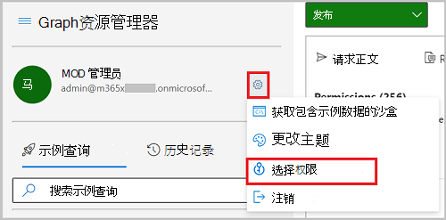

# <a name="configure-application-proxy-using-the-microsoft-graph-api"></a>使用 Microsoft Graph API 配置应用程序代理

本文将了解如何为应用程序配置 Azure Active Directory (Azure AD) 应用程序代理。 应用程序代理提供对本地 Web 应用程序的安全远程访问和单一登录。 为应用程序配置应用程序代理后，用户可以通过外部 URL、"我的应用程序"门户或其他内部应用程序门户访问其本地应用程序。

## <a name="prerequisites"></a>先决条件

- 本教程假定你已安装连接器并已完成应用程序代理的先决条件，以便连接器可以[](/azure/active-directory/manage-apps/application-proxy-add-on-premises-application#before-you-begin)与 Azure AD 服务通信。
- 本教程的前提是使用 Microsoft Graph Explorer，但是可以使用 Postman，也可以创建自己的客户端应用程序来调用 Microsoft Graph。 如果要在本教程中调用 Microsoft Graph API，需要使用具有全局管理员角色和适当权限的帐户。 完成以下步骤以在 Microsoft Graph Explorer 中设置权限：
    1. 启动 [Microsoft Graph 浏览器](https://developer.microsoft.com/graph/graph-explorer)。
    2. 选择“**使用 Microsoft 登录**”，然后使用 Azure AD 全局管理员账户登录。 成功登录后，可在左侧窗格中看到用户帐户详细信息。
    3. 选择用户帐户详细信息右侧的设置图标，然后选择“**权限**”。

        
        
    4. Scroll through the list of permissions to **Directory (3)**， expand and then select `Directory.ReadWrite.All` .

        
    
    5. 选择“**同意**”，然后选择“**接受**”，以接受同意权限。 你不需要代表组织同意这些权限。

        

> [!NOTE]
> 为了可读性，可能会缩短显示的响应对象。 

## <a name="step-1-create-a-custom-application"></a>步骤 1：创建自定义应用程序

若要使用 API 为应用配置应用程序代理，首先创建自定义应用程序，然后更新应用程序的 **onPremisesPublishing** 属性以配置应用程序代理设置。 本教程使用应用程序模板在租户中创建自定义应用程序和服务主体的实例，以用于管理。 自定义应用程序的模板 ID 为 `8adf8e6e-67b2-4cf2-a259-e3dc5476c621` 。

记录 **应用程序的 id** **、appId** **、servicePrincipalId，** 以在本教程的稍后部分使用。

#### <a name="request"></a>请求

```http
POST https://graph.microsoft.com/v1.0/applicationTemplates/8adf8e6e-67b2-4cf2-a259-e3dc5476c621/instantiate
Content-type: application/json

{
  "displayName": "Contoso IWA App"
}
```

#### <a name="response"></a>响应

```http
HTTP/1.1 201 Created
Content-type: application/json

{
  "@odata.context": "https://graph.microsoft.com/beta/$metadata#applications/$entity",
  "id": "bf21f7e9-9d25-4da2-82ab-7fdd85049f83",
  "deletedDateTime": null,
  "addIns": [],
  "appId": "d7fbfe28-c60e-46d2-8335-841923950d3b",
  "applicationTemplateId": null,
  "identifierUris": [],
  "createdDateTime": "2020-08-11T21:07:47.5919755Z",
  "description": null,
  "displayName": "Contoso IWA App",
  "isAuthorizationServiceEnabled": false,
  "isDeviceOnlyAuthSupported": null,
  "isFallbackPublicClient": null,
  "groupMembershipClaims": null,
  "notes": null,
  "optionalClaims": null,
  "orgRestrictions": [],
  "publisherDomain": "f128.info",
  "signInAudience": "AzureADandPersonalMicrosoftAccount",
  "tags": [],
  "tokenEncryptionKeyId": null,
  "uniqueName": null,
  "verifiedPublisher": {
      "displayName": null,
      "verifiedPublisherId": null,
      "addedDateTime": null
  },
}
```

## <a name="step-2-configure-application-proxy"></a>步骤 2：配置应用程序代理

使用为 **应用程序** 记录的 ID 启动应用程序代理的配置。 更新以下属性：

- **onPremisesPublishing** - 在此例中，你将使用具有内部 URL 的应用 `https://contosoiwaapp.com` ：。 您还可以将默认域用于外部 `https://contosoiwaapp-contoso.msappproxy.net` URL：。 
- **redirectUri、identifierUri** 和 **homepageUrl** - 设置为 **在 onPremisesPublishing** 属性中配置的相同外部 URL。 
- **implicitGrantSettings** - 设置为 `true` **enabledTokenIssuance** 和 `false` **enabledAccessTokenIssuance**。

#### <a name="request"></a>请求

```http
PATCH https://graph.microsoft.com/beta/applications/bf21f7e9-9d25-4da2-82ab-7fdd85049f83
Content-type: application/json

{
  "onPremisesPublishing": {
    "externalAuthenticationType": "aadPreAuthentication",
    "internalUrl": "https://contosoiwaapp.com",
    "externalUrl": "https://contosoiwaapp-contoso.msappproxy.net"
  }
  "identifierUris": ["https://contosoiwaapp-contoso.msappproxy.net"],
  "web": {
    "redirectUris": ["https://contosoiwaapp-contoso.msappproxy.net"],
    "homePageUrl": "https://contosoiwaapp-contoso.msappproxy.net",
    "implicitGrantSettings": {
      "enableIdTokenIssuance": true,
      "enableAccessTokenIssuance": false
    }
  }
}
```

#### <a name="response"></a>响应

```http
HTTP/1.1 204 No content
```

## <a name="step-3-assign-a-connector-group-to-the-application"></a>步骤 3：将连接器组分配给应用程序

### <a name="get-connectors"></a>获取连接器

列出可用的连接器。 记录 **要** 分配给连接器组的连接器的 ID。

#### <a name="request"></a>请求

```http
GET https://graph.microsoft.com/beta/onPremisesPublishingProfiles/applicationProxy/connectors
```

#### <a name="response"></a>响应

```http
HTTP/1.1 200 OK
Content-type: application/json

{
  "@odata.context": "https://graph.microsoft.com/beta/$metadata#connectors",
  "value": [
    {
      "id": "d2b1e8e8-8511-49d6-a4ba-323cb083fbb0",
      "machineName": "connectorA.redmond.contoso.com"",
      "externalIp": "131.137.147.164",
      "status": "active"
    },
    {
      "id": "f2cab422-a1c8-4d70-a47e-2cb297a2e051",
      "machineName": "connectorB.contoso.com"",
      "externalIp": "68.0.191.210",
      "status": "active"
    }
  ]
}
```

### <a name="create-a-connectorgroup"></a>创建 connectorGroup

对于此示例，将创建一个名为 的新 `IWA Demo Connector Group` connectorGroup，用于应用程序。 记录 **返回** 的 ID，以在下一步使用。

#### <a name="request"></a>请求

```http
POST https://graph.microsoft.com/beta/onPremisesPublishingProfiles/applicationProxy/connectorGroups

Content-type: application/json
{
  "name": "IWA Demo Connector Group"
}
```

#### <a name="response"></a>响应

```http
HTTP/1.1 201
Content-type: connectorGroup/json

{
  "@odata.context": "https://graph.microsoft.com/beta/$metadata#connectorGroups/$entity",
  "id": "3e6f4c35-a04b-4d03-b98a-66fff89b72e6",
  "name": "IWA Demo Connector Group",
  "connectorGroupType": "applicationProxy",
  "isDefault": false
}
```

### <a name="assign-a-connector-to-the-connectorgroup"></a>将连接器分配给 connectorGroup

#### <a name="request"></a>请求

```http
POST https://graph.microsoft.com/beta/onPremisesPublishingProfiles/applicationProxy/connectors/f2cab422-a1c8-4d70-a47e-2cb297a2e051/memberOf/$ref
Content-type: application/json

{
  "@odata.id":"https://graph.microsoft.com/beta/onPremisesPublishingProfiles/applicationProxy/connectorGroups/3e6f4c35-a04b-4d03-b98a-66fff89b72e6"
}
```

#### <a name="response"></a>响应

```http
HTTP/1.1 204 No content
```

### <a name="assign-the-application-to-the-connectorgroup"></a>将应用程序分配给 connectorGroup

#### <a name="request"></a>请求

```http
PUT https://graph.microsoft.com/beta/applications/bf21f7e9-9d25-4da2-82ab-7fdd85049f83/connectorGroup/$ref
Content-type: application/json

{
"@odata.id":"https://graph.microsoft.com/onPremisesPublishingProfiles/applicationproxy/connectorGroups/3e6f4c35-a04b-4d03-b98a-66fff89b72e6"
}
```

#### <a name="response"></a>响应

```http
HTTP/1.1 204 No content
```

## <a name="step-4-configure-single-sign-on"></a>步骤 4：配置单一登录

此应用程序使用 IWA Windows集成 (身份验证) 。 若要配置 IWA，请为 **onPremisesPublishing** 设置单一登录属性。

#### <a name="request"></a>请求

```http
PATCH https://graph.microsoft.com/beta/applications/bf21f7e9-9d25-4da2-82ab-7fdd85049f83
Content-type: appplication/json

{
  "onPremisesPublishing": {
    "singleSignOnSettings": {
      "kerberosSignOnSettings": {
        "kerberosServicePrincipalName": "HTTP/iwademo.contoso.com",
        "kerberosSignOnMappingAttributeType": "userPrincipalName"
      },
      "singleSignOnMode": "onPremisesKerberos"
    }
  } 
}
```

#### <a name="response"></a>响应

```http
HTTP/1.1 204 No content
```

## <a name="step-5-assign-a-user"></a>步骤 5：分配用户

### <a name="retrieve-the-approle-for-the-application"></a>检索应用程序的 appRole

使用服务主体的 **ID** 获取应用程序的应用程序角色。 记录 **将在下****一步** 中使用的用户应用角色的 ID。

#### <a name="request"></a>请求

```http
GET https://graph.microsoft.com/beta/servicePrincipals/a8cac399-cde5-4516-a674-819503c61313/appRoles
```

#### <a name="response"></a>响应

```http
HTTP/1.1 200
Content-type: application/json

{
  "@odata.context": "https://graph.microsoft.com/beta/$metadata#servicePrincipals('a8cac399-cde5-4516-a674-819503c61313')/appRoles",
  "value": [
    {
      "allowedMemberTypes": [
        "User"
      ],
      "description": "User",
      "displayName": "User",
      "id": "18d14569-c3bd-439b-9a66-3a2aee01d14f",
      "isEnabled": true,
      "origin": "Application",
      "value": null
    },
  ]
}
```

### <a name="create-a-user-account"></a>创建用户账户

对于本教程，你将创建分配给应用角色的用户帐户。 在请求正文中， `contoso.com` 更改为租户的域名。 可在 Azure Active Directory 概述页面上找到租户信息。 记录 **将在** 下一步中使用的用户帐户的 ID。

#### <a name="request"></a>请求

```http
POST https://graph.microsoft.com/v1.0/users
Content-type: application/json

{
  "accountEnabled":true,
  "displayName":"MyTestUser1",
  "mailNickname":"MyTestUser1",
  "userPrincipalName":"MyTestUser1@contoso.com",
  "passwordProfile": {
    "forceChangePasswordNextSignIn":true,
    "password":"Contoso1234"
  }
}
```

#### <a name="response"></a>响应

```http
{
  "@odata.context": "https://graph.microsoft.com/v1.0/$metadata#users/$entity",
  "id": "4628e7df-dff3-407c-a08f-75f08c0806dc",
  "businessPhones": [],
  "displayName": "MyTestUser1",
  "givenName": null,
  "jobTitle": null,
  "mail": null,
  "mobilePhone": null,
  "officeLocation": null,
  "preferredLanguage": null,
  "surname": null,
  "userPrincipalName": "MyTestUser1@contoso.com"
}
```

### <a name="assign-the-user-to-the-application"></a>将用户分配给应用程序

在下面的示例中，替换以下属性的值：

- 具有用户 **ID** 的 **principalId**
- 具有应用角色 **ID** 的 **appRoleId**
- **resourceId，****其 ID** 为服务主体

#### <a name="request"></a>请求

```http
POST https://graph.microsoft.com/beta/servicePrincipals/b00c693f-9658-4c06-bd1b-c402c4653dea/appRoleAssignments
Content-type: appRoleAssignments/json

{
  "principalId": "4628e7df-dff3-407c-a08f-75f08c0806dc",
  "principalType": "User",
  "appRoleId":"18d14569-c3bd-439b-9a66-3a2aee01d14f",
  "resourceId":"a8cac399-cde5-4516-a674-819503c61313"
}
```

#### <a name="response"></a>响应

```http
HTTP/1.1 200
Content-type: application/json

{
  "@odata.context": "https://graph.microsoft.com/beta/$metadata#appRoleAssignments/$entity",
  "id": "I23pL8ZdNU-CIgQmqMEVyLJ0E6fx0ixEo92az8MnhtU",
  "creationTimestamp": "2020-06-09T00:06:07.5129268Z",
  "appRoleId": "18d14569-c3bd-439b-9a66-3a2aee01d14f",
  "principalDisplayName": "MyTestUser1",
  "principalId": "2fe96d23-5dc6-4f35-8222-0426a8c115c8",
  "principalType": "User",
  "resourceDisplayName": "Contoso IWA App",
  "resourceId": "a8cac399-cde5-4516-a674-819503c61313"
}
```
## <a name="step-6-test-access-to-the-application"></a>步骤 6：测试对应用程序的访问

通过访问为浏览器上的应用 **配置** 的外部 URL 来测试应用程序，然后使用测试用户登录。 你应该能够登录应用并访问应用程序。

## <a name="step-7-clean-up-resources"></a>第 7 步：清理资源

在本教程中创建的资源不适合在生产环境中使用。 在此步骤中，将删除创建的资源。

### <a name="delete-the-user-account"></a>删除用户账户

删除 MyTestUser1 用户帐户。

#### <a name="request"></a>请求

```http
DELETE https://graph.microsoft.com/v1.0/users/4628e7df-dff3-407c-a08f-75f08c0806dc
```

#### <a name="response"></a>响应

```http
No Content - 204
```

### <a name="delete-the-application"></a>删除应用程序

#### <a name="request"></a>请求

```http
DELETE https://graph.microsoft.com/v1.0/applications/bf21f7e9-9d25-4da2-82ab-7fdd85049f83
```

#### <a name="response"></a>响应

```http
No Content - 204
```

### <a name="delete-the-connector-group"></a>删除连接器组

#### <a name="request"></a>请求

```http
DELETE https://graph.microsoft.com/beta/onPremisesPublishingProfiles/applicationProxy/connectorGroups/3e6f4c35-a04b-4d03-b98a-66fff89b72e6
```

#### <a name="response"></a>响应

```http
No Content - 204
```

## <a name="see-also"></a>另请参阅

- [应用程序代理](/azure/active-directory/manage-apps/what-is-application-proxy)
- [application](/graph/api/resources/application?view=graph-rest-1.0)
- [applicationTemplate：实例化](/graph/api/applicationtemplate-instantiate?view=graph-rest-1.0)
- [appRoleAssignment](/graph/api/resources/approleassignment?view=graph-rest-beta)
- [connector](/graph/api/resources/connector?view=graph-rest-beta)
- [connectorGroup](/graph/api/resources/connectorGroup?view=graph-rest-beta)
- [implicitGrantSettings](/graph/api/resources/implicitgrantsettings?view=graph-rest-1.0)
- [本地发布配置文件](/graph/api/resources/onpremisespublishingprofile-root?view=graph-rest-beta)
- [servicePrincipal](/graph/api/resources/serviceprincipal?view=graph-rest-1.0)
- [singleSignOnSettings](/graph/api/resources/onpremisespublishingsinglesignon?view=graph-rest-beta)
- [用户](/graph/api/resources/user?view=graph-rest-1.0)
