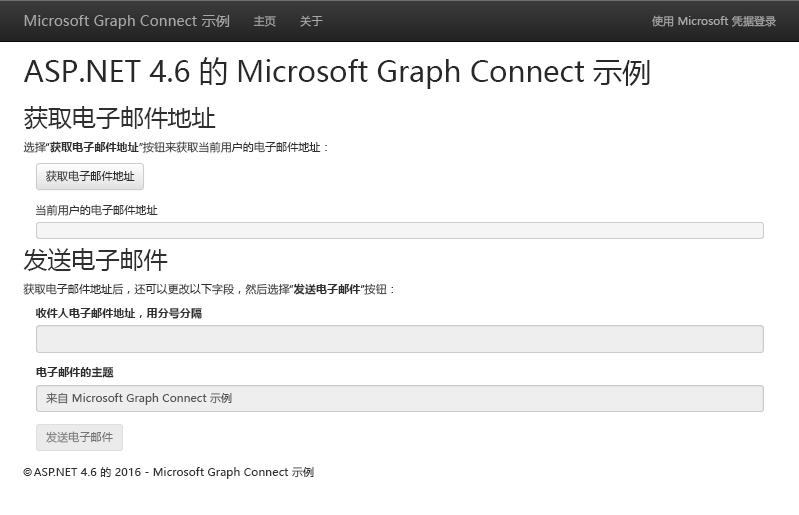

# 在 ASP.NET 4.6 MVC 应用中使用 Microsoft Graph 入门

本文介绍了从 Azure AD v2.0 终结点获取访问令牌和调用 Microsoft Graph 所需的任务。介绍了生成[适用于 ASP.NET 4.6 的 Microsoft Graph Connect 示例](https://github.com/microsoftgraph/aspnet-connect-sample)的步骤，并说明使用 Microsoft Graph 要实施的主要概念。

下图显示了将要创建的应用。 

[Azure AD v2.0 终结点](https://azure.microsoft.com/zh-CN/documentation/articles/active-directory-appmodel-v2-overview) 允许用户使用 Microsoft 帐户 (MSA) 或工作或学校帐户进行登录。应用使用 [ASP.Net OpenID Connect OWIN 中间件](https://www.nuget.org/packages/Microsoft.Owin.Security.OpenIdConnect/)和 [适用于 .Net 的 Microsoft Authentication Library (MSAL)](https://www.nuget.org/packages/Microsoft.Identity.Client) 进行登录和令牌管理。

**不想生成一个应用吗？** 使用 [Microsoft Graph 快速入门](https://developer.microsoft.com/zh-CN/graph/quick-start)快速准备就绪并开始运行。此外请注意，我们有[此示例的 REST 版本](https://github.com/microsoftgraph/aspnet-connect-rest-sample)。

## 先决条件

若要开始，将需要以下各项： 

- 一个 [Microsoft 帐户](https://www.outlook.com/) 或者一个[工作或学校帐户](https://docs.microsoft.com/zh-CN/office/developer-program/office-365-developer-program-faq#account-types)
- Visual Studio 2015 
- [ASP.NET 4.6 的 Microsoft Graph Connect 示例](https://github.com/microsoftgraph/aspnet-connect-sample)。将使用示例文件中的 **starter-project** 文件夹。

## 注册应用程序

本步骤中，将会在 Microsoft 应用注册门户上注册一个应用。这会生成在 Visual Studio 中配置此应用时要使用的应用程序 ID 和密码。

1. 使用个人或工作或学校帐户登录到 [Microsoft 应用注册门户](https://apps.dev.microsoft.com/)。

2. 选择“**添加应用**”。

3. 输入应用的名称，并选择“**创建应用程序**”。 
    
    将显示注册页，其中列出应用的属性。

4. 复制应用程序 ID。这是应用的唯一标识符。 

5. 在“**应用程序密码**”下，选择“**生成新密码**”。从“**生成的新密码**”对话框复制密码。

    将使用此应用程序 ID 和密码来配置应用。 

6. 在“平台”**** 下，依次选择“添加平台”**** > “Web”****。

7. 请确保已选中“允许隐式流”**** 复选框，并输入 *http://localhost:55065/* 作为重定向 URI。 

    “允许隐式流”**** 选项可启用 OpenID Connect 混合流。在身份验证过程中，这可使应用同时接收登录信息 (**id_token**) 以及应用用来获取访问令牌的项目（在这种情况下，项目为授权代码）。

8. 选择“保存”****。

### 配置项目

1. 在 Visual Studio 中打开初学者项目的解决方案文件。

2. 打开项目的 Web.config 文件。

3. 在 **appSettings** 元素中找到应用配置密钥。将 ENTER_YOUR_CLIENT_ID 和 ENTER_YOUR_SECRET 占位符值替换为刚复制的值。

重定向 URI 是已注册项目的 URL。已请求的[权限范围](https://developer.microsoft.com/zh-CN/graph/docs/concepts/permission_scopes)允许应用获取用户配置文件信息并发送电子邮件。

## 调用 Microsoft Graph

在此步骤中，将会关注 **SDKHelper**、**GraphService** 和 **HomeController** 类。 

 - 每次调用 Microsoft Graph 之前，**SDKHelper** 会初始化库的 **GraphServiceClient** 实例。在将访问令牌添加到该请求时执行此操作。 
 - **GraphService** 使用库生成请求并将其发送到 Microsoft Graph，然后处理响应。
 - **HomeController** 包含初始化库调用以响应 UI 事件的操作。

初学者项目已为 Microsoft Graph .NET Client Library NuGet 程序包声明依赖项：*Microsoft.Graph*。

1. 右键单击“帮助程序”**** 文件夹并选择“添加”**** > “类”****。 

1. 命名新类 *SDKHelper* 并选择“添加”****。

1. 用以下代码替换内容。

        using System.Net.Http.Headers;
        using Microsoft.Graph;

        namespace Microsoft_Graph_SDK_ASPNET_Connect.Helpers
        {
            public class SDKHelper
            {   
                private static GraphServiceClient graphClient = null;

                // Get an authenticated Microsoft Graph Service client.
                public static GraphServiceClient GetAuthenticatedClient()
                {
                    GraphServiceClient graphClient = new GraphServiceClient(
                        new DelegateAuthenticationProvider(
                            async (requestMessage) =>
                            {
                                string accessToken = await SampleAuthProvider.Instance.GetUserAccessTokenAsync();

                                // Append the access token to the request.
                                requestMessage.Headers.Authorization = new AuthenticationHeaderValue("bearer", accessToken);
                            }));
                    return graphClient;
                }

                public static void SignOutClient()
                {
                    graphClient = null;
                }
            }
        }

  请注意，初始化客户端时，调用 **SampleAuthProvider** 以获取令牌。

1. 在“模型”**** 文件夹中，打开 GraphService.cs。该服务使用库与 Microsoft Graph 进行交互。

1. 添加以下 **using** 语句。

        using Microsoft.Graph;

1. 用以下方法替换 *// GetMyEmailAddress*。可获取当前用户的电子邮件地址。 

        // Get the current user's email address from their profile.
        public async Task<string> GetMyEmailAddress(GraphServiceClient graphClient)
        {

            // Get the current user. 
            // The app only needs the user's email address, so select the mail and userPrincipalName properties.
            // If the mail property isn't defined, userPrincipalName should map to the email for all account types. 
            User me = await graphClient.Me.Request().Select("mail,userPrincipalName").GetAsync();
            return me.Mail ?? me.UserPrincipalName;
        }

  请注意，**Select** 段只能请求要返回的 **mail** 和 **userPrinicipalName**。可以使用 **Select** 和 **Filter** 减少响应数据有效负载的大小。

1. 用以下方法替换 *// SendEmail* 以生成和发送电子邮件。

        // Send an email message from the current user.
        public async Task SendEmail(GraphServiceClient graphClient, Message message)
        {
            await graphClient.Me.SendMail(message, true).Request().PostAsync();
        }

        public async Task<Message> BuildEmailMessage(GraphServiceClient graphClient, string recipients, string subject)
        {

            // Get current user photo
            Stream photoStream = await GetCurrentUserPhotoStreamAsync(graphClient);

            // If the user doesn't have a photo, or if the user account is MSA, we use a default photo

            if ( photoStream == null)
            {
                photoStream = System.IO.File.OpenRead(System.Web.Hosting.HostingEnvironment.MapPath("/Content/test.jpg"));
            }

            MemoryStream photoStreamMS = new MemoryStream();
            // Copy stream to MemoryStream object so that it can be converted to byte array.
            photoStream.CopyTo(photoStreamMS);

            DriveItem photoFile = await UploadFileToOneDrive(graphClient, photoStreamMS.ToArray());

            MessageAttachmentsCollectionPage attachments = new MessageAttachmentsCollectionPage();
            attachments.Add(new FileAttachment
            {
                ODataType = "#microsoft.graph.fileAttachment",
                ContentBytes = photoStreamMS.ToArray(),
                ContentType = "image/png",
                Name = "me.png"
            });

            Permission sharingLink = await GetSharingLinkAsync(graphClient, photoFile.Id);

            // Add the sharing link to the email body.
            string bodyContent = string.Format(Resource.Graph_SendMail_Body_Content, sharingLink.Link.WebUrl);

            // Prepare the recipient list.
            string[] splitter = { ";" };
            string[] splitRecipientsString = recipients.Split(splitter, StringSplitOptions.RemoveEmptyEntries);
            List<Recipient> recipientList = new List<Recipient>();
            foreach (string recipient in splitRecipientsString)
            {
                recipientList.Add(new Recipient
                {
                    EmailAddress = new EmailAddress
                    {
                        Address = recipient.Trim()
                    }
                });
            }

            // Build the email message.
            Message email = new Message
            {
                Body = new ItemBody
                {
                    Content = bodyContent,
                    ContentType = BodyType.Html,
                },
                Subject = subject,
                ToRecipients = recipientList,
                Attachments = attachments
            };
            return email;
        }

        // Gets the stream content of the signed-in user's photo. 
        // This snippet doesn't work with consumer accounts.
        public async Task<Stream> GetCurrentUserPhotoStreamAsync(GraphServiceClient graphClient)
        {
            Stream currentUserPhotoStream = null;

            try
            {
                currentUserPhotoStream = await graphClient.Me.Photo.Content.Request().GetAsync();

            }

            // If the user account is MSA (not work or school), the service will throw an exception.
            catch (ServiceException)
            {
                return null;
            }

            return currentUserPhotoStream;

        }

        // Uploads the specified file to the user's root OneDrive directory.
        public async Task<DriveItem> UploadFileToOneDrive(GraphServiceClient graphClient, byte[] file)
        {
            DriveItem uploadedFile = null;

            try
            {
                MemoryStream fileStream = new MemoryStream(file);
                uploadedFile = await graphClient.Me.Drive.Root.ItemWithPath("me.png").Content.Request().PutAsync<DriveItem>(fileStream);

            }

            catch (ServiceException)
            {
                return null;
            }

            return uploadedFile;
        }

        public static async Task<Permission> GetSharingLinkAsync(GraphServiceClient graphClient, string Id)
        {
            Permission permission = null;

            try
            {
                permission = await graphClient.Me.Drive.Items[Id].CreateLink("view").Request().PostAsync();
            }

            catch (ServiceException)
            {
                return null;
            }

            return permission;
        }

1. 在“控制器”**** 文件夹中，打开 HomeController.cs。

1. 添加以下 **using** 语句。

        using Microsoft.Graph;
  
1. 用以下操作替换 *// Controller actions*。

        [Authorize]
        // Get the current user's email address from their profile.
        public async Task<ActionResult> GetMyEmailAddress()
        {
            try
            {

                // Initialize the GraphServiceClient.
                GraphServiceClient graphClient = SDKHelper.GetAuthenticatedClient();

                // Get the current user's email address. 
                ViewBag.Email = await graphService.GetMyEmailAddress(graphClient);
                return View("Graph");
            }
            catch (ServiceException se)
            {
                if (se.Error.Message == Resource.Error_AuthChallengeNeeded) return new EmptyResult();
                return RedirectToAction("Index", "Error", new { message = Resource.Error_Message + Request.RawUrl + ": " + se.Error.Message });
            }
        }

        [Authorize]
        // Send mail on behalf of the current user.
        public async Task<ActionResult> SendEmail()
        {
            if (string.IsNullOrEmpty(Request.Form["email-address"]))
            {
                ViewBag.Message = Resource.Graph_SendMail_Message_GetEmailFirst;
                return View("Graph");
            }

            try
            {

                // Initialize the GraphServiceClient.
                GraphServiceClient graphClient = SDKHelper.GetAuthenticatedClient();

                // Build the email message.
                Message message = await graphService.BuildEmailMessage(graphClient, Request.Form["recipients"], Request.Form["subject"]);

                // Send the email.
                await graphService.SendEmail(graphClient, message);

                // Reset the current user's email address and the status to display when the page reloads.
                ViewBag.Email = Request.Form["email-address"];
                ViewBag.Message = Resource.Graph_SendMail_Success_Result;
                return View("Graph");
            }
            catch (ServiceException se)
            {
                if (se.Error.Code == Resource.Error_AuthChallengeNeeded) return new EmptyResult();
                return RedirectToAction("Index", "Error", new { message = Resource.Error_Message + Request.RawUrl + ": " + se.Error.Message });
            }
        }

现在可以[运行应用](#run-the-app)。

## 运行应用
1. 按 F5 生成和运行此应用。 

2. 使用个人、工作或学校帐户登录，并授予所请求的权限。

3. 选择“获取电子邮件地址”**** 按钮。在操作完成后，已登录用户的电子邮件地址会在此页上显示。

4. 还可以编辑收件人列表和电子邮件主题，然后选择“发送电子邮件”**** 按钮。在邮件发送后，按钮下方将显示成功消息。

## 后续步骤
- 使用 [Graph 浏览器](https://developer.microsoft.com/graph/graph-explorer)试用 REST API。
- 在 [ASP.NET 4.6 的 Microsoft Graph 代码段示例](https://github.com/microsoftgraph/aspnet-snippets-sample)中查找常见操作的示例，或浏览 GitHub 上的其他 [ASP.NET 示例](http://aka.ms/aspnetgraphsamples)。

## 另请参阅
- [Microsoft Graph.NET 客户端库](https://github.com/microsoftgraph/msgraph-sdk-dotnet)
- [用于 web API 身份验证方案的 Web 应用程序](https://azure.microsoft.com/zh-CN/documentation/articles/active-directory-authentication-scenarios/#web-application-to-web-api)
- [使用 OpenID Connect 将 Microsoft 标识和 Microsoft Graph 集成到 Web 应用程序中](https://azure.microsoft.com/zh-CN/documentation/samples/active-directory-dotnet-webapp-openidconnect-v2/)
- [Azure AD v2.0 协议](https://azure.microsoft.com/zh-CN/documentation/articles/active-directory-v2-protocols/)
- [Azure AD v2.0 令牌](https://azure.microsoft.com/zh-CN/documentation/articles/active-directory-v2-tokens/)
