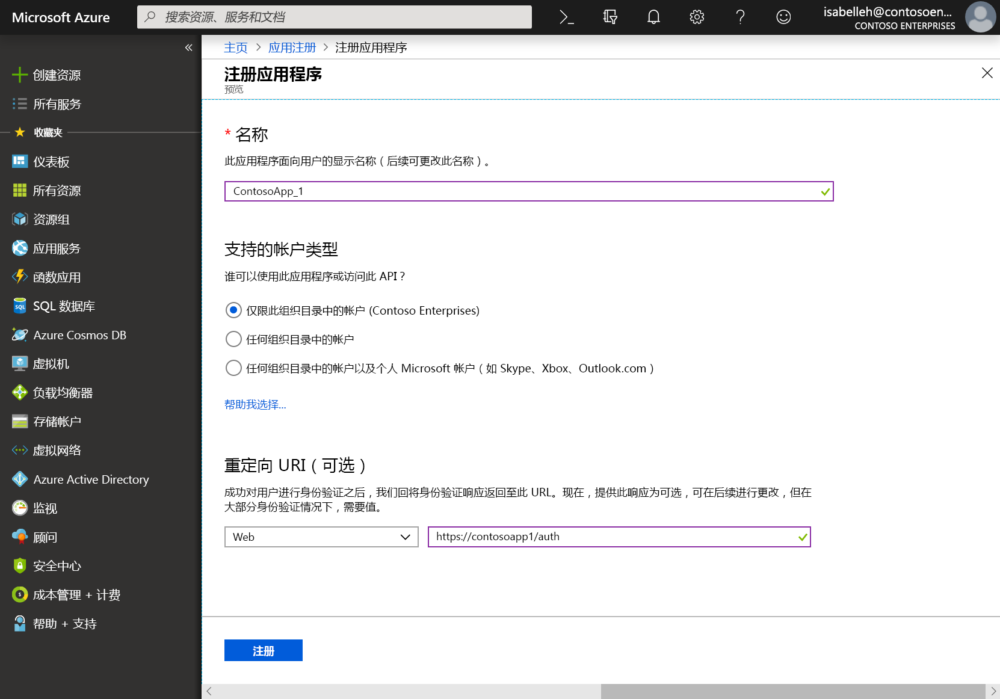
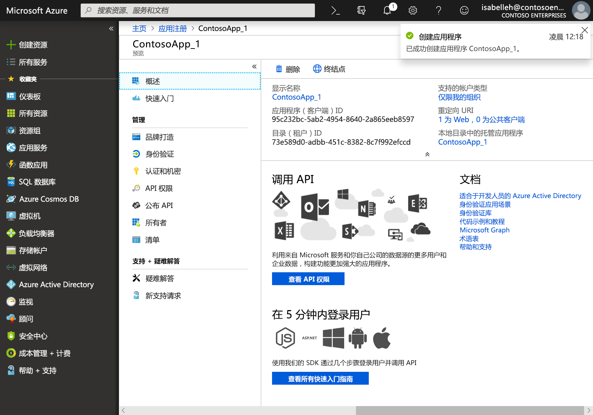

# 向 Microsoft 标识平台注册应用程序

在本页中，介绍了如何通过 Azure 门户中的 **应用注册** 体验添加和注册应用程序，从而让应用能够与 Microsoft 标识平台翔集成并调用 Microsoft Graph。 

> [!VIDEO https://www.youtube-nocookie.com/embed/93j0MmRruFo]

## 在 Azure 门户中注册新的应用程序

1. 使用工作/学校帐户或 Microsoft 个人帐户登录到 [Azure 门户](https://portal.azure.com)。
1. 如果你的帐户有权访问多个租户，请在右上角选择该帐户，并将门户会话设置为所需的 Azure AD 租户。
1. 在左侧导航窗格中，选择 **Azure Active Directory** 服务，然后选择 **“应用注册”>“新注册”**。
1. 出现“**注册应用程序**”页面后，输入应用程序的注册信息：

   - **名称** - 输入一个会显示给应用用户的有意义的应用程序名称。
   - **支持的帐户类型** - 选择希望应用程序支持的具体帐户。

       | 支持的帐户类型 | 说明 |
       |-------------------------|-------------|
       | **仅限此组织目录中的帐户** | 若要生成业务线 (LOB) 应用程序，请选择此选项。 如果不在目录中注册应用程序，则此选项不可用。  此选项映射到仅限 Azure AD 的单租户。  这是默认选项，除非你是在目录外部注册应用。 如果在目录外部注册应用，则默认设置为 Azure AD 多租户和 Microsoft 个人帐户。 |
       | **任何组织目录中的帐户** | 若想要面向所有企业和教育客户，请选择此选项。  此选项映射到仅限 Azure AD 的多租户。  如果已将应用注册为仅限 Azure AD 的单租户，则可通过“**身份验证**”边栏选项卡将其更新为 Azure AD 多租户，再更新回单租户。 |
       | **任何组织目录中的帐户和 Microsoft 个人帐户** | 若要面向最广泛的客户，请选择此选项。  此选项映射到 Azure AD 多租户和 Microsoft 个人帐户。  如果已将应用注册为 Azure AD 多租户和 Microsoft个人 帐户，则不能在 UI 中更改此项， 而只能使用应用程序清单编辑器来更改支持的帐户类型。 |

   - **重定向 URI（可选）** - 选择要生成的应用的类型：“**Web**”或“**公共客户端(移动和桌面)**”，然后输入应用程序的重定向 URI（或回复 URL）。
       - 对于 Web 应用程序，请提供应用的基 URL。 例如，`http://localhost:31544` 可以是本地计算机上运行的 Web 应用的 URL。 用户将使用此 URL 登录到 Web 客户端应用程序。
       - 对于公共客户端应用程序，请提供 Azure AD 返回令牌响应时所用的 URI。 输入特定于应用程序的值，例如 `myapp://auth`。

     若要查看 Web 应用程序或本机应用程序的特定示例，请参阅[快速入门](/azure/active-directory/develop/#quickstarts)。

1. 完成后，选择“**注册**”。

    

Azure AD 会将唯一的应用程序（客户端）ID 分配给应用，同时你会转到应用程序的“**概览**”页。 若要向应用程序添加其他功能，可选择品牌、证书和机密、API 权限等其他配置选项。

## 平台特定的属性

下表显示了针对不同类型的应用需要配置和复制的属性。_已分配_ 表示你应该使用由 Azure AD 分配的值。

| 应用类型 | 平台 | 应用程序（客户端）ID | 客户端密码 | 重定向 URI/URL | 隐式流 
| --- | --- | --- | --- | --- | --- |
| 本机/移动 | 本机 | 已分配  | 否 | 已分配 | 否 |
| Web 应用 | Web | 已分配 | 是 | 是 | 可选  Open ID Connect 中间件默认使用混合流（是） | 
| 单页应用 (SPA) | Web | 已分配 | 是 | 是 | 是   SPA 使用 Open ID Connect 隐式流 |
| 服务/守护程序 | Web | 已分配 | 是 | 是 | 否 |

## 后续步骤

- 详细了解[权限和同意](/azure/active-directory/develop/v2-permissions-and-consent)或查看 Microsoft Graph [权限参考](permissions-reference.md)。
- 若要在应用程序注册中启用其他配置功能（如凭据和权限），并使用户能够从其他租户登录，请参阅以下快速入门：
  - [将客户端应用程序配置为访问 Web API](/azure/active-directory/develop/quickstart-configure-app-access-web-apis)
  - [将应用程序配置为公开 Web API](/azure/active-directory/develop/quickstart-configure-app-expose-web-apis)
  - [修改应用程序支持的帐户](/azure/active-directory/develop/quickstart-modify-supported-accounts)
- 选择一个[快速入门](/azure/active-directory/develop/#quickstarts)，了解如何快速构建应用和添加功能，例如获取令牌、刷新令牌、进行用户登录、显示某些用户信息等等。
- 详细了解注册的应用程序及其间关系的两个 Azure AD 对象：[应用程序对象和服务主体对象](/azure/active-directory/develop/app-objects-and-service-principals)。
- 详细了解在通过[应用程序品牌指南](/azure/active-directory/develop/howto-add-branding-in-azure-ad-apps)开发应用时应使用的品牌指南。
