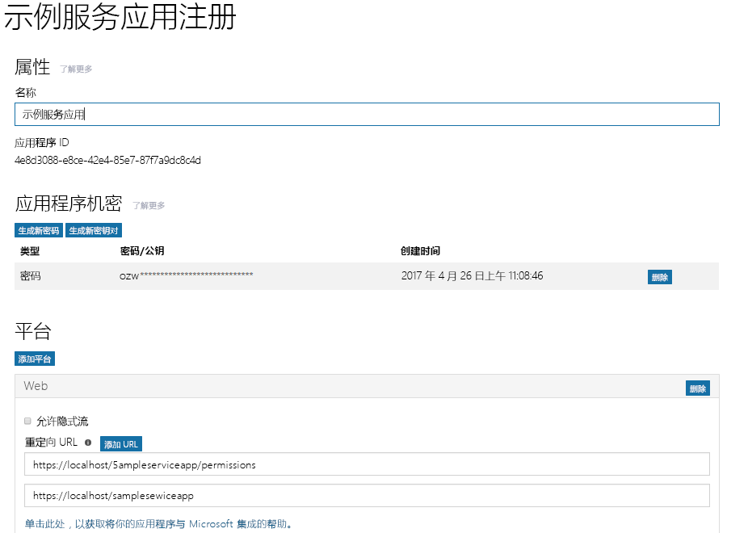
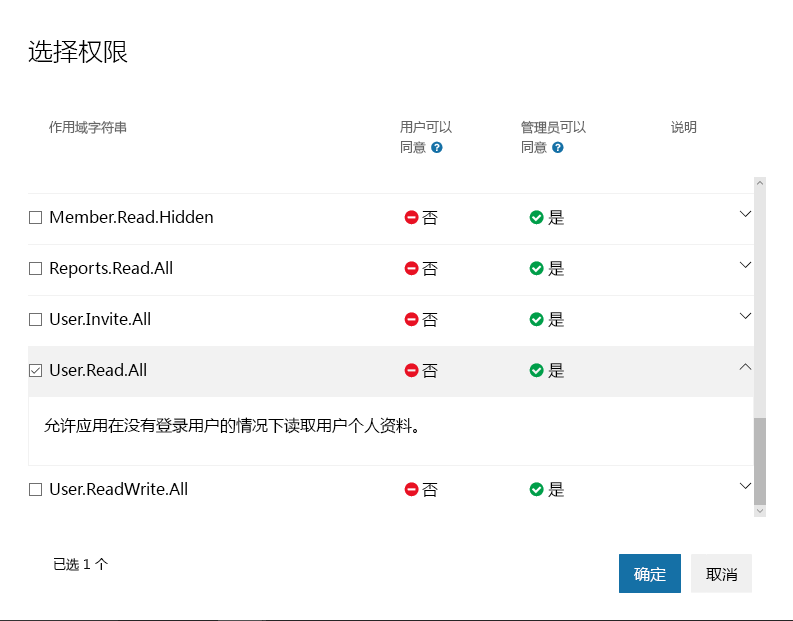

# <a name="get-access-without-a-user"></a><span data-ttu-id="2c369-107">无用户访问</span><span class="sxs-lookup"><span data-stu-id="2c369-107">Get access without a user</span></span>

<span data-ttu-id="2c369-p102">一些应用使用他们自己的标识（而不代表用户）调用 Microsoft Graph。在许多情况下，这些是在的服务器上运行的后台服务或守护程序，不存在登录用户。此类应用的一个示例是电子邮件存档服务，它可以在夜间保持清醒状态并运行。在某些情况下，具有登录用户的应用可能还需要以他们自己的标识调用 Microsoft Graph。例如，应用可能需要使用以下特定功能，该功能要求在组织中具有比登录用户的提升权限更多的权限。</span><span class="sxs-lookup"><span data-stu-id="2c369-p102">Some apps call Microsoft Graph with their own identity and not on behalf of a user. In many cases, these are background services or daemons that run on a server without the presence of a signed-in user. An example of such an app might be an email archival service that wakes up and runs overnight. In some cases, apps that have a signed-in user present may also need to call Microsoft Graph under their own identity. For example, an app may need to use functionality that requires more elevated privileges in an organization than those carried by the signed-in user.</span></span>  

<span data-ttu-id="2c369-p103">使用它们自己的标识调用 Microsoft Graph 的应用使用 OAuth 2.0 客户端凭据授予流从 Azure AD 获取访问令牌。在本主题中，我们将展示配置服务和使用 OAuth 客户端凭据授予流获取访问令牌的基本步骤。</span><span class="sxs-lookup"><span data-stu-id="2c369-p103">Apps that call Microsoft Graph with their own identity use the OAuth 2.0 client credentials grant flow to get access tokens from Azure AD. In this topic, we will walk through the basic steps to configure a service and use the OAuth client credentials grant flow to get an access token.</span></span> 

## <a name="authentication-and-authorization-steps"></a><span data-ttu-id="2c369-115">身份验证和授权步骤</span><span class="sxs-lookup"><span data-stu-id="2c369-115">Authentication and authorization steps</span></span>

<span data-ttu-id="2c369-116">配置服务和从 Azure AD v2.0 终结点获取令牌（服务可用于以自己的标识调用 Microsoft Graph）所需的基本步骤如下：</span><span class="sxs-lookup"><span data-stu-id="2c369-116">The basic steps required to configure a service and get a token from the Azure AD v2.0 endpoint that your service can use to call Microsoft Graph under its own identity are:</span></span>

1. <span data-ttu-id="2c369-117">注册应用。</span><span class="sxs-lookup"><span data-stu-id="2c369-117">Register your app.</span></span>
2. <span data-ttu-id="2c369-118">在应用上配置 Microsoft Graph 的权限。</span><span class="sxs-lookup"><span data-stu-id="2c369-118">Configure permissions for Microsoft Graph on your app.</span></span>
3. <span data-ttu-id="2c369-119">获取管理员同意。</span><span class="sxs-lookup"><span data-stu-id="2c369-119">Get administrator consent.</span></span>
4. <span data-ttu-id="2c369-120">获取访问令牌。</span><span class="sxs-lookup"><span data-stu-id="2c369-120">Get an access token.</span></span>
5. <span data-ttu-id="2c369-121">使用访问令牌调用 Microsoft Graph。</span><span class="sxs-lookup"><span data-stu-id="2c369-121">Use the access token to call Microsoft Graph.</span></span>

## <a name="1-register-your-app"></a><span data-ttu-id="2c369-122">1.注册你的应用程序</span><span class="sxs-lookup"><span data-stu-id="2c369-122">1. Register your app</span></span>

<span data-ttu-id="2c369-p104">若要使用 Azure v2.0 终结点进行身份验证，必须先在 [Microsoft 应用注册门户](https://apps.dev.microsoft.com/)注册你的应用。你可以使用 Microsoft 帐户或工作或学校帐户注册应用。</span><span class="sxs-lookup"><span data-stu-id="2c369-p104">To authenticate with the Azure v2.0 endpoint, you must first register your app at the [Microsoft App Registration Portal](https://apps.dev.microsoft.com/). You can use either a Microsoft account or a work or school account to register your app.</span></span> 

<span data-ttu-id="2c369-p105">下面的屏幕快照显示了已针对后台服务进行配置的 Web 应用注册。</span><span class="sxs-lookup"><span data-stu-id="2c369-p105">The following screenshot shows a web app registration that has been configured for a background service. </span></span>

<span data-ttu-id="2c369-127">对于将以自己的标识调用 Microsoft Graph 的服务，用户需要将应用注册到 Web 平台并复制以下值：</span><span class="sxs-lookup"><span data-stu-id="2c369-127">For a service that will call Microsoft Graph under its own identity, you need to register your app for the Web platform and copy the following values:</span></span>

- <span data-ttu-id="2c369-128">应用注册门户分配的应用程序 ID。</span><span class="sxs-lookup"><span data-stu-id="2c369-128">The Application ID assigned by the app registration portal.</span></span>
- <span data-ttu-id="2c369-129">应用程序密码，可以是密码，也可以是公钥/私钥对（证书）。</span><span class="sxs-lookup"><span data-stu-id="2c369-129">An Application Secret, either a password or a public/private key pair (certificate).</span></span>
- <span data-ttu-id="2c369-130">可以让服务接收来自 Azure AD 的令牌响应的重定向 URL。</span><span class="sxs-lookup"><span data-stu-id="2c369-130">A Redirect URL for your service to receive token responses from Azure AD.</span></span>
- <span data-ttu-id="2c369-131">你的应用实现功能以请求管理员同意时，可以让服务接收管理员同意响应的重定向 URL。</span><span class="sxs-lookup"><span data-stu-id="2c369-131">A Redirect URL for your service to receive admin consent responses if your app implements functionality to request administrator consent.</span></span>  

<span data-ttu-id="2c369-132">有关如何使用 Microsoft 应用注册门户配置应用的步骤，请参阅[注册你的应用](./auth-register-app-v2.md)。</span><span class="sxs-lookup"><span data-stu-id="2c369-132">For steps on how to configure an app using the Microsoft App Registration Portal, see [Register your app](./auth-register-app-v2.md).</span></span>

<span data-ttu-id="2c369-133">通过 OAuth 2.0 客户端凭据授予流，应用可以使用由 Azure AD 分配的应用程序 ID 和使用门户创建的应用程序密码，直接在 Azure AD v2.0 `/token` 终结点中进行身份验证。</span><span class="sxs-lookup"><span data-stu-id="2c369-133">With the OAuth 2.0 client credentials grant flow, your app authenticates directly at the Azure AD v2.0 `/token` endpoint using the Application ID assigned by Azure AD and the Application Secret that you create using the portal.</span></span> 

## <a name="2-configure-permissions-for-microsoft-graph"></a><span data-ttu-id="2c369-134">2.配置 Microsoft Graph 的权限</span><span class="sxs-lookup"><span data-stu-id="2c369-134">2. Configure permissions for Microsoft Graph</span></span>

<span data-ttu-id="2c369-p106">对于以它们自己的标识调用 Microsoft Graph 的应用，Microsoft Graph 显示应用程序权限。（Microsoft Graph 还显示代表用户调用 Microsoft Graph 的应用的委派权限。）注册应用时，需要预配置应用所需的应用程序权限。应用程序权限始终需要管理员的同意。当你的应用安装在他们的组织中时，管理员可以使用 [Azure 门户](https://portal.azure.com)同意这些权限，你也可以提供应用注册体验，让管理员同意你配置的权限。Azure AD 记录管理员同意后，你的应用无需再次请求同意即可请求令牌。有关可通过 Microsoft Graph 使用的权限的详细信息，请参阅[权限参考](./permissions-reference.md)</span><span class="sxs-lookup"><span data-stu-id="2c369-p106">For apps that call Microsoft Graph under their own identity, Microsoft Graph exposes application permissions. (Microsoft Graph also exposes delegated permissions for apps that call Microsoft Graph on behalf of a user.) You pre-configure the application permissions your app needs when you register your app. Application permissions always require administrator consent. An administrator can either consent to these permissions using the [Azure portal](https://portal.azure.com) when your app is installed in their organization, or you can provide a sign-up experience in your app through which administrators can consent to the permissions you configured. Once administrator consent is recorded by Azure AD, your app can request tokens without having to request consent again. For more detailed information about the permissions available with Microsoft Graph, see the [Permissions reference](./permissions-reference.md)</span></span>

<span data-ttu-id="2c369-141">若要在 [Microsoft 应用注册门户](https://apps.dev.microsoft.com/)中配置应用的应用程序权限：在“Microsoft Graph”\*\*\*\* 下，选择“应用程序权限”\*\*\*\* 旁边的“添加”\*\*\*\*，然后在“选择权限”\*\*\*\* 对话框中选择应用需要的权限。</span><span class="sxs-lookup"><span data-stu-id="2c369-141">To configure application permissions for your app in the [Microsoft App Registration Portal](https://apps.dev.microsoft.com/): under **Microsoft Graph**, choose **Add** next to **Application Permissions** and then select the permissions your app requires in the **Select Permissions** dialog.</span></span>

<span data-ttu-id="2c369-142">下面的屏幕快照显示了 Microsoft Graph 应用程序权限的“选择权限”\*\*\*\* 对话框。</span><span class="sxs-lookup"><span data-stu-id="2c369-142">The following screenshot shows the **Select Permissions** dialog for Microsoft Graph application permissions.</span></span> 



> <span data-ttu-id="2c369-p107">**注意**：建议配置应用需要的最小特权权限集。这为管理员提供的体验要比不得不同意一个很长的权限列表的体验舒适得多。</span><span class="sxs-lookup"><span data-stu-id="2c369-p107">**Note**: We recommend configuring the least privileged set of permissions required by your app. This provides a much more comfortable experience for administrators than having to consent to a long list of permissions.</span></span>

## <a name="3-get-administrator-consent"></a><span data-ttu-id="2c369-146">3.获取管理员同意</span><span class="sxs-lookup"><span data-stu-id="2c369-146">3. Get administrator consent</span></span>

<span data-ttu-id="2c369-147">你可以依赖管理员在 [Azure 门户](https://portal.azure.com)中授予应用所需的权限；但是，通常情况下，更好的选择是通过使用 Azure AD v2.0 `/adminconsent` 终结点为管理员提供注册体验。</span><span class="sxs-lookup"><span data-stu-id="2c369-147">You can rely on an administrator to grant the permissions your app needs at the [Azure portal](https://portal.azure.com); however, often, a better option is to provide a sign-up experience for administrators by using the Azure AD v2.0 `/adminconsent` endpoint.</span></span> 

> <span data-ttu-id="2c369-148">**重要说明**：任何时候更改配置权限都必须重复管理员同意过程。</span><span class="sxs-lookup"><span data-stu-id="2c369-148">**Important**: Any time you make a change to the configured permissions, you must also repeat the Admin Consent process.</span></span> <span data-ttu-id="2c369-149">租户管理员重新应用同意之后，才会反映应用注册门户中所做的更改。</span><span class="sxs-lookup"><span data-stu-id="2c369-149">Changes made in the app registration portal will not be reflected until consent has been reapplied by the tenant's administrator.</span></span>

### <a name="request"></a><span data-ttu-id="2c369-150">请求</span><span class="sxs-lookup"><span data-stu-id="2c369-150">Request</span></span>

```
// Line breaks are for legibility only.

GET https://login.microsoftonline.com/{tenant}/adminconsent
?client_id=6731de76-14a6-49ae-97bc-6eba6914391e
&state=12345
&redirect_uri=https://localhost/myapp/permissions
```

| <span data-ttu-id="2c369-151">参数</span><span class="sxs-lookup"><span data-stu-id="2c369-151">Parameter</span></span>     | <span data-ttu-id="2c369-152">条件</span><span class="sxs-lookup"><span data-stu-id="2c369-152">Condition</span></span>   | <span data-ttu-id="2c369-153">说明</span><span class="sxs-lookup"><span data-stu-id="2c369-153">Description</span></span> 
|:--------------|:------------|:------------
| <span data-ttu-id="2c369-154">租户</span><span class="sxs-lookup"><span data-stu-id="2c369-154">tenant</span></span>        | <span data-ttu-id="2c369-155">必需</span><span class="sxs-lookup"><span data-stu-id="2c369-155">Required</span></span>    | <span data-ttu-id="2c369-p109">需要从中请求权限的目录租户。它可以 GUID 或友好名称格式显示。如果你不了解用户授予哪个租户，并想让用户使用任意租户登录，请使用 `common`。</span><span class="sxs-lookup"><span data-stu-id="2c369-p109">The directory tenant that you want to request permission from. This can be in GUID or friendly name format. If you don't know which tenant the user belongs to and you want to let them sign in with any tenant, use `common`.</span></span> 
| <span data-ttu-id="2c369-159">client_id</span><span class="sxs-lookup"><span data-stu-id="2c369-159">client_id</span></span>     | <span data-ttu-id="2c369-160">必需</span><span class="sxs-lookup"><span data-stu-id="2c369-160">Required</span></span>    | <span data-ttu-id="2c369-161">[应用程序注册门户](https://apps.dev.microsoft.com/)分配给你的应用的应用程序 ID。</span><span class="sxs-lookup"><span data-stu-id="2c369-161">The Application ID that the [Application Registration Portal](https://apps.dev.microsoft.com/) assigned to your app.</span></span> 
| <span data-ttu-id="2c369-162">redirect_uri</span><span class="sxs-lookup"><span data-stu-id="2c369-162">redirect_uri</span></span>  | <span data-ttu-id="2c369-163">必需</span><span class="sxs-lookup"><span data-stu-id="2c369-163">Required</span></span>    | <span data-ttu-id="2c369-p110">要向其发送响应供应用处理的重定向 URI。它必须完全匹配在门户中注册的重定向 URI 之一，但它必须采用 URL 编码，且可以拥有其他路径段。</span><span class="sxs-lookup"><span data-stu-id="2c369-p110">The redirect URI where you want the response to be sent for your app to handle. It must exactly match one of the redirect URIs that you registered in the portal, except that it must be URL encoded, and it can have additional path segments.</span></span> 
| <span data-ttu-id="2c369-166">state</span><span class="sxs-lookup"><span data-stu-id="2c369-166">state</span></span>         | <span data-ttu-id="2c369-167">建议</span><span class="sxs-lookup"><span data-stu-id="2c369-167">Recommended</span></span> | <span data-ttu-id="2c369-p111">请求中包含的值，也会在令牌响应中返回。它可以是你希望的任何内容的字符串。此状态用于在发生身份验证请求前，对应用中的用户状态信息进行编码（例如它们所在的页面或视图上）。</span><span class="sxs-lookup"><span data-stu-id="2c369-p111">A value that is included in the request that also is returned in the token response. It can be a string of any content that you want. The state is used to encode information about the user's state in the app before the authentication request occurred, such as the page or view they were on.</span></span> 

### <a name="administrator-consent-experience"></a><span data-ttu-id="2c369-171">管理员同意体验</span><span class="sxs-lookup"><span data-stu-id="2c369-171">Administrator consent experience</span></span>

<span data-ttu-id="2c369-p112">对于 `/adminconsent` 终结点的请求，Azure AD 强制规定，仅租户管理员可以登录来完成请求。系统可能会提示管理员批准你在应用注册门户中为应用请求获取的所有应用程序权限。</span><span class="sxs-lookup"><span data-stu-id="2c369-p112">With requests to the `/adminconsent` endpoint, Azure AD enforces that only a tenant administrator can sign in to complete the request. The administrator will be asked to approve all the application permissions that you have requested for your app in the app registration portal.</span></span> 

<span data-ttu-id="2c369-174">下面的示例展示了 Azure AD 向管理员显示的同意对话框：</span><span class="sxs-lookup"><span data-stu-id="2c369-174">The following is an example of the consent dialog that Azure AD presents to the administrator:</span></span>


### <a name="response"></a><span data-ttu-id="2c369-176">响应</span><span class="sxs-lookup"><span data-stu-id="2c369-176">Response</span></span>

<span data-ttu-id="2c369-177">如果管理员批准应用程序的权限，则成功响应如下所示：</span><span class="sxs-lookup"><span data-stu-id="2c369-177">If the administrator approves the permissions for your application, the successful response looks like this:</span></span>

```
// Line breaks are for legibility only.

GET https://localhost/myapp/permissions
?tenant=a8990e1f-ff32-408a-9f8e-78d3b9139b95&state=12345
&admin_consent=True
```

| <span data-ttu-id="2c369-178">参数</span><span class="sxs-lookup"><span data-stu-id="2c369-178">Parameter</span></span>     | <span data-ttu-id="2c369-179">说明</span><span class="sxs-lookup"><span data-stu-id="2c369-179">Description</span></span> 
|:--------------|:------------
| <span data-ttu-id="2c369-180">租户</span><span class="sxs-lookup"><span data-stu-id="2c369-180">tenant</span></span>        | <span data-ttu-id="2c369-181">以 GUID 格式向应用程序授予其请求的权限的目录租户。</span><span class="sxs-lookup"><span data-stu-id="2c369-181">The directory tenant that granted your application the permissions that it requested, in GUID format.</span></span> 
| <span data-ttu-id="2c369-182">state</span><span class="sxs-lookup"><span data-stu-id="2c369-182">state</span></span>         | <span data-ttu-id="2c369-p113">请求中包含的值，也会在令牌响应中返回。它可以是你希望的任何内容的字符串。此状态用于在发生身份验证请求前，对应用中的用户状态信息进行编码（例如它们所在的页面或视图上）。</span><span class="sxs-lookup"><span data-stu-id="2c369-p113">A value that is included in the request that also is returned in the token response. It can be a string of any content that you want. The state is used to encode information about the user's state in the app before the authentication request occurred, such as the page or view they were on.</span></span> 
| <span data-ttu-id="2c369-186">admin_consent</span><span class="sxs-lookup"><span data-stu-id="2c369-186">admin_consent</span></span> | <span data-ttu-id="2c369-187">设置为 **true**。</span><span class="sxs-lookup"><span data-stu-id="2c369-187">Set to **true**.</span></span> 


> <span data-ttu-id="2c369-p114">**试一试**：可以通过将下面的请求粘贴到浏览器中自行尝试。如果以 Azure AD 租户的全局管理员身份登录，你将看到应用的管理员同意对话框。（这与上文的同意对话框屏幕截图中显示的应用不同。）</span><span class="sxs-lookup"><span data-stu-id="2c369-p114">**Try**: You can try this for yourself by pasting the following request in a browser. If you sign in as a Global administrator for an Azure AD tenant, you will be presented with the administrator consent dialog box for the app. (This will be a different app than that in the consent dialog box screenshot shown earlier.)</span></span>
> 
> https://login.microsoftonline.com/common/adminconsent?client_id=6731de76-14a6-49ae-97bc-6eba6914391e&state=12345&redirect_uri=https://localhost/myapp/permissions 

## <a name="4-get-an-access-token"></a><span data-ttu-id="2c369-191">4. 获取访问令牌</span><span class="sxs-lookup"><span data-stu-id="2c369-191">4. Get an access token</span></span>

<span data-ttu-id="2c369-192">在 OAuth 2.0 客户端凭据授予流中，可以在注册应用以便直接从 Azure AD v2.0 `/token` 终结点请求访问令牌时使用应用程序 ID 和应用程序密码值。</span><span class="sxs-lookup"><span data-stu-id="2c369-192">In the OAuth 2.0 client credentials grant flow, you use the Application ID and Application Secret values that you saved when you registered your app to request an access token directly from the Azure AD v2.0 `/token` endpoint.</span></span>

<span data-ttu-id="2c369-p115">你可以通过传递 `https://graph.microsoft.com/.default` 并将其作为令牌请求中 `scope` 参数的值来指定预配置的权限。请参阅下面的令牌请求中的 `scope` 参数说明获取详情。</span><span class="sxs-lookup"><span data-stu-id="2c369-p115">You specify the pre-configured permissions by passing `https://graph.microsoft.com/.default` as the value for the `scope` parameter in the token request. See the `scope` parameter description in the token request below for details.</span></span>

### <a name="token-request"></a><span data-ttu-id="2c369-195">令牌请求</span><span class="sxs-lookup"><span data-stu-id="2c369-195">Token request</span></span>

<span data-ttu-id="2c369-196">你可以将 POST 请求发送到 `/token` 2.0 终结点来获取访问令牌：</span><span class="sxs-lookup"><span data-stu-id="2c369-196">You send a POST request to the `/token` v2.0 endpoint to acquire an access token:</span></span>

```
// Line breaks are for legibility only.

POST https://login.microsoftonline.com/{tenant}/oauth2/v2.0/token HTTP/1.1
Host: login.microsoftonline.com
Content-Type: application/x-www-form-urlencoded

client_id=535fb089-9ff3-47b6-9bfb-4f1264799865
&scope=https%3A%2F%2Fgraph.microsoft.com%2F.default
&client_secret=qWgdYAmab0YSkuL1qKv5bPX
&grant_type=client_credentials
```

| <span data-ttu-id="2c369-197">参数</span><span class="sxs-lookup"><span data-stu-id="2c369-197">Parameter</span></span>     | <span data-ttu-id="2c369-198">条件</span><span class="sxs-lookup"><span data-stu-id="2c369-198">Condition</span></span> | <span data-ttu-id="2c369-199">说明</span><span class="sxs-lookup"><span data-stu-id="2c369-199">Description</span></span> 
|:--------------|:----------|:------------
| <span data-ttu-id="2c369-200">租户</span><span class="sxs-lookup"><span data-stu-id="2c369-200">tenant</span></span>        | <span data-ttu-id="2c369-201">必需</span><span class="sxs-lookup"><span data-stu-id="2c369-201">Required</span></span>  | <span data-ttu-id="2c369-p116">需要从中请求权限的目录租户。它可以 GUID 或友好名称格式显示。</span><span class="sxs-lookup"><span data-stu-id="2c369-p116">The directory tenant that you want to request permission from. This can be in GUID or friendly name format.</span></span> 
| <span data-ttu-id="2c369-204">client_id</span><span class="sxs-lookup"><span data-stu-id="2c369-204">client_id</span></span>     | <span data-ttu-id="2c369-205">必需</span><span class="sxs-lookup"><span data-stu-id="2c369-205">Required</span></span>  | <span data-ttu-id="2c369-206">当注册应用时，[Microsoft 应用注册门户](https://apps.dev.microsoft.com)分配的应用程序 ID。</span><span class="sxs-lookup"><span data-stu-id="2c369-206">The Application ID that the [Microsoft App Registration Portal](https://apps.dev.microsoft.com) assigned when you registered your app.</span></span> 
| <span data-ttu-id="2c369-207">范围</span><span class="sxs-lookup"><span data-stu-id="2c369-207">scope</span></span>         | <span data-ttu-id="2c369-208">必需</span><span class="sxs-lookup"><span data-stu-id="2c369-208">Required</span></span>  | <span data-ttu-id="2c369-p117">为此请求中的 `scope` 参数传递的值应为所需资源的资源标识符（应用程序 ID URI），带有 `.default` 后缀。对于 Microsoft Graph，值为 `https://graph.microsoft.com/.default`。此值会指示 v2.0 终结点，对于为应用配置的所有应用程序权限，它应该为要使用的资源的关联项颁发令牌。</span><span class="sxs-lookup"><span data-stu-id="2c369-p117">The value passed for the `scope` parameter in this request should be the resource identifier (Application ID URI) of the resource you want, affixed with the `.default` suffix. For Microsoft Graph, the value is `https://graph.microsoft.com/.default`. This value informs the v2.0 endpoint that of all the application permissions you have configured for your app, it should issue a token for the ones associated with the resource you want to use.</span></span> 
| <span data-ttu-id="2c369-212">client_secret</span><span class="sxs-lookup"><span data-stu-id="2c369-212">client_secret</span></span> | <span data-ttu-id="2c369-213">必需</span><span class="sxs-lookup"><span data-stu-id="2c369-213">Required</span></span>  | <span data-ttu-id="2c369-214">你在应用注册门户中为应用生成的应用程序密码。</span><span class="sxs-lookup"><span data-stu-id="2c369-214">The Application Secret that you generated for your app in the app registration portal.</span></span> 
| <span data-ttu-id="2c369-215">grant_type</span><span class="sxs-lookup"><span data-stu-id="2c369-215">grant_type</span></span>    | <span data-ttu-id="2c369-216">必需</span><span class="sxs-lookup"><span data-stu-id="2c369-216">Required</span></span>  | <span data-ttu-id="2c369-217">必须是 `client_credentials`。</span><span class="sxs-lookup"><span data-stu-id="2c369-217">Must be `client_credentials`.</span></span> 

#### <a name="token-response"></a><span data-ttu-id="2c369-218">令牌响应</span><span class="sxs-lookup"><span data-stu-id="2c369-218">Token response</span></span>

<span data-ttu-id="2c369-219">成功的响应如下所示：</span><span class="sxs-lookup"><span data-stu-id="2c369-219">A successful response looks like this:</span></span>

```json
{
  "token_type": "Bearer",
  "expires_in": 3599,
  "access_token": "eyJ0eXAiOiJKV1QiLCJhbGciOiJSUzI1NiIsIng1dCI6Ik1uQ19WWmNBVGZNNXBP..."
}
```

| <span data-ttu-id="2c369-220">参数</span><span class="sxs-lookup"><span data-stu-id="2c369-220">Parameter</span></span>     | <span data-ttu-id="2c369-221">说明</span><span class="sxs-lookup"><span data-stu-id="2c369-221">Description</span></span> 
|:--------------|:------------
| <span data-ttu-id="2c369-222">access_token</span><span class="sxs-lookup"><span data-stu-id="2c369-222">access_token</span></span>  | <span data-ttu-id="2c369-p118">请求的访问令牌。应用可使用此令牌调用 Microsoft Graph。</span><span class="sxs-lookup"><span data-stu-id="2c369-p118">The requested access token. Your app can use this token in calls to Microsoft Graph.</span></span> 
| <span data-ttu-id="2c369-225">token_type</span><span class="sxs-lookup"><span data-stu-id="2c369-225">token_type</span></span>    | <span data-ttu-id="2c369-p119">表示令牌类型值。Azure AD 唯一支持的类型是 `bearer`</span><span class="sxs-lookup"><span data-stu-id="2c369-p119">Indicates the token type value. The only type that Azure AD supports is `bearer`.</span></span> 
| <span data-ttu-id="2c369-228">expires_in</span><span class="sxs-lookup"><span data-stu-id="2c369-228">expires_in</span></span>    | <span data-ttu-id="2c369-229">访问令牌的有效期是多久（以秒为单位）。</span><span class="sxs-lookup"><span data-stu-id="2c369-229">How long the access token is valid (in seconds).</span></span> 

## <a name="5-use-the-access-token-to-call-microsoft-graph"></a><span data-ttu-id="2c369-230">5.使用访问令牌调用 Microsoft Graph</span><span class="sxs-lookup"><span data-stu-id="2c369-230">5. Use the access token to call Microsoft Graph</span></span>

<span data-ttu-id="2c369-p120">拥有访问令牌之后，可以通过将其包含在请求的 `Authorization` 标头中，用其调用 Microsoft Graph。以下请求可以获取特定用户的个人资料。你的应用必须拥有 _User.Read.All_ 权限才能调用此 API。</span><span class="sxs-lookup"><span data-stu-id="2c369-p120">After you have an access token, you can use it to call Microsoft Graph by including it in the `Authorization` header of a request. The following request gets the profile of a specific user. Your app must have the _User.Read.All_ permission to call this API.</span></span>

```
GET https://graph.microsoft.com/v1.0/users/12345678-73a6-4952-a53a-e9916737ff7f 
Authorization: Bearer eyJ0eXAiO ... 0X2tnSQLEANnSPHY0gKcgw
Host: graph.microsoft.com
```
<span data-ttu-id="2c369-234">成功的响应将与此类似（一些响应标头已被删除）：</span><span class="sxs-lookup"><span data-stu-id="2c369-234">A successful response will look similar to this (some response headers have been removed):</span></span>

```http
HTTP/1.1 200 OK
Content-Type: application/json;odata.metadata=minimal;odata.streaming=true;IEEE754Compatible=false;charset=utf-8
request-id: f45d08c0-6901-473a-90f5-7867287de97f
client-request-id: f45d08c0-6901-473a-90f5-7867287de97f
OData-Version: 4.0
Duration: 309.0273
Date: Wed, 26 Apr 2017 19:53:49 GMT
Content-Length: 407
```

```json
{
    "@odata.context":"https://graph.microsoft.com/v1.0/$metadata#users/$entity",
    "id":"12345678-73a6-4952-a53a-e9916737ff7f",
    "businessPhones":[
        "+1 555555555"
    ],
    "displayName":"Chris Green",
    "givenName":"Chris",
    "jobTitle":"Software Engineer",
    "mail":null,
    "mobilePhone":"+1 5555555555",
    "officeLocation":"Seattle Office",
    "preferredLanguage":null,
    "surname":"Green",
    "userPrincipalName":"ChrisG@contoso.onmicrosoft.com"
}
```

## <a name="supported-app-scenarios-and-resources"></a><span data-ttu-id="2c369-235">受支持的应用场景和资源</span><span class="sxs-lookup"><span data-stu-id="2c369-235">Supported app scenarios and resources</span></span>

<span data-ttu-id="2c369-236">以它们自己的标识调用 Microsoft Graph 的应用可分为两个类别：</span><span class="sxs-lookup"><span data-stu-id="2c369-236">Apps that call Microsoft Graph under their own identity fall into one of two categories:</span></span>

- <span data-ttu-id="2c369-237">在服务器上运行的没有登录用户的后台服务（守护程序）。</span><span class="sxs-lookup"><span data-stu-id="2c369-237">Background services (daemons) that run on a server without a signed-in user.</span></span>
- <span data-ttu-id="2c369-238">具有登录用户但仍以它们自己的标识调用 Microsoft Graph 的应用；例如，使用需要具有比登录用户所拥有的提升权限更多权限的功能。</span><span class="sxs-lookup"><span data-stu-id="2c369-238">Apps that have a signed-in user but also call Microsoft Graph with their own identity; for example, to use functionality that requires more elevated privileges than those of the user.</span></span>

<span data-ttu-id="2c369-p121">使用它们自己的标识调用 Microsoft Graph 的应用使用 OAuth 2.0 客户端凭据授予流通过 Azure AD 进行身份验证并获取访问令牌。对于 v2.0 终结点，可以使用以下资源进一步了解此方案：</span><span class="sxs-lookup"><span data-stu-id="2c369-p121">Apps that call Microsoft Graph with their own identity use the OAuth 2.0 client credentials grant to authenticate with Azure AD and get a token. For the v2.0 endpoint, you can explore this scenario further with the following resources:</span></span>

- <span data-ttu-id="2c369-241">有关还包含错误响应的客户端凭据授予流的更完整的处理，请参阅 [Azure Active Directory v2.0 和 OAuth 2.0 客户端凭据流](https://docs.microsoft.com/azure/active-directory/develop/active-directory-v2-protocols-oauth-client-creds)。</span><span class="sxs-lookup"><span data-stu-id="2c369-241">For a more complete treatment of the client credentials grant flow that also includes error responses, see [Azure Active Directory v2.0 and the OAuth 2.0 client credentials flow](https://docs.microsoft.com/azure/active-directory/develop/active-directory-v2-protocols-oauth-client-creds).</span></span> 
- <span data-ttu-id="2c369-242">有关从服务中调用 Microsoft Graph 的示例，请参阅 GitHub 上的 [v2.0 守护程序示例](https://github.com/Azure-Samples/active-directory-dotnet-daemon-v2)。</span><span class="sxs-lookup"><span data-stu-id="2c369-242">For a sample that calls Microsoft Graph from a service, see the [v2.0 daemon sample](https://github.com/Azure-Samples/active-directory-dotnet-daemon-v2) on GitHub.</span></span>
- <span data-ttu-id="2c369-243">有关对 Azure AD v2.0 建议的 Microsoft 和第三方身份验证库的详细信息，请参阅 [Azure Active Directory v2.0 身份验证库](https://docs.microsoft.com/azure/active-directory/develop/active-directory-v2-libraries)。</span><span class="sxs-lookup"><span data-stu-id="2c369-243">For more information about recommended Microsoft and third-party authentication libraries for Azure AD v2.0, see [Azure Active Directory v2.0 authentication libraries](https://docs.microsoft.com/azure/active-directory/develop/active-directory-v2-libraries).</span></span>

## <a name="azure-ad-endpoint-considerations"></a><span data-ttu-id="2c369-244">Azure AD 终结点注意事项</span><span class="sxs-lookup"><span data-stu-id="2c369-244">Azure AD endpoint considerations</span></span>

<span data-ttu-id="2c369-245">如果使用的是 Azure AD 终结点，则配置应用和登录到 Azure AD 的方式有一些差异：</span><span class="sxs-lookup"><span data-stu-id="2c369-245">If you are using the Azure AD endpoint, there are some differences in the way that you configure your app and the way that it signs in to Azure AD:</span></span>

- <span data-ttu-id="2c369-p122">使用 [Azure 门户](https://portal.azure.com)配置应用。有关使用 Azure 门户配置应用的详细信息，请参阅[将应用程序与 Azure Active Directory 相集成：添加应用程序](https://docs.microsoft.com/azure/active-directory/develop/active-directory-integrating-applications#adding-an-application)</span><span class="sxs-lookup"><span data-stu-id="2c369-p122">You use the [Azure portal](https://portal.azure.com) to configure your app. For more information about configuring apps with the Azure portal, see [Integrating applications with Azure Active Directory: Adding an application](https://docs.microsoft.com/azure/active-directory/develop/active-directory-integrating-applications#adding-an-application)</span></span>
- <span data-ttu-id="2c369-248">如果你的应用为多租户应用，则必须在 [Azure 门户](https://portal.azure.com)中通过显式方式将其配置为多租户。</span><span class="sxs-lookup"><span data-stu-id="2c369-248">If your app is a multi-tenant app, you must explicitly configure it to be multi-tenant at the [Azure portal](https://portal.azure.com).</span></span>
- <span data-ttu-id="2c369-p123">没有管理员同意终结点 (`/adminconsent`)，但是，你的应用可以在运行时通过将 `prompt=admin_consent` 参数添加到授权请求来请求管理员同意。有关详细信息，请参阅[将应用程序与 Azure Active Directory 相集成](https://docs.microsoft.com/azure/active-directory/develop/active-directory-integrating-applications)中的**在运行时引发 Azure AD 同意框架**。</span><span class="sxs-lookup"><span data-stu-id="2c369-p123">There is no admin consent endpoint (`/adminconsent`), instead, your app can request administrator consent during runtime by adding the `prompt=admin_consent` parameter to an authorization request. For more information, see **Triggering the Azure AD consent framework at runtime** in [Integrating applications with Azure Active Directory](https://docs.microsoft.com/azure/active-directory/develop/active-directory-integrating-applications).</span></span>
- <span data-ttu-id="2c369-p124">授权和令牌请求中的参数不相同。例如，Azure AD 终结点请求中没有 `scope` 参数；但是，`resource` 参数可用于指定为其请求的授权（用于管理员同意）或令牌的资源 (`resource=https://graph.microsoft.com`) 的 URI。</span><span class="sxs-lookup"><span data-stu-id="2c369-p124">The parameters in authorization and token requests are different. For example, there is no `scope` parameter in Azure AD endpoint requests; instead, the `resource` parameter is used to specify the URI of the resource (`resource=https://graph.microsoft.com`) that authorization (for administrator consent) or a token is being requested for.</span></span>

<span data-ttu-id="2c369-253">对于 Azure AD 终结点，可以使用以下资源进一步了解此方案：</span><span class="sxs-lookup"><span data-stu-id="2c369-253">For the Azure AD endpoint, you can explore this scenario further with the following resources:</span></span>

- <span data-ttu-id="2c369-254">有关客户端凭据授予流的概述、示例和详细处理的快速链接，请参阅[适用于开发人员的 Azure Active Directory](https://docs.microsoft.com/azure/active-directory/develop/active-directory-developers-guide) 的**入门节**中的**服务到服务**。</span><span class="sxs-lookup"><span data-stu-id="2c369-254">For quick links to an overview, samples, and a detailed treatment of the client credentials grant flow, see **Service-to-Service** in the **Getting Started section** in [Azure Active Directory for Developers](https://docs.microsoft.com/azure/active-directory/develop/active-directory-developers-guide).</span></span>
- <span data-ttu-id="2c369-p125">对于 Azure AD 终结点，可以使用 Azure Active Directory 身份验证库 (ADAL) 从 Azure AD 中获取令牌。ADAL 可用于多个平台，包括 .NET、iOS、Android、JavaScript、Java 和 Node.js。有关 ADAL 和 Azure AD 终结点的 Microsoft 身份验证库的详细信息，请参阅 [Azure Active Directory 身份验证库](https://docs.microsoft.com/azure/active-directory/develop/active-directory-authentication-libraries)。</span><span class="sxs-lookup"><span data-stu-id="2c369-p125">For the Azure AD endpoint, you can use the Azure Active Directory Authentication Library (ADAL) to get tokens from Azure AD. ADAL is available for several platforms including .NET, iOS, Android, JavaScript, Java, and Node.js. For more information about ADAL and other Microsoft authentication libraries for the Azure AD endpoint, see [Azure Active Directory Authentication Libraries](https://docs.microsoft.com/azure/active-directory/develop/active-directory-authentication-libraries).</span></span> 

 
