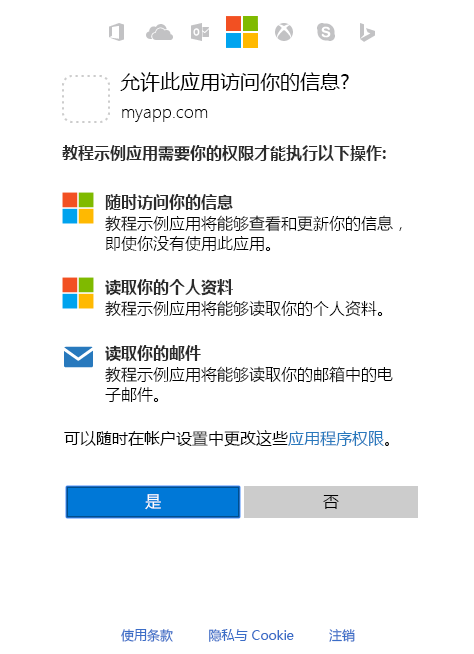

# <a name="get-access-on-behalf-of-a-user"></a><span data-ttu-id="2ea5f-103">代表用户获取访问权限</span><span class="sxs-lookup"><span data-stu-id="2ea5f-103">Get access on behalf of a user</span></span>

<span data-ttu-id="2ea5f-p101">若要代表用户使用 Microsoft Graph 读取和写入资源，应用必须从 Microsoft 标识平台获取访问令牌，并将令牌附加到其发往 Microsoft Graph 的请求。你将用于获取访问令牌的确切的身份验证流会依赖于你正在开发的应用类型以及你是否要使用 OpenID Connect 让用户登录到应用中。本机和移动应用还有某些 Web 应用使用的常见流程就是 OAuth 2.0 授权代码授予流程。本主题将介绍一个使用此流程的示例。</span><span class="sxs-lookup"><span data-stu-id="2ea5f-p101">To use Microsoft Graph to read and write resources on behalf of a user, your app must get an access token from the Microsoft identity platform and attach the token to requests that it sends to Microsoft Graph. The exact authentication flow that you will use to get access tokens will depend on the kind of app you are developing and whether you want to use OpenID Connect to sign the user in to your app. One common flow used by native and mobile apps and also by some Web apps is the OAuth 2.0 authorization code grant flow. This topic  walks through an example using this flow.</span></span>

## <a name="authentication-and-authorization-steps"></a><span data-ttu-id="2ea5f-108">身份验证和授权步骤</span><span class="sxs-lookup"><span data-stu-id="2ea5f-108">Authentication and Authorization steps</span></span>

<span data-ttu-id="2ea5f-109">需要执行下述基本步骤来使用 OAuth 2.0 授权代码授予流从 Microsoft 标识平台终结点获取访问令牌：</span><span class="sxs-lookup"><span data-stu-id="2ea5f-109">The basic steps required to use the OAuth 2.0 authorization code grant flow to get an access token from the Microsoft identity platform endpoint are:</span></span>

1. <span data-ttu-id="2ea5f-110">使用 Azure AD 注册应用。</span><span class="sxs-lookup"><span data-stu-id="2ea5f-110">Register your app with Azure AD.</span></span>
2. <span data-ttu-id="2ea5f-111">获取授权。</span><span class="sxs-lookup"><span data-stu-id="2ea5f-111">Get authorization.</span></span>
3. <span data-ttu-id="2ea5f-112">获取访问令牌。</span><span class="sxs-lookup"><span data-stu-id="2ea5f-112">Get an access token.</span></span>
4. <span data-ttu-id="2ea5f-113">使用访问令牌调用 Microsoft Graph。</span><span class="sxs-lookup"><span data-stu-id="2ea5f-113">Call Microsoft Graph with the access token.</span></span>
5. <span data-ttu-id="2ea5f-114">使用刷新令牌获取新的访问令牌。</span><span class="sxs-lookup"><span data-stu-id="2ea5f-114">Use a refresh token to get a new access token.</span></span>

## <a name="1-register-your-app"></a><span data-ttu-id="2ea5f-115">1.注册你的应用程序</span><span class="sxs-lookup"><span data-stu-id="2ea5f-115">1. Register your app</span></span>

<span data-ttu-id="2ea5f-p102">要使用 Microsoft 标识平台终结点，必须通过[应用注册门户](https://go.microsoft.com/fwlink/?linkid=2083908)注册应用。可使用 Microsoft 帐户或工作/学校帐户来注册应用。</span><span class="sxs-lookup"><span data-stu-id="2ea5f-p102">To use the Microsoft identity platform endpoint, you must register your app using the Azure [app registration portal](https://go.microsoft.com/fwlink/?linkid=2083908). You can use either a Microsoft account or a work or school account to register an app.</span></span>

<span data-ttu-id="2ea5f-118">若要配置应用以使用 OAuth 2.0 授权代码授予流程，将需要在注册应用时保存下列值：</span><span class="sxs-lookup"><span data-stu-id="2ea5f-118">To configure an app to use the OAuth 2.0 authorization code grant flow, you'll need to save the following values when registering the app:</span></span>

- <span data-ttu-id="2ea5f-119">应用注册门户分配的应用程序（客户端）ID。</span><span class="sxs-lookup"><span data-stu-id="2ea5f-119">The Application (client) ID assigned by the app registration portal.</span></span>
- <span data-ttu-id="2ea5f-p103">客户端（应用）密码，可以是密码，也可以是公钥/私钥对（证书）。对于本机应用，这不是必需的。</span><span class="sxs-lookup"><span data-stu-id="2ea5f-p103">A Client (application) Secret, either a password or a public/private key pair (certificate). This is not required for native apps.</span></span>
- <span data-ttu-id="2ea5f-122">可让应用接收来自 Azure AD 的响应的重定向 URL（或回复 URL）。</span><span class="sxs-lookup"><span data-stu-id="2ea5f-122">A Redirect URI (or reply URL) for your app to receive responses from Azure AD.</span></span>

<span data-ttu-id="2ea5f-123">要分步了解如何在 Azure 门户中配置应用，请参阅[注册应用](./auth-register-app-v2.md)。</span><span class="sxs-lookup"><span data-stu-id="2ea5f-123">For steps on how to configure an app in the Azure portal, see [Register your app](./auth-register-app-v2.md).</span></span>

## <a name="2-get-authorization"></a><span data-ttu-id="2ea5f-124">2. 获取授权</span><span class="sxs-lookup"><span data-stu-id="2ea5f-124">2. Get authorization</span></span>

<span data-ttu-id="2ea5f-p104">对于许多 OpenID Connect 和 OAuth 2.0 流，获取访问令牌的第一步是将用户重定向到 Microsoft 标识平台 `/authorize` 端点。Azure AD 将允许用户登录并确保其同意应用请求的权限。在授权代码授予流中，一旦获得同意，Azure AD 就会将 authorization_code 返回到应用，它可以在 Microsoft 标识平台 `/token` 端点上兑换为访问令牌。</span><span class="sxs-lookup"><span data-stu-id="2ea5f-p104">The first step to getting an access token for many OpenID Connect (OIDC) and OAuth 2.0 flows is to redirect the user to the Microsoft identity platform `/authorize` endpoint. Azure AD will sign the user in and ensure their consent for the permissions your app requests. In the authorization code grant flow, after consent is obtained, Azure AD will return an authorization_code to your app that it can redeem at the Microsoft identity platform `/token` endpoint for an access token.</span></span>

### <a name="authorization-request"></a><span data-ttu-id="2ea5f-128">授权请求</span><span class="sxs-lookup"><span data-stu-id="2ea5f-128">Authorization request</span></span>

<span data-ttu-id="2ea5f-129">以下示例显示了对 `/authorize` 终结点的请求示例。</span><span class="sxs-lookup"><span data-stu-id="2ea5f-129">The following shows an example request to the `/authorize` endpoint.</span></span>

<span data-ttu-id="2ea5f-p105">通过 Microsoft 标识平台端点，使用 `scope` 参数请求权限。在此示例中，所请求的 Microsoft Graph 权限可用于 _User.Read_ 和 _Mail.Read_，这会允许应用读取已登录用户的个人资料和邮件。已请求 _脱机\_访问_ 权限，因此应用可以获取刷新令牌，此令牌可用于在当前令牌过期后获取新的访问令牌。</span><span class="sxs-lookup"><span data-stu-id="2ea5f-p105">With the Microsoft identity platform endpoint, permissions are requested using the `scope` parameter. In this example, the Microsoft Graph permissions requested are for _User.Read_ and _Mail.Read_, which will allow the app to read the profile and mail of the signed-in user. The _offline\_access_ permission is a standard OIDC scope that is requested so that the app can get a refresh token, which it can use to get a new access token when the current one expires.</span></span>

```
// Line breaks for legibility only

https://login.microsoftonline.com/{tenant}/oauth2/v2.0/authorize?
client_id=11111111-1111-1111-1111-111111111111
&response_type=code
&redirect_uri=http%3A%2F%2Flocalhost%2Fmyapp%2F
&response_mode=query
&scope=offline_access%20user.read%20mail.read
&state=12345
```

| <span data-ttu-id="2ea5f-133">参数</span><span class="sxs-lookup"><span data-stu-id="2ea5f-133">Parameter</span></span>     | <span data-ttu-id="2ea5f-134">必需</span><span class="sxs-lookup"><span data-stu-id="2ea5f-134">Required</span></span>    | <span data-ttu-id="2ea5f-135">说明</span><span class="sxs-lookup"><span data-stu-id="2ea5f-135">Description</span></span>                                                                                                                                                                                                                                                                                                                                                                                                                                                                                             |
|---------------|-------------|---------------------------------------------------------------------------------------------------------------------------------------------------------------------------------------------------------------------------------------------------------------------------------------------------------------------------------------------------------------------------------------------------------------------------------------------------------------------------------------------------------|
| <span data-ttu-id="2ea5f-136">租户</span><span class="sxs-lookup"><span data-stu-id="2ea5f-136">tenant</span></span>        | <span data-ttu-id="2ea5f-137">必需</span><span class="sxs-lookup"><span data-stu-id="2ea5f-137">required</span></span>    | <span data-ttu-id="2ea5f-p106">请求路径中的 `{tenant}` 值可用于控制登录应用程序的用户。允许的值为适用于 Microsoft 帐户和工作或学校帐户的 `common`、仅适用于工作或学校帐户的 `organizations`、仅适用于 Microsoft 帐户的 `consumers` 以及租户标识符（如租户 ID 或域名）。有关详细信息，请参阅[协议基础](/azure/active-directory/develop/active-directory-v2-protocols#endpoints)。</span><span class="sxs-lookup"><span data-stu-id="2ea5f-p106">The `{tenant}` value in the path of the request can be used to control who can sign into the application.  The allowed values are `common` for both Microsoft accounts and work or school accounts, `organizations` for work or school accounts only, `consumers` for Microsoft accounts only, and tenant identifiers such as the tenant ID or domain name.  For more detail, see [protocol basics](/azure/active-directory/develop/active-directory-v2-protocols#endpoints).</span></span> |
| <span data-ttu-id="2ea5f-141">client_id</span><span class="sxs-lookup"><span data-stu-id="2ea5f-141">client_id</span></span>     | <span data-ttu-id="2ea5f-142">必需</span><span class="sxs-lookup"><span data-stu-id="2ea5f-142">required</span></span>    | <span data-ttu-id="2ea5f-143">[注册门户](https://go.microsoft.com/fwlink/?linkid=2083908)分配给应用的应用程序 ID。</span><span class="sxs-lookup"><span data-stu-id="2ea5f-143">The Application ID that the [registration portal](https://go.microsoft.com/fwlink/?linkid=2083908) assigned your app.</span></span>                                                                                                                                                                                                                                                                                                                                                                                   |
| <span data-ttu-id="2ea5f-144">response_type</span><span class="sxs-lookup"><span data-stu-id="2ea5f-144">response_type</span></span> | <span data-ttu-id="2ea5f-145">必需</span><span class="sxs-lookup"><span data-stu-id="2ea5f-145">required</span></span>    | <span data-ttu-id="2ea5f-146">必须包括授权代码流的 `code`。</span><span class="sxs-lookup"><span data-stu-id="2ea5f-146">Must include `code` for the authorization code flow.</span></span>                                                                                                                                                                                                                                                                                                                                                                                                                                                    |
| <span data-ttu-id="2ea5f-147">redirect_uri</span><span class="sxs-lookup"><span data-stu-id="2ea5f-147">redirect_uri</span></span>  | <span data-ttu-id="2ea5f-148">建议</span><span class="sxs-lookup"><span data-stu-id="2ea5f-148">recommended</span></span> | <span data-ttu-id="2ea5f-p107">你的应用的 redirect_uri，你可以在其中通过应用发送并接收身份验证响应。它必须完全匹配你在应用注册门户中注册的 redirect_uris 之一，除了它必须采用 URL 编码。对于本机和移动应用，应使用默认值 `https://login.microsoftonline.com/common/oauth2/nativeclient`。</span><span class="sxs-lookup"><span data-stu-id="2ea5f-p107">The redirect_uri of your app, where authentication responses can be sent and received by your app.  It must exactly match one of the redirect_uris you registered in the app registration portal, except it must be URL encoded.  For native and mobile apps, you should use the default value of `https://login.microsoftonline.com/common/oauth2/nativeclient`.</span></span>                                                                                                                                       |
| <span data-ttu-id="2ea5f-152">范围</span><span class="sxs-lookup"><span data-stu-id="2ea5f-152">scope</span></span>         | <span data-ttu-id="2ea5f-153">必需</span><span class="sxs-lookup"><span data-stu-id="2ea5f-153">required</span></span>    | <span data-ttu-id="2ea5f-154">由空格分隔的希望用户同意的 Microsoft Graph 权限列表。</span><span class="sxs-lookup"><span data-stu-id="2ea5f-154">A space-separated list of the Microsoft Graph permissions that you want the user to consent to.</span></span> <span data-ttu-id="2ea5f-155">这可能包括资源权限，如 _User.Read_ 和 _Mail.Read_ 和 OIDC 作用域如 `offline_access`，这表示你的应用需要刷新令牌才能长期访问资源。</span><span class="sxs-lookup"><span data-stu-id="2ea5f-155">These can include resource permissions, such as _User.Read_ and _Mail.Read_, and OIDC scopes, such as `offline_access`, which indicates that your app needs a refresh token for long-lived access to resources.</span></span>                                                                                                                                                                                                                                                                                                                                                                  |
| <span data-ttu-id="2ea5f-156">response_mode</span><span class="sxs-lookup"><span data-stu-id="2ea5f-156">response_mode</span></span> | <span data-ttu-id="2ea5f-157">建议</span><span class="sxs-lookup"><span data-stu-id="2ea5f-157">recommended</span></span> | <span data-ttu-id="2ea5f-p109">指定用于将结果令牌发送回应用的方法。可以是 `query` 或 `form_post`。</span><span class="sxs-lookup"><span data-stu-id="2ea5f-p109">Specifies the method that should be used to send the resulting token back to your app.  Can be `query` or `form_post`.</span></span>                                                                                                                                                                                                                                                                                                                                                                                  |
| <span data-ttu-id="2ea5f-160">状态</span><span class="sxs-lookup"><span data-stu-id="2ea5f-160">state</span></span>         | <span data-ttu-id="2ea5f-161">建议</span><span class="sxs-lookup"><span data-stu-id="2ea5f-161">recommended</span></span> | <span data-ttu-id="2ea5f-p110">请求中包含的值将在令牌响应中返回。它可以是你希望的任何内容的字符串。随机生成的唯一值通常用于[防止跨网站请求伪造攻击](https://tools.ietf.org/html/rfc6749#section-10.12)。此状态还用于在发生身份验证请求前，对应用中的用户状态信息进行编码（如它们所在的页面或视图上）。</span><span class="sxs-lookup"><span data-stu-id="2ea5f-p110">A value included in the request that will also be returned in the token response.  It can be a string of any content that you wish.  A randomly generated unique value is typically used for [preventing cross-site request forgery attacks](https://tools.ietf.org/html/rfc6749#section-10.12).  The state is also used to encode information about the user's state in the app before the authentication request occurred, such as the page or view they were on.</span></span>                                     |

> [!NOTE]
> <span data-ttu-id="2ea5f-p111">Microsoft Graph 公开两种类型的权限：应用程序和委派。对于使用已登录用户运行的应用，在 `scope` 参数中请求权限。这些权限将已登录用户的权限委派给您的应用程序，从而允许它在调用 Microsoft Graph 时作为已登录的用户。有关通过 Microsoft Graph 提供的权限的更多详细信息，请参阅 [权限引用](./permissions-reference.md)。</span><span class="sxs-lookup"><span data-stu-id="2ea5f-p111">Microsoft Graph exposes two kinds of permissions: application and delegated. For apps that run with a signed-in user, you request delegated permissions in the `scope` parameter. These permissions delegate the privileges of the signed-in user to your app, allowing it to act as the signed-in user when making calls to Microsoft Graph. For more detailed information about the permissions available through Microsoft Graph, see the [Permissions reference](./permissions-reference.md).</span></span>
>
> <span data-ttu-id="2ea5f-170">Microsoft Graph 还会公开以下定义明确的 OIDC 作用域： `openid`、 `email`、 `profile`和 `offline_access`。</span><span class="sxs-lookup"><span data-stu-id="2ea5f-170">Microsoft Graph also exposes the following well-defined OIDC scopes: `openid`, `email`, `profile`, and `offline_access`.</span></span> <span data-ttu-id="2ea5f-171">不支持`address`和`phone` OIDC 作用域。</span><span class="sxs-lookup"><span data-stu-id="2ea5f-171">The `address` and `phone` OIDC scopes aren't supported.</span></span> <span data-ttu-id="2ea5f-172">有关每个 OIDC 作用域的更多详细信息，请参阅 [许可和同意](/azure/active-directory/develop/v2-permissions-and-consent#openid-connect-scopes)。</span><span class="sxs-lookup"><span data-stu-id="2ea5f-172">For more details about each OIDC scope, see [Permissions and consent](/azure/active-directory/develop/v2-permissions-and-consent#openid-connect-scopes).</span></span>

### <a name="consent-experience"></a><span data-ttu-id="2ea5f-173">同意体验</span><span class="sxs-lookup"><span data-stu-id="2ea5f-173">Consent experience</span></span>

<span data-ttu-id="2ea5f-p113">在这种情况下，将要求用户输入其凭据以使用 Microsoft 进行身份验证。Microsoft 标识平台 v2.0 端点还将确保用户已同意 `scope` 查询参数中指示的权限。如果用户并不同意任何这些权限，且管理员此前未代表组织内的所有用户表示同意，Azure AD 将提示用户同意所需权限。</span><span class="sxs-lookup"><span data-stu-id="2ea5f-p113">At this point, the user will be asked to enter their credentials to authenticate with Microsoft. The Microsoft identity platform v2.0 endpoint will also ensure that the user has consented to the permissions indicated in the `scope` query parameter.  If the user has not consented to any of those permissions and if an administrator has not previously consented on behalf of all users in the organization, they will be asked to consent to the required permissions.</span></span>

<span data-ttu-id="2ea5f-177">下面是为 Microsoft 帐户用户呈现的同意对话框示例。</span><span class="sxs-lookup"><span data-stu-id="2ea5f-177">The following is an example of the consent dialog box presented for a Microsoft account user.</span></span>



> <span data-ttu-id="2ea5f-p114">**试一试** 如果你拥有 Microsoft 帐户或 Azure AD 工作或学校帐户，可以通过点击以下链接进行尝试：登录后，浏览器应被重定向到地址栏中有 `code` 的 `https://localhost/myapp/`。</span><span class="sxs-lookup"><span data-stu-id="2ea5f-p114">**Try** If you have a Microsoft account or an Azure AD work or school account, you can try this for yourself by clicking the following link. After signing in, your browser should be redirected to `https://localhost/myapp/` with a `code` in the address bar.</span></span>
>
> <span data-ttu-id="2ea5f-181"><a href="https://login.microsoftonline.com/common/oauth2/v2.0/authorize?client_id=6731de76-14a6-49ae-97bc-6eba6914391e&response_type=code&redirect_uri=http%3A%2F%2Flocalhost%2Fmyapp%2F&response_mode=query&scope=offline_access%20user.read%20mail.read&state=12345" target="_blank">https://login.microsoftonline.com/common/oauth2/v2.0/authorize...</a></span><span class="sxs-lookup"><span data-stu-id="2ea5f-181"><a href="https://login.microsoftonline.com/common/oauth2/v2.0/authorize?client_id=6731de76-14a6-49ae-97bc-6eba6914391e&response_type=code&redirect_uri=http%3A%2F%2Flocalhost%2Fmyapp%2F&response_mode=query&scope=offline_access%20user.read%20mail.read&state=12345" target="_blank">https://login.microsoftonline.com/common/oauth2/v2.0/authorize...</a></span></span>

### <a name="authorization-response"></a><span data-ttu-id="2ea5f-182">授权响应</span><span class="sxs-lookup"><span data-stu-id="2ea5f-182">Authorization response</span></span>

<span data-ttu-id="2ea5f-p115">如果用户同意应用请求的权限，响应将在 `code` 参数中提供授权代码。这是对上述请求的成功响应的示例。因为请求中的 `response_mode` 参数已设为 `query`，响应会在重定向 URL 的查询字符串中返回。</span><span class="sxs-lookup"><span data-stu-id="2ea5f-p115">If the user consents to the permissions your app requested, the response will contain the authorization code in the `code` parameter. Here is an example of a successful response to the previous request. Because the `response_mode` parameter in the request was set to `query`, the response is returned in the query string of the redirect URL.</span></span>

```
GET https://localhost/myapp/?
code=M0ab92efe-b6fd-df08-87dc-2c6500a7f84d
&state=12345
```

| <span data-ttu-id="2ea5f-186">参数</span><span class="sxs-lookup"><span data-stu-id="2ea5f-186">Parameter</span></span> | <span data-ttu-id="2ea5f-187">说明</span><span class="sxs-lookup"><span data-stu-id="2ea5f-187">Description</span></span>                                                                                                                                                                                                                        |
|-----------|------------------------------------------------------------------------------------------------------------------------------------------------------------------------------------------------------------------------------------|
| <span data-ttu-id="2ea5f-188">code</span><span class="sxs-lookup"><span data-stu-id="2ea5f-188">code</span></span>      | <span data-ttu-id="2ea5f-p116">应用请求的 authorization_code。应用可以使用授权代码请求目标资源的访问令牌。Authorization_codes 有效期非常短暂，通常它们会在 10 分钟后失效。</span><span class="sxs-lookup"><span data-stu-id="2ea5f-p116">The authorization_code that the app requested. The app can use the authorization code to request an access token for the target resource.  Authorization_codes are very short lived, typically they expire after about 10 minutes.</span></span> |
| <span data-ttu-id="2ea5f-192">状态</span><span class="sxs-lookup"><span data-stu-id="2ea5f-192">state</span></span>     | <span data-ttu-id="2ea5f-p117">如果请求中包含状态参数，则应在响应中显示相同的值。应用应确认请求和响应中的状态值相同。</span><span class="sxs-lookup"><span data-stu-id="2ea5f-p117">If a state parameter is included in the request, the same value should appear in the response. The app should verify that the state values in the request and response are identical.</span></span>                                              |

## <a name="3-get-a-token"></a><span data-ttu-id="2ea5f-195">3.获取令牌</span><span class="sxs-lookup"><span data-stu-id="2ea5f-195">3. Get a token</span></span>

<span data-ttu-id="2ea5f-196">你的应用使用上一步接收的授权 `code`，通过发送 `POST` 请求到 `/token` 终结点来请求访问令牌。</span><span class="sxs-lookup"><span data-stu-id="2ea5f-196">Your app uses the authorization `code` received in the previous step to request an access token by sending a `POST` request to the `/token` endpoint.</span></span>

### <a name="token-request"></a><span data-ttu-id="2ea5f-197">令牌请求</span><span class="sxs-lookup"><span data-stu-id="2ea5f-197">Token request</span></span>

```
// Line breaks for legibility only

POST /{tenant}/oauth2/v2.0/token HTTP/1.1
Host: https://login.microsoftonline.com
Content-Type: application/x-www-form-urlencoded

client_id=11111111-1111-1111-1111-111111111111
&scope=user.read%20mail.read
&code=OAAABAAAAiL9Kn2Z27UubvWFPbm0gLWQJVzCTE9UkP3pSx1aXxUjq3n8b2JRLk4OxVXr...
&redirect_uri=http%3A%2F%2Flocalhost%2Fmyapp%2F
&grant_type=authorization_code
&client_secret=jXoM3iz...    // NOTE: Only required for web apps
```

| <span data-ttu-id="2ea5f-198">参数</span><span class="sxs-lookup"><span data-stu-id="2ea5f-198">Parameter</span></span>     | <span data-ttu-id="2ea5f-199">必需</span><span class="sxs-lookup"><span data-stu-id="2ea5f-199">Required</span></span>              | <span data-ttu-id="2ea5f-200">说明</span><span class="sxs-lookup"><span data-stu-id="2ea5f-200">Description</span></span>                                                                                                                                                                                                                                                                                                                                                                                                                                                                                             |
|---------------|-----------------------|---------------------------------------------------------------------------------------------------------------------------------------------------------------------------------------------------------------------------------------------------------------------------------------------------------------------------------------------------------------------------------------------------------------------------------------------------------------------------------------------------------|
| <span data-ttu-id="2ea5f-201">租户</span><span class="sxs-lookup"><span data-stu-id="2ea5f-201">tenant</span></span>        | <span data-ttu-id="2ea5f-202">必需</span><span class="sxs-lookup"><span data-stu-id="2ea5f-202">required</span></span>              | <span data-ttu-id="2ea5f-p118">请求路径中的 `{tenant}` 值可用于控制登录应用程序的用户。允许的值为适用于 Microsoft 帐户和工作或学校帐户的 `common`、仅适用于工作或学校帐户的 `organizations`、仅适用于 Microsoft 帐户的 `consumers` 以及租户标识符（如租户 ID 或域名）。有关详细信息，请参阅[协议基础](/azure/active-directory/develop/active-directory-v2-protocols#endpoints)。</span><span class="sxs-lookup"><span data-stu-id="2ea5f-p118">The `{tenant}` value in the path of the request can be used to control who can sign into the application.  The allowed values are `common` for both Microsoft accounts and work or school accounts, `organizations` for work or school accounts only, `consumers` for Microsoft accounts only, and tenant identifiers such as the tenant ID or domain name.  For more detail, see [protocol basics](/azure/active-directory/develop/active-directory-v2-protocols#endpoints).</span></span> |
| <span data-ttu-id="2ea5f-206">client_id</span><span class="sxs-lookup"><span data-stu-id="2ea5f-206">client_id</span></span>     | <span data-ttu-id="2ea5f-207">必需</span><span class="sxs-lookup"><span data-stu-id="2ea5f-207">required</span></span>              | <span data-ttu-id="2ea5f-208">[注册门户](https://go.microsoft.com/fwlink/?linkid=2083908)分配给应用的应用程序 ID。</span><span class="sxs-lookup"><span data-stu-id="2ea5f-208">The Application ID that the [registration portal](https://go.microsoft.com/fwlink/?linkid=2083908)) assigned your app.</span></span>                                                                                                                                                                                                                                                                                                                                                                                  |
| <span data-ttu-id="2ea5f-209">grant_type</span><span class="sxs-lookup"><span data-stu-id="2ea5f-209">grant_type</span></span>    | <span data-ttu-id="2ea5f-210">必需</span><span class="sxs-lookup"><span data-stu-id="2ea5f-210">required</span></span>              | <span data-ttu-id="2ea5f-211">对于授权代码流必须为 `authorization_code`。</span><span class="sxs-lookup"><span data-stu-id="2ea5f-211">Must be `authorization_code` for the authorization code flow.</span></span>                                                                                                                                                                                                                                                                                                                                                                                                                                           |
| <span data-ttu-id="2ea5f-212">范围</span><span class="sxs-lookup"><span data-stu-id="2ea5f-212">scope</span></span>         | <span data-ttu-id="2ea5f-213">必需</span><span class="sxs-lookup"><span data-stu-id="2ea5f-213">required</span></span>              | <span data-ttu-id="2ea5f-p119">用空格分隔的范围列表。在此图例中请求的范围必须等于在首个（授权）图例中请求的范围或其子集。如果此请求中指定的范围跨越多个资源服务器，则 v2.0 将为首个范围中指定的资源返回令牌。</span><span class="sxs-lookup"><span data-stu-id="2ea5f-p119">A space-separated list of scopes.  The scopes requested in this leg must be equivalent to or a subset of the scopes requested in the first (authorization) leg.  If the scopes specified in this request span multiple resource servers, then the v2.0 endpoint will return a token for the resource specified in the first scope.</span></span>                                                                                                                                                                      |
| <span data-ttu-id="2ea5f-217">code</span><span class="sxs-lookup"><span data-stu-id="2ea5f-217">code</span></span>          | <span data-ttu-id="2ea5f-218">必需</span><span class="sxs-lookup"><span data-stu-id="2ea5f-218">required</span></span>              | <span data-ttu-id="2ea5f-219">你在流程的第一个图例中获得的 authorization_code。</span><span class="sxs-lookup"><span data-stu-id="2ea5f-219">The authorization_code that you acquired in the first leg of the flow.</span></span>                                                                                                                                                                                                                                                                                                                                                                                                                                  |
| <span data-ttu-id="2ea5f-220">redirect_uri</span><span class="sxs-lookup"><span data-stu-id="2ea5f-220">redirect_uri</span></span>  | <span data-ttu-id="2ea5f-221">必需</span><span class="sxs-lookup"><span data-stu-id="2ea5f-221">required</span></span>              | <span data-ttu-id="2ea5f-222">用于获取 authorization_code 的相同的 redirect_uri 值。</span><span class="sxs-lookup"><span data-stu-id="2ea5f-222">The same redirect_uri value that was used to acquire the authorization_code.</span></span>                                                                                                                                                                                                                                                                                                                                                                                                                            |
| <span data-ttu-id="2ea5f-223">client_secret</span><span class="sxs-lookup"><span data-stu-id="2ea5f-223">client_secret</span></span> | <span data-ttu-id="2ea5f-224">Web 应用需要</span><span class="sxs-lookup"><span data-stu-id="2ea5f-224">required for web apps</span></span> | <span data-ttu-id="2ea5f-p120">你在应用注册门户中为应用创建的应用程序密码。它不可在本机应用中使用，因为设备无法可靠地存储 client_secrets。Web 应用和 Web API 需要此值，它们能够将 client_secret 安全地存储在服务器端上。</span><span class="sxs-lookup"><span data-stu-id="2ea5f-p120">The application secret that you created in the app registration portal for your app.  It should not be used in a native app, because client_secrets cannot be reliably stored on devices.  It is required for web apps and web APIs, which have the ability to store the client_secret securely on the server side.</span></span>                                                                                                                                                                                     |

### <a name="token-response"></a><span data-ttu-id="2ea5f-228">令牌响应</span><span class="sxs-lookup"><span data-stu-id="2ea5f-228">Token response</span></span>

<span data-ttu-id="2ea5f-229">尽管访问令牌对应用是不透明的，但是响应包含了权限列表，访问令牌对 `scope` 参数中的这些权限有益。</span><span class="sxs-lookup"><span data-stu-id="2ea5f-229">Although the access token is opaque to your app, the response contains a list of the permissions that the access token is good for in the `scope` parameter.</span></span>

```json
{
    "token_type": "Bearer",
    "scope": "user.read%20Fmail.read",
    "expires_in": 3600,
    "access_token": "eyJ0eXAiOiJKV1QiLCJhbGciOiJSUzI1NiIsIng1dCI6Ik5HVEZ2ZEstZnl0aEV1Q...",
    "refresh_token": "AwABAAAAvPM1KaPlrEqdFSBzjqfTGAMxZGUTdM0t4B4..."
}
```

| <span data-ttu-id="2ea5f-230">参数</span><span class="sxs-lookup"><span data-stu-id="2ea5f-230">Parameter</span></span>     | <span data-ttu-id="2ea5f-231">说明</span><span class="sxs-lookup"><span data-stu-id="2ea5f-231">Description</span></span>                                                                                                                                                                                                                                                                                                                                                                                  |
|---------------|----------------------------------------------------------------------------------------------------------------------------------------------------------------------------------------------------------------------------------------------------------------------------------------------------------------------------------------------------------------------------------------------|
| <span data-ttu-id="2ea5f-232">token_type</span><span class="sxs-lookup"><span data-stu-id="2ea5f-232">token_type</span></span>    | <span data-ttu-id="2ea5f-p121">表示令牌类型值。Azure AD 唯一支持的类型是 Bearer。</span><span class="sxs-lookup"><span data-stu-id="2ea5f-p121">Indicates the token type value. The only type that Azure AD supports is Bearer.</span></span>                                                                                                                                                                                                                                                                                                              |
| <span data-ttu-id="2ea5f-235">范围</span><span class="sxs-lookup"><span data-stu-id="2ea5f-235">scope</span></span>         | <span data-ttu-id="2ea5f-236">此 access_token 适用的空格分隔的 Microsoft Graph 权限列表。</span><span class="sxs-lookup"><span data-stu-id="2ea5f-236">A space separated list of the Microsoft Graph permissions that the access_token is valid for.</span></span>                                                                                                                                                                                                                                                                                                |
| <span data-ttu-id="2ea5f-237">expires_in</span><span class="sxs-lookup"><span data-stu-id="2ea5f-237">expires_in</span></span>    | <span data-ttu-id="2ea5f-238">访问令牌的有效期是多久（以秒为单位）。</span><span class="sxs-lookup"><span data-stu-id="2ea5f-238">How long the access token is valid (in seconds).</span></span>                                                                                                                                                                                                                                                                                                                                             |
| <span data-ttu-id="2ea5f-239">access_token</span><span class="sxs-lookup"><span data-stu-id="2ea5f-239">access_token</span></span>  | <span data-ttu-id="2ea5f-p122">请求的访问令牌。你的应用可以使用此令牌调用 Microsoft Graph。</span><span class="sxs-lookup"><span data-stu-id="2ea5f-p122">The requested access token. Your app can use this token to call Microsoft Graph.</span></span>                                                                                                                                                                                                                                                                                                             |
| <span data-ttu-id="2ea5f-242">refresh_token</span><span class="sxs-lookup"><span data-stu-id="2ea5f-242">refresh_token</span></span> | <span data-ttu-id="2ea5f-243">OAuth 2.0 刷新令牌。</span><span class="sxs-lookup"><span data-stu-id="2ea5f-243">An OAuth 2.0 refresh token.</span></span> <span data-ttu-id="2ea5f-244">在当前访问令牌到期后，应用程序可以使用此令牌获取其他访问令牌。</span><span class="sxs-lookup"><span data-stu-id="2ea5f-244">Your app can use this token to acquire additional access tokens after the current access token expires.</span></span>  <span data-ttu-id="2ea5f-245">刷新令牌有效期较长，可用于长时间保留对资源的访问权限。</span><span class="sxs-lookup"><span data-stu-id="2ea5f-245">Refresh tokens are long-lived, and can be used to retain access to resources for extended periods of time.</span></span>  <span data-ttu-id="2ea5f-246">有关详细信息，请参阅 [v2.0 令牌参考](/azure/active-directory/develop/active-directory-v2-tokens)。</span><span class="sxs-lookup"><span data-stu-id="2ea5f-246">For more detail, refer to the [v2.0 token reference](/azure/active-directory/develop/active-directory-v2-tokens).</span></span> |

## <a name="4-use-the-access-token-to-call-microsoft-graph"></a><span data-ttu-id="2ea5f-247">4. 使用访问令牌调用 Microsoft Graph</span><span class="sxs-lookup"><span data-stu-id="2ea5f-247">4. Use the access token to call Microsoft Graph</span></span>

<span data-ttu-id="2ea5f-p124">拥有访问令牌后，可通过将其包含在请求的 `Authorization` 标头中，用其调用 Microsoft Graph。以下请求可获取已登录用户的个人资料。</span><span class="sxs-lookup"><span data-stu-id="2ea5f-p124">After you have an access token, you can use it to call Microsoft Graph by including it in the `Authorization` header of a request. The following request gets the profile of the signed-in user.</span></span>

```
GET https://graph.microsoft.com/v1.0/me
Authorization: Bearer eyJ0eXAiO ... 0X2tnSQLEANnSPHY0gKcgw
Host: graph.microsoft.com

```

<span data-ttu-id="2ea5f-250">成功的响应将与下述内容类似（一些响应标头已被删除）。</span><span class="sxs-lookup"><span data-stu-id="2ea5f-250">A successful response will look similar to the following (some response headers have been removed).</span></span>

```
HTTP/1.1 200 OK
Content-Type: application/json;odata.metadata=minimal;odata.streaming=true;IEEE754Compatible=false;charset=utf-8
request-id: f45d08c0-6901-473a-90f5-7867287de97f
client-request-id: f45d08c0-6901-473a-90f5-7867287de97f
OData-Version: 4.0
Duration: 727.0022
Date: Thu, 20 Apr 2017 05:21:18 GMT
Content-Length: 407

{
    "@odata.context":"https://graph.microsoft.com/v1.0/$metadata#users/$entity",
    "id":"12345678-73a6-4952-a53a-e9916737ff7f",
    "businessPhones":[
        "+1 555555555"
    ],
    "displayName":"Chris Green",
    "givenName":"Chris",
    "jobTitle":"Software Engineer",
    "mail":null,
    "mobilePhone":"+1 5555555555",
    "officeLocation":"Seattle Office",
    "preferredLanguage":null,
    "surname":"Green",
    "userPrincipalName":"ChrisG@contoso.onmicrosoft.com"
}
```

## <a name="5-use-the-refresh-token-to-get-a-new-access-token"></a><span data-ttu-id="2ea5f-251">5.使用此刷新令牌获取新的访问令牌。</span><span class="sxs-lookup"><span data-stu-id="2ea5f-251">5. Use the refresh token to get a new access token</span></span>

<span data-ttu-id="2ea5f-p125">访问令牌有效期非常短暂，在过期后继续访问资源，必须进行刷新。你可以通过向 `/token` 终结点提交其他 `POST` 请求执行此操作，这时提交的是 `refresh_token` 而非 `code`。</span><span class="sxs-lookup"><span data-stu-id="2ea5f-p125">Access tokens are short lived, and you must refresh them after they expire to continue accessing resources.  You can do so by submitting another `POST` request to the `/token` endpoint, this time providing the `refresh_token` instead of the `code`.</span></span>

### <a name="request"></a><span data-ttu-id="2ea5f-254">请求</span><span class="sxs-lookup"><span data-stu-id="2ea5f-254">Request</span></span>

```
// Line breaks for legibility only

POST /common/oauth2/v2.0/token HTTP/1.1
Host: https://login.microsoftonline.com
Content-Type: application/x-www-form-urlencoded

client_id=11111111-1111-1111-1111-111111111111
&scope=user.read%20mail.read
&refresh_token=OAAABAAAAiL9Kn2Z27UubvWFPbm0gLWQJVzCTE9UkP3pSx1aXxUjq...
&redirect_uri=http%3A%2F%2Flocalhost%2Fmyapp%2F
&grant_type=refresh_token
&client_secret=jXoM3iz...      // NOTE: Only required for web apps
```

| <span data-ttu-id="2ea5f-255">参数</span><span class="sxs-lookup"><span data-stu-id="2ea5f-255">Parameter</span></span>     | <span data-ttu-id="2ea5f-256">必需</span><span class="sxs-lookup"><span data-stu-id="2ea5f-256">Required</span></span>              | <span data-ttu-id="2ea5f-257">说明</span><span class="sxs-lookup"><span data-stu-id="2ea5f-257">Description</span></span>                                                                                                                                                                                                                                                                                                         |
|---------------|-----------------------|---------------------------------------------------------------------------------------------------------------------------------------------------------------------------------------------------------------------------------------------------------------------------------------------------------------------|
| <span data-ttu-id="2ea5f-258">client_id</span><span class="sxs-lookup"><span data-stu-id="2ea5f-258">client_id</span></span>     | <span data-ttu-id="2ea5f-259">必需</span><span class="sxs-lookup"><span data-stu-id="2ea5f-259">required</span></span>              | <span data-ttu-id="2ea5f-260">[注册门户](https://go.microsoft.com/fwlink/?linkid=2083908)分配给应用的应用程序 ID。</span><span class="sxs-lookup"><span data-stu-id="2ea5f-260">The Application ID that the [registration portal](https://go.microsoft.com/fwlink/?linkid=2083908) assigned your app.</span></span>                                                                                                                                                                                               |
| <span data-ttu-id="2ea5f-261">grant_type</span><span class="sxs-lookup"><span data-stu-id="2ea5f-261">grant_type</span></span>    | <span data-ttu-id="2ea5f-262">必需</span><span class="sxs-lookup"><span data-stu-id="2ea5f-262">required</span></span>              | <span data-ttu-id="2ea5f-263">必须是 `refresh_token`。</span><span class="sxs-lookup"><span data-stu-id="2ea5f-263">Must be `refresh_token`.</span></span>                                                                                                                                                                                                                                                                                            |
| <span data-ttu-id="2ea5f-264">范围</span><span class="sxs-lookup"><span data-stu-id="2ea5f-264">scope</span></span>         | <span data-ttu-id="2ea5f-265">必需</span><span class="sxs-lookup"><span data-stu-id="2ea5f-265">required</span></span>              | <span data-ttu-id="2ea5f-p126">用空格分隔的权限列表（范围）。请求的权限必须等于初始 authorization_code 请求中所请求的权限或其子集。</span><span class="sxs-lookup"><span data-stu-id="2ea5f-p126">A space-separated list of permissions (scopes).  The permissions requested must be equivalent to or a subset of the permissions requested in the original authorization_code request.</span></span>                                                                                                                               |
| <span data-ttu-id="2ea5f-268">refresh_token</span><span class="sxs-lookup"><span data-stu-id="2ea5f-268">refresh_token</span></span> | <span data-ttu-id="2ea5f-269">必需</span><span class="sxs-lookup"><span data-stu-id="2ea5f-269">required</span></span>              | <span data-ttu-id="2ea5f-270">令牌请求期间获得的 refresh_token。</span><span class="sxs-lookup"><span data-stu-id="2ea5f-270">The refresh_token that you acquired during the token request.</span></span>                                                                                                                                                                                                                                                       |
| <span data-ttu-id="2ea5f-271">redirect_uri</span><span class="sxs-lookup"><span data-stu-id="2ea5f-271">redirect_uri</span></span>  | <span data-ttu-id="2ea5f-272">必需</span><span class="sxs-lookup"><span data-stu-id="2ea5f-272">required</span></span>              | <span data-ttu-id="2ea5f-273">用于获取 authorization_code 的相同的 redirect_uri 值。</span><span class="sxs-lookup"><span data-stu-id="2ea5f-273">The same redirect_uri value that was used to acquire the authorization_code.</span></span>                                                                                                                                                                                                                                        |
| <span data-ttu-id="2ea5f-274">client_secret</span><span class="sxs-lookup"><span data-stu-id="2ea5f-274">client_secret</span></span> | <span data-ttu-id="2ea5f-275">Web 应用需要</span><span class="sxs-lookup"><span data-stu-id="2ea5f-275">required for web apps</span></span> | <span data-ttu-id="2ea5f-p127">你在应用注册门户中为应用创建的应用程序密码。它不可在本机应用中使用，因为设备无法可靠地存储 client_secrets。Web 应用和 Web API 需要此值，它们能够将 client_secret 安全地存储在服务器端上。</span><span class="sxs-lookup"><span data-stu-id="2ea5f-p127">The application secret that you created in the app registration portal for your app.  It should not be used in a native app, because client_secrets cannot be reliably stored on devices.  It is required for web apps and web APIs, which have the ability to store the client_secret securely on the server side.</span></span> |

### <a name="response"></a><span data-ttu-id="2ea5f-279">响应</span><span class="sxs-lookup"><span data-stu-id="2ea5f-279">Response</span></span>

<span data-ttu-id="2ea5f-280">成功的令牌响将与下列内容类似。</span><span class="sxs-lookup"><span data-stu-id="2ea5f-280">A successful token response will look similar to the following.</span></span>

```
{
    "access_token": "eyJ0eXAiOiJKV1QiLCJhbGciOiJSUzI1NiIsIng1dCI6Ik5HVEZ2ZEstZnl0aEV1Q...",
    "token_type": "Bearer",
    "expires_in": 3599,
    "scope": "user.read%20mail.read",
    "refresh_token": "AwABAAAAvPM1KaPlrEqdFSBzjqfTGAMxZGUTdM0t4B4...",
}
```
| <span data-ttu-id="2ea5f-281">参数</span><span class="sxs-lookup"><span data-stu-id="2ea5f-281">Parameter</span></span>     | <span data-ttu-id="2ea5f-282">说明</span><span class="sxs-lookup"><span data-stu-id="2ea5f-282">Description</span></span>                                                                                                                                                                        |
|---------------|------------------------------------------------------------------------------------------------------------------------------------------------------------------------------------|
| <span data-ttu-id="2ea5f-283">access_token</span><span class="sxs-lookup"><span data-stu-id="2ea5f-283">access_token</span></span>  | <span data-ttu-id="2ea5f-p128">请求的访问令牌。应用可使用此令牌调用 Microsoft Graph。</span><span class="sxs-lookup"><span data-stu-id="2ea5f-p128">The requested access token. The app can use this token in calls to Microsoft Graph.</span></span>                                                                                                |
| <span data-ttu-id="2ea5f-286">token_type</span><span class="sxs-lookup"><span data-stu-id="2ea5f-286">token_type</span></span>    | <span data-ttu-id="2ea5f-p129">表示令牌类型值。Azure AD 唯一支持的类型是 Bearer</span><span class="sxs-lookup"><span data-stu-id="2ea5f-p129">Indicates the token type value. The only type that Azure AD supports is Bearer</span></span>                                                                                                     |
| <span data-ttu-id="2ea5f-289">expires_in</span><span class="sxs-lookup"><span data-stu-id="2ea5f-289">expires_in</span></span>    | <span data-ttu-id="2ea5f-290">访问令牌的有效期是多久（以秒为单位）。</span><span class="sxs-lookup"><span data-stu-id="2ea5f-290">How long the access token is valid (in seconds).</span></span>                                                                                                                                   |
| <span data-ttu-id="2ea5f-291">范围</span><span class="sxs-lookup"><span data-stu-id="2ea5f-291">scope</span></span>         | <span data-ttu-id="2ea5f-292">access_token 适用的权限（范围）。</span><span class="sxs-lookup"><span data-stu-id="2ea5f-292">The permissions (scopes) that the access_token is valid for.</span></span>                                                                                                                       |
| <span data-ttu-id="2ea5f-293">refresh_token</span><span class="sxs-lookup"><span data-stu-id="2ea5f-293">refresh_token</span></span> | <span data-ttu-id="2ea5f-p130">新的 OAuth 2.0 刷新令牌。应当使用刚获得的刷新令牌替换旧的刷新令牌，尽可能确保你的刷新令牌仍旧有效。</span><span class="sxs-lookup"><span data-stu-id="2ea5f-p130">A new OAuth 2.0 refresh token. You should replace the old refresh token with this newly acquired refresh token to ensure your refresh tokens remain valid for as long as possible.</span></span> |

## <a name="supported-app-scenarios-and-additional-resources"></a><span data-ttu-id="2ea5f-296">受支持的应用场景和其他资源</span><span class="sxs-lookup"><span data-stu-id="2ea5f-296">Supported app scenarios and additional resources</span></span>

<span data-ttu-id="2ea5f-297">你可以代表用户从以下类型的应用中调用 Microsoft Graph:</span><span class="sxs-lookup"><span data-stu-id="2ea5f-297">You can call Microsoft Graph on behalf of a user from the following kinds of apps:</span></span>

- [<span data-ttu-id="2ea5f-298">本机/移动应用</span><span class="sxs-lookup"><span data-stu-id="2ea5f-298">Native/Mobile apps</span></span>](/azure/active-directory/develop/scenario-mobile-overview)
- [<span data-ttu-id="2ea5f-299">Web 应用</span><span class="sxs-lookup"><span data-stu-id="2ea5f-299">Web apps</span></span>](/azure/active-directory/develop/scenario-web-app-call-api-overview)
- [<span data-ttu-id="2ea5f-300">单页应用 (SPA)</span><span class="sxs-lookup"><span data-stu-id="2ea5f-300">Single page apps (SPA)</span></span>](/azure/active-directory/develop/scenario-spa-overview)
- <span data-ttu-id="2ea5f-p131">[后端 Web API](/azure/active-directory/develop/scenario-web-app-call-api-overview)：例如，在如本机应用这样的客户端应用场景中，实现 Web API 后端中的功能。使用 Microsoft 标识平台终结点，客户端应用和后端 Web API 必须都具有相同的应用程序 ID。</span><span class="sxs-lookup"><span data-stu-id="2ea5f-p131">[Back-end Web APIs](/azure/active-directory/develop/scenario-web-app-call-api-overview): For example, in scenarios where a client app, like a native app, implements functionality in a Web API back end. With the Microsoft identity platform endpoint, both the client app and the back-end Web API must have the same Application ID.</span></span>

<span data-ttu-id="2ea5f-303">要详细了解 Microsoft 标识平台终结点支持的应用方案，请参阅[应用方案和身份验证流程](/azure/active-directory/develop/authentication-flows-app-scenarios)。</span><span class="sxs-lookup"><span data-stu-id="2ea5f-303">For more information about supported app scenarios with the Microsoft identity platform endpoint, see [App scenarios and authentication flows](/azure/active-directory/develop/authentication-flows-app-scenarios).</span></span>

> <span data-ttu-id="2ea5f-p132">**请注意**: 从独立 Web API 调用 Microsoft Graph 目前不受 Microsoft 标识平台端点支持。在这种场景下，需要使用 Azure AD 端点。</span><span class="sxs-lookup"><span data-stu-id="2ea5f-p132">**Note**: Calling Microsoft Graph from a standalone web API is not currently supported by the Microsoft identity platform endpoint. For this scenario, you need to use the Azure AD endpoint.</span></span>

<span data-ttu-id="2ea5f-306">若要详细了解如何代表用户从 Microsoft标识平台终结点获取访问 Microsoft Graph 的权限：</span><span class="sxs-lookup"><span data-stu-id="2ea5f-306">For more information about getting access to Microsoft Graph on behalf of a user from the Microsoft identity platform endpoint:</span></span>

- <span data-ttu-id="2ea5f-307">有关指向不同类型应用的协议文档和入门文章的链接，请参阅 [Microsoft 标识平台终结点文档](/azure/active-directory/develop/active-directory-appmodel-v2-overview)。</span><span class="sxs-lookup"><span data-stu-id="2ea5f-307">For links to protocol documentation and getting started articles for different kinds of apps, see the [Microsoft identity platform endpoint documentation](/azure/active-directory/develop/active-directory-appmodel-v2-overview).</span></span>
- <span data-ttu-id="2ea5f-308">要详细了解受支持的应用程序类型和身份验证流程，请参阅 [v2.0 应用类型](/azure/active-directory/develop/v2-app-types)。</span><span class="sxs-lookup"><span data-stu-id="2ea5f-308">For detailed explanations of supported application types and authentication flows, see [v2.0 app types](/azure/active-directory/develop/v2-app-types).</span></span>
- <span data-ttu-id="2ea5f-309">要详细了解为 Microsoft 标识平台推荐的 Microsoft 和第三方身份验证库及服务器中间件，请参阅 [Azure Active Directory v2.0 身份验证库](/azure/active-directory/develop/active-directory-v2-libraries)。</span><span class="sxs-lookup"><span data-stu-id="2ea5f-309">For more information about recommended Microsoft and third-party authentication libraries and server middleware for the Microsoft identity platform, see [Azure Active Directory v2.0 authentication libraries](/azure/active-directory/develop/active-directory-v2-libraries).</span></span>

## <a name="endpoint-considerations"></a><span data-ttu-id="2ea5f-310">终结点注意事项</span><span class="sxs-lookup"><span data-stu-id="2ea5f-310">Endpoint considerations</span></span>

<span data-ttu-id="2ea5f-311">Microsoft 继续支持 Azure AD 终结点。</span><span class="sxs-lookup"><span data-stu-id="2ea5f-311">Microsoft continues to support the Azure AD endpoint.</span></span> <span data-ttu-id="2ea5f-312">在使用 Microsoft 标识平台终结点和使用 Azure AD 终结点之间存在[诸多区别](/azure/active-directory/develop/azure-ad-endpoint-comparison)。</span><span class="sxs-lookup"><span data-stu-id="2ea5f-312">There are [several differences](/azure/active-directory/develop/azure-ad-endpoint-comparison) between using the Microsoft identity platform endpoint and the Azure AD endpoint.</span></span> <span data-ttu-id="2ea5f-313">使用 Azure AD 终结点时：</span><span class="sxs-lookup"><span data-stu-id="2ea5f-313">When using the Azure AD endpoint:</span></span>

- <span data-ttu-id="2ea5f-314">应用将需要为每个平台提供不同的应用程序 ID（客户端 ID）。</span><span class="sxs-lookup"><span data-stu-id="2ea5f-314">Your app will require a different application ID (client ID) for each platform.</span></span>
- <span data-ttu-id="2ea5f-315">如果应用为多租户应用，则必须在 [Azure 门户](https://portal.azure.com)中通过显式方式将其配置为多租户。</span><span class="sxs-lookup"><span data-stu-id="2ea5f-315">If your app is a multi-tenant app, you must explicitly configure it to be multi-tenant at the [Azure portal](https://portal.azure.com).</span></span>
- <span data-ttu-id="2ea5f-p134">应用需要的所有权限必须由开发人员进行配置。Azure AD 终结点不支持动态（增量）同意。</span><span class="sxs-lookup"><span data-stu-id="2ea5f-p134">All permissions that your app needs must be configured by the developer. The Azure AD endpoint does not support dynamic (incremental) consent.</span></span>
- <span data-ttu-id="2ea5f-p135">Azure AD 终结点使用授权中的 `resource` 参数和令牌请求，指定其需要权限的资源（如 Microsoft Graph）。终结点不支持 `scope` 参数。</span><span class="sxs-lookup"><span data-stu-id="2ea5f-p135">The Azure AD endpoint uses a `resource` parameter in authorization and token requests to specify the resource, such as Microsoft Graph, for which it wants permissions. The endpoint does not support the `scope` parameter.</span></span>
- <span data-ttu-id="2ea5f-p136">Azure AD 终结点不会公开管理员同意的特定终结点。反之，应用会使用授权请求中的 `prompt=admin_consent` 参数，为组织获取管理员同意。有关详细信息，请参阅 [将应用程序与 Azure Active Directory 相集成](/azure/active-directory/develop/active-directory-integrating-applications)中的 **在运行时引发 Azure AD 同意框架**。</span><span class="sxs-lookup"><span data-stu-id="2ea5f-p136">The Azure AD endpoint does not expose a specific endpoint for administrator consent. Instead apps use the `prompt=admin_consent` parameter in the authorization request to obtain administrator consent for an organization. For more information, see **Triggering the Azure AD consent framework at runtime** in [Integrating applications with Azure Active Directory](/azure/active-directory/develop/active-directory-integrating-applications).</span></span>

<span data-ttu-id="2ea5f-323">有关代表用户从 Azure AD 终结点获取对 Microsoft Graph 访问的详细信息：</span><span class="sxs-lookup"><span data-stu-id="2ea5f-323">For more information about getting access to Microsoft Graph on behalf of a user from the Azure AD endpoint:</span></span>

- <span data-ttu-id="2ea5f-324">要了解如何将 Microsoft 标识平台终结点与不同类型的应用结合使用，请参阅 [Microsoft 标识平台开发人员文档](/azure/active-directory/develop/active-directory-developers-guide)中的 **开始使用** 链接。</span><span class="sxs-lookup"><span data-stu-id="2ea5f-324">For information about using the Microsoft identity platform endpoint with different kinds of apps, see the **Get Started** links in the [Microsoft identity platform developer documentation](/azure/active-directory/develop/active-directory-developers-guide).</span></span> <span data-ttu-id="2ea5f-325">该文档包含众多链接，可通过它们查看 Microsoft 标识平台终结点支持的不同类型的应用的概述主题、快速入门、教程、代码示例和协议文档。</span><span class="sxs-lookup"><span data-stu-id="2ea5f-325">The documentation contains links to overview topics, quickstarts, tutorials, code samples and protocol documentation for different kinds of apps supported by the Microsoft identity platform endpoint.</span></span>
- <span data-ttu-id="2ea5f-326">要了解可与 Microsoft 标识平台终结点结合使用的 Microsoft 身份验证库 (MSAL) 和服务器中间件，请参阅 [Microsoft 身份验证库](/azure/active-directory/develop/msal-overview)。</span><span class="sxs-lookup"><span data-stu-id="2ea5f-326">For information about the Microsoft Authentication Library (MSAL) and server middleware available for use with the Microsoft identity platform endpoint, see [Microsoft Authentication Libraries](/azure/active-directory/develop/msal-overview).</span></span>

## <a name="see-also"></a><span data-ttu-id="2ea5f-327">另请参阅</span><span class="sxs-lookup"><span data-stu-id="2ea5f-327">See also</span></span>

- <span data-ttu-id="2ea5f-328">有关 Azure 应用服务上托管的 Web 应用调用 Microsoft Graph 作为用户的示例，请参阅[教程：从安全应用访问作为用户的 Microsoft Graph](/azure/app-service/scenario-secure-app-access-microsoft-graph-as-user)。</span><span class="sxs-lookup"><span data-stu-id="2ea5f-328">For an example of a web app hosted on Azure App Service calling Microsoft Graph as the user, see [Tutorial: Access Microsoft Graph from a secured app as the user](/azure/app-service/scenario-secure-app-access-microsoft-graph-as-user).</span></span> <span data-ttu-id="2ea5f-329">了解如何向 Web 应用授予委派权限、配置应用服务以获取访问令牌，以及如何从 Web 应用为登录用户调用 Microsoft Graph。</span><span class="sxs-lookup"><span data-stu-id="2ea5f-329">Learn how to grant delegated permissions to a web app, configure App Service to get an access token, and call Microsoft Graph from a web app for a signed-in user.</span></span>
- <span data-ttu-id="2ea5f-330">有关使用 Microsoft 标识平台保护不同应用程序类型的示例，请查看 [Microsoft 标识平台代码示例（v2.0 终结点）](/azure/active-directory/develop/sample-v2-code)。</span><span class="sxs-lookup"><span data-stu-id="2ea5f-330">For samples using the Microsoft identity platform to secure different application types, see [Microsoft identity platform code samples (v2.0 endpoint)](/azure/active-directory/develop/sample-v2-code).</span></span>
