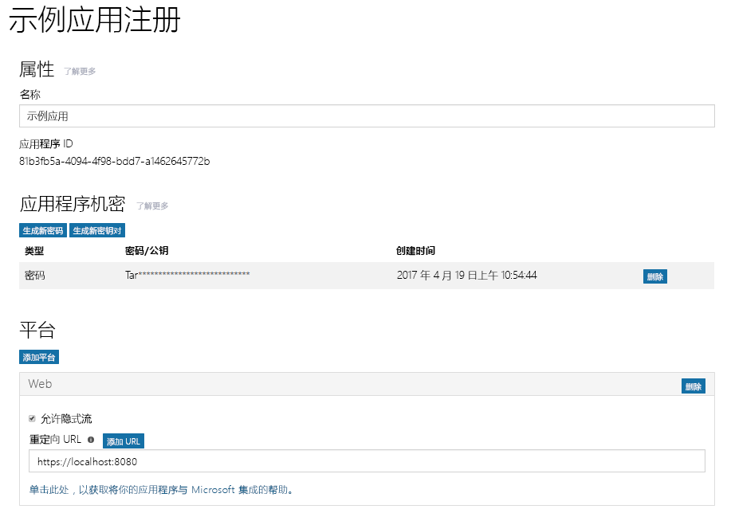

# 使用 Azure AD v2.0 终结点注册应用

应用必须使用 Azure AD 注册。注册应用会建立一个唯一的应用程序 ID 和其他值，你的应用可使用这些值通过 Azure AD 进行身份验证并获取令牌。对于 Azure AD v2.0 终结点，请使用 [Microsoft 应用程序注册门户](https://apps.dev.microsoft.com)注册应用。你可以使用 Microsoft 帐户或工作或学校帐户注册应用。为应用配置身份验证或授权时，你需要根据开发的应用类型复制一个或多个要在注册期间使用的属性。 

> **注意：**本文主要介绍了使用 Azure AD v2.0 终结点注册应用的内容。有关使用 Azure AD 终结点注册应用的信息，请参阅下面的 [Azure AD 终结点注意事项](#azure-ad-endpoint-considerations)。
> 
> 此外，请注意，如果之前已经在 Microsoft Azure 管理门户注册应用，那么这些应用将不会在应用注册门户中列出。在 Azure 管理门户中管理这些应用。 

下面的屏幕截图显示了已使用密码和隐式流配置的 Web 应用注册示例。

若要注册应用，请遵循以下步骤；配置应用的授权时，务必复制要使用的指示值：

1. 登录到 [Microsoft 应用注册门户](https://apps.dev.microsoft.com/)。
   
    你可以使用 Microsoft 帐户或工作或学校帐户登录。 

2. 选择“添加应用”****。
    > 注意：如果使用工作或学校帐户登录，请选择**聚合应用程序**的“添加应用程序”****按钮。 

3. 输入应用的名称，并选择“创建应用程序”****”。

    将显示注册页，其中列出应用的属性。

4. 复制应用程序 ID。这是应用的唯一标识符。

    你将使用该应用程序 ID 配置应用。

5. 在“平台”****下，选择“添加平台”****，然后为应用选择合适的平台：
    
    **对于本机或移动应用**：

    1. 选择“本机应用程序”****。

    2. 复制**内置重定向 URI** 值。你将需要这些来配置应用。

        重定向 URL 是向应用程序提供的唯一的 URI，以确保发送到此 URI 的邮件只发送到该应用程序。 

    **对于 Web 应用**：

    1. 选择“Web”****

    2. 根据正在使用的身份验证流类型，必须确保选中“允许隐式流”****复选框。 
        
        “允许隐式流”****选项可启用 OpenID Connect 混合流和隐式流。混合流可使应用同时接收登录信息（id 令牌）以及应用用来获取访问令牌的项目（在这种情况下，项目为授权代码）。混合流是 OWIN OpenID Connect 中间件使用的默认流。对于单页应用 (SPA)，隐式流可使应用接收登录信息和访问令牌。 

    3. 指定重定向 URI。
        
        重定向 URI 是 Azure AD v2.0 终结点处理身份验证请求后在应用中调用的位置。

    4. 在“应用程序机密”****下，选择“生成新密码”****。从“生成的新密码”****对话框复制应用密钥。
        > **重要信息** 关闭“生成的新密码”****对话框之前，必须复制应用密钥。关闭该对话框后，将无法检索密钥。 
            
6. 选择“保存”****。

下表显示了针对不同类型的应用需要配置和复制的属性。_已分配_表示你应该使用由 Azure AD 分配的值。

| 应用类型 | 平台 | 应用程序 ID | 应用程序密码 | 重定向 URI/URL | 隐式流 
| --- | --- | --- | --- | --- | --- |
| 本机/移动 | 本机 | 已分配  | 否 | 已分配 | 否 |
| Web 应用 | Web | 已分配 | 是 | 是 | 可选  Open ID Connect 中间件默认使用混合流（是） | 
| 单页应用 (SPA) | Web | 已分配 | 是 | 是 | 是   SPA 使用 Open ID Connect 隐式流 |
| 服务/守护程序 | Web | 已分配 | 是 | 必需 | 否 |

提供管理员同意体验的应用可能需要用于 Azure AD 的其他重定向 URL 返回响应。

有关应用注册门户以及你可以为应用配置的属性的详细信息，请参阅[应用注册引用](https://docs.microsoft.com/en-us/azure/active-directory/develop/active-directory-v2-registration-portal)。  

## Azure AD 终结点注意事项

可使用 [Azure 门户](https://aka.ms/aadapplist)为 Azure AD 终结点注册应用。可以和 v2.0 终结点一样配置相同的基本属性（例如，应用程序 ID、应用程序密码和重定向 URI/URL），但是请注意以下不同之处： 

- 只能使用工作或学校帐户注册应用。
- 应用将需要每个平台具有不同的应用程序 ID。
- 如果应用是多租户应用，则必须在门户中将其显式配置为多租户。
- 必须在门户中预配置应用需要的所有权限（包括 Microsoft Graph 权限）。 

有关使用 Azure 门户添加应用的指导，请参阅[使用 Azure Active Directory 集成应用程序：添加应用程序](https://docs.microsoft.com/azure/active-directory/develop/active-directory-integrating-applications#adding-an-application)。
