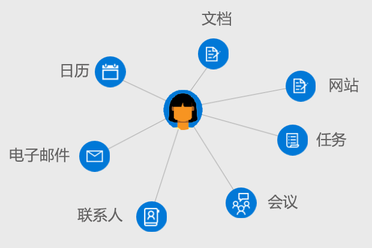

# Microsoft Graph 中用户的概述Overview of users in Microsoft Graph

用户是 Microsoft Graph 中 Azure Active Directory (Azure AD) 工作或学校用户帐户或 Microsoft 帐户的表示形式。Users are the representation of an Azure Active Directory (Azure AD) work or school user account or a Microsoft account in Microsoft Graph. Microsoft Graph 中的**用户**资源是一个中心，可以从这里访问与用户相关的关系和资源。The **user** resource in Microsoft Graph is a hub from which you can access the relationships and resources that are relevant to your users.

## 开发以用户为中心的应用程序Develop user-centric applications

你可使用 Microsoft Graph 访问与登录用户上下文相关的关系、文档、联系人和首选项。You can use Microsoft Graph to access the relationships, documents, contacts, and preferences that are contextually relevant to the signed-in user. **用户**资源提供了无需执行其他调用即可访问和操作用户资源的简单方法，可查找特定的身份验证信息，并直接对其他 Microsoft Graph 资源发出查询。The **user** resource provides straightforward way for you to access and manipulate user resources without having to perform additional calls, look up specific authentication information, and directly issue queries against other Microsoft Graph resources.

若要访问用户的信息和数据，你需要[以用户身份进行访问](auth-v2-user.md)。To access a user's information and data, you'll need to [get access on their behalf](auth-v2-user.md). 验证应用程序并获得[管理员同意](permissions-reference.md)，即可使用和更新与用户关联的更广泛的实体。Authenticating your application with [admin consent](permissions-reference.md) enables you to work with and update a wider range of entities associated with a user.

### 管理组织Manage your organization

在组织中创建新用户或更新现有用户的资源和关系。Create new users in your organization or update the resources and relationships for existing users. 可使用 Microsoft Graph 执行以下用户管理任务：You can use Microsoft Graph to perform the following user management tasks: 

- 创建或删除 Azure AD 组织中的用户。Create or delete users in your Azure AD organization.
- 列出用户的组成员资格并确定用户是否为组的成员。List a user's group memberships and determine whether a user is a member of a group.
- 列出向某用户报告的用户和向某用户分配经理。List the users who report to a user and assign managers to a user.
- 上传或检索用户的照片。Upload or retrieve a photo for the user.

### 使用日历和任务Work with calendars and tasks

可查看、查询和更新与某用户关联的用户日历和日历组，包括：You can view, query, and update user calendar and calendar groups associated with a user, including:

- 在用户日历上列出和创建事件。List and create events on a users calendar.
- 查看分配给用户的任务。View tasks assigned to a user.
- 为一组用户查找空闲的会议时间。Find free meeting times for a set of users.
- 获取用户日历上设置的提醒列表。Get a list of reminders set on a user's calendar.

### 管理邮件和处理联系人Administer mail and handle contacts

可配置用户邮件设置和联系人列表，并代表用户发送邮件，包括：You can configure user mail settings and contact lists and send mail on a user's behalf, including:

- 列出邮件消息和发送新邮件。List mail messages and send new mail.
- 创建和列出用户联系人，并组织文件夹中的联系人。Create and list user contacts and organize contacts in folders.
- 检索并更新邮箱文件夹和设置。Retrieve and update mailbox folders and settings.

### 利用用户见解丰富应用Enrich your app with user insights

通过推广最近使用的文档或热门文档以及与用户关联的联系人，最大限度地提高应用程序的关联性。Maximize relevance in your application by promoting recently used or trending documents and contacts associated with a user. 可以使用 Microsoft Graph：You can use Microsoft Graph to:

- 返回用户最近查看和修改的文档。Return documents recently viewed and modified by a user.
- 返回有关用户活动的文档和网站。Return documents and sites trending around a user's activity.
- 列出通过电子邮件或 OneDrive for Business 与用户共享的文档。List documents shared with a user through email or OneDrive for Business.

## API 参考API reference
在查找此服务的 API 参考？Looking for the API reference for this service?

- [Microsoft Graph v1.0 中的用户 APIUsers API in Microsoft Graph v1.0](/graph/api/resources/users?view=graph-rest-1.0)
- [Microsoft Graph beta 中的用户 APIUsers API in Microsoft Graph beta](/graph/api/resources/users?view=graph-rest-beta)

## 后续步骤Next steps

- 了解有关如何[使用用户](/graph/api/resources/users?view=graph-rest-1.0)的详细信息。Learn more about how to [work with users](/graph/api/resources/users?view=graph-rest-1.0).
- 从 [Graph 浏览器](https://developer.microsoft.com/graph/graph-explorer)的**用户**资源探索自己的数据。Explore your own data from the **user** resource in the [Graph Explorer](https://developer.microsoft.com/graph/graph-explorer).
- [代表用户](auth-v2-user.md)或[作为管理员同意的守护程序或服务](auth-v2-service.md)使用 Microsoft Graph 进行身份验证。Authenticate with Microsoft Graph [on behalf of a user](auth-v2-user.md) or [as a daemon or service by consent of an administator](auth-v2-service.md).
- 为使用 [Azure AD API](/graph/api/resources/azure-ad-overview?view=graph-rest-1.0) 的用户设置访问控制和策略。Set access control and policies for users with the [Azure AD API](/graph/api/resources/azure-ad-overview?view=graph-rest-1.0).
- 审阅应用访问用户数据所需的[权限](permissions-reference.md)。Review the [permissions](permissions-reference.md) your app will need to access user data. 
<!-- This isn't really a next step; let's remove to keep the list of links concise.>
- Stay up to date with Microsoft Graph [changelog](changelog.md).
-->
