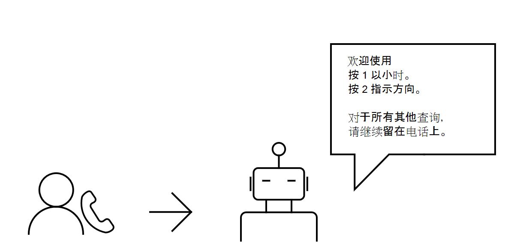
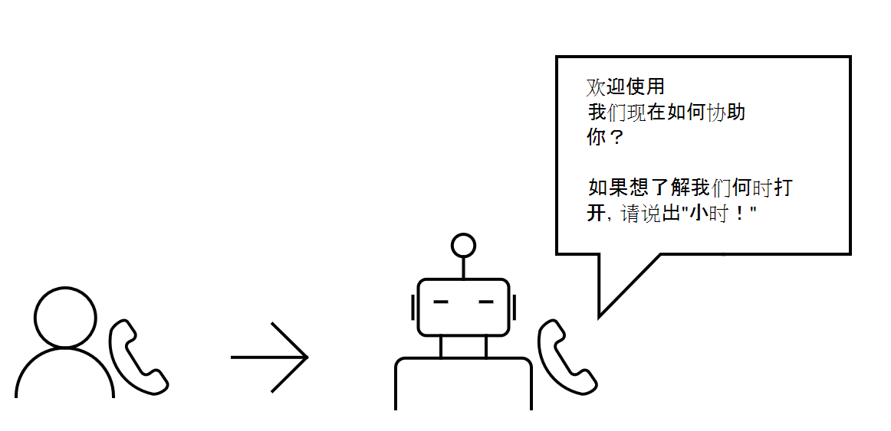

# 云通信 API 概述
Microsoft 中的云通信 API Graph通过各种通信相关功能（如通话和联机会议）为应用和服务如何与用户交互添加了新的维度。 通过了解如何响应客户需求以及员工如何相互协作来发展业务。

## 为什么与云通信 API 集成？

发现使用云通信 API 构建服务应用程序的好处， ([聊天](https://microsoftgraph.github.io/microsoft-graph-comms-samples/docs/articles/calls/register-calling-bot.html?q=create%20bot) 机器人) 。

### 处理传入呼叫

当工作人员收到大量业务呼叫，并且无法或无法高效应答所有业务呼叫时，这一切可能会非常不知所措。 机器人可以充当前台助理，通过拒绝看起来像垃圾邮件呼叫的呼叫，以及将 (将) 呼叫重定向到其他号码来处理这些呼叫。

可以使用云通信 API：

- 让用户通过 VoIP [呼叫](/graph/api/application-post-calls?view=graph-rest-1.0) 机器人。
- 如有必要， [让机器人将传入](/graph/api/call-redirect?view=graph-rest-1.0) 呼叫重定向到相应的代理。
- 使机器人[应答](/graph/api/call-answer?view=graph-rest-1.0)[或拒绝](/graph/api/call-reject?view=graph-rest-1.0)呼叫。

### 简化客户服务体验
无论你拥有大型技术支持服务还是小型店面，都很难处理多个客户请求，尤其是在你没有事先尝试解决什么问题的上下文时。 通过 IVR 或IVR (互动语音响应) 客户的传入呼叫，机器人最初将在该系统中与其交互。

当提示客户从自动程序响应时，客户可以在其键盘上按与其选择对应的键。 然后，机器人可以收集来自客户的 DTMF (拨号) 音多频。

可以使用云通信 API 生成以下机器人：

- [应答来自](/graph/api/call-answer?view=graph-rest-1.0) 客户的呼叫。
- [播放提示](/graph/api/call-playprompt?view=graph-rest-1.0) 以通知和提示客户进行选择。
- [订阅提示音以](/graph/api/call-subscribetotone?view=graph-rest-1.0) 从客户收集 DTMF。
- [将客户转移到](/graph/api/call-transfer?view=graph-rest-1.0) 代理。
- [结束与客户](/graph/api/call-delete?view=graph-rest-1.0) 的通话。

为了在您的客户和自动程序之间创建更智能的交互，当系统提示客户做出响应时，他们将能够直接说出他们需要帮助的方面。

与自然语言处理服务集成意味着可以分析客户的语音以表达其情绪。 然后，机器人可以相应地响应客户的需要。

>**注意：** 不得记录或以其他方式保留应用程序访问的呼叫或会议中的媒体内容，或记录派生自该媒体内容的数据。 确保你遵守有关通信数据保护和机密性的法律和法规。 有关详细信息，请参阅[使用条款](/legal/microsoft-apis/terms-of-use)并咨询法律顾问。

可以使用云通信 API 生成以下机器人：

- [应答来自](/graph/api/call-answer?view=graph-rest-1.0) 客户的呼叫。
- [播放提示](/graph/api/call-playprompt?view=graph-rest-1.0) 以通知并提示客户说话。
- [录制客户说话的](/graph/api/call-record?view=graph-rest-1.0) 简短音频剪辑。
- [在分析客户的](/graph/api/call-playprompt?view=graph-rest-1.0) 语音后，向客户播放相应响应的提示。

### 通过组内呼叫进行协作
允许用户通过创建组通话与同事或客户互动，以便每个人都可以参与对话。

可以使用云通信 API 生成以下机器人：

- [创建包含多个参与者的](/graph/api/application-post-calls?view=graph-rest-1.0#example-3-create-a-group-call-with-service-hosted-media) 组呼叫。
- [邀请其他机器人或用户](/graph/api/participant-invite?view=graph-rest-1.0) 加入现有组通话。
- [以机器人方式加入现有](/graph/api/application-post-calls?view=graph-rest-1.0#example-5-join-scheduled-meeting-with-service-hosted-media) 组呼叫。
- [列出组](/graph/api/call-list-participants?view=graph-rest-1.0) 呼叫中的参与者。
- [将另一个参与者静音](/graph/api/participant-mute?view=graph-rest-1.0)。

### 可靠地发送提醒
若要使用户能够为客户发送约会提醒或接近付款截止时间提醒，你可以让机器人自动呼叫客户。 <!--If the customer misses the call, it will leave a voicemail with the automated message. (Add this back once bot to PSTN calling works)-->

可以使用云通信 API 生成以下机器人：

- [呼叫客户](/graph/api/application-post-calls?view=graph-rest-1.0)Teams。
- [播放录制的提示](/graph/api/call-playprompt?view=graph-rest-1.0) 以用作提醒。
- [结束调用](/graph/api/call-delete?view=graph-rest-1.0)。

### 设置联机会议
无论是在患者和患者之间安排会议，还是在用户及其直接下属之间安排会议，都可以生成生成用户可依赖的会议的解决方案。 为了增加灵活性，用户可以呼叫其他用户，并邀请他们在会议进行期间参加会议。

可以使用云通信 API：

- 让用户创建 [联机会议](/graph/api/application-post-onlinemeetings?view=graph-rest-1.0)。
- 让用户 [检索联机](/graph/api/onlinemeeting-get?view=graph-rest-1.0) 会议的详细信息。
- 使机器人或用户 [加入联机会议](/graph/api/application-post-calls?view=graph-rest-1.0#example-5-join-scheduled-meeting-with-service-hosted-media)。

## API 参考
在查找此服务的 API 参考？

- [Microsoft Graph (v1.0) 中的云通信 API](/graph/api/resources/communications-api-overview?view=graph-rest-1.0)
- [Microsoft Graph (beta) 中的云通信 API](/graph/api/resources/communications-api-overview?view=graph-rest-beta)

## 后续步骤

- 使用机器人[开始。](cloud-communications-get-started.md)
- 详细了解[通话、](cloud-communications-calls.md)[媒体](cloud-communications-media.md)和[联机会议](cloud-communications-online-meetings.md)。
- 查看 API 使用 [限制](throttling.md#cloud-communication-service-limits)。
- 了解如何 [管理机器人](cloud-communications-phone-number.md) 的电话号码。

## 另请参阅

- [委派权限和应用程序权限](/azure/active-directory/develop/v1-permissions-and-consent)
- [通话权限](./permissions-reference.md#calls-permissions)
- [联机会议权限](./permissions-reference.md#online-meetings-permissions)
- [云通信示例](https://github.com/microsoftgraph/microsoft-graph-comms-samples)
