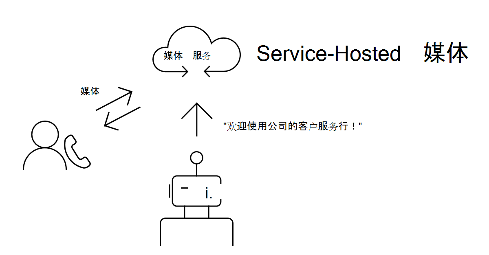
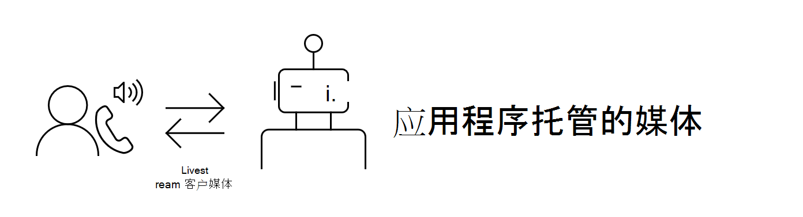

# 媒体概述

Microsoft 中的云通信 API Graph通过各种通信相关功能（如通话和联机会议）为应用和服务如何与用户交互添加了新的维度。 你可以使机器人发送和接收与音频和视频相关的内容。 利用媒体，可以在机器人和用户之间创建更具交互性的体验。

本文将帮助你根据你的需求发现哪个媒体托管选项适合你。

## 服务托管的媒体 (远程托管) 
如果希望机器人在客户拨打你的企业号码时播放自定义提示，或者检测电话提示音、录制短语音剪辑或执行任何各种互动语音响应 ([IVR](/graph/api/resources/calls-api-ivr-overview)) 方案，请考虑使用服务托管的媒体[API。](/graph/api/resources/communications-api-overview)

**如果你的媒体需求更简单，请首先浏览此选项**。 由于负载过重的媒体处理是远程卸载的，因此这是一种较轻的解决方案，可让你以更灵活的方式生成自动程序。

有关演示如何创建使用服务托管媒体的机器人的示例，请参阅远程 [媒体呼叫机器人示例](https://github.com/microsoftgraph/microsoft-graph-comms-samples/tree/master/Samples/V1.0Samples/RemoteMediaSamples)。

## 应用程序托管的媒体 (本地托管) 
如果希望机器人访问客户的音频和视频实时流，以通过自然语言处理服务进行录制、转录、翻译或情绪分析，请考虑在本地托管媒体。

>**注意：** 如果不首先调用 [updateRecordingStatus API](/graph/api/call-updaterecordingstatus)以指示录制已开始，并且从该 API 收到成功回复，则不能使用媒体访问 API 来记录或以其他方式保留应用程序访问的呼叫或会议中的媒体内容，也不能录制派生自该媒体内容 ("record"或"recording") 的数据。 如果应用程序开始录制任何会议/呼叫，则必须在调用 updateRecordingStatus API 之前结束录制，以指示录制已结束。 确保你遵守有关通信数据保护和机密性的法律和法规。 有关详细信息，请参阅[使用条款](/legal/microsoft-apis/terms-of-use)并咨询法律顾问。

**如果你想要对媒体进行更多控制，请选择此选项**。 你可以直接访问媒体流，并且将能够使用基于视频的屏幕共享。 你可以构建更复杂的启用语音的 IVR 方案。 这是一个较重的解决方案，可让你更灵活地对媒体进行编程。

另请参阅 [应用程序托管的](/microsoftteams/platform/concepts/calls-and-meetings/requirements-considerations-application-hosted-media-bots) 媒体机器人的要求和注意事项。

有关演示如何创建使用应用程序托管媒体的自动程序的示例，请参阅本地 [媒体示例](https://github.com/microsoftgraph/microsoft-graph-comms-samples/tree/master/Samples/V1.0Samples/LocalMediaSamples)。

## 另请参阅

- [通话权限](./permissions-reference.md#calls-permissions)
