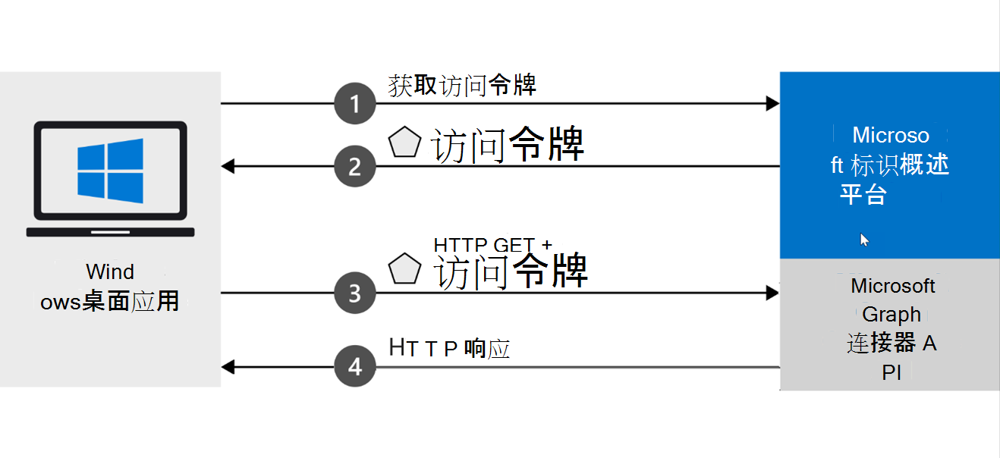

<!-- markdownlint-disable MD002 MD025 MD041 -->
<!--- # Introduction --->

<span data-ttu-id="87938-101">Microsoft Graph 连接器允许你将你自己的数据添加到 Microsoft Graph，并可以支持各种Microsoft 365体验。</span><span class="sxs-lookup"><span data-stu-id="87938-101">Microsoft Graph connectors allow you to add your own data into Microsoft Graph and have it power various Microsoft 365 experiences.</span></span>

<span data-ttu-id="87938-102">此 .NET Core 应用程序演示如何使用 Microsoft Graph 连接器 API 创建客户连接器并使用它来支持 Microsoft 搜索。</span><span class="sxs-lookup"><span data-stu-id="87938-102">This .NET Core application shows you how to use the Microsoft Graph connectors API to create a customer connector and use it to power Microsoft Search.</span></span> <span data-ttu-id="87938-103">本教程使用 Contoso 设备修复组织的示例数据设备部件清单。</span><span class="sxs-lookup"><span data-stu-id="87938-103">This tutorial uses a sample data appliance parts inventory for the Contoso Appliance Repair organization.</span></span>

## <a name="how-does-the-sample-work"></a><span data-ttu-id="87938-104">示例如何工作？</span><span class="sxs-lookup"><span data-stu-id="87938-104">How does the sample work?</span></span>

<span data-ttu-id="87938-105">此示例创建从 Windows 获取令牌的 Microsoft 标识平台 桌面应用，并使用它向 Microsoft Graph 连接器 API 发送请求。</span><span class="sxs-lookup"><span data-stu-id="87938-105">The sample creates a Windows desktop app that acquires a token from the Microsoft identity platform, and uses it to send requests to the Microsoft Graph connectors API.</span></span> <span data-ttu-id="87938-106">连接器 API 将在验证访问权限后发送其响应。</span><span class="sxs-lookup"><span data-stu-id="87938-106">The connectors API will send its response after the access is validated.</span></span>



## <a name="prerequisites"></a><span data-ttu-id="87938-108">先决条件</span><span class="sxs-lookup"><span data-stu-id="87938-108">Prerequisites</span></span>

* <span data-ttu-id="87938-109">在Visual Studio计算机上安装带[.NET Core 3.1 SDK 的 2019](https://www.microsoft.com/net/download/core)版本。</span><span class="sxs-lookup"><span data-stu-id="87938-109">Install Visual Studio 2019 with [.NET Core 3.1 SDK](https://www.microsoft.com/net/download/core) on your development computer.</span></span>
* <span data-ttu-id="87938-110">确保你有个人 Microsoft [帐户或](https://signup.live.com/)工作或学校帐户。</span><span class="sxs-lookup"><span data-stu-id="87938-110">Make sure that you have a [personal Microsoft account](https://signup.live.com/), or a work or school account.</span></span>
* <span data-ttu-id="87938-111">使用下面的 [命令将实体框架核心](/ef/core/miscellaneous/cli/dotnet) 工具安装为全局工具：</span><span class="sxs-lookup"><span data-stu-id="87938-111">Install the [Entity Framework Core Tools](/ef/core/miscellaneous/cli/dotnet) as a global tool using the following command:</span></span>

    ```dotnetcli
    dotnet tool install --global dotnet-ef
    ```

* <span data-ttu-id="87938-112">安装用于更新 SQLite 数据库的工具。</span><span class="sxs-lookup"><span data-stu-id="87938-112">Install a tool to update a SQLite database.</span></span> <span data-ttu-id="87938-113">例如，适用于 [SQLite 的 DB 浏览器](https://sqlitebrowser.org/)。</span><span class="sxs-lookup"><span data-stu-id="87938-113">For example, the [DB Browser for SQLite](https://sqlitebrowser.org/).</span></span>
* <span data-ttu-id="87938-114">从 **搜索ApplianceParts.csv**[示例存储库](https://github.com/microsoftgraph/msgraph-search-connector-sample/blob/master/PartsInventoryConnector/ApplianceParts.csv)下载文件，并将其添加到 PartsInventoryConnector.csproj。</span><span class="sxs-lookup"><span data-stu-id="87938-114">Download the **ApplianceParts.csv** file from the [Search connector sample repo](https://github.com/microsoftgraph/msgraph-search-connector-sample/blob/master/PartsInventoryConnector/ApplianceParts.csv) and add it to the PartsInventoryConnector.csproj.</span></span>
