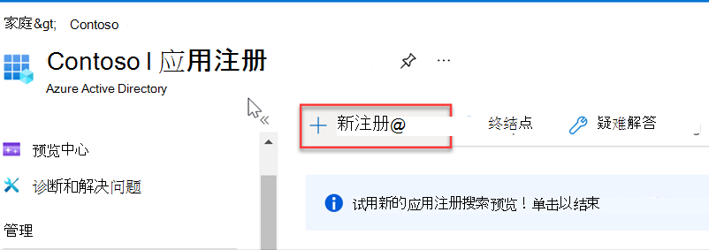
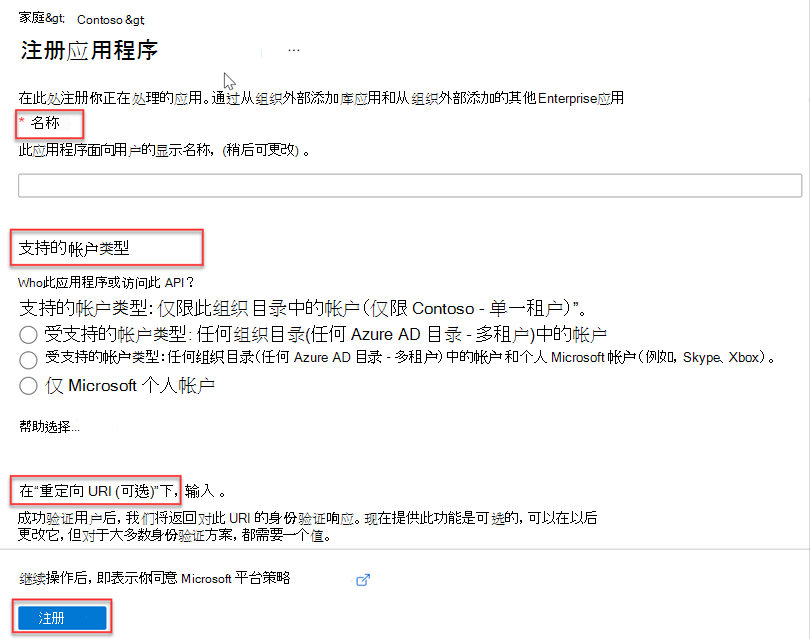
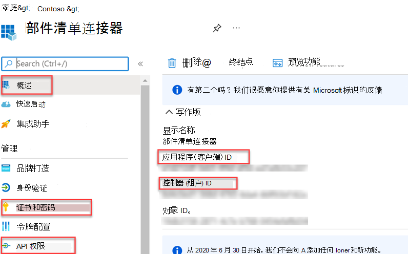
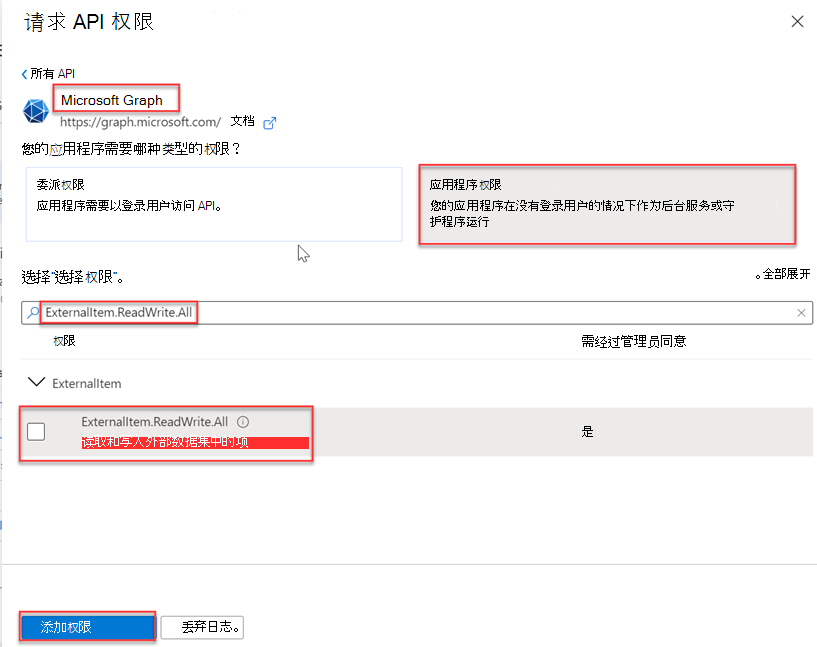
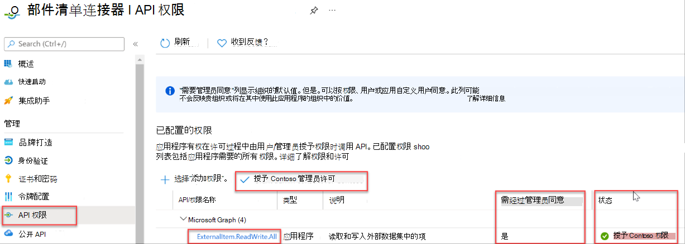
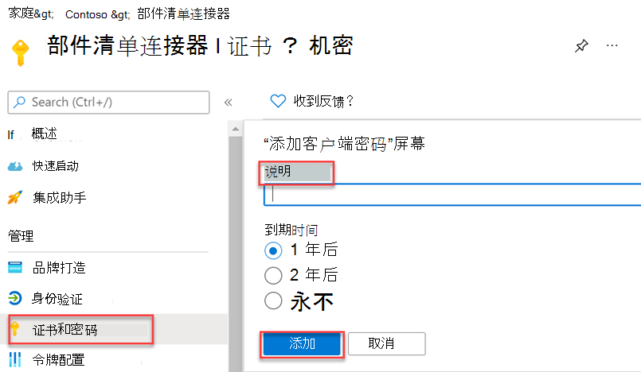

<!-- markdownlint-disable MD002 MD041 -->

完成所有先决条件后，你将能够在 Azure AD 管理中心注册应用程序。 注册是必需的，以便对应用程序进行身份验证，并使用它调用 Microsoft Graph连接器 API。

1. 转到管理[Azure Active Directory](https://aad.portal.azure.com/)中心，然后使用管理员帐户登录。
2. 在左窗格中，选择 **"Azure Active Directory"，****在**"管理"下，选择 **"应用注册"。**
3. 选择“新注册”。

    

4. 使用下列 **值填写"注册** 应用程序表单"，然后选择"注册 **"。**

    a. **名称**：部件库存连接器

    b. **支持的帐户类型**：此组织目录中的帐户仅 (Microsoft - 单租户) 

    c. **重定向 URI：** 保留为空

    

5. 在"部件清单连接器概述&quot;页上，复制&quot;应用程序客户端 (**ID&quot;** 和") 目录 (ID) 值。 你将需要在下一节中同时使用这两者。

    

6. 选择 **"管理"下的"API** **权限"。**
7. 选择 **"添加权限"，** 然后选择 **"Microsoft Graph"。**
8. 选择 **"应用程序权限"，** 然后选择 **"ExternalItem.ReadWrite.All"** 权限。 选择 **添加权限**。

    

9. 选择 **"授予 {TENANT} 的管理员同意"，** 然后在 **系统提示时** 选择"是"。

    

10. 选择 **"管理 &amp; "下的**"证书 **密码"，** 然后选择"**新建客户端密码"。**
11. 输入说明并选择密码的过期时间，然后选择"添加 **"。**

    

12. 复制并保存新密码，你将在下面的部分中需要它。
