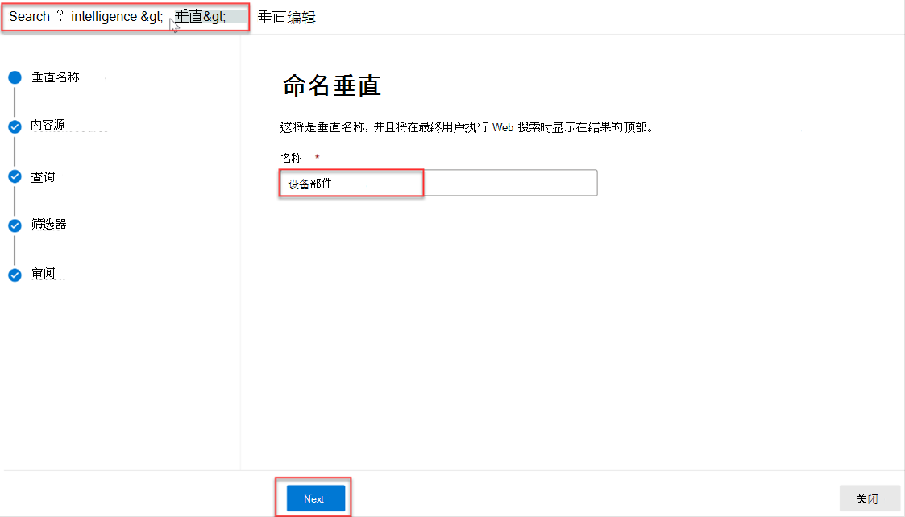
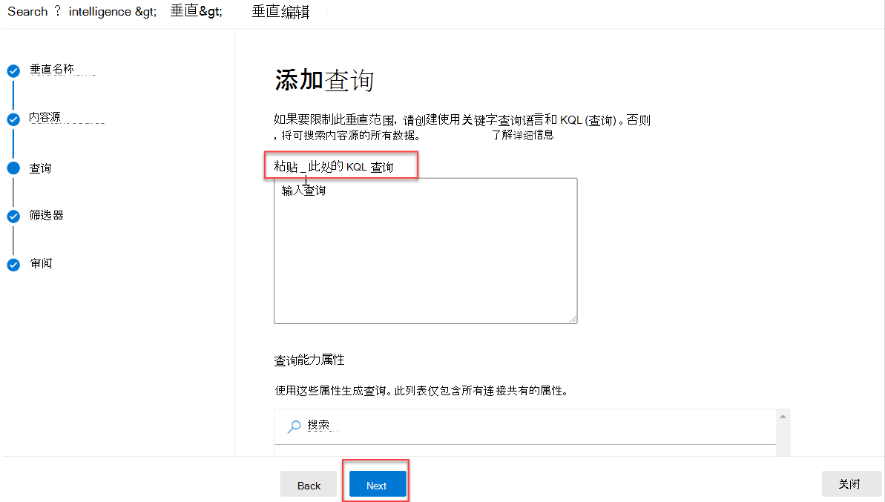
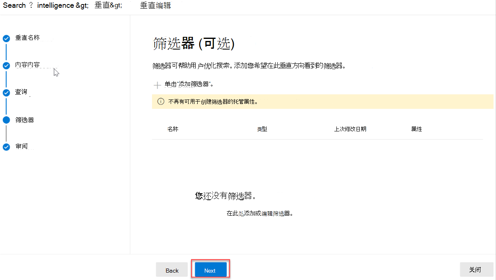
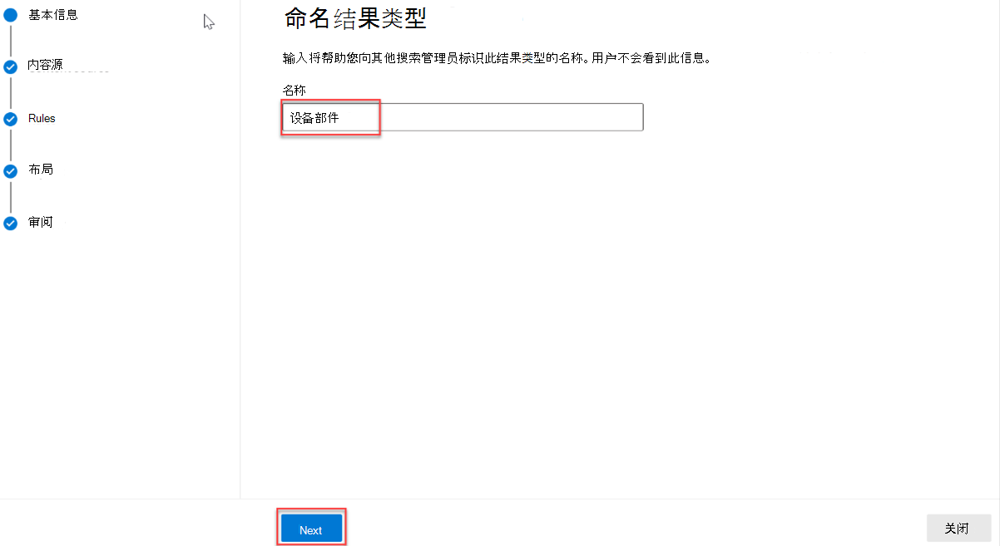
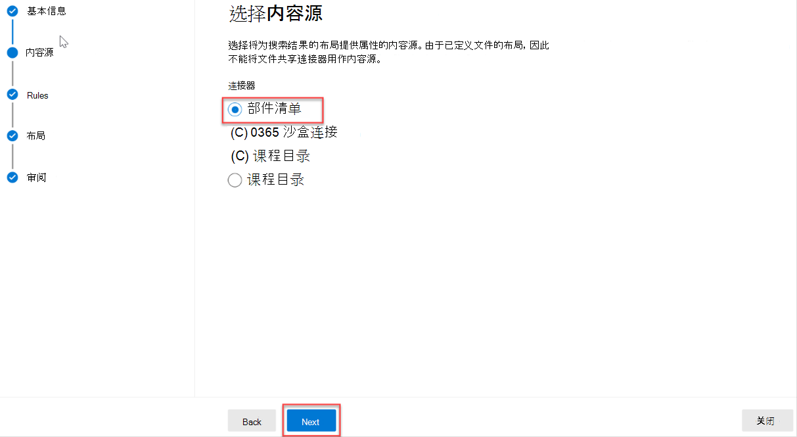
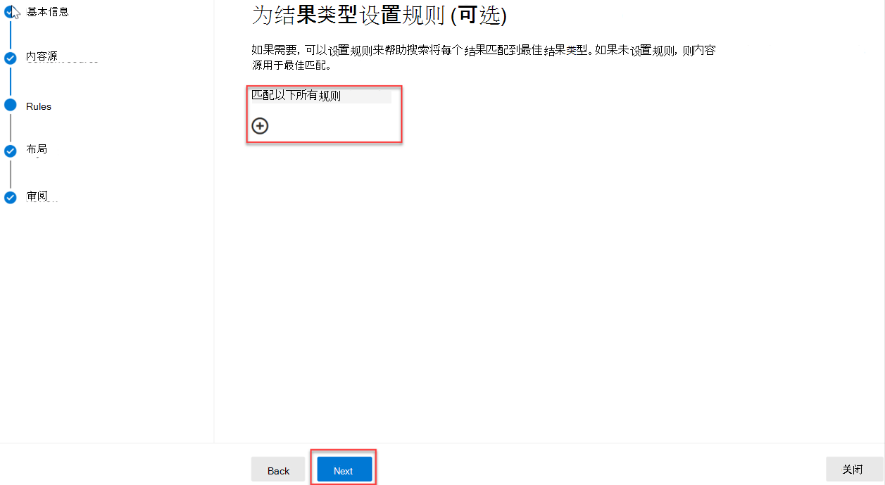
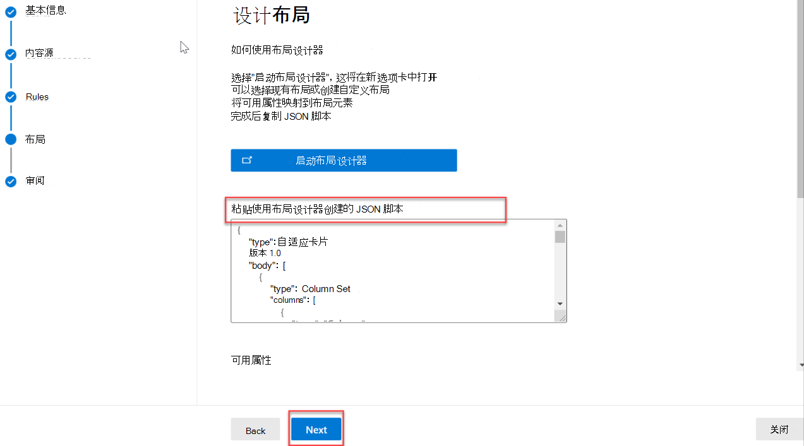

<!-- markdownlint-disable MD002 MD025 MD041 -->

创建垂直搜索和结果类型以自定义 必应 中的 Microsoft SharePoint、Microsoft Office 和 Microsoft 搜索 中的搜索结果，以便用户更轻松地找到他们有权查看的信息。

## 创建垂直

若要在组织级别创建和启用垂直搜索，请Microsoft 365 管理中心全局管理员角色并执行以下操作：

1. 转到 **"设置**  >  **搜索&**  >  **自定义"。**
2. 转到 **"垂直** "，然后单击" **添加"** 按钮。
3. 提供以下详细信息：
  * **将垂直名称：** 设备部件。

   

  * **内容源**：使用应用创建的连接器。  (部件清单) 

   

  * **添加查询：** 保留为空。

   

  * **筛选器**：保留为空。

   

## 创建结果类型

创建结果类型：

1. 转到 **"设置**  >  **搜索&**  >  **自定义"。**
2. 转到结果 **类型选项卡，** 然后单击"添加 **"** 按钮。
3. 提供以下详细信息：

  * **名称**：设备部件

   

  * **内容源**：在应用中创建的连接器。

   

  * **规则**：无

   

  * 将 [ 上result-type.js内容](https://github.com/microsoftgraph/msgraph-search-connector-sample/blob/master/result-type.json) 粘贴到布局设计器文本框中。

   
