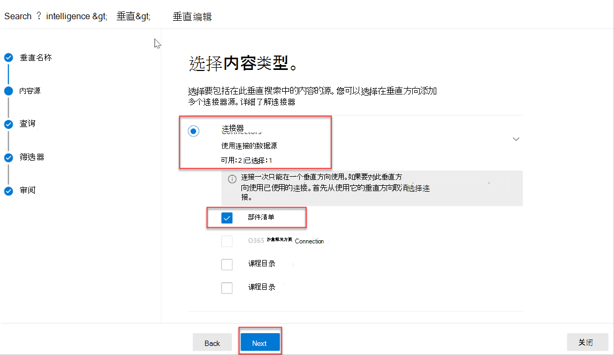

<!-- markdownlint-disable MD002 MD025 MD041 -->

创建垂直搜索和结果类型以自定义 必应 中的 Microsoft SharePoint、Microsoft Office 和 Microsoft 搜索中的搜索结果，以便用户更轻松地找到他们有权查看的信息。Create search verticals and result types to customize the search results in Microsoft SharePoint, Microsoft Office, and Microsoft Search in Bing, to make it easier for users to find the information that they have permission to see.

## 创建垂直Create a vertical

若要在组织级别创建和启用垂直搜索，请Microsoft 365管理中心，全局管理员角色执行以下操作：To create and enable a search vertical at the organization level, sign in to the [Microsoft 365 Admin center](https://admin.microsoft.com/) using the global administrator role, and do the following:

1. 转到 **"设置**  >  **搜索&**  >  **自定义"。**Go to **Settings** > **Search & intelligence** > **Customizations**.
2. 转到 **"垂直** "，然后单击" **添加"** 按钮。Go to **Vertical** and click the **Add** button.
3. 提供以下详细信息：Provide the following details:
  * **将垂直名称：** 设备部件。**Name the vertical:** Appliance Parts.

   

  * **内容源**：使用应用创建的连接器。**Content source**: The connector created with the app.  (部件清单) (Parts Inventory)

   

  * **添加查询：** 保留为空。**Add a query**: Leave blank.

   

  * **筛选器**：保留为空。**Filters**: Leave blank.

   

## 创建结果类型Create a result type

创建结果类型：To create a result type:

1. 转到 **"设置**  >  **搜索&**  >  **自定义"。**Go to **Settings** > **Search & intelligence** > **Customizations**.
2. 转到结果 **类型选项卡，** 然后单击"添加 **"** 按钮。Go to the **result type** tab and click the **Add** button.
3. 提供以下详细信息：Provide the following details:

  * **名称**：设备部件**Name**: Appliance Part

   

  * **内容源**：在应用中创建的连接器。**Content source**: The connector created in the app.

   

  * **规则**：无**Rules**: None

   

  * 将 [ 上result-type.js粘贴](https://github.com/microsoftgraph/msgraph-search-connector-sample/blob/master/result-type.json) 到布局设计器文本框中。Paste contents of [result-type.json](https://github.com/microsoftgraph/msgraph-search-connector-sample/blob/master/result-type.json) into the layout designer textbox.

   
