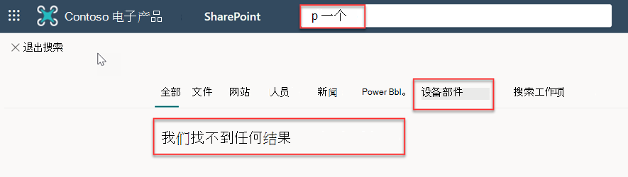
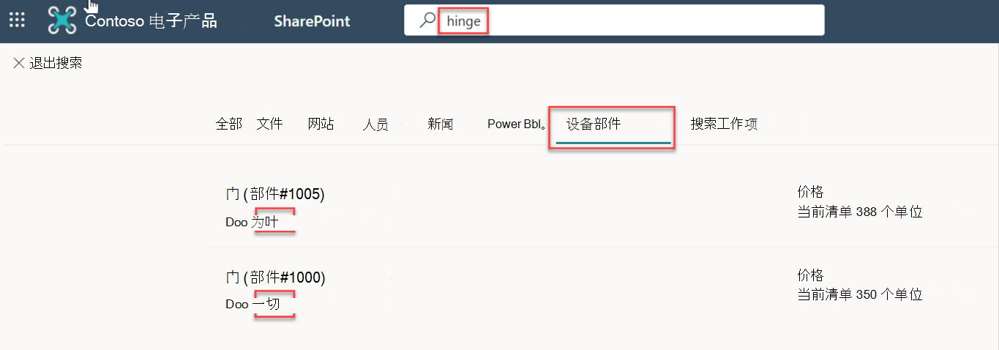

<!-- markdownlint-disable MD002 MD025 MD041 -->

在此步骤中，您将在 SharePoint 中搜索SharePoint。In this step, you will search for parts in SharePoint.

1. 转到租户的根SharePoint网站。Go to the root SharePoint site for your tenant.
2. 使用页面顶部的搜索框，搜索"下一 **页"。**Using the search box at the top of the page, search for **hinge**.

  

3. 当搜索完成 0 个结果时，选择" **设备部件"** 选项卡。When the search completes with 0 results, select the **Appliance Parts** tab.
4. 将显示来自连接器的结果。Results from the connector will be displayed.

  
