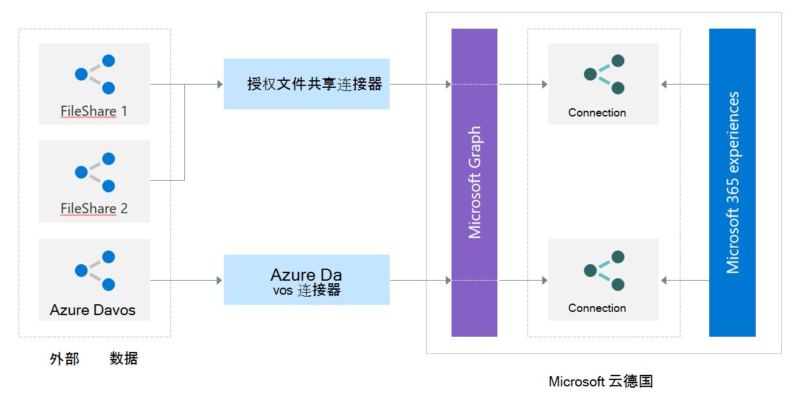

# 使用连接器 APIWorking with the connectors API

Microsoft Graph 连接器平台提供了一种简单的方法，可将外部数据添加到 Microsoft Graph 中并提升 Microsoft 365 智能体验。Microsoft Graph connectors offer a simple way to bring external data into Microsoft Graph and enhance Microsoft 365 intelligent experiences. 你可能希望构建自定义连接器，以与未作为 Microsoft 构建的连接器的服务集成。You might want to build a custom connector to integrate with services that aren't available as connectors built by Microsoft. 若要构建自定义连接器，请使用 Microsoft Graph 连接器 REST API。To build custom connectors, you use the Microsoft Graph connector REST APIs.

可以使用 Microsoft Graph 连接器 API 来：You can use the Microsoft Graph connectors API to:

1. 创建和管理外部数据连接。Create and manage external data connections.
2. 定义和注册外部数据类型的架构。Define and register the schema of the external data type(s).
3. 将外部数据项提取到 Microsoft Graph 中。Ingest external data items into Microsoft Graph.
4. 同步外部组。Sync external groups.

如果要了解有关这些 API 的更多详细信息，可以访问下面建议的文档。To learn more details about these APIs, you can visit the documentation suggested next.

## 连接 APIConnections API

连接是外部数据的逻辑容器，您可以作为一个单元进行管理。A connection is a logical container for your external data that you can manage as a single unit.
如果要了解有关如何在 Microsoft Graph 中创建、更新和删除连接的更多信息，请访问[管理连接](connecting-external-content-manage-connections.md)部分。To learn more about how to create, update, and delete connections in the Microsoft Graph, visit the [Manage connection](connecting-external-content-manage-connections.md) section.

## 架构 APISchema API

连接[架构](/graph/api/resources/schema?view=graph-rest-beta&amp;preserve-view=true)确定各种 Microsoft 365 体验中如何使用你的内容。The connection [schema](/graph/api/resources/schema?view=graph-rest-beta&amp;preserve-view=true) determines how your content will be used in various Microsoft 365 experiences. 架构是计划添加到连接中的所有属性的简单列表及其属性、标签和别名。Schema is a flat list of all the properties you plan to add to the connection along with their attributes, labels, and aliases. 必须先注册架构，然后才能将项目提取到 Microsoft Graph 中。You must register the schema before ingesting items into Microsoft Graph.

如果要了解有关如何为 Microsoft Graph 连接注册架构及其属性的更多信息，请访问[管理架构](connecting-external-content-manage-schema.md)部分。To learn more about how to register the schema for the Microsoft Graph connection, and its properties, visit the [Manage schema](connecting-external-content-manage-schema.md) section.

## 提取外部数据项Ingest external data items

Microsoft Graph 连接器平台提供了一种简单的方法，可将外部数据添加到 Microsoft Graph 中。Microsoft Graph connectors offer a simple way to bring external data into Microsoft Graph. 应用程序添加到 Microsoft 搜索服务的项用 Microsoft Graph 中的 [externalItem](/graph/api/resources/externalitem?view=graph-rest-beta&preserve-view=true) 资源表示。Items added by your application to the Microsoft Search service are represented by the [externalItem](/graph/api/resources/externalitem?view=graph-rest-beta&preserve-view=true) resource in Microsoft Graph.

如果要了解有关如何创建、更新和删除应用程序通过 Microsoft Graph 连接器添加的项目的更多信息，请访问[管理项目](connecting-external-content-manage-items.md)部分。To learn more about how to create, update, and delete items added by your application via Microsoft Graph connectors, visit the [Manage items](connecting-external-content-manage-items.md) section.

## 外部组 APIExternal groups API

可通过 ACL 对不同类型的非 Azure Active Directory 组授予或拒绝对外部服务中的项目的访问。Items in the external service can be granted or denied access via ACL to different types of non-Azure Active Directory groups. 例如，Salesforce 项可能拥有权限集和配置文件。For example, Salesforce items might have permission sets and profiles. ServiceNow 项目可能有本地组。ServiceNow items might have local groups. 将这些项目提取到 Microsoft Graph 中时，需要遵守这些 ACL。When you ingest these items into Microsoft Graph, you need to honor these ACLs.

可以使用外部组 API 来设置对提取到 Microsoft Graph 中的外部项目权限。You can use the External groups API to set permissions on external items ingested into Microsoft Graph. [externalGroup](/graph/api/externalgroup-post-members?view=graph-rest-beta&amp;preserve-view=true) 表示非 Azure Active Directory 组或类似组的构造（例如业务部门、团队等），并确定对外部数据源中内容的权限。An [externalGroup](/graph/api/externalgroup-post-members?view=graph-rest-beta&amp;preserve-view=true) represents a non-Azure Active Directory group or group-like construct (such as Business units, Teams, and so on) and determines permissions on the content in your external data source.