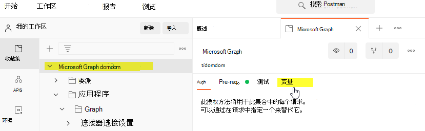
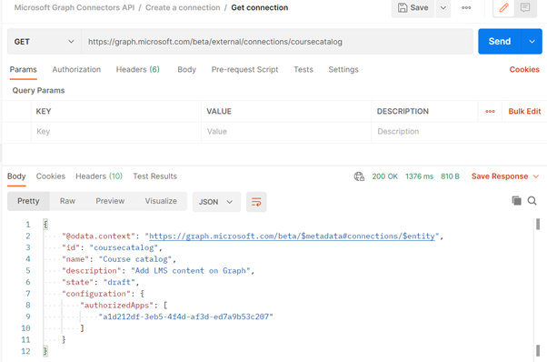

# <a name="use-postman-with-the-microsoft-graph-connectors-api"></a><span data-ttu-id="e551c-103">将 Postman 与 Microsoft Graph 连接器 API 一并使用</span><span class="sxs-lookup"><span data-stu-id="e551c-103">Use Postman with the Microsoft Graph connectors API</span></span>

<span data-ttu-id="e551c-104">本主题介绍如何将 Microsoft Graph 连接器 API 与 Postman 一并使用。</span><span class="sxs-lookup"><span data-stu-id="e551c-104">This topic describes how you can use the Microsoft Graph connector APIs with Postman.</span></span>

## <a name="prerequisites"></a><span data-ttu-id="e551c-105">先决条件</span><span class="sxs-lookup"><span data-stu-id="e551c-105">Prerequisites</span></span>

* <span data-ttu-id="e551c-106">Microsoft 帐户或者工作或学校帐户。</span><span class="sxs-lookup"><span data-stu-id="e551c-106">Either a Microsoft account or work or school account.</span></span>
* <span data-ttu-id="e551c-107">访问 Microsoft 365 开发人员租户。</span><span class="sxs-lookup"><span data-stu-id="e551c-107">Access to a Microsoft 365 developer tenant.</span></span> <span data-ttu-id="e551c-108">如果没有，可以注册 [Microsoft 365 开发人员计划]，获取免费的开发人员订阅。</span><span class="sxs-lookup"><span data-stu-id="e551c-108">If you don't have one, you can sign up for the [Microsoft 365 Developer Program] to get a free developer subscription.</span></span>

## <a name="step-1---import-the-microsoft-graph-postman-collection"></a><span data-ttu-id="e551c-109">步骤 1 - 导入 Microsoft Graph Postman 集合</span><span class="sxs-lookup"><span data-stu-id="e551c-109">Step 1 - Import the Microsoft Graph Postman collection</span></span>

<span data-ttu-id="e551c-110">要使用"邮政编码"集合，需要将其导入到"邮政编码"工作区。</span><span class="sxs-lookup"><span data-stu-id="e551c-110">To use the Postman collection, you need to import it into your Postman workspace.</span></span> <span data-ttu-id="e551c-111">在 Web 浏览器中执行这一操作。</span><span class="sxs-lookup"><span data-stu-id="e551c-111">Do this from a web browser.</span></span>

1. <span data-ttu-id="e551c-112">转到 [Postman](https://identity.getpostman.com/signup) 并登录。</span><span class="sxs-lookup"><span data-stu-id="e551c-112">Go to [Postman](https://identity.getpostman.com/signup) and sign up.</span></span> <span data-ttu-id="e551c-113">如果已有 Postman 帐户， [登录](https://identity.getpostman.com/login)。</span><span class="sxs-lookup"><span data-stu-id="e551c-113">If you already have a Postman account, you can [sign in](https://identity.getpostman.com/login).</span></span>

2. <span data-ttu-id="e551c-114">登录后，转到" **工作区**。</span><span class="sxs-lookup"><span data-stu-id="e551c-114">After you sign in, go to **My workspace**.</span></span>


3. <span data-ttu-id="e551c-116">转到 **"我的工作区"** 后， 选择 **"导入** 按钮。</span><span class="sxs-lookup"><span data-stu-id="e551c-116">After you go into **My workspace**, select the **Import** button.</span></span>


4. <span data-ttu-id="e551c-118">在打开的对话框中，选择 **链接** 选项卡，然后输入以下 URL - 在文本框中：  `https://www.postman.com/collections/61bfc772fe030514b062`。</span><span class="sxs-lookup"><span data-stu-id="e551c-118">In the dialog that opens, select **Link** tab and enter the following URL - in the textbox:  `https://www.postman.com/collections/61bfc772fe030514b062`.</span></span>


5. <span data-ttu-id="e551c-120">选择 **继续**。</span><span class="sxs-lookup"><span data-stu-id="e551c-120">Select **Continue**.</span></span>
6. <span data-ttu-id="e551c-121">选择“**导入**”。</span><span class="sxs-lookup"><span data-stu-id="e551c-121">Select **Import**.</span></span>


<span data-ttu-id="e551c-123">现在，你应该在 Postman 内看到 Microsoft Graph 连接器 API 集合。</span><span class="sxs-lookup"><span data-stu-id="e551c-123">You should now see the Microsoft Graph connectors API collection inside Postman.</span></span>


> [!NOTE]
> <span data-ttu-id="e551c-125">Microsoft Graph connector API 最近已添加到 [Microsoft Graph 邮政编码集合中](https://www.postman.com/microsoftgraph/workspace/microsoft-graph/overview)。</span><span class="sxs-lookup"><span data-stu-id="e551c-125">The Microsoft Graph connector API was recently added into the [Microsoft Graph postman collection](https://www.postman.com/microsoftgraph/workspace/microsoft-graph/overview).</span></span>
<span data-ttu-id="e551c-126">将很快编辑此文档以改为使用该集合。</span><span class="sxs-lookup"><span data-stu-id="e551c-126">This document will be edited soon to use that collection instead.</span></span>

## <a name="step-2---download-the-postman-agent-optional---postman-web-browser-only"></a><span data-ttu-id="e551c-127">步骤 2 - 下载Postman代理（可选 - 仅适用于 Postman Web 浏览器）</span><span class="sxs-lookup"><span data-stu-id="e551c-127">Step 2 - Download the Postman Agent (Optional - Postman Web browser only)</span></span>

<span data-ttu-id="e551c-128">要在 web 浏览器中使用此 Postman 集合，请下载 [Postman 桌面代理](https://www.postman.com/downloads)。</span><span class="sxs-lookup"><span data-stu-id="e551c-128">To use this Postman collection in your web browser, download the [Postman Desktop Agent](https://www.postman.com/downloads).</span></span> <span data-ttu-id="e551c-129">由于 web 浏览器的限制，无法在未下载此代理的情况下在 web 上使用 Postman。</span><span class="sxs-lookup"><span data-stu-id="e551c-129">You can't use Postman for the web without this due to CORS restrictions in the web browser.</span></span>
<span data-ttu-id="e551c-130">“每个Microsoft 365租户的最大[连接](/graph/api-reference/resources/externalconnection?view=graph-rest-beta&preserve-view=true)资源数。”</span><span class="sxs-lookup"><span data-stu-id="e551c-130">"The maximum number of [connection](/graph/api-reference/resources/externalconnection?view=graph-rest-beta&preserve-view=true) resources per Microsoft 365 tenant."</span></span>

> [!NOTE]
> <span data-ttu-id="e551c-131">如果你正在使用 Postman for Windows 应用，则不需要此代理。</span><span class="sxs-lookup"><span data-stu-id="e551c-131">You don't need the agent if you're using the Postman for Windows app.</span></span> <span data-ttu-id="e551c-132">如果打开 Postman for Windows 后，你会在工作区中看到这个分支集合。</span><span class="sxs-lookup"><span data-stu-id="e551c-132">If you open Postman for Windows, you will see this collection in your workspace.</span></span>

## <a name="step-3---create-an-azure-ad-application"></a><span data-ttu-id="e551c-133">第三步 - 创建 Azure AD 应用程序</span><span class="sxs-lookup"><span data-stu-id="e551c-133">Step 3 - Create an Azure AD application</span></span>

<span data-ttu-id="e551c-134">要在你的开发者租户中使用此集合，请创建一个 Azure AD 应用程序并根据想要调用的请求给予其合适的权限。</span><span class="sxs-lookup"><span data-stu-id="e551c-134">To use this collection in your own developer tenant, create an Azure AD application and give it the appropriate permissions for the requests you want to call.</span></span>

1. <span data-ttu-id="e551c-135">转到 [portal.azure.com](https://portal.azure.com/) ， 并使用您的开发人员租户管理员帐户 **登录**。</span><span class="sxs-lookup"><span data-stu-id="e551c-135">Go to [portal.azure.com](https://portal.azure.com/) and **Sign in** with your developer tenant administrator account.</span></span>
2. <span data-ttu-id="e551c-136">在 Azure 服务下， 选择 **Azure Active Directory**。</span><span class="sxs-lookup"><span data-stu-id="e551c-136">Under Azure Services, select **Azure Active Directory**.</span></span>
3. <span data-ttu-id="e551c-137">在左侧菜单上，选择 **注册**。</span><span class="sxs-lookup"><span data-stu-id="e551c-137">On the left menu, select **App registrations**.</span></span>
4. <span data-ttu-id="e551c-138">在水平菜单中，单击“**新建注册**”。</span><span class="sxs-lookup"><span data-stu-id="e551c-138">On the horizontal menu, select **New registration**.</span></span>
5. <span data-ttu-id="e551c-139">将应用程序名称设置为"部件库存"。</span><span class="sxs-lookup"><span data-stu-id="e551c-139">Set the Application name to "Parts Inventory".</span></span>
6. <span data-ttu-id="e551c-140">将"重定向 URI"设置为 https://oauth.pstmn.io/v1/browser-callback。</span><span class="sxs-lookup"><span data-stu-id="e551c-140">Set the Redirect URI to https://oauth.pstmn.io/v1/browser-callback.</span></span>
7. <span data-ttu-id="e551c-141">选择“**注册**”。</span><span class="sxs-lookup"><span data-stu-id="e551c-141">Select **Register**.</span></span>
8. <span data-ttu-id="e551c-142">在左侧菜单上，选择 **API 权限**。</span><span class="sxs-lookup"><span data-stu-id="e551c-142">On the left menu, select **API Permissions**.</span></span>
9. <span data-ttu-id="e551c-143">在水平菜单中，**Microsoft Graph** > **权限或** > **权限添加**。</span><span class="sxs-lookup"><span data-stu-id="e551c-143">In the horizontal menu, select **Add a permission** > **Microsoft Graph** > **Delegated Permissions**.</span></span>
10. <span data-ttu-id="e551c-144">开始键入内容 `ExternalItem.ReadWrite.All` 并选中 `ExternalItem.ReadWrite.All`。</span><span class="sxs-lookup"><span data-stu-id="e551c-144">Start typing `ExternalItem.ReadWrite.All` and check `ExternalItem.ReadWrite.All`.</span></span>
11. <span data-ttu-id="e551c-145">选择 **权限**，键入"用户"，然后选中 **权限**。</span><span class="sxs-lookup"><span data-stu-id="e551c-145">Select **Application permissions**, type "User"., and check **Application Permissions**.</span></span>
12. <span data-ttu-id="e551c-146">展开 **用户选项，** 并选中 **`ExternalItem.ReadWrite.All`**。</span><span class="sxs-lookup"><span data-stu-id="e551c-146">Expand the **User options** and check **`ExternalItem.ReadWrite.All`**.</span></span>
13. <span data-ttu-id="e551c-147">选择 **添加权限**。</span><span class="sxs-lookup"><span data-stu-id="e551c-147">Select **Add permissions**.</span></span>
14. <span data-ttu-id="e551c-148">在水平菜单中，选择 **授予管理员对** 许可， **"是**。</span><span class="sxs-lookup"><span data-stu-id="e551c-148">In the horizontal menu, select **Grant admin consent for**, and select **Yes**.</span></span>
15. <span data-ttu-id="e551c-149">在左侧的菜单中，选择 **概述**。</span><span class="sxs-lookup"><span data-stu-id="e551c-149">In the left menu, select **Overview**.</span></span> <span data-ttu-id="e551c-150">在这里，你可以获取应用程序（客户端）ID 和目录（租户）ID。</span><span class="sxs-lookup"><span data-stu-id="e551c-150">From here, you can get the Application (client) ID and Directory (tenant) ID.</span></span> <span data-ttu-id="e551c-151">这些会在第四步中用到。</span><span class="sxs-lookup"><span data-stu-id="e551c-151">You will need these in step 4.</span></span>
16. <span data-ttu-id="e551c-152">在左侧的菜单中， **证书和秘诀**。</span><span class="sxs-lookup"><span data-stu-id="e551c-152">In the left menu, select **Certificates and secrets**.</span></span>
17. <span data-ttu-id="e551c-153">选择“**新建客户端机密**”，并输入简短说明，然后选择“**添加**”。</span><span class="sxs-lookup"><span data-stu-id="e551c-153">Select **New client secret**, enter a description, and select **Add**.</span></span> <span data-ttu-id="e551c-154">复制新的客户端密码值，将在步骤 4 中需要该密码。</span><span class="sxs-lookup"><span data-stu-id="e551c-154">Copy the new client secret value, you will need this in step 4.</span></span>

<span data-ttu-id="e551c-155">现在，Azure AD应用程序具有代表用户发出呼叫请求`ExternalItem.ReadWrite.All`的权限，并作为`ExternalItem.ReadWrite.All`的应用程序。</span><span class="sxs-lookup"><span data-stu-id="e551c-155">The Azure AD application now has permissions to make requests on behalf of a user to call `ExternalItem.ReadWrite.All`, and as an application for `ExternalItem.ReadWrite.All`.</span></span>

## <a name="step-4--configure-authentication"></a><span data-ttu-id="e551c-156">步骤 4：配置身份验证</span><span class="sxs-lookup"><span data-stu-id="e551c-156">Step 4 – Configure authentication</span></span>

<span data-ttu-id="e551c-157">在 Postman 中设置变量。</span><span class="sxs-lookup"><span data-stu-id="e551c-157">Set up the variables in Postman.</span></span> <span data-ttu-id="e551c-158">此信息用于生成访问令牌。</span><span class="sxs-lookup"><span data-stu-id="e551c-158">This information is used to generate the access token.</span></span>

1. <span data-ttu-id="e551c-159">选择 **Microsoft Graph connectors API** 选项卡，然后转到" **变量** 部分。</span><span class="sxs-lookup"><span data-stu-id="e551c-159">Select the **Microsoft Graph connectors API** tab and go to the **Variables** section.</span></span>



2. <span data-ttu-id="e551c-161">在"变量"部分，使用步骤 3 中的信息提供所需信息。</span><span class="sxs-lookup"><span data-stu-id="e551c-161">In the Variables section, provide the required information using the information from step 3.</span></span>

- <span data-ttu-id="e551c-162">从步骤3.15开始，将 **客户端\_id** 的 **当前值** 设置为应用程序（客户端）ID值。</span><span class="sxs-lookup"><span data-stu-id="e551c-162">Set the  **Current value**  of **client\_id** to the Application (client) ID value from step 3.15.</span></span>
- <span data-ttu-id="e551c-163">从步骤3.17开始，将 **客户端\_密码** 的 **当前值** 设置为客户端密码值。</span><span class="sxs-lookup"><span data-stu-id="e551c-163">Set the  **Current value** of **client\_secret** to the Client Secret value from step 3.17.</span></span>
- <span data-ttu-id="e551c-164">从步骤3.15开始，将 **租户** 的 **当前值** 设置为目录（租户）ID 值。</span><span class="sxs-lookup"><span data-stu-id="e551c-164">Set the  **Current value**  of **tenant** to the Directory (tenant) ID value from step 3.15.</span></span>
- <span data-ttu-id="e551c-165">将 **用户名** 的 **当前值** 设置为`admin@xxxxxxx.onmicrosoft.com`</span><span class="sxs-lookup"><span data-stu-id="e551c-165">Set the  **Current value**  of **username** to `admin@xxxxxxx.onmicrosoft.com`</span></span>
- <span data-ttu-id="e551c-166">将 **密码** 的 **当前值** 设置为租户管理员密码。</span><span class="sxs-lookup"><span data-stu-id="e551c-166">Set the  **Current value**  of **password** to tenant admin password.</span></span>


3. <span data-ttu-id="e551c-168">选择“**保存**” / “**更新**”。</span><span class="sxs-lookup"><span data-stu-id="e551c-168">Select  **Save** / **Update**.</span></span>

## <a name="step-5---get-an-authentication-token"></a><span data-ttu-id="e551c-169">步骤 5 - 获取身份验证令牌</span><span class="sxs-lookup"><span data-stu-id="e551c-169">Step 5 - Get an authentication token</span></span>

<span data-ttu-id="e551c-170">由于这是你第一次通过应用程序身份验证流程运行请求，你需要获取访问令牌。</span><span class="sxs-lookup"><span data-stu-id="e551c-170">You need to get an access token because this is the first time you are running a request as an application authentication flow.</span></span> <span data-ttu-id="e551c-171">通过以下 POST 请求获取应用访问令牌：</span><span class="sxs-lookup"><span data-stu-id="e551c-171">Get the app access token by making the following POST request:</span></span>


<span data-ttu-id="e551c-173">以下示例显示了如何获取共享密码的访问令牌：</span><span class="sxs-lookup"><span data-stu-id="e551c-173">The following example shows how to get an access token with a shared secret:</span></span>
```html
POST /{{tenant}}/oauth2/v2.0/token HTTP/1.1 //Line breaks for clarity
Host: login.microsoftonline.com
Content-Type: application/x-www-form-urlencoded

client_id={{client_id}} 
&scope=https%3A%2F%2Fgraph.microsoft.com%2F.default 
&client_secret={{client_secret}} 
&grant_type=client_credentials 
```
<span data-ttu-id="e551c-174">以下示例显示了成功响应：</span><span class="sxs-lookup"><span data-stu-id="e551c-174">The following example shows a successful response:</span></span>
```html
{ 
    "token_type": "Bearer", 
    "expires_in": 3599, 
    "ext_expires_in": 3599, 
    "access_token": "eyJ0eXAiOiJKV1QiLCJu… " 
} 
```

<span data-ttu-id="e551c-175">请注意，你正在通过此处 [客户端凭据](/azure/active-directory/develop/v2-oauth2-client-creds-grant-flow) 流。</span><span class="sxs-lookup"><span data-stu-id="e551c-175">Note that you are using the [client credential flow](/azure/active-directory/develop/v2-oauth2-client-creds-grant-flow) here.</span></span> <span data-ttu-id="e551c-176">请确保获取应用访问令牌，而不是用户访问令牌。</span><span class="sxs-lookup"><span data-stu-id="e551c-176">Be sure to get an app access token and not a user access token.</span></span>

## <a name="step-6--create-a-new-connection"></a><span data-ttu-id="e551c-177">步骤 6 - 创建新连接</span><span class="sxs-lookup"><span data-stu-id="e551c-177">Step 6 – Create a new connection</span></span>

<span data-ttu-id="e551c-178">[连接](/concepts/connecting-external-content-manage-connections.md)是外部数据的逻辑容器，您可以作为一个单元进行管理。</span><span class="sxs-lookup"><span data-stu-id="e551c-178">A [connection](/concepts/connecting-external-content-manage-connections.md) is a logical container for your external data that you can manage as a single unit.</span></span> <span data-ttu-id="e551c-179">选择连接名称、ID 和说明。</span><span class="sxs-lookup"><span data-stu-id="e551c-179">Choose a connection name, id, and description.</span></span> <span data-ttu-id="e551c-180">从管理员获取连接到数据源的必要详细信息，并提供一种机制，在设置连接时授权处理内容源。</span><span class="sxs-lookup"><span data-stu-id="e551c-180">Get the necessary details from the admin to connect to the data source and provide a mechanism to authorize against the content source when setting up the connection.</span></span> <span data-ttu-id="e551c-181">可使用 [Microsoft Graph SDK](/graph/sdks/sdks-overview) 和API对连接器设置进行编程。</span><span class="sxs-lookup"><span data-stu-id="e551c-181">You can use the [Microsoft Graph SDK](/graph/sdks/sdks-overview) and APIs to program your connector setup.</span></span> <span data-ttu-id="e551c-182">如果要存储凭据，则可以使用Azure Key Vault。</span><span class="sxs-lookup"><span data-stu-id="e551c-182">If you want to store credentials, you can use Azure Key Vault.</span></span>

```http
POST /external/connections
```

<span data-ttu-id="e551c-183">下面展示了示例请求。</span><span class="sxs-lookup"><span data-stu-id="e551c-183">The following is an example of the request.</span></span>

```http
POST https://graph.microsoft.com/beta/external/connections 
Content-type: application/json 

{ 
  "id": "contosotasks", 
  "name": "Contoso Tasks", 
  "description": "Connection to index Contoso task management system" 
} 
```

<span data-ttu-id="e551c-184">下面介绍响应示例。</span><span class="sxs-lookup"><span data-stu-id="e551c-184">The following is an example of the response.</span></span>

```http
HTTP/1.1 201 Created 
Content-type: application/json 
 
{ 
    "@odata.context": "https://graph.microsoft.com/beta/$metadata#connections/$entity", 
    "id": "contosotasks", 
    "name": "Contoso Tasks", 
    "description": "Connection to index Contoso task management system", 
    "state": null, 
    "configuration": { 
        "authorizedApps": [ 
            "a47b35b7-6271-4e6d-9e27-2450a8b9c6b6" 
        ] 
    } 
} 
```

<span data-ttu-id="e551c-185">以下是 **“创建连接”** 部分的屏幕快照。</span><span class="sxs-lookup"><span data-stu-id="e551c-185">The following is a screenshot of the **Create connection** section.</span></span>

 

## <a name="step-7---register-connection-schema"></a><span data-ttu-id="e551c-187">步骤 7 - 注册连接架构</span><span class="sxs-lookup"><span data-stu-id="e551c-187">Step 7 - Register connection schema</span></span>

<span data-ttu-id="e551c-188">连接架构确定各种 Microsoft Graph 体验中如何使用你的内容。</span><span class="sxs-lookup"><span data-stu-id="e551c-188">The connection schema determines how your content will be used in various Microsoft Graph experiences.</span></span> <span data-ttu-id="e551c-189">架构是计划添加到连接中的所有属性的简单列表及其属性、标签和别名。</span><span class="sxs-lookup"><span data-stu-id="e551c-189">Schema is a flat list of all the properties that you plan to add to the connection along with their attributes, labels, and aliases.</span></span> <span data-ttu-id="e551c-190">向连接添加项目前，必须注册架构。</span><span class="sxs-lookup"><span data-stu-id="e551c-190">You must register the schema before adding items into the connection.</span></span>

```http
POST /external/connections/{id}/schema 
```

<span data-ttu-id="e551c-191">下面展示了示例请求。</span><span class="sxs-lookup"><span data-stu-id="e551c-191">The following is an example of the request.</span></span>

```http
POST https://graph.microsoft.com/beta/external/connections/contosotasks/schema 
Content-type: application/json 
Prefer: respond-async 

{ 
  "baseType": "microsoft.graph.externalItem", 
  "properties": [ 
    { 
"name": "title", 
      "type": "String", 
      "isSearchable": "true", 
"isQueryable": "true", 
      "isRetrievable": "true", 
      "labels": [ 
        "title" 
      ] 
    }, 
    { 
"aliases": "creator", 
      "name": "createdBy", 
      "type": "String", 
      "isSearchable": "true", 
"isQueryable": "true", 
      "isRetrievable": "false", 
"isRefinable": "false", 
      "labels": [ 
        "createdBy" 
      ] 
    }, 
    { 
"aliases": "editedDate", 
      "name": "lastEditedDate", 
      "type": "DateTime", 
      "isSearchable": "false", 
"isQueryable": "true", 
      "isRetrievable": "true", 
"isRefinable": "true", 
      "labels": [ 
   "lastModifiedDateTime" 
] 
    } 
  ] 
} 
```

<span data-ttu-id="e551c-192">下面介绍响应示例。</span><span class="sxs-lookup"><span data-stu-id="e551c-192">The following is an example of the response.</span></span>

```http
HTTP/1.1 202 Accepted 
Location: https://graph.microsoft.com/beta/external/connections/contosotasks/operations/616bfeed-666f-4ce0-8cd9-058939010bfc 
```

> [!NOTE]
> <span data-ttu-id="e551c-193">注册连接架构是一个异步操作，因此在连接架构进入"完成"状态之前，请勿将项目进入连接中。</span><span class="sxs-lookup"><span data-stu-id="e551c-193">Registering connection schema is an asynchronous operation, so do not ingest items into the connection until the connection schema is in the Completed state.</span></span> <span data-ttu-id="e551c-194">要检查连接架构状态，请执行以下请求：</span><span class="sxs-lookup"><span data-stu-id="e551c-194">To check connection schema status, execute the following request:</span></span>
> ```http
> GET /external/connections/contosotasks/operations/616bfeed-666f-4ce0-8cd9-058939010bfc 
> ```

<span data-ttu-id="e551c-195">下面是另一个请求示例。</span><span class="sxs-lookup"><span data-stu-id="e551c-195">The following is another example of request.</span></span>
```http
Request 
GET https://graph.microsoft.com/beta/external/connections/operations/616bfeed-666f-4ce0-8cd9-058939010bfc 
```

<span data-ttu-id="e551c-196">以及下一个各自答复示例。</span><span class="sxs-lookup"><span data-stu-id="e551c-196">And next the respective example of response.</span></span>

```http
HTTP/1.1 200 OK 
Content-type: application/json 

{
    @odata.context":"https://graph.microsoft.com/beta/$metadata#external/connections('coursecatalog')/operations/$entity", 
    "id": "aa9186d2-893c-4361-ca51-431d88fa45d8", 
    "name": "Contoso Tasks", 
    "status": "inprogress", 
    "error": null  
}
```

<span data-ttu-id="e551c-197">以下是 **“获取操作状态”** 部分的屏幕截图。</span><span class="sxs-lookup"><span data-stu-id="e551c-197">The following is a screenshot of the **Get operation status** section.</span></span>


<span data-ttu-id="e551c-199">将连接架构操作状态从 **“进行中”** 更改为 **“完成”后，** 您可以提取该连接的项目。</span><span class="sxs-lookup"><span data-stu-id="e551c-199">After the connection schema operation status changes from **InProgress** to **Completed,** you can ingest items for the connection.</span></span>

<span data-ttu-id="e551c-200">以下屏幕截图显示状态为"已完成"。</span><span class="sxs-lookup"><span data-stu-id="e551c-200">The following screenshot shows the status as "completed".</span></span>

 

<span data-ttu-id="e551c-202">以下屏幕截图将状态显示为"草稿"。</span><span class="sxs-lookup"><span data-stu-id="e551c-202">The following screenshot shows the state as "draft".</span></span>

 

<span data-ttu-id="e551c-204">连接状态从 **草稿\*\*\*\*准备就绪**（如下一个屏幕截图所示）后，您可以将项目放入当前连接。</span><span class="sxs-lookup"><span data-stu-id="e551c-204">After the connection state changes from **draft** to **ready**, as showed in the next screenshot, you can ingest items into current connection.</span></span>


## <a name="step-8---add-external-group-member-optional"></a><span data-ttu-id="e551c-206">步骤 8 - 添加外部团队成员（可选）</span><span class="sxs-lookup"><span data-stu-id="e551c-206">Step 8 - Add external group member (optional)</span></span>

<span data-ttu-id="e551c-207">如果外部服务使用非 Azure AD ACL，请同步这些权限。</span><span class="sxs-lookup"><span data-stu-id="e551c-207">If your external service uses non-Azure AD ACLs, sync those permissions.</span></span>  

<span data-ttu-id="e551c-208">外部组（以及 Azure Active Directory 用户和组）用于设置 `externalItems` Microsoft Graph 连接的权限。</span><span class="sxs-lookup"><span data-stu-id="e551c-208">External groups (along with Azure Active Directory users and groups) are used to set permissions on `externalItems` added to a Microsoft Graph connection.</span></span> <span data-ttu-id="e551c-209">有关详细信息，请参阅 [externalGroups](/graph/api/resources/externalgroup?view=graph-rest-beta)。</span><span class="sxs-lookup"><span data-stu-id="e551c-209">For details see [externalGroups](/graph/api/resources/externalgroup?view=graph-rest-beta).</span></span>

<span data-ttu-id="e551c-210">这是一个请求示例。</span><span class="sxs-lookup"><span data-stu-id="e551c-210">This is an example of a request.</span></span>

```http
POST https://graph.microsoft.com/beta/external/connections/contosotasks/groups/31bea3d537902000/members 
Content-Type: application/json 
 
{ 
  "@odata.type": "#microsoft.graph.externalGroupMember", 
  "id": "1431b9c38ee647f6a", 
  "type": "group", 
  "identitySource": "external" 
} 
```

<span data-ttu-id="e551c-211">下面是一个响应示例。</span><span class="sxs-lookup"><span data-stu-id="e551c-211">And next is an example of the response.</span></span>

```http
HTTP/1.1 201 Created 
Content-Type: application/json 

{ 
  "@odata.type": "#microsoft.graph.externalGroupMember", 
  "id": "14m1b9c38qe647f6a", 
  "type": "group", 
  "identitySource": "external" 
} 
```

<span data-ttu-id="e551c-212">以下屏幕截图显示了 **“创建外部组”** 部分。</span><span class="sxs-lookup"><span data-stu-id="e551c-212">The following screenshot shows the **Create external group** section.</span></span>


## <a name="step-9---ingest-items"></a><span data-ttu-id="e551c-214">步骤 9 - 正在购买项目</span><span class="sxs-lookup"><span data-stu-id="e551c-214">Step 9 - Ingest Items</span></span>

<span data-ttu-id="e551c-215">创建连接后，可以添加内容。</span><span class="sxs-lookup"><span data-stu-id="e551c-215">After you created a connection, you can add your content.</span></span> <span data-ttu-id="e551c-216">数据源中的每个项目必须用唯一项目 id `externalItem` Microsoft Graph 中表示为对象。此 ID 用于创建、更新或删除 Microsoft Graph 中的项目。</span><span class="sxs-lookup"><span data-stu-id="e551c-216">Each item from your data source must be represented as an `externalItem` in Microsoft Graph with a unique item id. This ID is used to create, update or delete the item from Microsoft Graph.</span></span> <span data-ttu-id="e551c-217">可使用数据源中的主键作为源 `itemId` 或来自一个或多个字段的主键。</span><span class="sxs-lookup"><span data-stu-id="e551c-217">You can use the primary key from your data source as the `itemId` or derive it from one or more fields.</span></span> <span data-ttu-id="e551c-218">控件 `externalItem` 三个关键组件：访问控制列表、属性和内容。</span><span class="sxs-lookup"><span data-stu-id="e551c-218">An `externalItem` has three key components: access control list, properties, and content.</span></span>

<span data-ttu-id="e551c-219">如果有二进制文件，则必须进行分析以获得元数据和内容的文本版本。</span><span class="sxs-lookup"><span data-stu-id="e551c-219">If you have binary files, you must parse to get the metadata and a text version of the content.</span></span> <span data-ttu-id="e551c-220">如果有 PDF 或 BMP 文件等非文本内容，则必须使用对象字符识别将内容转换为文本。</span><span class="sxs-lookup"><span data-stu-id="e551c-220">If you have non-text content such as a PDF or BMP file, you must use object character recognition to convert content to text.</span></span>  

<span data-ttu-id="e551c-221">你负责转换源权限以授予或拒绝。</span><span class="sxs-lookup"><span data-stu-id="e551c-221">You are responsible for converting your source permissions to grant or deny.</span></span> <span data-ttu-id="e551c-222">拒绝优先于授予。</span><span class="sxs-lookup"><span data-stu-id="e551c-222">Deny takes higher precedence over grant.</span></span>

<span data-ttu-id="e551c-223">请求示例如下所示。</span><span class="sxs-lookup"><span data-stu-id="e551c-223">The following is an example of request.</span></span>

```http
PUT https://graph.microsoft.com/beta/connections/contosohr/items/TSP228082938 
Content-type: application/json 

{ 
  "@odata.type": "microsoft.graph.externalItem", 
  "acl": [ 
    { 
      "type": "user", 
      "value": "e811976d-83df-4cbd-8b9b-5215b18aa874", 
      "accessType": "grant", 
      "identitySource": "azureActiveDirectory" 
    }, 
    { 
      "type": "group", 
      "value": "14m1b9c38qe647f6a", 
      "accessType": "deny", 
      "identitySource": "external" 
    } 
  ], 
  "properties": { 
    "ticketID": "1158", 
    "priority": 1, 
    "title": "Filter design", 
  }, 
  "content": { 
    "value": "Build filtering capability by...", 
    "type": "text" 
  } 
} 
```

<span data-ttu-id="e551c-224">下面是成功响应的示例。</span><span class="sxs-lookup"><span data-stu-id="e551c-224">The following is an example of a successful response.</span></span>

```http
HTTP/1.1 200 OK
```

## <a name="error-handling"></a><span data-ttu-id="e551c-225">错误处理</span><span class="sxs-lookup"><span data-stu-id="e551c-225">Error handling</span></span>

<span data-ttu-id="e551c-226">若要详细了解如何解决错误，请参阅 [Microsoft Graph 授权](/graph/resolve-auth-errors)。</span><span class="sxs-lookup"><span data-stu-id="e551c-226">For details about how to resolve errors, see [Microsoft Graph authorization errors](/graph/resolve-auth-errors).</span></span>
