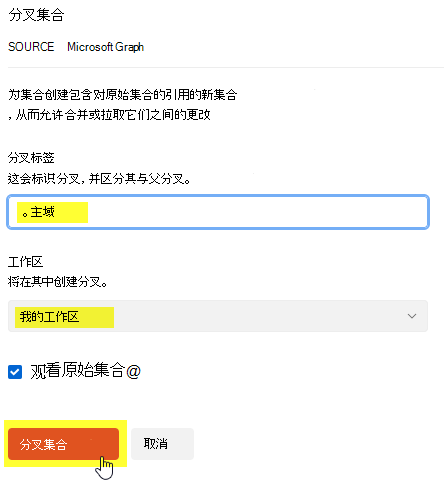
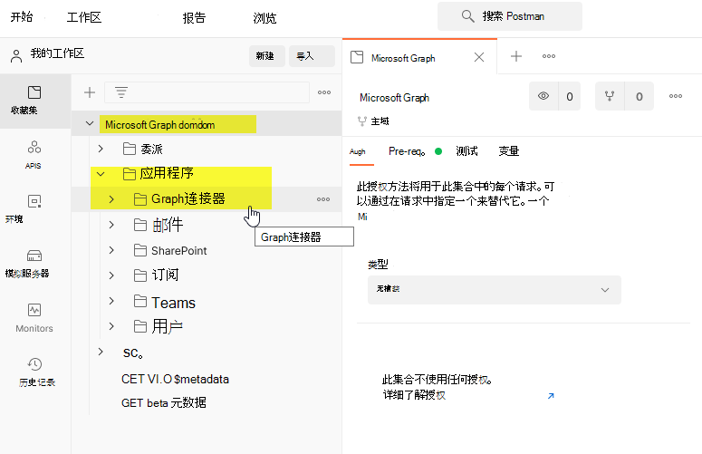
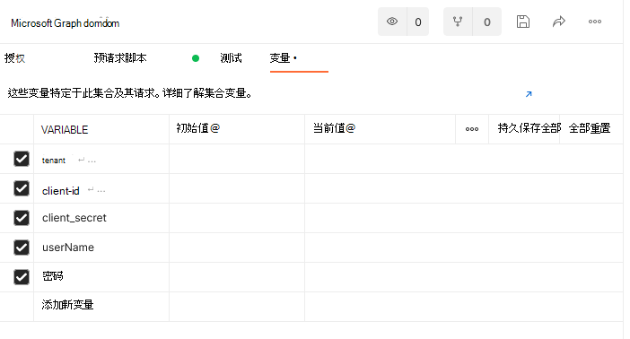
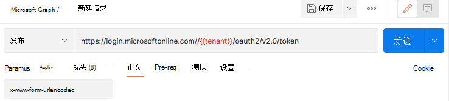
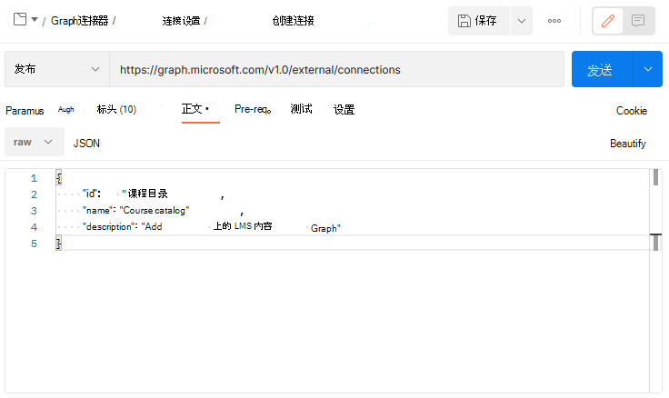

# <a name="use-postman-with-the-microsoft-graph-connectors-api"></a>将 Postman 与 Microsoft Graph 连接器 API 一并使用

本主题介绍如何将 Microsoft Graph 连接器 API 与 Postman 一并使用。

## <a name="prerequisites"></a>先决条件

* Microsoft 帐户或者工作或学校帐户。
* 访问 Microsoft 365 开发人员租户。如果没有，可以注册 [Microsoft 365 开发人员计划](https://developer.microsoft.com/en-us/microsoft-365/dev-program)，以获取免费的开发人员订阅。

## <a name="step-1---fork-the-microsoft-graph-postman-collection"></a>步骤 1 - 导入 Microsoft Graph Postman 集合

要使用 Postman 集合，需要将其导入到 Postman 工作区。在 Web 浏览器执行此操作。

1. 转到 [Postman](https://identity.getpostman.com/signup) 并登录。 如果已有 Postman 帐户， [登录](https://identity.getpostman.com/login)。

2. 登录后，转到以下 URL：`https://www.postman.com/microsoftgraph/workspace/microsoft-graph/collection/455214-085f7047-1bec-4570-9ed0-3a7253be148`然后选择 Microsoft Graph 集合。

3. 选择右边的三个点，然后选择 **创建分支** 选项。


4. 在打开的对话框中，输入标签以标识您的分支。 在"**工作区**"下拉菜单中，选择"**我的工作区**"，然后选择"**分支集合**"。



3. 现在，可以转到"**工作区**  >  ""**我的工作区**"，然后查看创建的分支。 你将在 **应用程序** 下找到 Microsoft Graph连接器文件夹。



## <a name="step-2---download-the-postman-agent-optional---postman-web-browser-only"></a>步骤 2 - 下载Postman代理（可选 - 仅适用于 Postman Web 浏览器）

要在 web 浏览器中使用此 Postman 集合，请下载 [Postman 桌面代理](https://www.postman.com/downloads)。 由于 web 浏览器的限制，无法在未下载此代理的情况下在 web 上使用 Postman。
“每个Microsoft 365租户的最大[连接](/graph/api/resources/externalconnectors-externalconnection)资源数。”

> [!NOTE]
> 如果你正在使用 Postman for Windows 应用，则不需要此代理。 如果打开 Postman for Windows 后，你会在工作区中看到这个分支集合。

## <a name="step-3---create-an-azure-ad-application"></a>第三步 - 创建 Azure AD 应用程序

要在你的开发者租户中使用此集合，请创建一个 Azure AD 应用程序并根据想要调用的请求给予其合适的权限。

1. 转到 [portal.azure.com](https://portal.azure.com/) ， 并使用您的开发人员租户管理员帐户 **登录**。
2. 在 Azure 服务下， 选择 **Azure Active Directory**。
3. 在左侧菜单上，选择 **注册**。
4. 在水平菜单中，单击“**新建注册**”。
5. 将应用程序名称设置为"部件库存"。
6. 将"重定向 URI"设置为 https://oauth.pstmn.io/v1/browser-callback。
7. 选择“**注册**”。
8. 在左侧菜单上，选择 **API 权限**。
9. 在水平菜单中，**Microsoft Graph** > **权限或** > **权限添加**。
10. 开始键入内容 `ExternalItem.ReadWrite.All` 并选中 `ExternalItem.ReadWrite.All`。
11. 选择 **权限**，键入"用户"，然后选中 **权限**。
12. 展开 **用户选项，** 并选中 **`ExternalItem.ReadWrite.All`**。
13. 选择 **添加权限**。
14. 在水平菜单中，选择 **授予管理员对** 许可， **"是**。
15. 在左侧的菜单中，选择 **概述**。 在这里，你可以获取应用程序（客户端）ID 和目录（租户）ID。 这些会在第四步中用到。
16. 在左侧的菜单中， **证书和秘诀**。
17. 选择“**新建客户端机密**”，并输入简短说明，然后选择“**添加**”。 复制新的客户端密码值，将在步骤 4 中需要该密码。

现在，Azure AD应用程序具有代表用户发出呼叫请求`ExternalItem.ReadWrite.All`的权限，并作为`ExternalItem.ReadWrite.All`的应用程序。

## <a name="step-4--configure-authentication"></a>步骤 4：配置身份验证

在 Postman 中设置变量。 此信息用于生成访问令牌。

1. 选择 **"Microsoft Graph"** 选项卡，然后转到 **"变量"** 部分。


2. 在"变量"部分，使用步骤 3 中的信息提供所需信息。

- 从步骤3.15开始，将 **客户端\_id** 的 **当前值** 设置为应用程序（客户端）ID值。
- 从步骤3.17开始，将 **客户端\_密码** 的 **当前值** 设置为客户端密码值。
- 从步骤3.15开始，将 **租户** 的 **当前值** 设置为目录（租户）ID 值。
- 将 **用户名** 的 **当前值** 设置为`admin@xxxxxxx.onmicrosoft.com`
- 将 **密码** 的 **当前值** 设置为租户管理员密码。



3. 选择“**保存**” / “**更新**”。

## <a name="step-5---get-an-authentication-token"></a>步骤 5 - 获取身份验证令牌

由于这是你第一次通过应用程序身份验证流程运行请求，你需要获取访问令牌。 通过以下 POST 请求获取应用访问令牌：




以下示例显示了如何获取共享密码的访问令牌：
```html
POST /{{tenant}}/oauth2/v2.0/token HTTP/1.1 //Line breaks for clarity
Host: login.microsoftonline.com
Content-Type: application/x-www-form-urlencoded

client_id={{client_id}} 
&scope=https%3A%2F%2Fgraph.microsoft.com%2F.default 
&client_secret={{client_secret}} 
&grant_type=client_credentials 
```
以下示例显示了成功响应：
```html
{ 
    "token_type": "Bearer", 
    "expires_in": 3599, 
    "ext_expires_in": 3599, 
    "access_token": "eyJ0eXAiOiJKV1QiLCJu… " 
} 
```

请注意，你正在通过此处 [客户端凭据](/azure/active-directory/develop/v2-oauth2-client-creds-grant-flow) 流。 请确保获取应用访问令牌，而不是用户访问令牌。

## <a name="step-6--create-a-new-connection"></a>步骤 6 - 创建新连接

[连接](/graph/connecting-external-content-manage-connections)是外部数据的逻辑容器，您可以作为一个单元进行管理。 选择连接名称、ID 和说明。 从管理员获取连接到数据源的必要详细信息，并提供一种机制，在设置连接时授权处理内容源。 可使用 [Microsoft Graph SDK](/graph/sdks/sdks-overview) 和API对连接器设置进行编程。 如果要存储凭据，则可以使用Azure Key Vault。

```http
POST /external/connections
```

下面展示了示例请求。

```http
POST https://graph.microsoft.com/beta/external/connections 
Content-type: application/json 

{ 
  "id": "contosotasks", 
  "name": "Contoso Tasks", 
  "description": "Connection to index Contoso task management system" 
} 
```

下面介绍响应示例。

```http
HTTP/1.1 201 Created 
Content-type: application/json 
 
{ 
    "@odata.context": "https://graph.microsoft.com/beta/$metadata#connections/$entity", 
    "id": "contosotasks", 
    "name": "Contoso Tasks", 
    "description": "Connection to index Contoso task management system", 
    "state": null, 
    "configuration": { 
        "authorizedApps": [ 
            "a47b35b7-6271-4e6d-9e27-2450a8b9c6b6" 
        ] 
    } 
} 
```

以下是 **“创建连接”** 部分的屏幕快照。

 

## <a name="step-7---register-connection-schema"></a>步骤 7 - 注册连接架构

连接架构确定各种 Microsoft Graph 体验中如何使用你的内容。 架构是计划添加到连接中的所有属性的简单列表及其属性、标签和别名。 向连接添加项目前，必须注册架构。

```http
POST /external/connections/{id}/schema 
```

下面展示了示例请求。

```http
POST https://graph.microsoft.com/beta/external/connections/contosotasks/schema 
Content-type: application/json 
Prefer: respond-async 

{ 
  "baseType": "microsoft.graph.externalItem", 
  "properties": [ 
    { 
"name": "title", 
      "type": "String", 
      "isSearchable": "true", 
"isQueryable": "true", 
      "isRetrievable": "true", 
      "labels": [ 
        "title" 
      ] 
    }, 
    { 
"aliases": "creator", 
      "name": "createdBy", 
      "type": "String", 
      "isSearchable": "true", 
"isQueryable": "true", 
      "isRetrievable": "false", 
"isRefinable": "false", 
      "labels": [ 
        "createdBy" 
      ] 
    }, 
    { 
"aliases": "editedDate", 
      "name": "lastEditedDate", 
      "type": "DateTime", 
      "isSearchable": "false", 
"isQueryable": "true", 
      "isRetrievable": "true", 
"isRefinable": "true", 
      "labels": [ 
   "lastModifiedDateTime" 
] 
    } 
  ] 
} 
```

下面介绍响应示例。

```http
HTTP/1.1 202 Accepted 
Location: https://graph.microsoft.com/beta/external/connections/contosotasks/operations/616bfeed-666f-4ce0-8cd9-058939010bfc 
```

> [!NOTE]
> 注册连接架构是一个异步操作，因此在连接架构进入“完成”状态之前，请勿将项目进入连接中。要检查连接架构状态，请执行以下请求：
> ```http
> GET /external/connections/contosotasks/operations/616bfeed-666f-4ce0-8cd9-058939010bfc 
> ```

下面是另一个请求示例。
```http
Request 
GET https://graph.microsoft.com/beta/external/connections/operations/616bfeed-666f-4ce0-8cd9-058939010bfc 
```

以及下一个各自答复示例。

```http
HTTP/1.1 200 OK 
Content-type: application/json 

{
    @odata.context":"https://graph.microsoft.com/beta/$metadata#external/connections('coursecatalog')/operations/$entity", 
    "id": "aa9186d2-893c-4361-ca51-431d88fa45d8", 
    "name": "Contoso Tasks", 
    "status": "inprogress", 
    "error": null  
}
```

下面是"**获取连接操作状态**"部分屏幕截图。


将连接架构操作状态从 **“进行中”** 更改为 **“完成”后，** 您可以提取该连接的项目。

在连接状态从 **草稿** 变为 **就绪** 后，可以将项目加入当前连接。

## <a name="step-8---add-external-group-member-optional"></a>步骤 8 - 添加外部团队成员（可选）

如果外部服务使用非 Azure AD ACL，请同步这些权限。  

外部组（以及 Azure Active Directory 用户和组）用于设置 `externalItems` Microsoft Graph 连接的权限。有关详细信息，请参阅 [externalGroups](/graph/api/resources/externalgroup?view=graph-rest-beta&preserve-view=true)。

这是一个请求示例。

```http
POST https://graph.microsoft.com/beta/external/connections/contosotasks/groups/31bea3d537902000/members 
Content-Type: application/json 
 
{ 
  "@odata.type": "#microsoft.graph.externalGroupMember", 
  "id": "1431b9c38ee647f6a", 
  "type": "group", 
  "identitySource": "external" 
} 
```

下面是一个响应示例。

```http
HTTP/1.1 201 Created 
Content-Type: application/json 

{ 
  "@odata.type": "#microsoft.graph.externalGroupMember", 
  "id": "14m1b9c38qe647f6a", 
  "type": "group", 
  "identitySource": "external" 
} 
```

## <a name="step-9---ingest-items"></a>步骤 9 - 正在购买项目

创建连接后，可以添加内容。 数据源中的每个项目必须用唯一项目 id `externalItem` Microsoft Graph 中表示为对象。此 ID 用于创建、更新或删除 Microsoft Graph 中的项目。 可使用数据源中的主键作为源 `itemId` 或来自一个或多个字段的主键。 控件 `externalItem` 三个关键组件：访问控制列表、属性和内容。

如果有二进制文件，则必须进行分析以获得元数据和内容的文本版本。 如果有 PDF 或 BMP 文件等非文本内容，则必须使用对象字符识别将内容转换为文本。  

你负责转换源权限以授予或拒绝。 拒绝优先于授予。

请求示例如下所示。

```http
PUT https://graph.microsoft.com/beta/external/connections/contosohr/items/TSP228082938 
Content-type: application/json 

{ 
  "@odata.type": "microsoft.graph.externalItem", 
  "acl": [ 
    { 
      "type": "user", 
      "value": "e811976d-83df-4cbd-8b9b-5215b18aa874", 
      "accessType": "grant", 
      "identitySource": "azureActiveDirectory" 
    }, 
    { 
      "type": "group", 
      "value": "14m1b9c38qe647f6a", 
      "accessType": "deny", 
      "identitySource": "external" 
    } 
  ], 
  "properties": { 
    "ticketID": "1158", 
    "priority": 1, 
    "title": "Filter design", 
  }, 
  "content": { 
    "value": "Build filtering capability by...", 
    "type": "text" 
  } 
} 
```

下面是成功响应的示例。

```http
HTTP/1.1 200 OK
```

## <a name="error-handling"></a>错误处理

若要详细了解如何解决错误，请参阅 [Microsoft Graph 授权](/graph/resolve-auth-errors)。
