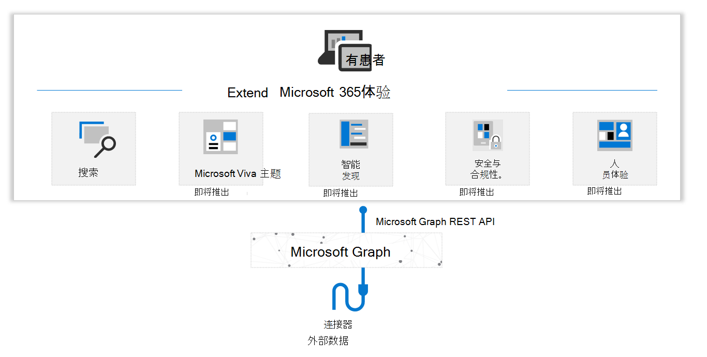

# Microsoft Graph 连接器概述

[Microsoft 365](https://www.microsoft.com/microsoft-365) 是一套完整的智能解决方案，可让用户和组织获得创新生产力体验和丰富见解，从而提高效率、促进业务增长。 Microsoft Graph 是支持这些智能体验的数据平台，Microsoft Graph API 提供此数据和智能的访问权限。

尽管大多数信息工作者在生产力应用程序（如 Microsoft 365）上花费大量时间，但他们还需要一种方法将该环境与企业应用程序以及所使用的其他本地和 SaaS 云软件和服务集成。 示例包括企业资源计划 (ERP) 应用程序、客户资源管理 (CRM) 应用程序、Intranet 应用程序、Wiki、博客和社交网络网站。

Microsoft Graph 连接器提供了一种直观的方式，可将外部服务中的内容引入到 Microsoft Graph 中，使外部数据能够支持 Microsoft 365 智能体验，如 Microsoft 搜索（目前已正式发布）。

现在，使用 Microsoft Graph 连接器，你引入组织的数据可能出现在 Microsoft 搜索结果中。 此功能扩展了 Microsoft 365 生产力应用中可搜索的内容源类型以及 Microsoft 更广泛的数据源。 很快，连接器将支持许多其他 Microsoft 365 智能体验，如 Viva Topics。

下图提供了 Microsoft Graph 连接线高级概述。

<!---Insert image reference here --->
<!---        --->

## 自定义连接器入门

Microsoft 和合作伙伴当前提供的 100 多个连接器可用于连接到热门的 Microsoft 和非 Microsoft 服务。 现有连接器的示例包括 Azure 服务、Box、ServiceNow、SalesForce、Google 服务和 MediaWiki。

若要详细了解现有的 Microsoft Graph 连接器，请访问 [Microsoft Graph 连接器库](https://www.microsoft.com/microsoft-search/connectors/)。

## 生成自定义连接器

尽管现有连接器有助于连接到热门服务，但你可能希望集成连接器库中未提供的服务。 可以使用 Microsoft Graph 连接器 API 生成自定义连接器，以将外部数据引入到组织的 Microsoft 365 体验中。

如果要开始使用，请参阅 [生成第一个自定义 Microsoft Graph 连接器](connecting-external-content-build-quickstart.yml)。

## 后续步骤

* [使用 Microsoft Graph 连接器 API](connecting-external-content-connectors-api-overview.md)
* [将 Postman 与 Microsoft Graph 连接器 API 一并使用](connecting-external-content-connectors-api-postman.md)