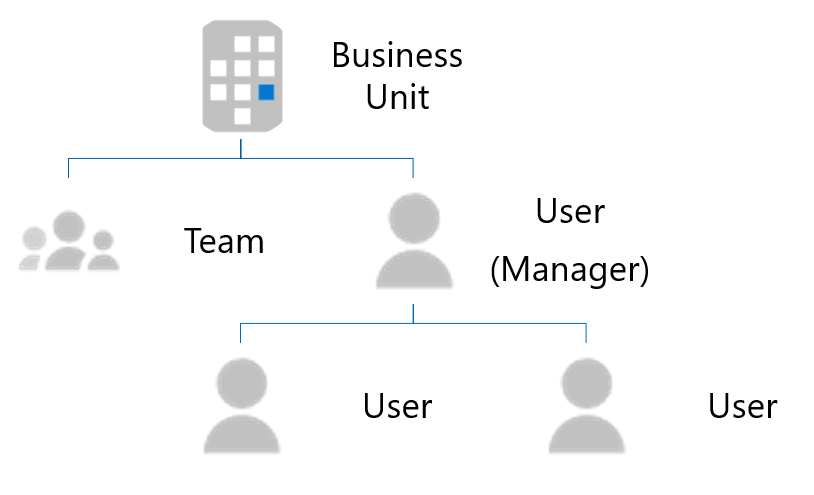

# <a name="use-external-groups-to-manage-permissions-to-microsoft-graph-connector-data-sources"></a>使用外部组管理对 Microsoft Graph连接器数据源的权限

[通过外部](/graph/api/resources/externalgroup?view=graph-rest-beta&preserve-view=true)组，您可以管理查看 Microsoft [](/graph/api/resources/externalitem?view=graph-rest-beta&preserve-view=true) Graph 连接中的外部项以及连接到外部组Azure Active Directory (Azure AD) 的权限。

对于依赖 Azure AD 用户和组的数据源，在创建或更新外部项时，通过将访问控制列表 (ACL) 与 Azure AD 用户和组 ID 关联来设置对外部项的权限。 [](/graph/api/externalconnection-put-items?view=graph-rest-beta&preserve-view=true)

但是，对于使用非 Azure AD 组或类似组构造的数据源（如 Salesforce 配置文件、Dynamics 业务单位、SharePoint 组、ServiceNow 本地组或 Confluence 本地组），建议使用外部 *组*。

## <a name="common-external-group-scenarios"></a>常见的外部组方案

以下是常见的非Azure AD应用程序特定的组示例。

Microsoft Dynamics 365 允许客户使用业务部门和团队构建其 CDM。这些业务部门和团队的成员身份信息不会存储在Azure AD。

下图显示了业务部门和团队的结构。

<!---Using html to adjust the size of the image --->
<br><p align="center"></p>

Salesforce 使用配置文件、角色和权限集进行授权。 这些信息特定于 Salesforce，并且成员资格信息在 Azure AD。

下图显示了 Salesforce 中成员身份信息的结构。

<!---Using html to adjust the size of the image --->
<br><p align="center"></p>

## <a name="using-external-groups-in-your-connection"></a>在连接内使用外部组

若要在连接内使用外部组：

1. 对于每个非Azure AD组，使用组 API 在 Microsoft Graph创建[一个外部组](/en-us/graph/api/resources/group?view=graph-rest-beta&preserve-view=true)。
2. 如有必要，在定义外部项的 ACL 时，请使用外部组。
3. 使外部组的成员身份保持最新并同步。

### <a name="create-external-groups"></a>创建外部组

外部组属于连接。 若要在连接内创建外部组，请：
* 使用 Microsoft Graph 中的组 API，如以下示例所示。

    > [!NOTE]
    > [displayName 和](/graph/api/resources/externalgroup?view=graph-rest-beta&preserve-view=true) **description** 是可选的字段。

    ```http
    POST /external/connections/{connectionId}/groups

    { 
      "id": "contosoEscalations", 
      "displayName": "Contoso Escalations", 
      "description": "Tier-1 escalations within Contoso"
    } 
    ```

* 在 ID 字段中提供 [标识符或名称](/graph/api/resources/externalgroup?view=graph-rest-beta&preserve-view=true) 。 使用此值在后续请求中调用外部组。

    > [!NOTE]
    > ID 字段允许您使用 URL 和 filename-safe Base64 字符集，并且该字符集限制为 128 个字符。

外部组可以包含以下一个或多个：
* 一Azure AD用户。
* 一Azure AD组。
* 另一个外部组，包括嵌套外部组。

创建组后，可以将成员添加到组，如以下示例所示。

```http
POST https://graph.microsoft.com/beta/external/connections/{connectionId}/groups/{groupId}/members

{
  "id": "contosoSupport",
  "type": "group",
  "identitySource": "external"
}
```
```http
POST https://graph.microsoft.com/beta/external/connections/{connectionId}/groups/{groupId}/members

{
  "id": "25f143de-be82-4afb-8a57-e032b9315752",
  "type": "user",
  "identitySource": "azureActiveDirectory"
}
```
```http
POST https://graph.microsoft.com/beta/external/connections/{connectionId}/groups/{groupId}/members

{
  "id": "99a3b3d6-71ee-4d21-b08b-4b6f22e3ae4b",
  "type": "group",
  "identitySource": "azureActiveDirectory"
}
```

### <a name="use-external-groups-in-acl"></a>在 ACL 中使用外部组

定义外部项的 [ACL](connecting-external-content-manage-items.md#access-control-list) 时，可以使用外部组，如以下示例所示。 除了用户Azure AD组外，外部项的访问控制条目中还可以包含外部组。

```http
PUT https://graph.microsoft.com/beta/external/connections/{id}/items/{id} 

Content-type: application/json 
{ 
  "@odata.type": "microsoft.graph.externalItem", 
  "acl": [ 
    { 
      "type": "group", 
      "value": "contosEscalations", 
      "accessType": "grant", 
      "identitySource": "External" 
    }, 
    { 
      "type": "user", 
      "value": "87e9089a-08d5-4d9e-9524-b7bd6be580d5", 
      "accessType": "grant", 
      "identitySource": "azureActiveDirectory" 
    }, 
    { 
      "type": "group", 
      "value": "96fbeb4f-f71c-4405-9f0b-1d6988eda2d2", 
      "accessType": "deny", 
      "identitySource": "azureActiveDirectory" 
    } 
  ], 
  "properties": { 
    "title": "Error in the payment gateway", 
    "priority": 1, 
    "assignee": "john@contoso.com" 
  }, 
  "content": { 
    "value": "<h1>Error in payment gateway</h1><p>Error details...</p>", 
    "type": "html" 
  } 
} 
```

> [!NOTE]
> 即使在创建外部组之前，您也可在 ACL 中使用这些外部组。

### <a name="keep-external-group-memberships-in-sync"></a>保持外部组成员身份同步

在 Microsoft Graph 中保持外部组的成员身份Graph。 当自定义组的成员更改时，请确保更改在满足你需求的时间反映在外部组中。

### <a name="manage-external-groups-and-membership"></a>管理外部组和成员身份

可以使用组 API 管理外部组和组成员身份。 有关详细信息，请参阅 [externalGroup](/graph/api/resources/externalgroup?view=graph-rest-beta&preserve-view=true) 和 [externalGroupMember](/graph/api/resources/externalgroupmember?view=graph-rest-beta&preserve-view=true)。

## <a name="see-also"></a>另请参阅
若要了解有关 Microsoft Graph 连接器 API 的更多信息，请参阅[使用连接器 API。](connecting-external-content-connectors-api-overview.md)
