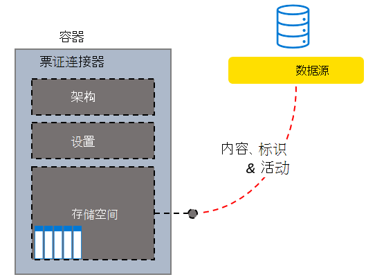

<!---<author of this doc: rsamai>--->

# 创建、更新和删除 Microsoft Graph 中的连接

外部服务与 Microsoft 搜索服务的连接由 Microsoft Graph 中的 [externalConnection](/graph/api/resources/externalconnection?view=graph-rest-beta&preserve-view=true) 资源表示。

Microsoft Graph 连接器平台提供了一种简单的方法，可将外部数据添加到 Microsoft Graph 中。 连接是外部数据的逻辑容器，管理员可将其作为一个单元进行管理。

创建连接后，你可以添加来自任何外部数据源（如本地内容源或外部 SaaS 服务）的内容。 你只能查看和管理你创建的连接，或者显式[已授权](/graph/api/external-post-connections?view=graph-rest-beta&preserve-view=true)进行管理的连接。 搜索管理员可以从现代管理中心查看和管理租户中的所有连接。

<!-- markdownlint-disable MD036 -->

*自定义支持人员系统票证连接器结构示例*

*连接的管理员视图，包括自定义票证连接器*

<!-- markdownlint-enable MD036 -->

可建立任意的连接模型，但为每个连接器实例创建一个连接是最常见的模型。 例如，每次[设置 Microsoft Windows 文件共享连接器](/microsoftsearch/configure-connector)时，都会创建一个新的连接。 你还可以创建一个连接来添加数据源中的所有项目。 例如，创建单一连接，从支持人员系统中的多个团队中添加所有票证和事件。

## 状态与操作

你的连接可以以下列一种状态存在。

| 状态             | 说明                                                                                                                                               |
|-------------------|-----------------------------------------------------------------------------------------------------------------------------------------------------------|
| **Draft**         | 已预配空连接。尚未配置数据源、架构或任何设置。                                                |
| **Ready**         | 该连接配有已注册的架构并已准备好接收。                                                                          |
| **Obsolete**      | 如果已弃用依赖功能（如 API），则会出现这种情况。 删除连接是唯一有效的操作。                           |
| **LimitExceeded** | 如果点击了单个连接的最大限制或所有连接的租户级别配额，则无法添加更多项目，直至退出该状态。 |

下表指定每种状态中的可用操作。

| Operation         | Draft              | Ready              | Obsolete           | LimitExceeded      |
|-------------------|--------------------|--------------------|--------------------|--------------------|
| Create Connection | :x:                | :heavy_check_mark: | :x:                | :heavy_check_mark: |
| Read connection   | :heavy_check_mark: | :heavy_check_mark: | :heavy_check_mark: | :heavy_check_mark: |
| 更新连接 | :heavy_check_mark: | :heavy_check_mark: | :x:                | :heavy_check_mark: |
| 删除连接 | :heavy_check_mark: | :heavy_check_mark: | :heavy_check_mark: | :heavy_check_mark: |
| 创建架构     | :heavy_check_mark: | :x:                | :x:                | :x:                |
| 读取架构       | :x:                | :heavy_check_mark: | :heavy_check_mark: | :heavy_check_mark: |
| 更新架构     | :x:                | :x:                | :x:                | :x:                |
| 删除架构     | :x:                | :x:                | :x:                | :x:                |
| 创建项目       | :x:                | :heavy_check_mark: | :x:                | :x:                |
| 读取项目         | :x:                | :heavy_check_mark: | :heavy_check_mark: | :heavy_check_mark: |
| 更新项目       | :x:                | :heavy_check_mark: | :x:                | :heavy_check_mark: |
| 删除项目       | :x:                | :heavy_check_mark: | :x:                | :heavy_check_mark: |

通过连接，你的应用程序可以为要编入索引的项目[定义架构](/graph/api/externalconnection-post-schema?view=graph-rest-beta&preserve-view=true)，并为服务提供终结点，以便在索引中添加、更新或删除项目。 [创建连接](#create-a-connection)是应用程序将项目添加到搜索索引的第一步。

## 创建连接

应用程序必须先按照以下步骤创建并配置连接，才能将项目添加到搜索索引：

- 使用唯一 ID、显示名称和说明[创建连接](/graph/api/external-post-connections?view=graph-rest-beta&preserve-view=true)。
- [注册架构](/graph/api/externalconnection-post-schema?view=graph-rest-beta&preserve-view=true)，以定义索引中将包含的字段。

> [!NOTE]
> 有关更新现有连接的架构的信息，请参阅[架构更新功能](/graph/connecting-external-content-manage-schema#schema-update-capabilities)。

## 更新连接

可通过[更新连接](/graph/api/externalconnection-update?view=graph-rest-beta&preserve-view=true)来更改现有连接的显示名称或说明。

## 删除连接

可[删除连接](/graph/api/externalconnection-delete?view=graph-rest-beta&preserve-view=true)，并删除通过该连接进行索引的所有项目。

## 后续步骤

- [注册连接架构](/graph/connecting-external-content-manage-schema.md)
- [查看图形连接器 API 参考](/graph/api/resources/indexing-api-overview?view=graph-rest-beta&preserve-view=true)
- [Microsoft Graph 连接器概述](/microsoftsearch/connectors-overview)
- 从 GitHub 下载[示例搜索连接器](https://github.com/microsoftgraph/msgraph-search-connector-sample)
