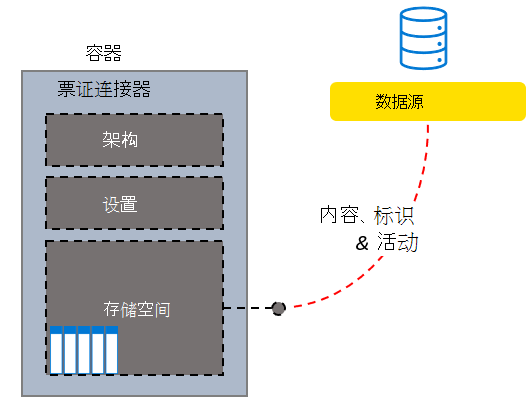

<!---<author of this doc: rsamai>--->

# 创建、更新和删除 Microsoft Graph 中的连接

外部服务与 Microsoft 搜索服务的连接由 Microsoft Graph 中的 [externalConnection](/graph/api/resources/externalconnectors-externalconnection) 资源表示。

Microsoft Graph 连接器平台提供了将外部数据添加到Microsoft Graph 的直观方法。 连接是外部数据的逻辑容器，管理员可将其作为一个单元进行管理。

创建连接后，可以添加来自任何外部数据源(例如本地内容源或外部 SaaS 服务)的内容。 只能查看并管理 [已创建](/graph/api/externalconnectors-external-post-connections) 或已显式授权管理的连接。 搜索管理员可以从现代管理中心查看和管理租户中的所有连接。

<!-- markdownlint-disable MD036 -->

*示例自定义帮助台系统票证连接器结构。*

*连接的管理员视图，包括自定义票证连接器。*

<!-- markdownlint-enable MD036 -->

可以根据需要对连接进行建模，但为连接器的每个实例创建连接是最常见的模型。 例如，每次 [设置 Microsoft Windows 文件共享连接器](/en-us/microsoftsearch/configure-connector) 时，都会新建连接。 你还可以创建一个连接来添加数据源中的所有项目。 例如，可以创建单个连接，从而从帮助台系统跨多个团队添加所有票证和事件。

## 状态与操作

你的连接可以以下列一种状态存在。

| 状态             | 说明                |
|-------------------|----------------------------|
| **Draft**         | 已预配空连接。尚未配置数据源、架构或任何设置。 |
| **Ready**         | 该连接配有已注册的架构并已准备好接收。 |
| **Obsolete**      | 如果已弃用依赖功能（如 API），则会出现这种情况。 删除连接是唯一有效的操作。 |
| **LimitExceeded** | 如果达到所有连接内单个连接或租户级别配额的最大限制，则在退出状态之前无法添加更多项。 |

下表指定每种状态中的可用操作。

| Operation         | Draft              | Ready              | Obsolete           | LimitExceeded      |
|-------------------|--------------------|--------------------|--------------------|--------------------|
| Create Connection | :x:                | :heavy_check_mark: | :x:                | :heavy_check_mark: |
| Read connection   | :heavy_check_mark: | :heavy_check_mark: | :heavy_check_mark: | :heavy_check_mark: |
| 更新连接 | :heavy_check_mark: | :heavy_check_mark: | :x:                | :heavy_check_mark: |
| 删除连接 | :heavy_check_mark: | :heavy_check_mark: | :heavy_check_mark: | :heavy_check_mark: |
| 创建架构     | :heavy_check_mark: | :x:                | :x:                | :x:                |
| 读取架构       | :x:                | :heavy_check_mark: | :heavy_check_mark: | :heavy_check_mark: |
| 更新架构     | :x:                | :x:                | :x:                | :x:                |
| 删除架构     | :x:                | :x:                | :x:                | :x:                |
| 创建项目       | :x:                | :heavy_check_mark: | :x:                | :x:                |
| 读取项目         | :x:                | :heavy_check_mark: | :heavy_check_mark: | :heavy_check_mark: |
| 更新项目       | :x:                | :heavy_check_mark: | :x:                | :heavy_check_mark: |
| 删除项目       | :x:                | :heavy_check_mark: | :x:                | :heavy_check_mark: |

通过连接，应用程序可以为将编制索引的项 [定义架构](/graph/api/externalconnectors-externalconnection-post-schema)，并为服务提供终结点，从而从索引添加、更新或删除项。 

应用程序将项添加到搜索索引的第一步是创建连接。

## 创建连接

应用程序必须先创建并配置连接，然后才可将项添加到搜索索引:

1. 使用唯一 ID、显示名称和说明[创建连接](/graph/api/externalconnectors-external-post-connections)。
2. [注册架构](/graph/api/externalconnectors-externalconnection-post-schema)，以定义索引中将包含的字段。

> [!NOTE]
> 有关更新现有连接的架构的信息，请参阅[架构更新功能](/graph/connecting-external-content-manage-schema#schema-update-capabilities)。

## 更新连接

要更改现有连接的显示名称或说明，可以 [更新连接](/graph/api/externalconnectors-externalconnection-update)。

## 删除连接

要删除所有已通过连接编制索引的项，可以 [删除连接](/graph/api/externalconnectors-externalconnection-delete)。

## 后续步骤

- [注册连接架构](connecting-external-content-manage-schema.md)
- [查看 Microsoft Graph 连接器 API 参考](/graph/api/resources/indexing-api-overview)
- [从 GitHub 下载示例搜索连接器](https://github.com/microsoftgraph/msgraph-search-connector-sample)
