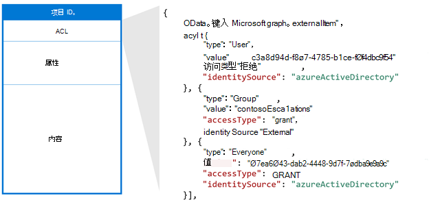
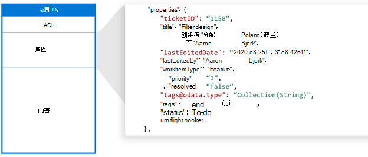
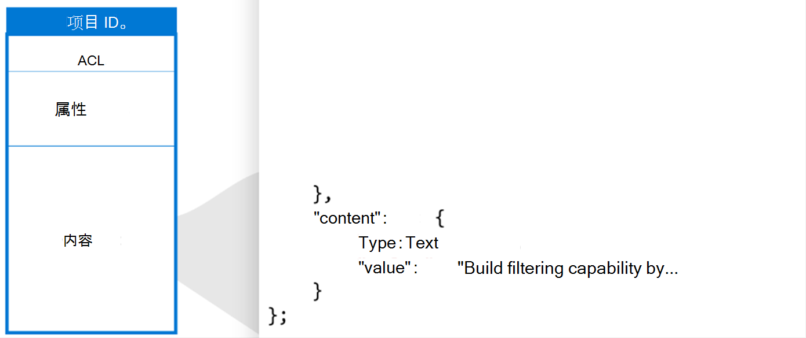

<!---<author of this doc: rsamai>--->

# <a name="create-update-and-delete-items-added-by-your-application-via-microsoft-graph-connectors"></a>通过 Microsoft Graph 连接器创建、更新和删除应用程序添加的项目

Microsoft Graph 连接器提供了一种直观的方法，可将外部数据添加到 Microsoft Graph 中。 应用程序添加到 Microsoft 搜索服务的项用 Microsoft Graph 中的 [externalItem](/graph/api/resources/externalconnectors-externalitem) 资源表示。

[创建连接](/graph/api/externalconnectors-external-post-connections) 后，可以添加内容。 数据源中的每个项目都必须用唯一的项目 id 表示为 Microsoft Graph 中的 **externalItem**。 此 ID 用于在 Microsoft Graph 中创建、更新或删除项目。 可以将数据源中的主键用作项目 ID，或者从一个或多个字段派生项目 ID。 

## <a name="key-components"></a>主要组件

**externalItem** 有三个关键组成部分：访问控制列表、属性和内容。

### <a name="access-control-list"></a>访问控制列表

访问控制列表 (ACL) 用于指定是否授予或拒绝给定角色访问权限，以在 Microsoft 体验中查看项目。 ACL 是一组访问控制条目，每个条目表示一个 Azure Active Directory (Azure AD) 用户或组。 第三个访问控制条目类型 `Everyone` 表示租户中的所有用户。



*访问控制列表示例。*

**accessType** 值 `deny` 优先于 `grant`。例如，在前面显示的项中，虽然向 `Everyone` 授予了访问权限，但拒绝特定用户的访问，而该用户的有效访问权限为 `deny`。

如果数据源具有用于设置项目权限的非 Azure Active Directory 组（例如技术支持系统中的团队），则可以通过使用组同步 API 复制 `allow` 或 `deny` 权限来在 Microsoft Graph 中创建外部组。 避免将外部组的成员身份直接展开为各项的 ACL，因为每个组成员资格都可能导致大量项目更新。

外部组可以由另一个外部组、Azure AD 用户和 Azure AD 组来组成。 如果具有非 Azure AD 用户，则必须将其转换为 ACL 中的 Azure AD 用户。

### <a name="properties"></a>属性

属性组件用于添加在 Microsoft Graph 体验中有用的项元数据。 在向该连接添加项目并将 **数据类型** 转换为 [支持的数据类型](/graph/api/resources/externalconnectors-property)前，必须 [注册该架构](connecting-external-content-manage-schema.md)。



*属性组件示例。*

### <a name="content"></a>内容

内容组件用于添加需要进行全文检索的大量项目。 示例包括票证说明、文件正文中的已分析文本或者 wiki 网页正文。

内容是影响 Microsoft 体验[相关性](connecting-external-content-manage-schema.md#relevance)的关键字段之一。 支持内容类型 `text` 和 `html`。 如果数据源具有其他内容类型，如二进制文件、视频或图像，则可以在将它们添加到 Microsoft Graph 之前将其解析为文本。 例如，可以使用光学字符识别从图像中提取可搜索文本。



*内容组件示例。*

无法直接将内容添加到搜索结果模板中，但你可以使用生成的结果段，该片段是内容中的相关节的动态生成的预览。


*搜索结果模板。*

数据源中的内容发生更改时，必须将其与连接项同步。 可更新整个项目或更新它的一个或多个组件。 将内容添加到 Microsoft Graph 后，可以在设置 [垂直搜索](/en-us/microsoftsearch/manage-verticals) 和 [结果类型](/en-us/microsoftsearch/manage-result-types) 后通过 Microsoft 搜索体验，或通过使用 [Microsoft Graph 搜索 API](/graph/api/resources/search-api-overview) 来搜索该内容。

## <a name="add-an-item"></a>添加项

要向索引添加项，请 [创建 externalItem](/graph/api/externalconnectors-externalconnection-put-items)。 创建项目时，可在 URL 中分配唯一的标识符。

例如，应用程序可能通过使用票证编号来索引技术支持票证。 如果票证具有票证编号 `SR00145`，则请求外观可能如下所示：

```http
PUT /external/connections/contosohelpdesk/items/SR00145
Content-Type: application/json

{
  "title": "WiFi outage in Conference Room A",
  "status": "New",
  "assignee": "meganb@contoso.com"
}
```

> [!NOTE]
> 管理员必须先为相应的连接 [自定义搜索结果页](/en-us/microsoftsearch/configure-connector#next-steps-customize-the-search-results-page)，然后才能在 Microsoft 搜索 UI 中找到索引项。

## <a name="update-an-item"></a>更新项

当项在外部服务中更新（重新分配支持人员票证或更新产品说明）时，可以使用创建项时分配给项的唯一标识符，通过 [更新 externalItem](/graph/api/externalconnectors-externalitem-update) 更新它在索引中的条目。

```http
PATCH /external/connections/contosohelpdesk/items/SR00145
Content-Type: application/json

{
  "assignee": "alexw@contoso.com"
}
```

## <a name="delete-an-item"></a>删除项

要从索引中删除项，可以使用创建项时分配给项的唯一标识符来 [删除 externalItem](/graph/api/externalconnectors-externalitem-delete)。

```http
DELETE /external/connections/contosohelpdesk/items/SR00145
```

## <a name="next-steps"></a>后续步骤

- [使用外部组管理权限](connecting-external-content-external-groups.md)
- [使用 Microsoft 搜索 API 的查询](search-concept-overview.md#why-use-the-microsoft-search-api)
- [查看 Microsoft Graph 连接器 API 参考](/graph/api/resources/indexing-api-overview)
- [搜索自定义类型 (externalItem)](search-concept-custom-types.md)
- [从 GitHub 下载示例搜索连接器](https://github.com/microsoftgraph/msgraph-search-connector-sample)
