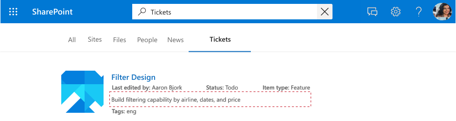

<!---<author of this doc: rsamai>--->

# <a name="create-update-and-delete-items-added-by-your-application-via-microsoft-graph-connectors"></a><span data-ttu-id="aa0ef-103">通过 Microsoft Graph 连接器创建、更新和删除应用程序添加的项目</span><span class="sxs-lookup"><span data-stu-id="aa0ef-103">Create, update, and delete items added by your application via Microsoft Graph connectors</span></span>

<span data-ttu-id="aa0ef-104">Microsoft Graph 连接器平台提供了一种简单的方法，可将外部数据添加到 Microsoft Graph 中。</span><span class="sxs-lookup"><span data-stu-id="aa0ef-104">Microsoft Graph connectors offer a simple way to bring external data into Microsoft Graph.</span></span> <span data-ttu-id="aa0ef-105">应用程序添加到 Microsoft 搜索服务的项用 Microsoft Graph 中的 [externalItem](/graph/api/resources/externalitem?view=graph-rest-beta&preserve-view=true) 资源表示。</span><span class="sxs-lookup"><span data-stu-id="aa0ef-105">Items added by your application to the Microsoft Search service are represented by the [externalItem](/graph/api/resources/externalitem?view=graph-rest-beta&preserve-view=true) resource in Microsoft Graph.</span></span>

<span data-ttu-id="aa0ef-106">[创建连接](/graph/api/external-post-connections?view=graph-rest-beta&preserve-view=true)后，可以添加内容。</span><span class="sxs-lookup"><span data-stu-id="aa0ef-106">After you have [created a connection](/graph/api/external-post-connections?view=graph-rest-beta&preserve-view=true), you can add your content.</span></span> <span data-ttu-id="aa0ef-107">数据源中的每个项目都必须用唯一的项目 id 表示为 Microsoft Graph 中的 [externalItem](/graph/api/resources/externalitem?view=graph-rest-beta&preserve-view=true)。</span><span class="sxs-lookup"><span data-stu-id="aa0ef-107">Each item from your data source must be represented as an [externalItem](/graph/api/resources/externalitem?view=graph-rest-beta&preserve-view=true) in Microsoft Graph with a unique item ID.</span></span> <span data-ttu-id="aa0ef-108">此 ID 用于在 Microsoft Graph 中创建、更新或删除项目。</span><span class="sxs-lookup"><span data-stu-id="aa0ef-108">This ID is used to create, update, or delete the item from Microsoft Graph.</span></span> <span data-ttu-id="aa0ef-109">你可以将数据源中的主键用作 itemId，或者从一个或多个字段派生。</span><span class="sxs-lookup"><span data-stu-id="aa0ef-109">You can use the primary key from your data source as the itemId or derive it from one or more fields.</span></span> <span data-ttu-id="aa0ef-110">**externalItem** 有三个关键组成部分：访问控制列表、属性和内容。</span><span class="sxs-lookup"><span data-stu-id="aa0ef-110">An **externalItem** has three key components: access control list, properties, and content.</span></span>

## <a name="access-control-list"></a><span data-ttu-id="aa0ef-111">访问控制列表</span><span class="sxs-lookup"><span data-stu-id="aa0ef-111">Access control list</span></span>

<span data-ttu-id="aa0ef-112">访问控制列表用于指定是否授予或拒绝给定角色访问 Microsoft 体验中的查看项目的权限。</span><span class="sxs-lookup"><span data-stu-id="aa0ef-112">The access control list is used to specify whether the given roles are granted or denied access to view items in Microsoft experiences.</span></span> <span data-ttu-id="aa0ef-113">它是一组访问控制项，每个项表示一个 Azure Active Directory 用户或组。</span><span class="sxs-lookup"><span data-stu-id="aa0ef-113">It is an array of access control entries, each representing an Azure Active Directory user or group.</span></span> <span data-ttu-id="aa0ef-114">第三个访问控制条目类型 `Everyone` ，表示租户中的所有用户。</span><span class="sxs-lookup"><span data-stu-id="aa0ef-114">A third access control entry type `Everyone` that represents all the users in the tenant.</span></span>


<span data-ttu-id="aa0ef-116">**accessType** 值 `deny` 优先于 `grant`。</span><span class="sxs-lookup"><span data-stu-id="aa0ef-116">The **accessType** value `deny` takes precedence over `grant`.</span></span> <span data-ttu-id="aa0ef-117">例如，在以前显示的项目中，如果授予 `Everyone` 访问权限，并且拒绝了特定用户的访问权限，则此用户的有效权限将被 `deny`。</span><span class="sxs-lookup"><span data-stu-id="aa0ef-117">For example, in the item shown earlier, while `Everyone` is granted access and a specific user is denied access, the effective permission for this user is `deny`.</span></span>

<span data-ttu-id="aa0ef-118">如果数据源具有非 Azure Active Directory 组（例如支持人员系统中的团队），并且用于设置项目的权限，则可以使用组同步 API 复制 `allow` 或 `deny` 权限，在 Microsoft Graph 中创建外部组。</span><span class="sxs-lookup"><span data-stu-id="aa0ef-118">If your data source has non-Azure Active Directory groups, such as teams within your helpdesk system, used to set permissions for the item, you can create external groups in Microsoft Graph using the group sync APIs to replicate the `allow` or `deny` permissions.</span></span> <span data-ttu-id="aa0ef-119">避免将外部组的成员身份直接展开为各项的访问控制列表，，因为每个组的成员资格都可能导致大量项目更新。</span><span class="sxs-lookup"><span data-stu-id="aa0ef-119">Avoid expanding the membership of your external groups directly into the access control lists of individual items, because each group membership can lead to a high volume of item updates.</span></span>

<span data-ttu-id="aa0ef-120">外部组可以由另一个外部组、Azure Active Directory 用户和 Azure Active Directory 组组成。</span><span class="sxs-lookup"><span data-stu-id="aa0ef-120">External groups can consist of another external group, Azure Active Directory users, and Azure Active Directory groups.</span></span> <span data-ttu-id="aa0ef-121">如果你有非 Azure Active Directory 用户，则必须在访问控制列表中将其转换为 Azure Active Directory 用户。</span><span class="sxs-lookup"><span data-stu-id="aa0ef-121">If you have non-Azure Active Directory users, you must translate them to Azure Active Directory users in your access control list.</span></span>

## <a name="properties"></a><span data-ttu-id="aa0ef-122">属性</span><span class="sxs-lookup"><span data-stu-id="aa0ef-122">Properties</span></span>

<span data-ttu-id="aa0ef-123">属性组件用于添加在 Microsoft Graph 体验中有用的项元数据。</span><span class="sxs-lookup"><span data-stu-id="aa0ef-123">The properties component is used to add item metadata that is useful in Microsoft Graph experiences.</span></span> <span data-ttu-id="aa0ef-124">在向该连接添加项目并将 **数据类型** 转换为[支持的数据类型](/graph/api/resources/property?view=graph-rest-beta&preserve-view=true)前，必须[注册该架构](./connecting-external-content-manage-schema.md)。</span><span class="sxs-lookup"><span data-stu-id="aa0ef-124">You must [register the schema](./connecting-external-content-manage-schema.md) for the connection before adding items into it and convert **datatypes** into [supported datatypes](/graph/api/resources/property?view=graph-rest-beta&preserve-view=true).</span></span>


## <a name="content"></a><span data-ttu-id="aa0ef-126">内容</span><span class="sxs-lookup"><span data-stu-id="aa0ef-126">Content</span></span>

<span data-ttu-id="aa0ef-127">内容组件用于添加需要进行全文检索的大量项目。</span><span class="sxs-lookup"><span data-stu-id="aa0ef-127">The content component is used to add the bulk of the item that needs to be full text indexed.</span></span> <span data-ttu-id="aa0ef-128">示例包括票证说明、文件正文中的已分析文本或者 wiki 网页正文。</span><span class="sxs-lookup"><span data-stu-id="aa0ef-128">Examples include ticket description, parsed text from a file body, or a wiki page body.</span></span>

<span data-ttu-id="aa0ef-129">内容是影响 Microsoft 体验[相关性](./connecting-external-content-manage-schema.md#relevance)的关键字段之一。</span><span class="sxs-lookup"><span data-stu-id="aa0ef-129">Content is one of the key fields influencing [relevance](./connecting-external-content-manage-schema.md#relevance) across Microsoft experiences.</span></span> <span data-ttu-id="aa0ef-130">支持内容类型 `text` 和 `HTML`。</span><span class="sxs-lookup"><span data-stu-id="aa0ef-130">The content types `text` and `HTML` are supported.</span></span> <span data-ttu-id="aa0ef-131">如果数据源有二进制文件，则可以先将它们分析为文本，然后再将其添加到 Microsoft Graph。</span><span class="sxs-lookup"><span data-stu-id="aa0ef-131">If your data source has binary files, you can parse them to text before adding them to Microsoft Graph.</span></span>


<span data-ttu-id="aa0ef-133">无法直接将内容添加到搜索结果模板中，但你可以使用生成的结果段，该片段是内容中的相关节的动态生成的预览。</span><span class="sxs-lookup"><span data-stu-id="aa0ef-133">Content cannot be directly added into a search result template, but you can use a generated result snippet, which is a dynamically generated preview of the relevant sections within content.</span></span>



<span data-ttu-id="aa0ef-135">数据源中的内容发生更改时，必须将其与连接项同步。</span><span class="sxs-lookup"><span data-stu-id="aa0ef-135">When content in your data source changes, you must sync it with your connection items.</span></span> <span data-ttu-id="aa0ef-136">可更新整个项目或更新它的一个或多个组件。</span><span class="sxs-lookup"><span data-stu-id="aa0ef-136">You can either update the entire item or update one or more of its components.</span></span> <span data-ttu-id="aa0ef-137">将内容添加到 Microsoft Graph 后，你可以在设置[纵向和结果类型](/MicrosoftSearch/customize-search-page)或使用 [Microsoft Graph 搜索 API](/graph/api/resources/search-api-overview?view=graph-rest-beta&preserve-view=true) 后，通过 Microsoft 搜索体验搜索该内容。</span><span class="sxs-lookup"><span data-stu-id="aa0ef-137">Once your content has been added to Microsoft Graph, you can search for it through the Microsoft Search experience after setting up [verticals and result types](/MicrosoftSearch/customize-search-page) or using the [Microsoft Graph Search API](/graph/api/resources/search-api-overview?view=graph-rest-beta&preserve-view=true).</span></span>

## <a name="add-an-item"></a><span data-ttu-id="aa0ef-138">添加项</span><span class="sxs-lookup"><span data-stu-id="aa0ef-138">Add an item</span></span>

<span data-ttu-id="aa0ef-139">可通过[创建 externalItem](/graph/api/externalconnection-put-items?view=graph-rest-beta&preserve-view=true)，将项添加到索引。</span><span class="sxs-lookup"><span data-stu-id="aa0ef-139">You can add an item to the index by [creating an externalItem](/graph/api/externalconnection-put-items?view=graph-rest-beta&preserve-view=true).</span></span> <span data-ttu-id="aa0ef-140">创建项目时，可在 URL 中分配唯一的标识符。</span><span class="sxs-lookup"><span data-stu-id="aa0ef-140">When you create an item, you assign a unique identifier in the URL.</span></span>

<span data-ttu-id="aa0ef-141">例如，你的应用程序可能会使用票证编号来索引支持人员票证。</span><span class="sxs-lookup"><span data-stu-id="aa0ef-141">For example, your application may index helpdesk tickets using the ticket number.</span></span> <span data-ttu-id="aa0ef-142">如果票证具有 `SR00145` 票证编号，请求可能如下所示。</span><span class="sxs-lookup"><span data-stu-id="aa0ef-142">If a ticket has the ticket number `SR00145`, the request may look like the following.</span></span>

```http
PUT /external/connections/contosohelpdesk/items/SR00145
Content-Type: application/json

{
  "title": "WiFi outage in Conference Room A",
  "status": "New",
  "assignee": "meganb@contoso.com"
}
```

> <span data-ttu-id="aa0ef-143">![注意] 管理员必须先[自定义相应连接的搜索结果页](/MicrosoftSearch/configure-connector#next-steps-customize-the-search-results-page)，然后索引项才能在 Microsoft 搜索 UI 中找到。</span><span class="sxs-lookup"><span data-stu-id="aa0ef-143">![NOTE] Before indexed items can be found in the Microsoft Search UI, an administrator must [customize the search results page](/MicrosoftSearch/configure-connector#next-steps-customize-the-search-results-page) for the corresponding connection.</span></span>

## <a name="update-an-item"></a><span data-ttu-id="aa0ef-144">更新项</span><span class="sxs-lookup"><span data-stu-id="aa0ef-144">Update an item</span></span>

<span data-ttu-id="aa0ef-145">当项在外部服务中更新（重新分配支持人员票证或更新产品说明）时，可以使用创建项时分配给项的唯一标识符，通过[更新 externalItem](/graph/api/externalitem-update?view=graph-rest-beta&preserve-view=true) 更新项在索引中的条目。</span><span class="sxs-lookup"><span data-stu-id="aa0ef-145">When an item is updated in the external service (helpdesk ticket is reassigned, or a product description is updated), you can update its entry in the index by [updating the externalItem](/graph/api/externalitem-update?view=graph-rest-beta&preserve-view=true), using the unique identifier assigned to the item when you created it.</span></span>

```http
PATCH /external/connections/contosohelpdesk/items/SR00145
Content-Type: application/json

{
  "assignee": "alexw@contoso.com"
}
```

## <a name="delete-an-item"></a><span data-ttu-id="aa0ef-146">删除项</span><span class="sxs-lookup"><span data-stu-id="aa0ef-146">Delete an item</span></span>

<span data-ttu-id="aa0ef-147">可以使用创建项时分配给项的唯一标识符，通过[删除 externalItem](/graph/api/externalitem-delete?view=graph-rest-beta&preserve-view=true) 从索引中删除项。</span><span class="sxs-lookup"><span data-stu-id="aa0ef-147">You can remove items from the index by [deleting the externalItem](/graph/api/externalitem-delete?view=graph-rest-beta&preserve-view=true), using the unique identifier assigned to the item when you created it.</span></span>

```http
DELETE /external/connections/contosohelpdesk/items/SR00145
```

## <a name="see-also"></a><span data-ttu-id="aa0ef-148">另请参阅</span><span class="sxs-lookup"><span data-stu-id="aa0ef-148">See also</span></span>

- [<span data-ttu-id="aa0ef-149">使用 Microsoft 搜索 API 的查询</span><span class="sxs-lookup"><span data-stu-id="aa0ef-149">Query using the Microsoft Search API</span></span>](search-concept-overview.md#why-use-the-microsoft-search-api)
- [<span data-ttu-id="aa0ef-150">查看索引 API 参考</span><span class="sxs-lookup"><span data-stu-id="aa0ef-150">Review the Indexing API reference</span></span>](/graph/api/resources/indexing-api-overview?view=graph-rest-beta&preserve-view=true)
- [<span data-ttu-id="aa0ef-151">自定义 Microsoft 搜索结果页</span><span class="sxs-lookup"><span data-stu-id="aa0ef-151">Customize Microsoft Search results page</span></span>](/MicrosoftSearch/customize-search-page)
- [<span data-ttu-id="aa0ef-152">搜索自定义类型 (externalItem)</span><span class="sxs-lookup"><span data-stu-id="aa0ef-152">Search custom types (externalItem)</span></span>](search-concept-custom-types.md)
- <span data-ttu-id="aa0ef-153">从 GitHub 下载[示例搜索连接器](https://github.com/microsoftgraph/msgraph-search-connector-sample)</span><span class="sxs-lookup"><span data-stu-id="aa0ef-153">Download the [sample search connector](https://github.com/microsoftgraph/msgraph-search-connector-sample) from GitHub</span></span>