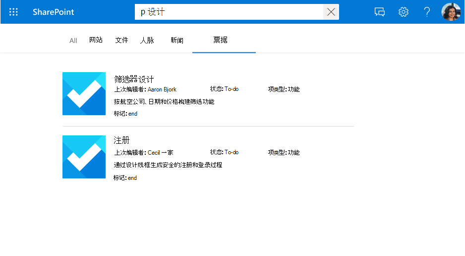

<!---<author of this doc: rsamai>--->

# 注册并更新 Microsoft Graph 连接的架构

连接 [架构](/graph/api/resources/externalconnectors-schema?view=graph-rest-1.0&preserve-view=true) 确定如何在各种 Microsoft Graph 体验中使用你的内容。 架构是计划与其特性、标签和别名一起添加到连接中的所有属性的简单列表。 向连接添加项目前，必须注册架构。

## 示例架构

下表提供了工作票据系统连接器可能的架构示例。

| 属性       | 类型             | 可搜索         | 可查询          | 可检索        | 可精简          | 标签               | 别名    |
|----------------|------------------|--------------------|--------------------|--------------------|--------------------|----------------------|------------|
| ticketId       | String           |                    |                    |                    |                    |                      | ID         |
| title          | String           | :heavy_check_mark: | :heavy_check_mark: | :heavy_check_mark: |                    | title                |            |
| createdBy      | String           | :heavy_check_mark: | :heavy_check_mark: |                    |                    | createdBy            | Creator    |
| assignedTo     | String           | :heavy_check_mark: | :heavy_check_mark: |                    |                    |                      |            |
| lastEditedDate | 日期时间         |                    | :heavy_check_mark: | :heavy_check_mark: | :heavy_check_mark: | lastModifiedDateTime | editedDate |
| lastEditedBy   | String           | :heavy_check_mark: | :heavy_check_mark: | :heavy_check_mark: |                    | lastModifiedBy       | 已编辑     |
| workItemType   | String           |                    | :heavy_check_mark: | :heavy_check_mark: |                    |                      | ticketType |
| priority       | Int64            | :heavy_check_mark: |                    |                    |                    |                      |            |
| 标记           | StringCollection |                    | :heavy_check_mark: | :heavy_check_mark: | :heavy_check_mark: |                      |            |
| 状态         | String           |                    | :heavy_check_mark: | :heavy_check_mark: |                    |                      |            |
| url            | String           |                    |                    |                    |                    | url                  |            |
| 已解决       | Boolean          |                    | :heavy_check_mark: | :heavy_check_mark: |                    |                      |            |

## Property 属性

### 可搜索

如果属性可搜索，则将其值添加到全文检索。 当用户执行搜索时，如果其中一个可搜索字段或其[内容](connecting-external-content-manage-items.md#content)中有搜索命中率，则会返回结果。

<!-- markdownlint-disable MD036 -->

*搜索“设计”显示出针对属性(`title`)和内容的点击结果。*

### 可查询

如果属性可查询，则可以使用知识查询语言 (KQL) 对其进行查询。 KQL 由一个或多个自由文本关键词（单词或短语）或属性限制组成。 属性名称必须包含在查询中：在查询本身中指定或以编程方式包含在查询中。 可将前缀与通配符 (*) 搭配使用。

> [!NOTE]
> 不支持后缀匹配。

显示匹配此前缀的结果的 *“search ba*”搜索\*。*

*“tags:design”搜索，将结果范围缩小到 `tags` 属性中具有“设计”的项。*

### 可检索

如果属性可检索，则其值可以在搜索结果中返回。 希望将任何属性添加到显示模板，或者从查询中返回，并且在搜索结果中相关，则该属性必须是可检索的。 将大型属性或过多属性标记为可检索将增加搜索延迟。 是可选择的并选择相关属性。

*一组呈现为结果的可检索属性(`title` 和 `lastEditedBy`)。*

### 可精简

如果属性是可精简的，则管理员可将其配置为 Microsoft 搜索结果页面中的自定义筛选器。`refinable` 属性无法为 `searchable`。

*按可精简属性 `tags` 精简结果。*

## 语义标签

语义标签是 Microsoft 发布的已知标记，可以针对架构中的属性添加该标签。 添加语义标签有助于各种 Microsoft 产品了解属性并提供更好的体验。

语义标签提供了一种独立于域的方法，用于将不同内容域中的属性分配给一组已知类。 它们在许多不同的内容体验中查找应用程序，并为任务提供自动化支持，例如：

* 异构体验中的数据集成
* 生成常识图(例如，Viva Topics)
* 用户体验的默认模板

可以在 **分配属性标签** 页面上将语义标签分配给源属性。 标签可提供语义含义，并允许将连接器数据集成到 Microsoft 365 体验中。  

| 标签                 | 说明                                                                               |
|---------------------- |------------------------------------------------------------------------------------------ |
| title                 | 要在搜索和其他体验中显示的项的标题。                |
| url                   | 数据源中项的目标 URL。                                            |
| createdBy             | 在数据源中创建项目的人员姓名。                           |
| lastModifiedBy        | 最近在数据源中编辑该项目的人员姓名。              |
| authors               | 所有在数据源中参与/协作处理该项的人员的姓名。 |
| createdDateTime       | 在数据源中创建该项的日期和时间。                           |
| lastModifiedDateTime  | 上次在数据源中修改该项的日期和时间。                     |
| fileName              | 如果是文件，则为数据源中文件的名称。                               |
| FileExtension         | 如果是文件，则为数据源中该文件的扩展名。                          |
| iconUrl               | 图标 URL。                                                                       |
| containerName         | 容器名称。                                                                |
| containerUrl          | 容器 URL。                                                                 |

例如，**lastEditedBy** 连接属性与 Microsoft label *lastModifiedBy* 的含义相同。

添加尽可能多的标签，但要确保它们准确地映射到属性。 如果标签没有意义，请不要向属性中添加。 映射不正确会降低体验。

> [!IMPORTANT]
> 所有映射到标签的属性都必须可供检索。

**标题** 标签为最重要的标签。 请确保向此标签分配属性，从而允许连接参与结果群集体验。 映射不正确标签将降低搜索体验。 可以不向一些标签分配属性。

### 相关性

通过应用尽可能多地正确映射的标签，你还可以通过搜索改进内容的发现。 我们强烈建议定义尽可能多的以下标签，并按对发现的可能影响降序排列：

- title
- lastModifiedDateTime
- lastModifiedBy
- url
- fileName
- FileExtension

对于发现（搜索方案），请注意以下事项：

- 确保你的映射准确。
- 将属性用作包含大型内容的标签时，可能会增加搜索延迟，并且必须等待更长的时间搜索才能返回结果。
- 尤其是在配置了允许通过多个连接进行搜索的自定义垂直搜索情况下，指定尽可能多的标签会极大地有利于搜索结果。

### 默认结果类型

标签还会影响默认结果类型的生成方式。尽可能少添加标题和内容标签可以确保为连接创建结果类型。

*带有 `title` 和结果片段的默认结果类型。*

在定义这些标签（如果适用，则按升序排列）时，默认结果类型将提供更好的体验：

- title
- url
- lastModifiedBy
- lastModifiedDateTime
- fileName
- FileExtension

最后，在分配标签时，请确保以下内容：

- 需要将选择用作标签的属性标记为可检索。
- 属性及其分配的标签必须具有相同的数据类型。
- 只能将一个标签正好映射到一个属性。

## 别名

别名是你所分配属性的好记的名称。 这些将用于可精简属性筛选器的查询和选择中。

## 架构更新功能

本节包含有关 [架构](/graph/api/resources/externalconnectors-schema?view=graph-rest-1.0&preserve-view=true) API 的更新功能的信息。

> [!NOTE]
> 我们建议在更新后重新引入项，以将其引入到最新架构中。 如果不重新引入，则项的行为将不一致。

### 添加属性

可以将属性添加到架构中；虽然执行此操作无需重新引入，但建议引入。

添加属性时，可以包含所有所需的搜索属性。

### 添加/删除搜索功能

可以将特定的搜索属性添加到属性中，但请记住，无法将精简程序搜索属性添加为架构更改。 此外，无法将可精简属性用作可搜索功能。

添加搜索功能需要重新引入。

### 添加/删除别名

可以添加或删除别名，并将其用于搜索查询。

请注意，无法删除由系统自动创建的可精简属性的原始别名。

### 添加/删除语义标签

添加语义标签可能会影响相关性和 Viva Topics 等体验。

## 后续步骤

- [向连接添加项目](connecting-external-content-manage-items.md)
- [查看 Microsoft Graph 连接器 API 参考](/graph/api/resources/indexing-api-overview?view=graph-rest-1.0&preserve-view=true)
- [搜索自定义类型 (externalItem)](search-concept-custom-types.md)
- [生成你的第一个自定义 Microsoft Graph 连接器](/graph/connecting-external-content-build-quickstart)

