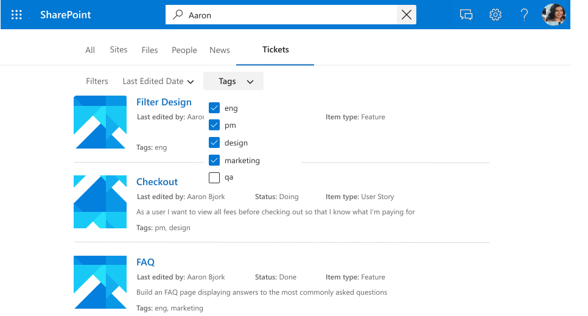

<!---<author of this doc: rsamai>--->

# Microsoft Graph 连接的注册架构

连接[架构](/graph/api/resources/schema?view=graph-rest-beta&preserve-view=true)确定如何将内容用于各种 Microsoft Graph 体验。 架构是计划添加到连接中的所有属性的简单列表及其属性、标签和别名。 向连接添加项目前，必须注册架构。

## 示例架构

下表提供了工作票据系统连接器可能的架构示例。

| 属性       | 类型             | 可搜索         | 可查询          | 可检索        | 可精简          | 标签               | 别名    |
|----------------|------------------|--------------------|--------------------|--------------------|--------------------|----------------------|------------|
| ticketId       | String           |                    |                    |                    |                    |                      | ID         |
| title          | String           | :heavy_check_mark: | :heavy_check_mark: | :heavy_check_mark: |                    | title                |            |
| createdBy      | String           | :heavy_check_mark: | :heavy_check_mark: |                    |                    | createdBy            | Creator    |
| assignedTo     | String           | :heavy_check_mark: | :heavy_check_mark: |                    |                    |                      |            |
| lastEditedDate | 日期时间         |                    | :heavy_check_mark: | :heavy_check_mark: | :heavy_check_mark: | lastModifiedDateTime | editedDate |
| lastEditedBy   | String           | :heavy_check_mark: | :heavy_check_mark: | :heavy_check_mark: |                    | lastModifiedBy       | 已编辑     |
| workItemType   | String           |                    | :heavy_check_mark: | :heavy_check_mark: |                    |                      | ticketType |
| priority       | Int64            | :heavy_check_mark: |                    |                    |                    |                      |            |
| 标记           | StringCollection |                    | :heavy_check_mark: | :heavy_check_mark: | :heavy_check_mark: |                      |            |
| 状态         | String           |                    | :heavy_check_mark: | :heavy_check_mark: |                    |                      |            |
| url            | String           |                    |                    |                    |                    | url                  |            |
| 已解决       | Boolean          |                    | :heavy_check_mark: | :heavy_check_mark: |                    |                      |            |

## Property 属性

### 可搜索

如果属性可搜索，则将其值添加到全文检索。 当用户执行搜索时，如果其中一个可搜索字段或其[内容](connecting-external-content-manage-items.md#content)中有搜索命中率，则会返回结果。

<!-- markdownlint-disable MD036 -->

*搜索“设计”，显示针对属性（`title`, `tags`）和内容的点击结果*

### 可查询

如果属性可查询，则可以使用知识查询语言 (KQL) 对其进行查询。 KQL 由一个或多个自由文本关键词（单词或短语）或属性限制组成。 属性名称必须包含在查询中：在查询本身中指定或以编程方式包含在查询中。 可将前缀与通配符 (*) 搭配使用。

> [!NOTE]
> 不支持后缀匹配。

*搜索“search ba*”，显示与此前缀 * 匹配的结果

*搜索“tags:design”，结果范围限定为 tags 属性中包含“design”的项*

### 可检索

如果属性可检索，则其值可以在搜索结果中返回。 希望将任何属性添加到显示模板，或者从查询中返回，并且在搜索结果中相关，则该属性必须是可检索的。 将较大的属性（如 `editHistory`或属性过多）标记为可检索会增加搜索延迟。 是可选择的并选择相关属性。

*结果所呈现的一组可检索属性（`title`、 `lastEditedBy` 等）*

### 可精简

如果属性是可精简的，则管理员可将其配置为 Microsoft 搜索结果页面中的自定义筛选器。

*按`tags`优化结果，可精简属性*

## 标签

标签是 Microsoft 发布的众所周知的标记，可在架构中针对属性进行添加。 添加标签有助于各种 Microsoft 产品理解属性并提供更好的体验。

| 标签                 | 说明                                                                          |
|---------------------- |------------------------------------------------------------------------------------- |
| title                 | 要在搜索中显示的项目标题和其他体验              |
| url                   | 数据源中的项的目标 URL                                        |
| createdBy             | 数据源中的项创建者的姓名                           |
| lastModifiedBy        | 数据源中的项最近编辑者的姓名              |
| authors               | 数据源中的项参加/合作所有人员的姓名  |
| createdDateTime       | 在数据源中创建项的日期和时间                             |
| lastModifiedDateTime  | 在数据源中修正项的日期和时间                            |
| fileName              | 对于文件，则为数据源中的文件名称                           |
| FileExtension         | 对于文件，则为数据源中的文件扩展                      |

例如，*lastEditedBy* 连接属性与 Microsoft label *lastModifiedBy* 的含义相同。

添加尽可能多的标签，但要确保它们准确地映射到属性。 如果标签没有意义，请不要向属性中添加。 不正确的映射将降低体验。

> [!IMPORTANT]
> 所有映射到标签的属性都必须可供检索。

### 相关性

通过应用尽可能多地正确映射的标签，你还可以通过搜索改进内容的发现。 我们极力建议你尽可能多地定义如下所示的标签，并按对发现顺序的潜在影响进行降序：

- title
- lastModifiedDateTime
- lastModifiedBy
- url
- 文件名
- FileExtension

对于发现，即搜索方案，请注意：

- 确保你的映射准确。
- 将属性用作包含大型内容的标签时，可能会增加搜索延迟，并且必须等待更长的时间才能使搜索返回结果。
- 尤其是在配置自定义垂直的情况下允许通过多个连接进行搜索的情况下，搜索结果在指定尽可能多的标签时占有优势。

### 默认结果类型

标签还会影响生成默认结果类型的方式。尽可能少添加标题和内容标签可确保为连接创建结果类型。

*带有标题和`title`结果片段的默认结果类型*

当你定义这些标签时，你的默认结果类型将提供更好的体验（适用时按升序排列）：

- title
- url
- lastModifiedBy
- lastModifiedDateTime
- fileName
- FileExtension

最后，在分配标签时，请确保以下内容：

- 需要将选择用作标签的属性标记为可检索。
- 属性及其分配的标签必须具有相同的数据类型。
- 只能将一个标签正好映射到一个属性。

## 别名

别名是你所分配属性的好记的名称。 它们将用于可精简属性筛选器中的查询和选择。

## 后续步骤

- [向连接添加项目](./connecting-external-content-manage-items.md)
- [查看 Microsoft Graph 连接器 API 参考](/graph/api/resources/indexing-api-overview?view=graph-rest-beta&preserve-view=true)
- [搜索自定义类型 (externalItem)](search-concept-custom-types.md)
- 从 GitHub 下载[示例搜索连接器](https://github.com/microsoftgraph/msgraph-search-connector-sample)