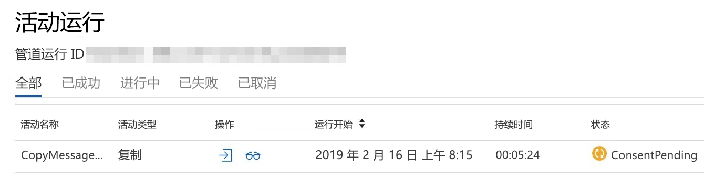

# Microsoft Graph 数据连接常见问题解答Microsoft Graph Data Connect frequently asked questions

借助 Microsoft Graph 数据连接，开发人员可为客户创建应用程序，用以提供对其大规模的 Microsoft Graph 数据集的受管访问。Microsoft Graph Data Connect allows developers to create applications that customers can provide managed access to their at-scale Microsoft Graph datasets. 本文提供了可帮助你利用数据连接功能的提示。This article provides tips that will help you take advantage of the Data Connect feature. 有关 Microsoft Graph 数据连接的简介，请参阅[概述](data-connect-concept-overview.md)文章。For an introduction to Microsoft Graph Data Connect, see the [Overview](data-connect-concept-overview.md) article.

## Microsoft Graph 数据连接是否适合我？Is Microsoft Graph Data Connect right for me?

数据连接和 Microsoft Graph API 可以完全不同的方式访问相同的基础数据。Data Connect and the Microsoft Graph APIs provide access to the same underlying data but in very different ways. 数据连接旨在批量提取大量数据，而 Microsoft Graph API 更适合于实时访问分散的数据集。Data Connect is designed to extract large amounts of data in bulk while the Microsoft Graph APIs are more suitable for accessing discrete sets of data in real time. 在某些情况下，将两者组合使用可能极具意义。In some cases, it might even make sense to combine them. 例如，可以使用数据连接来对去年的电子邮件数据进行初步提取，再使用 Microsoft Graph API 实时动态分析不断变化的电子邮件。For example, you might want use Data Connect to do an initial extraction of the last year of email data, and then use the Microsoft Graph APIs to analyze emails in real time moving forward. 数据连接和 Microsoft Graph API 是针对不同工作的不同工具。Data Connect and the Microsoft Graph APIs are different tools for different jobs. 有必要思考哪种访问方法最适合你的场景。It's important to think about which access method best fits your scenario.

## 是否会有任何初始开销？Will there be any initial overhead?

数据连接专用于批量提取大量数据，因此在提取数据之前可能会产生一些开销。Because Data Connect is designed to extract large amounts of data in bulk, some overhead is incurred before the data can be extracted. 此开销大约为 45 分钟，这意味着无论数据量如何，所有管道至少都将花费这么长时间。This overhead is around 45 minutes, meaning all pipelines will take at least that long regardless of the data size. 数据量庞大时，这一成本可忽略不计；但是如果你的场景无法承受这么长的时间，Microsoft Graph API 可提供更好的方法。This might be a negligible cost for large amounts of data, but if this time is unacceptable for your scenario, the Microsoft Graph APIs might provide a better approach.

## 我需要为 Microsoft Graph 数据连接支付多少费用？How much do I have to pay for Microsoft Graph Data Connect?

Microsoft Graph 数据连接消耗费用按月以“即付即用”方式计费。Microsoft Graph Data Connect consumption charges are billed monthly on a pay-as-you-go basis. Microsoft Graph 数据连接计费单位为 1000 个对象倍数，其，1 个对象映射到 Microsoft 365 中实体的 1 个单独实例。Microsoft Graph Data Connect billing unit is in multiple of 1000s of objects, where 1 object maps to 1 individual instance of an entity in Microsoft 365. 例如，1 封电子邮件 =1 个对象，1 个文件 =1 个对象，1 条 Teams 聊天消息 = 1 个对象等等。For example, 1 email == 1 object, 1 file == 1 object, 1 Teams chat message == 1 object, and so on. 根据通过连接器提取的每 1,000 个对象计数，使用统一费率计算费用。Charges are calculated using a flat rate based on the count of per-1,000 objects extracted through the connector. 从以下数据集中提取对象无需支付任何费用：There is no charge for extraction of objects from the following datasets:

- BasicDataSet_v0.UserBasicDataSet_v0.User
- BasicDataSet_v0.MailboxSettingsBasicDataSet_v0.MailboxSettings
- BasicDataSet_v0.ManagerBasicDataSet_v0.Manager
- BasicDataSet_v0.DirectReport。BasicDataSet_v0.DirectReport.

## 使用 Microsoft Graph 数据连接，我的数据是否可保留在组织的订阅内？Is it possible for my data to stay within the organization's subscription with Microsoft Graph Data Connect?

数据连接管道由 Azure 数据工厂进行安排，后者是一项在 Azure 订阅中运行的数据集成服务。Data Connect pipelines are orchestrated by Azure Data Factory, a data integration service that runs in an Azure subscription. Azure 订阅[与 Microsoft 365 租户一对一关联](/azure/active-directory/fundamentals/active-directory-how-subscriptions-associated-directory)。The Azure subscription is [associated with exactly one Microsoft 365 tenant](/azure/active-directory/fundamentals/active-directory-how-subscriptions-associated-directory). 这样的话，数据一开始必须传输到关联的 Azure 订阅。This way, the data must initially flow to an associated Azure subscription. 在进一步最小化和聚合后，数据可在其他位置使用。After further minimalization and aggregation, the data can be used elsewhere.

如果想要构建供其他人用来提取其 Microsoft 365 数据的应用，可将应用打包为 [Azure 托管应用](/azure/managed-applications/overview)，再将其发布到 Azure 市场。If you want to build an app for others to use to extract their Microsoft 365 data, you can package the app as an [Azure managed application](/azure/managed-applications/overview) and publish it to the Azure Marketplace. 之后，其他人可在其自己的 Azure 订阅中部署你的应用，而该应用也能访问其租户中的数据。Then someone can deploy your app into their own Azure subscription, and the app can access data in their tenant.

## 使用 Microsoft Graph 数据连接时，是否要求使用服务主体？Are service principals required with Microsoft Graph Data Connect?

创建数据工厂管道时，必须向 Microsoft 365 链接的服务提供服务主体。When creating the Data Factory pipeline, you will have to provide a service principal to the Microsoft 365 linked service. 在 Azure 中，服务主体是指代表应用程序/服务（与用户相反）的一个安全标识。In Azure, a service principal is a security identity that represents an application/service (as opposed to a user). 数据连接在获得授权可访问 Microsoft 365 数据时，会使用此服务主体作为其标识。Data Connect uses this service principal as its identity when getting authorized access to your Microsoft 365 data.

如果创建供其他人在其租户中使用的 Azure 托管应用程序，仍需为要使用的应用提供服务主体。If you create an Azure Managed Application for others to use in their tenants, you'll still provide a service principal for the app to use. 该服务主体将存在于你的（发布者的）租户中。This service principal will exist in your (the publisher's) tenant. 但是如果该应用需要其他服务主体，你的客户（安装者）将在其自己的租户中自行创建。However, if the app needs other service principals, your customer (the installer) will create them in their own tenant. 例如，数据工厂管道将可能需要访问 Azure 中的存储资源。For example, your Data Factory pipeline will likely need access to a storage resource in Azure. 客户会创建服务主体，该主体有权存储帐户供管道使用。The customer would create the service principal with permissions to the storage account for the pipeline to use.

## 如何检查待处理的 Privileged Access Management 请求？How can I check for pending Privileged Access Management requests?

Privileged Access Management (PAM) 请求必须得到管理员的批准，然后数据连接才可复制你的数据。Before Data Connect can copy your data, an administrator must approve a Privileged Access Management (PAM) request. PAM 是 Microsoft 365 中向数据管道授予数据访问权限的机制。PAM is the mechanism used to authorize your data pipeline access to the data in Microsoft 365. 首次触发管道时，它将等待 Microsoft 365 管理员（或指定的代理人）批准访问请求。The first time you trigger a pipeline, it will wait on a Microsoft 365 administrator (or appointed delegate) to approve the access request. 虽然管道状态显示“**正在进行中**”，但基础复制活动的状态将为 **ConsentPending**，直到获得批准，如以下屏幕截图所示。Although the pipeline status shows **In progress**, the underlying copy activity will have a status of **ConsentPending** until approval is granted, as shown in the following screenshot.

在开发期间，最好确保你的管道运行不一直处于 **ConsentPending** 状态，尤其是在更改管道之后。During development, it's a good idea to make sure your pipeline runs aren't stuck on **ConsentPending**, especially after you make a change to your pipeline. 例如，如果向架构额外添加了一个字段，则下一次管道运行将发出一个新的 PAM 请求，而该请求必须获得批准。For example, if you add an additional field to the schema, the next pipeline run will issue a new PAM request that has to be approved. 不要浪费时间等待一个需要你来批准的管道。Don't waste time waiting on a pipeline that's waiting for your approval.

## 如何通过 Microsoft 365 管理门户审批 PAM 请求？How can I approve PAM requests via Microsoft 365 admin portal?

数据连接文档介绍了如何使用 PowerShell 和 PAM UX 来审批 PAM 请求。The Data Connect documentation shows you how to use PowerShell and the PAM UX to approve PAM requests. 要通过 PAM UX 进行审批，请访问 [Microsoft 365 管理门户](https://admin.microsoft.com/Adminportal/Home?source=applauncher#/Settings/PrivilegedAccess)中的 PAM 界面。To approve using the PAM UX, visit the PAM interface in the [Microsoft 365 admin portal](https://admin.microsoft.com/Adminportal/Home?source=applauncher#/Settings/PrivilegedAccess). 该门户让你能够以简单、快捷的方式查看和审批/拒绝/撤消 PAM 请求。The portal provides an easy and user-friendly way to view and approve/deny/revoke PAM requests. 可访问“**设置**” > “**服务和加载项**” > “**Microsoft Graph 数据连接**”，在 Microsoft Graph 数据连接加载项中查找指向它的链接。You can find a link to it in the Microsoft Graph Data Connect add-in under **Settings** > **Services & Add-ins** > **Microsoft Graph Data Connect**.

## 是否可让另一名用户审批 PAM 请求？Can I have a second user to approve PAM requests?

运行管道并触发 PAM 请求，该请求会附加到拥有该管道所用服务主体的用户帐户上。When you run a pipeline and trigger a PAM request, the request is attached to your user account that owns the service principal used by the pipeline. 但即使该帐户属于你设置的审批者组，你也不能用它来审批 PAM 请求，因为不允许自我审批。But even if this account is part of the approver group you set up, you can't use it to approve the PAM request because self-approvals are not allowed. 如果尝试此操作，你将在 PAM 门户中获得一个错误消息：“请求者和审批者是同一人。If you try, you'll get an error message in the PAM portal: "Requestor and approver are the same. 不允许自我审批。”Self-approval is not allowed." 在开发时，你将必须在审批请求的管理员之外再拥有一个帐户。For development, you'll want to have a second account in addition to the admin who approves requests. 提交者和审批者都必须具有有效的 Exchange Online 帐户。Both the submitter and the approver must have active Exchange Online accounts.

## 能否在必要时删除重复的电子邮件？Can I deduplicate emails when needed?

从 `Message` 数据集中提取电子邮件时，通常同一封电子邮件有多个 JSON 对象。When you extract emails from the `Message` dataset, there will often be multiple JSON objects for the same email. 这些重复项存在的原因是在向多名用户发送电子邮件时，每个收件人的邮箱中都有该电子邮件的副本。These duplicates exist because when an email is sent to multiple people, there is a copy of the email in every recipient's mailbox. 由于数据集是从每个邮箱中提取的，因此它将包含所有用户的所有副本。Because the dataset is extracted from every mailbox, it will contain all copies across users. 在某些情况下，可能有必要保留每个副本；但在其他情况下，可能必须删除重复项。In some scenarios, it might be necessary to keep every copy but in others, you may want to remove the duplicates.
可根据邮件的 `internetMessageId` 删除导出的 JSON 对象中的重复项：具有相同 `internetMessageId` 的两封邮件是同一实例的重复副本。You can deduplicate the exported JSON objects based on the `internetMessageId` of the messages: Two messages with the same `internetMessageId` are duplicate copies of the same instance. 由于重复项可存在于不同的 blob 中，因此必须删除所有 blob 中的重复项，而不是分别删除每个 blob 中的重复项。Because the duplicates can exist in different blobs, you must deduplicate across all blobs rather than deduplicating in each blob separately.

## 能否使用 puser 字段来确定相关用户？Can I use puser field to determine the relevant user?

提取的数据包含一些在使用相应的 Microsoft Graph API 时不存在的属性。The extracted data includes some meta properties that don't exist when using the corresponding Microsoft Graph APIs. 具体而言，`puser` 在确定用户数据提取的位置时非常有用。Specifically, the `puser` field can be useful for determining which user the data was extracted from. 如果不同邮箱中具有同一电子邮件的两个副本，可使用 `puser` 字段来确定副本来自哪个邮箱。In the scenario where you have two copies of the same email in different mailboxes, you can use the `puser` field to determine which copy came from which mailbox. `puser` 字段还对 `Manager` 数据集之类的数据集很有用。The `puser` field is also useful for datasets such as the `Manager` dataset. 导出的 JSON 将包含管理器相关信息，但只有当你知道它们是谁的管理器时，这才有用。The exported JSON will contain information about a manager, but this is only useful if you know whose manager they are. `puser` 字段将指出 JSON 对象对应于哪个管理器。The `puser` field will tell you whose manager that JSON object corresponds to.

## 是否支持混合拥有和不拥有工作区分析许可证的用户？Is a mix of users with and without Workplace Analytics licenses supported?

如今，我们要求用户列表中的所有用户都拥有工作区分析许可证，或者用户列表中的所有用户都没有工作区分析许可证。Today, we require all users in user list to either have Workplace Analytics license or all users in user list to not have Workplace Analytics license. 遗憾的是，我们不支持混合的用户列表，即有些用户拥有工作区分析许可证，而有些用户没有工作区分析许可证。Unfortunately, we do not supported mixed user list, i.e. some users have Workplace Analytics license and some do not. 这是因为如果用户列表中的用户拥有工作区分析许可证，则数据连接不需要额外收费，而如果客户没有工作区分析许可证，则将使用此处详述的消耗计费向客户收费。This is because if users in user list have Workplace Analytics license then no additional charges are required for Data Connect, whereas if customers do not have Workplace Analytics license, then customers are billed using consumption billing detailed here. 如果当前存在违反你的用例的情况，请告知我们，我们可在此查看是否有机会帮助解决这种情况。If this is breaking your use case today, please let us know and we can see if there are opportunities to help your scenario here.

## 是否支持混合模式租户设置？Is hybrid mode tenant setup supported?

如果你的 Microsoft 365 设置有一些用户在 Exchange Online 中，而一些用户在 Exchange 本地，则位于 Exchange 本地的用户将不受支持。遗憾的是，当前对 Exchange 本地用户不支持数据连接。If your Microsoft 365 setup have some users in Exchange Online and some users in Exchange on-premises then the users who are in Exchange on-premises would not be supported. Unfortunately, today we do not support Data Connect for Exchange on-premises users.

## 是否支持资源帐户？Are resource accounts supported?

我们目前不支持从资源帐户访问邮件或事件。We don't currently support access to messages or events from resource accounts. 我们将在未来添加对此功能的支持。We will add support for this in the future.

## 我看到每个 ADF 管道运行有多个文件，但有时每个运行只有 1 个文件。为什么会发生这种情况？I am seeing multiple files per ADF pipeline run, but sometimes just 1 file per run. Why is this happening?

Microsoft Graph 数据连接会获取每个管道运行的用户列表，然后跨并行运行的多个作业分发数据集提取和策展。Microsoft Graph Data Connect takes user list for each pipeline run and then distributes the dataset extraction and curation across multiple jobs that run in parallel. 对于每个并行运行，都会在你定义的数据接收器中生成 1 个输出文件。For each parallel run, 1 output file is generated in the data sink defined by you. 对于某些情况，如果用户列表较小，则可能会将其映射到 1 个提取和策展作业，在这些情况下，数据接收器中只会生成 1 个输出文件。For some cases, if the user list is small, they may be mapped into 1 extraction and curation job, and in those cases only 1 output file would be generated in the data sink.

## 如何使用对象计数而不是舍入数字计算计费？How is billing computed with the count of objects is not a round number?

出于计费目的，Microsoft Graph 数据连接会将提取的对象计数进位到最接近的 1000。For billing purposes, Microsoft Graph Data Connect rounds up to the extracted object count to nearest 1000. 例如，如果你提取了 125 个对象或它们提取了 999 个对象，则将收取 1000 个对象的费用。For example, if you extracts 125 objects or they extract 999 objects, they will be billed for 1000 objects. 同样，如果你提取的对象数在 1001 到 2000 之间，则将收取 2000 个对象的费用。Similarly, if you extract between 1001 to 2000 objects, you would be charged for 2000 objects.

## 通过 Azure Synapse 初始化时，Microsoft 365 复制数据活动始终失败。为什么会发生这种情况？My Microsoft 365 copy data activity is always failing when initialized via Azure Synapse. Why is this happening?

目前，我们不支持通过 Azure Synapse 初始化 Microsoft 365 复制数据活动。Today, we do not support Microsoft 365 copy data activity to be initialized via Azure Synapse. 我们正在努力添加 Azure Synapse 初始化活动的集成，并将在完成此操作后更新我们的文档。We are working toward adding the integration for Azure Synapse initialized activity and will update our documentation when this is completed.
