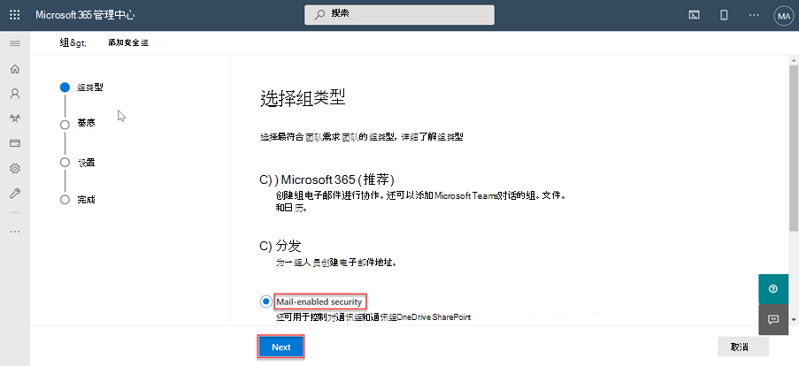
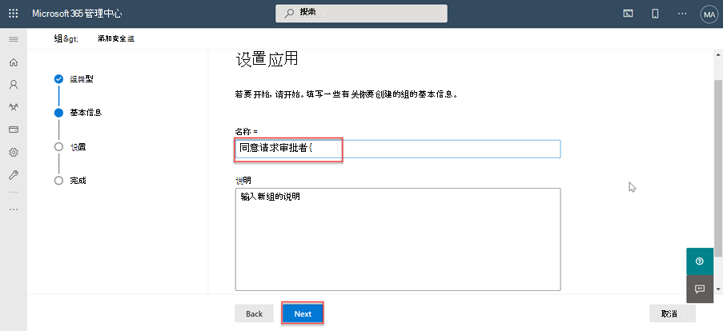
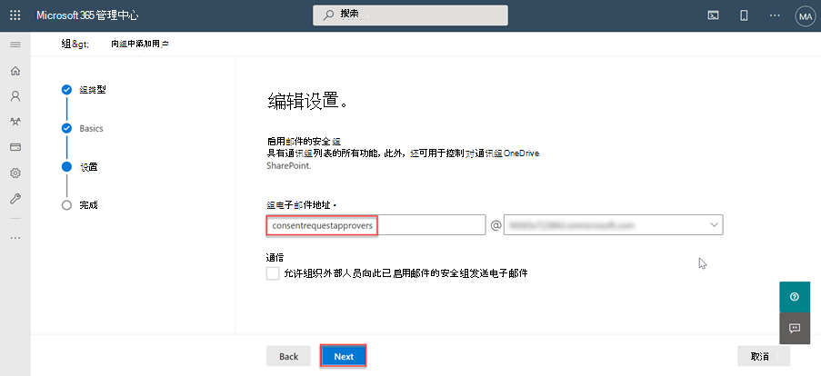
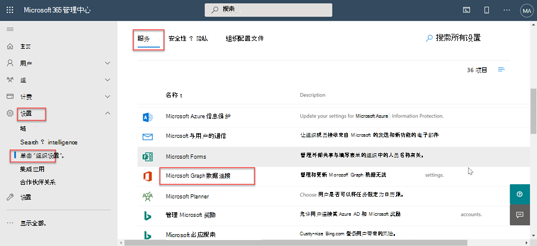
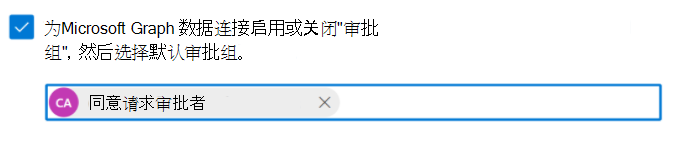

<!-- markdownlint-disable MD002 MD041 -->

在首次Microsoft Graph 数据连接之前，你需要配置Microsoft 365租户。 这涉及打开服务并配置具有批准数据提取请求的权限的安全组。

## 向 Azure AD 用户授予全局管理员角色

在此步骤中，将确保租户中的两Microsoft 365已启用 **全局管理员** 角色。

- [全局管理员内置角色](/azure/active-directory/roles/permissions-reference#global-administrator)。
- [提升访问权限以获得全局管理员角色](/azure/role-based-access-control/elevate-access-global-admin)。

## 配置Microsoft Graph 数据连接同意请求审批者组

在此步骤中，你将设置Microsoft 365租户，以允许使用Microsoft Graph 数据连接。

1. 打开浏览器，然后转到你的Microsoft 365 管理[门户。](https://admin.microsoft.com/)

1. 在边栏导航上，选择"**活动组"。**
  
    

1. 选择" **添加组"** 按钮。

1. 使用以下方法创建新的启用邮件的安全组，然后选择"**添加"** 按钮。
   - **类型**：启用邮件的安全性

    

   - **名称**：同意请求审批者

    

   - **Email Prefix**： consentrequestapprovers

    

1. **新创建的组** 最多可能需要一个小时才能显示在列表中。 创建组后，选择它。

1. 再次转到 **活动组** 选项，然后搜索你刚刚创建的组。

1. 选择组，在"成员 **"** 选项卡中，选择"**查看所有和管理成员"。**

1. 将启用全局管理员角色 **的两个用户** 添加到此新组中。

## 在Microsoft Graph 数据连接租户中Microsoft 365租户

在此步骤中，你将在 Microsoft Graph 数据连接 租户上启用 Microsoft 365 服务。

1. 当你仍登录到 Microsoft 365 管理 门户时 **，设置 >"组织设置"** 菜单项。

1. 选择 **Microsoft Graph 数据连接** 服务。

    

1. 选中显示为整个Microsoft Graph 数据连接 **启用或** 关闭"启用数据"选项的连接。

    

1. 输入 **同意请求** (或你之前创建的组的名称) 在用户组中做出审批决定，**然后选择保存。** 
