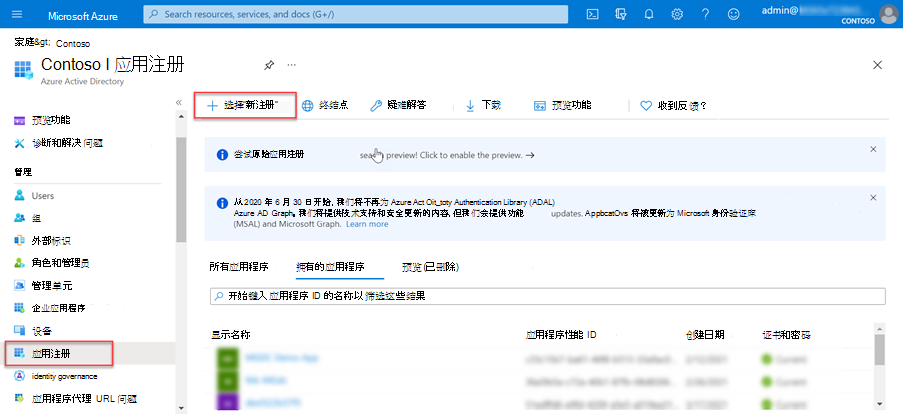
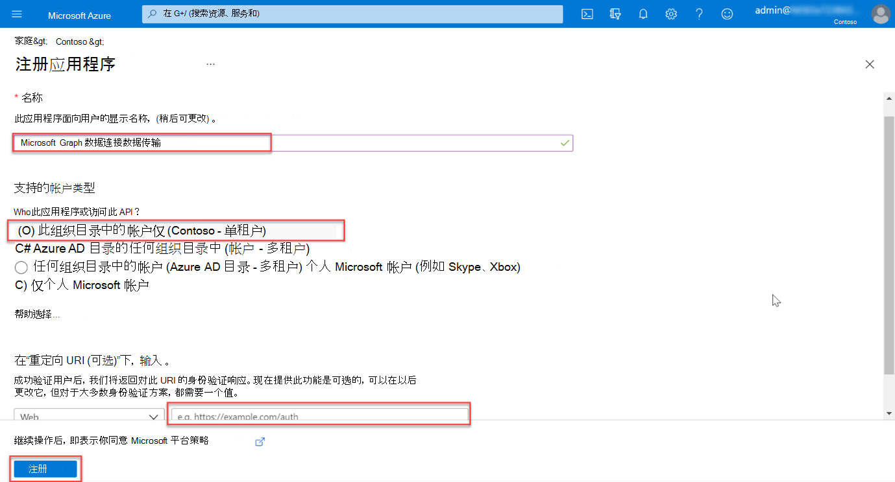
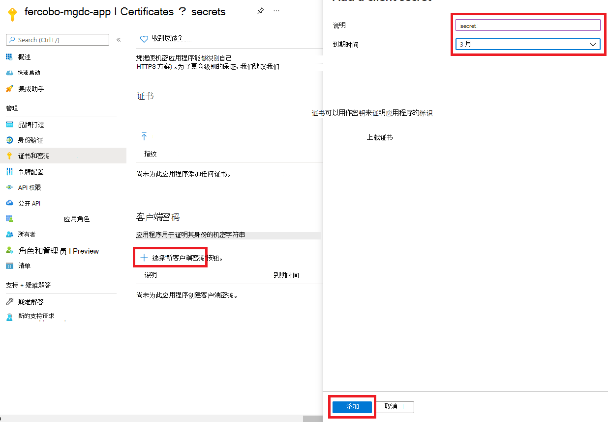

<!-- markdownlint-disable MD002 MD041 -->

在此练习中，你将创建、运行和批准 Azure 数据工厂管道，以将数据从 Microsoft 365 提取到 Azure 存储 Blob 进行其他处理。In this exercise you will create, run, and approve an Azure Data Factory pipeline to extract data from Microsoft 365 to an Azure Storage Blob for additional processing.

## 创建Microsoft Azure Active Directory应用程序注册Create a Microsoft Azure Active Directory application registration

第一步是创建一个 Azure AD 应用程序，该应用程序将用作运行数据提取过程的安全主体。The first step is to create an Azure AD application that will be used as the security principal to run the data extraction process.

1. 打开浏览器并转到 Azure [门户](https://portal.azure.com/)。Open a browser and go to your [Azure Portal](https://portal.azure.com/).

1. 使用具有 Azure 和租户 **全局** 管理员权限Microsoft 365登录。Sign in using an account with **Global administrator** rights to your Azure and Microsoft 365 tenants.

1. 在边栏导航上，选择 **Azure Active Directory (** Azure AD) 。On the sidebar navigation, select **Azure Active Directory** (Azure AD).

1. 在"Azure AD 概述"页上，从菜单 **的** " **管理"部分** 选择"应用注册"。On the Azure AD Overview page, select **App registrations** from the **Manage** section of the menu.

1. 选择" **新建注册"** 按钮。Select the **New registration** button.

    

1. 使用以下值创建新的 Azure AD 应用程序，然后选择"注册 **"。**Use the following values to create a new Azure AD application and select **Register**.

   - **名称**：Microsoft Graph数据连接数据传输**Name**: Microsoft Graph Data Connect Data Transfer
   - **支持的帐户类型**：仅此组织目录中的帐户。**Supported account types**: Accounts in this organizational directory only.
   - **重定向 URI：** 保留默认值。**Redirect URI**: Leave the default values.

    

1. 找到 **应用程序 (客户端) ID** 并复制它，因为本教程稍后将对此进行介绍。Locate the **Application (client) ID** and copy it as you will need it later in this tutorial. 这称为服务主体 ID。This will be referred to as the service principal ID.

1. 找到 **目录 (租户) ID，** 并复制它，因为本教程稍后将对此进行介绍。Locate the **Directory (tenant) ID** and copy it as you will need it later in this tutorial. 这称为租户 ID。This will be referred to as the tenant ID.

1. 在边栏导航上，选择"管理 **"下的"证书和\*\*\*\*密码"。**On the sidebar navigation, select **Certificates and secrets** under **Manage**.

1. 选择" **新建客户端密码"按钮**。Select the **New client secret button**. 将 *"说明*"设置为任意名称，将 **"到期**"设置为下拉列表中的任意值，然后选择"添加 **"。**Set *Description* to any name, set **Expires** to any value in the dropdown and choose **Add**.

    

    - 创建客户端密码后，请确保将 **"** 值"保存在安全位置，因为稍后将不再可用，并且需要创建新的密码。After the client secret is created, make sure you save the **Value** somewhere safe, as it will no longer be available later, and you will need to create a new one.
    - 这将作为服务主体密钥引用。This will be referenced as the service principal key.

1. 在应用程序的边栏导航上，选择"所有者 **"。**On the sidebar navigation for the application, select **Owners**.

1. 验证您的帐户是否列为应用程序的所有者。Verify that your account is listed as an owner for the application. 如果未列为所有者，请添加它。If it isn't listed as an owner, add it.

    
