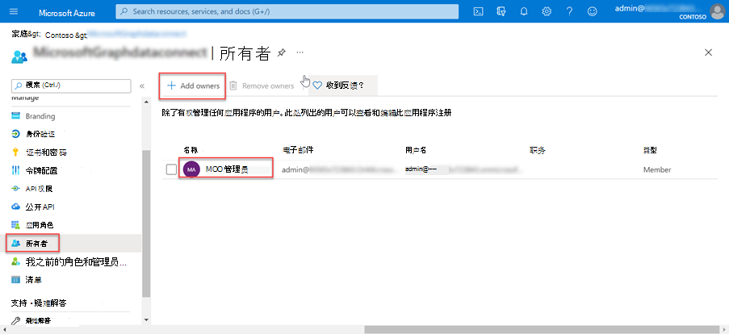

<!-- markdownlint-disable MD002 MD041 -->

在此练习中，你将创建、运行和批准 Azure 数据工厂管道，以将数据从 Microsoft 365 提取到 Azure 存储 Blob 进行其他处理。

## 创建Microsoft Azure Active Directory应用程序注册

第一步是创建一Azure AD应用程序，该应用程序将用作运行数据提取过程的安全主体。

1. 打开浏览器并转到 [Azure 门户](https://portal.azure.com/)。

1. 使用具有 Azure 和租户 **全局** 管理员权限Microsoft 365登录。

1. 在边栏导航上，选择"**Azure Active Directory (Azure AD)**"。

1. 在"Azure AD概述"页上，从菜单 **的**"管理 **"部分** 选择"应用注册"。

1. 选择" **新建注册"** 按钮。

    

1. 使用以下值创建新应用程序，Azure AD注册 **"**。

   - **名称**：Microsoft Graph 数据连接数据传输
   - **支持的帐户类型**：仅此组织目录中的帐户。
   - **重定向 URI**：保留默认值。

    

1. 找到 **应用程序 (客户端) ID** ，然后复制它，因为本教程稍后将需要它。 这称为服务主体 ID。

1. 找到 **" (租户) ID** 并复制它，因为本教程稍后将需要它。 这称为租户 ID。

1. 在边栏导航上，选择"管理 **"下的"证书和****密码"**。

1. 选择" **新建客户端密码"按钮**。 将 *"说明* "设置为任何名称，将 **"到期** "设置为下拉列表中的任意值，然后选择"添加 **"**。

    

    - 创建客户端密码后，请确保将 **"** 值"保存在安全位置，因为稍后将不再可用，并且需要创建新的密码。
    - 这将作为服务主体密钥引用。

1. 在应用程序的边栏导航上，选择"所有者 **"**。

1. 验证您的帐户是否列为应用程序的所有者。 如果未列为所有者，请添加它。

    
