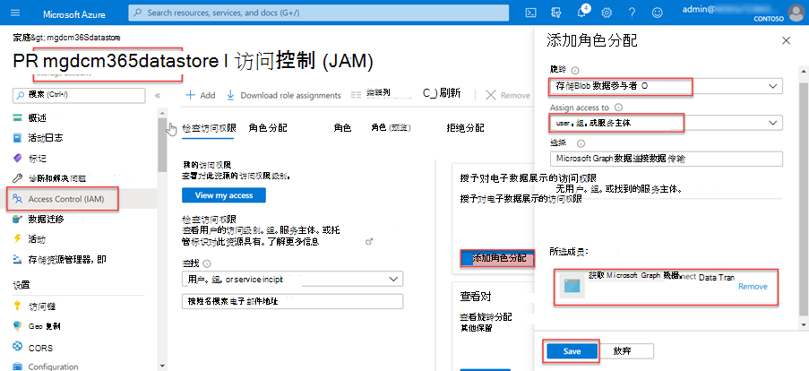
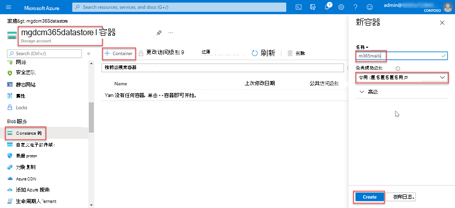

<!-- markdownlint-disable MD002 MD041 -->

在此步骤中，你将创建一Azure 存储帐户，Microsoft Graph 数据连接从数据中提取的数据进行Microsoft 365进一步处理。In this step you will create an Azure Storage account where Microsoft Graph data connect will store the data extracted from Microsoft 365 for further processing.

1. 打开浏览器并转到 Azure [门户](https://portal.azure.com/)。Open a browser and go to your [Azure Portal](https://portal.azure.com/).

1. 使用具有 Azure 和租户 **全局** 管理员权限Microsoft 365登录。Sign in using an account with **Global administrator** rights to your Azure and Microsoft 365 tenants.

1. 在边栏导航上，选择 **"创建资源"。**On the sidebar navigation, select **Create a resource**.

1. 查找 存储 **Account** 资源类型，然后使用以下值创建它，然后选择"**审阅 + 创建"。**Find the **Storage Account** resource type and use the following values to create it, then select **Review + create**.

    - **订阅**：选择 Azure 订阅**Subscription**: select your Azure subscription
    - **资源组**：GraphDataConnect (或选择现有资源组) **Resource group**: GraphDataConnect (or select an existing resource group)
    - **存储帐户名称**： mgdcm365datastore**Storage account name**: mgdcm365datastore
    - **区域**：选取与你的区域相同的 Azure Microsoft 365区域**Region**: pick an Azure region in the same region as your Microsoft 365 region
    - **性能**：标准**Performance**: Standard
    - **冗余：** 异地冗余存储 (GRS) **Redundancy**: Geo-redundant storage (GRS)
    - **高级选项卡**：**Advanced tab**:
      - **访问层**：热**Access tier**: Hot

1. 查看设置与上一步中显示的设置匹配，然后选择"创建 **"。**Review that the settings match those shown in the previous step and select **Create**.

1. 创建Azure 存储帐户后，向 Azure AD 应用程序授予之前创建的正确访问权限。After the Azure Storage account has been created, grant the Azure AD application previously created the proper access to it.

    1. 选择Azure 存储 **帐户**。Select the **Azure Storage account**.
    2. 在边栏菜单上，选择 **"IAM (访问控制) "。**On the sidebar menu, select **Access control (IAM)**.
    3. 选择" **添加** 项目"块 **中的"添加角色分配** 按钮。Select the **Add** button in the **Add a role assignment** block.
    4. 使用以下值查找之前选择的应用程序，以授予其存储 **Blob 数据** 参与者角色，然后选择"保存 **"。**Use the following values to find the application you previously selected to grant it the **Storage Blob Data Contributor** role, then select **Save**.

        - **角色**：存储 Blob 数据参与者**Role**: Storage Blob Data Contributor
        - **向：** 用户、组或服务主体分配访问权限**Assign access to**: User, group or service principal
        - **选择** Microsoft Graph 数据连接： (之前创建的 Azure AD 应用程序的名称进行数据传输) **Select**: Microsoft Graph data connect Data Transfer (the name of the Azure AD application you created previously)

        

1. 在 **mgdcm365datastore** 帐户Azure 存储容器。Create a new container in the **mgdcm365datastore** Azure Storage account.

    1. 选择 **"mgdcm365datastore"Azure 存储** 帐户。Select the **mgdcm365datastore** Azure Storage account.
    2. 在边栏菜单上 **，选择\*\*\*\*"Blob** 服务"部分下的"容器"。On the sidebar menu, select **Containers** under the **Blob** service section.
    3. 选择 **页面顶部的"+容器**"按钮，然后使用以下值，然后选择"创建 **"。**Select the **+Container** button at the top of the page and use the following values and then select **Create**.

        - **名称**：m365mails**Name**: m365mails
        - **公共访问级别**：专用 (匿名访问) **Public access level**: Private (no anonymous access)

        
