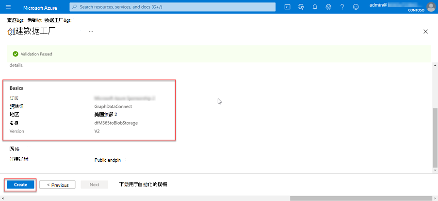
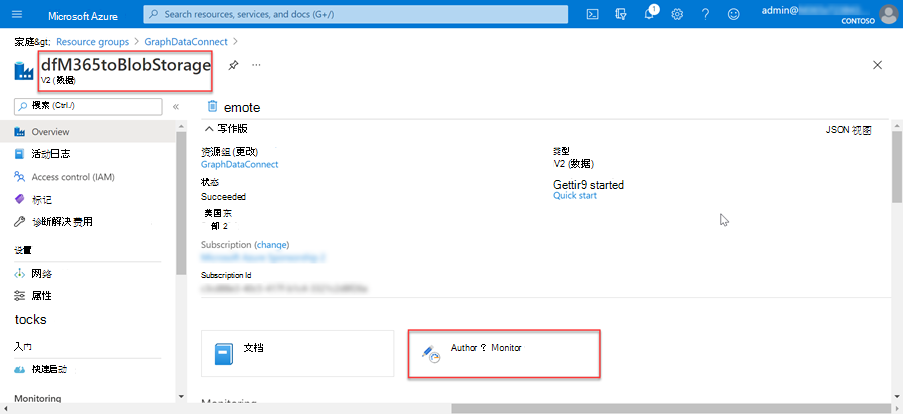
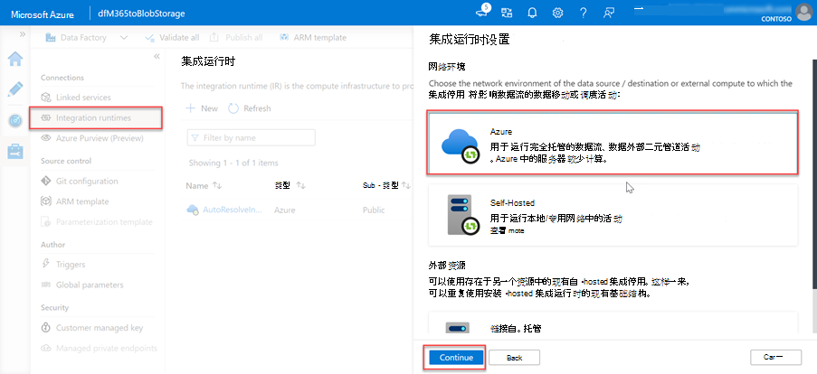
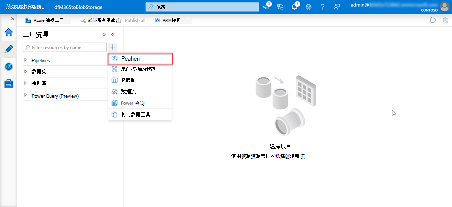
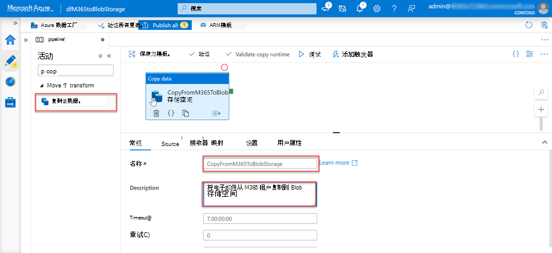
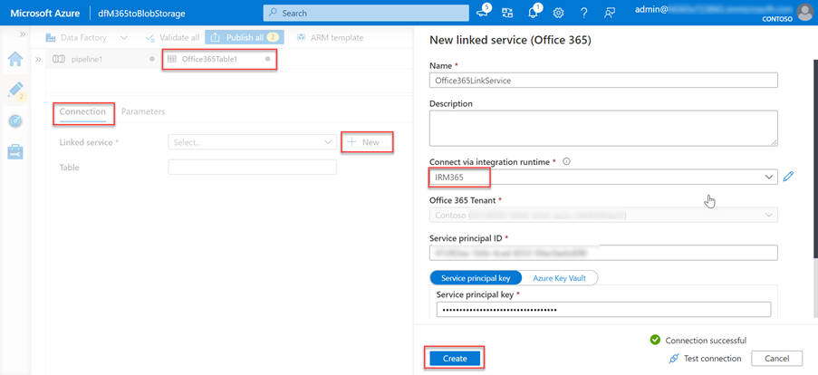
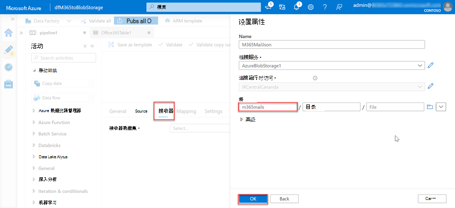
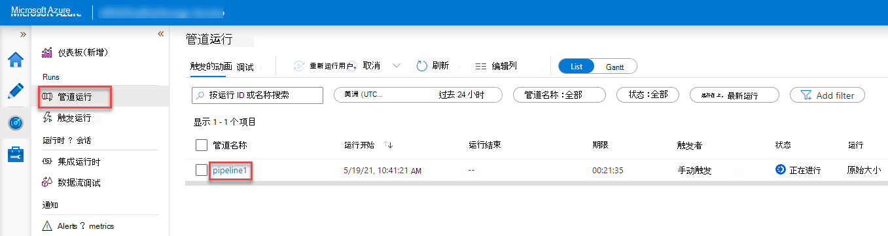
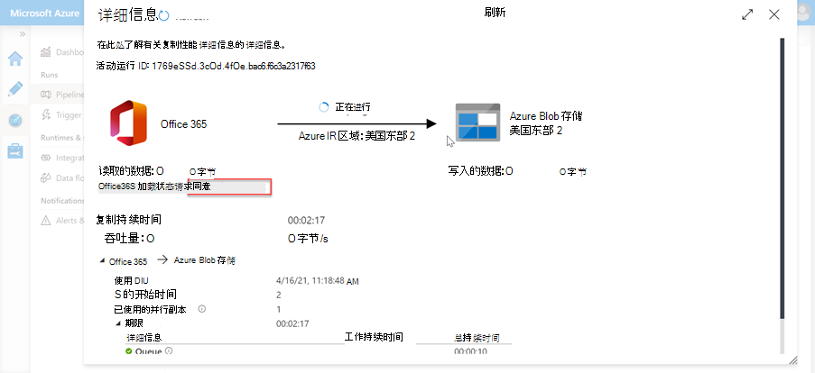

<!-- markdownlint-disable MD002 MD041 -->

下一步是使用 Azure 数据工厂创建管道，以使用 Microsoft 365 将数据从 Azure 存储 帐户提取Microsoft Graph 数据连接。The next step is to use the Azure Data Factory to create a pipeline to extract the data from Microsoft 365 to the Azure Storage account using Microsoft Graph data connect.

## 创建 Azure 数据工厂管道Create an Azure Data Factory pipeline

1. 打开浏览器并转到 Azure [门户](https://portal.azure.com/)。Open a browser and go to your [Azure Portal](https://portal.azure.com/).

1. 使用具有 Azure 和租户 **全局** 管理员权限Microsoft 365登录。Sign in using an account with **Global administrator** rights to your Azure and Microsoft 365 tenants.

1. 在边栏导航上，选择 **"创建资源"。**On the sidebar navigation, select **Create a resource**.

1. 找到"**数据工厂**"资源类型，然后使用以下值创建它，然后选择"创建 **"。**Find the **Data Factory** resource type and use the following values to create it, then select **Create**.

    1. **订阅**：选择 Azure 订阅**Subscription**: select your Azure subscription
    2. **资源组**：GraphDataConnect**Resource group**: GraphDataConnect
    3. **区域**：选取与你的区域相同的 Azure Microsoft 365区域**Region**: pick an Azure region in the same region as your Microsoft 365 region
    4. **名称**：dfM365toBlobStorage**Name**: dfM365toBlobStorage
    5. **版本**： V2**Version**: V2

        

    6. 在 **"Git 配置"** 选项卡中，确保配置 Git 或选择选项"_稍后配置 Git"。_In the **Git configuration** tab, make sure you either configure Git or select the option _Configure Git later_.

1. 创建 Azure 数据工厂资源后，选择"作者和 **监视器** "磁贴以启动 Azure 数据工厂全屏编辑器。After the Azure Data Factory resource is created, select the **Author and Monitor** tile to launch the Azure Data Factory full screen editor.

    

1. 通过从左侧 **导航\*\*\*\*中选择**"概述"，从"管理"体验切换到"管理"体验。Switch from the **Overview** to the **Manage** experience by selecting it from the left-hand navigation.

1. 默认情况下，Azure 数据工厂将使用自动解析区域集成运行时。By default, the Azure Data Factory will use an integration runtime that is auto-resolving the region. 由于连接要求源和目标以及集成运行时存在于同一 Microsoft 365 区域，因此建议您创建一个包含固定区域的新集成运行时。Because Data Connect requires that your source and destination, and integration runtime to exist in the same Microsoft 365 region, we recommend that you create a new integration runtime with a fixed region.

    1. 选择 **"集成运行时**  >  **""新建"。**Select **Integration runtimes** > **New**.
    2. 选择 **"Azure，自托管"，** 然后选择"继续 **"。**Select **Azure, Self-Hosted** and select **Continue**.
    3. 选择 **"Azure** 用于网络环境"，然后选择"继续 **"。**Select **Azure** for network environment and select **Continue**.

        

    4. 使用以下详细信息在最终屏幕上完成表单，然后选择"创建 **"。**Use the following details to complete the form on the final screen and then select **Create**.

        - **名称**：集成运行时的名称**Name**: name of your integration runtime
        - **说明**：输入说明**Description**: enter a description
        - **区域**：选择与你的区域Microsoft 365区域**Region**: select the region that matches your Microsoft 365 region
        - **虚拟网络配置 (预览) ：** 已禁用**Virtual network configuration (preview)**: Disabled

1. 从左侧 **导航中选择** "管理 **"** 体验切换到"作者"体验。Switch from the **Manage** to the **Author** experience by selecting it from the left-hand navigation.
1. 通过选择加号图标，然后通过管道 创建新 **管道**。Create a new pipeline by selecting the **plus** icon, then **pipeline**.

    

    - 将 **"复制数据"** 活动从 **"移动和转换"** 部分拖到设计图面上。Drag the **Copy Data** activity from the **Move and Transform** section onto the design surface.

        

    - 在设计器中选择活动。Select the activity in the designer.
    - 选择" **常规"** 选项卡，并指定其名称和说明。Select the **General** tab and give it a name and description.

      - **名称**：CopyFromM365toBlobStorage**Name**: CopyFromM365toBlobStorage
      - **说明**：您需要的说明。**Description**: A description you want.

    - 在设计器下面的活动编辑器窗格中，选择"源 **"** 选项卡，然后选择"新建 **"。**In the activity editor pane below the designer, select the **Source** tab, then select **New**.
    - 找到数据集 **Office 365，** 选择它，然后选择"继续 **"** 按钮。Locate the dataset **Office 365**, select it and then select the **Continue** button.

        

    - 设计器将 **更新"源**"选项卡，Microsoft 365连接器设置。The designer will update the **Source** tab with the Microsoft 365 connector settings.
    - 选择" **源** 数据集"字段旁边的" **打开"** 选项。Select the **Open** option next to the **Source dataset** field.
    - 在表设置中，选择"连接 **"** 选项卡，然后选择"新建 **"** 按钮。In the table settings, select the **Connection** tab, then the **New** button.
    - 在出现的对话框中，分别在"服务主体 **ID"** 和"服务主体密钥"字段中输入之前创建的 Azure AD应用程序的应用程序 ID 和密码 **ID，** 然后选择"创建 **"。**In the dialog that appears, enter the previously created Azure AD application's **Application ID** and **Secret ID** in the **Service principal ID** and **Service principal key** fields respectively, then select **Create**.
    - 通过"集成运行时"下拉列表选择 **之前在 连接中创建的集成** 运行时。Select the integration runtime you previously created in the **Connect via integration runtime** dropdown.

        

    - 创建连接Microsoft 365，对于 **"表**"字段，选择"BasicDataSet_v0"。 **Message_v0**。After creating the Microsoft 365 connection, for the **Table** field, select **BasicDataSet_v0.Message_v0**.
    - 从 **Office365Table** 切换到 **管道>源**。Switch from **Office365Table** to **Pipeline > Source**. 对 Date 筛选器 **使用以下值**。Use the following values for the **Date filter**.

      - **列名称**：CreatedDateTime**Column name**: CreatedDateTime
      - **UTC (开始时间) ：** 选择当前日期之前的某个时间**Start time (UTC)**: select a date sometime prior to the current date
      - **UTC (结束) ：** 选择当前日期**End time (UTC)**: select the current date
      - 选择 **"输出列** "部分 _中的"导入架构_ "。Select **Import schema** in the _Output columns_ section.

    - 选择管道 **选项卡中的** "复制数据活动"，然后选择" **接收"** 选项卡。Select the **Copy data** activity in the pipeline tab, then select the **Sink** tab.

      - 选择"**新建"** 按钮，选择 **"Azure Blob 存储"，** 然后选择"继续 **"** 按钮。Select the **New** button, select **Azure Blob Storage**, and then select the **Continue** button.
      - 选择 **"** 二进制"作为数据的格式，然后选择"继续 **"** 按钮。Select **Binary** as the format for the data and then select the **Continue** button.
      - 为数据集指定名称 **M365JsonFile，** 如果尚未存在，则创建新的链接服务。Give the dataset the name **M365JsonFile** and create new linked service if it does not exist already.

    - 在表中，选择"连接 **"** 选项卡，然后选择"新建 **"。**In the table select the **Connection** tab, then select **New**.
    - 在对话框中设置以下值，然后选择"完成 **"。**Set the following values in the dialog, then select **Finish**.

        - **身份验证方法**：服务主体**Authentication method**: Service principal
        - **Azure 订阅**：全选**Azure subscription**: Select all
        - **存储帐户名称**： mgdcm365datastore**Storage account name**: mgdcm365datastore
          - 这是本练习前面创建的存储帐户。This is the storage account created earlier in this exercise.
        - **租户**：输入 Azure 租户的 ID**Tenant**: enter the ID of your Azure tenant
        - **服务主体 ID：** 输入之前创建的 Azure AD 应用程序的 ID**Service principal ID**: enter the ID of the Azure AD application you previously created
        - **服务主体密钥**：输入你之前创建的 Azure AD 应用程序的哈希密钥**Service principal key**: enter the hashed key of the Azure AD application you previously created

    - 在"文件 **路径"字段旁边**，选择"浏览 **"。**Next to the **File path** field, select **Browse**.
    - 选择之前创建的存储容器的名称。Select the name of the storage container you created previously.

      

1. 创建管道后，选择设计器 **顶部的** "全部验证"按钮。With the pipeline created, select the **Validate All** button at the top of the designer.

1. 在验证 (并修复在) 发现的所有问题后，选择设计器顶部的"全部发布"按钮。 After validating (and fixing any issues that were found), select the **Publish All** button at the top of the designer.

## 运行 Azure 数据工厂管道Run the Azure Data Factory Pipeline

创建管道后，现在可以运行它了。With the pipeline created, now it is time to run it.

> [!NOTE]
> 可能需要几分钟时间才能显示同意请求，并且整个过程 (开始、请求同意以及批准完成管道运行) 同意后，需要 40 分钟以上的时间。It can take several minutes for the consent request to appear and it is not uncommon for the entire process (start, requesting consent and after approving the consent completing the pipeline run) to take over 40 minutes.

1. 在 Azure 数据工厂设计器中，打开管道后，选择"添加触发器 **>"现在触发"。**In the Azure Data Factory designer, with the pipeline open, select **Add trigger > Trigger Now**.

    

1. 启动作业后，从边栏菜单中选择"监视器"以查看当前正在运行的作业。After starting the job, from the sidebar menu, select **Monitor** to view current running jobs.

1. 在左侧导航栏上，找到" **管道运行** "选项卡并选择它。On the left-side navigation bar, locate the **Pipeline runs** tab and select it. 选择管道 **名称列下的** 管道以查看活动 **运行**。Select the pipeline under the **Pipeline name** column to view the **Activity runs**. 此管道将显示为 _"正在进行"。_This pipeline will show as _In progress_.

    

1. 进入"活动运行 **"** 视图后，转到位于页面底部的"活动运行"部分。After you are in the **Activity runs** view, go to the _Activity runs_ section, which is located in the bottom side of the page.

1. 将鼠标悬停在 **活动名称上方** ，然后选择 googles 选项。Hover over the **Activity name** and select the googles option. 此时将打开" **详细信息"** 选项卡。This will bring up the **Details** tab.

    

1. 在 **"详细信息** "屏幕中，查找管道活动的状态，如下图所示。In the **Details** screen, look for the status of the pipeline activity as highlighted in the following image. 在这种情况下，你可以看到它的状态为 **RequestingConsent**。In this case you can see it is in a state of **RequestingConsent**.

    

1. 此时，活动运行在内部暂停，直到有人通过管理中心或 PowerShell Microsoft 365批准同意请求。At this point, the activity run is internally paused until someone manually approves the consent request via the Microsoft 365 admin center or via PowerShell.
