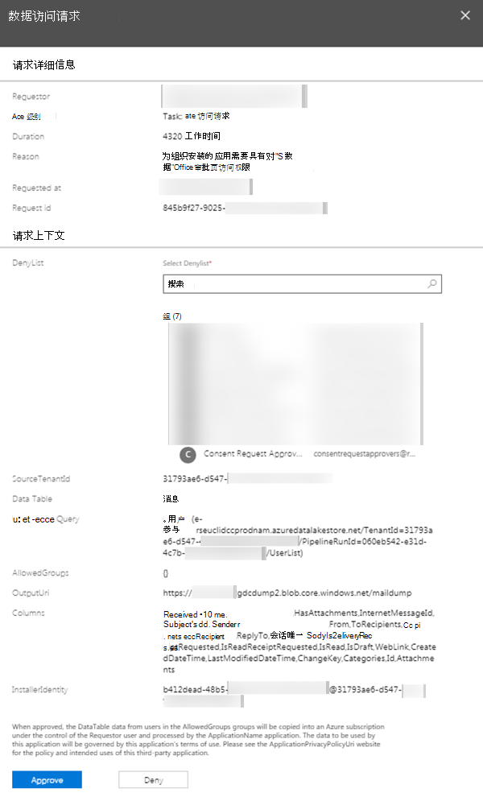
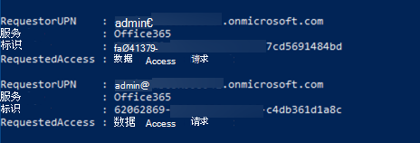
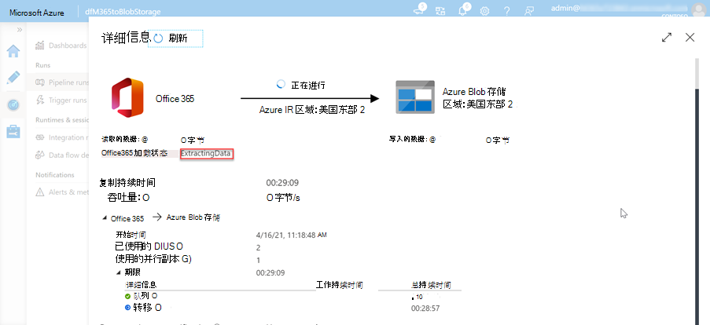
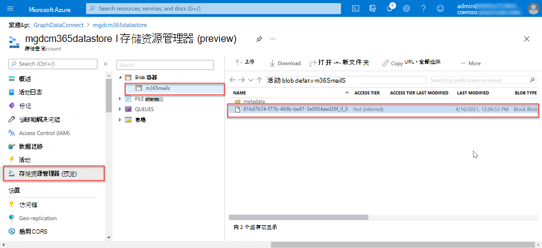

<!-- markdownlint-disable MD002 MD041 -->

Microsoft 365管理员能够批准或拒绝同意请求。 这可以通过管理中心Microsoft 365 管理 PowerShell 以编程方式完成。

## <a name="approve-consent-requests"></a>批准同意请求

# <a name="microsoft-365-admin-center"></a>[Microsoft 365 管理中心](#tab/Microsoft365)

1. 打开浏览器，然后转到你的Microsoft 365 管理[门户。](https://admin.microsoft.com)

1. 若要批准或拒绝同意请求，请转到 [Privileged Access](https://portal.office.com/adminportal/home#/Settings/PrivilegedAccess)。

1. 选择一个挂起 **的数据访问请求**。

1. 在" **数据访问请求"** 调用中，选择"批准 **"** 按钮。

    

# <a name="powershell"></a>[PowerShell](#tab/PowerShell)

1. 打开 Windows PowerShell。
1. 确保 PowerShell 会话已启用远程签名的脚本。

    ```powershell
    Set-ExecutionPolicy RemoteSigned
    ```

1. 连接Exchange Online。

    1. 通过执行以下 PowerShell 获取登录凭据。 使用创建和启动 Azure 数据工厂管道的用户登录，该用户应用了全局管理员角色，是拥有批准 Microsoft 365 中数据请求的组的成员，并且启用了多重身份验证。

        ```powershell
        $UserCredential = Get-Credential
        ```

    1. 创建新的 PowerShell Exchange Online并加载 (导入) 。

        ```powershell
        $Session = New-PSSession -ConfigurationName Microsoft.Exchange -ConnectionUri https://ps.protection.outlook.com/powershell-liveid/ -Credential $UserCredential -Authentication Basic -AllowRedirection
        Import-PSSession $Session -DisableNameChecking
        ```

        > [!IMPORTANT]
        > 完成此会话后，请确保使用 PowerShell 命令断开与会话的连接 `Remove-PSSession $Session` 。 Exchange Online仅允许三个打开的远程 PowerShell 会话，以抵御拒绝服务 (DoS) 攻击。 如果您只是关闭 PowerShell 窗口，它将保持连接打开状态。

1. 通过执行以下 PowerShell 从 Microsoft Graph 数据连接获取所有待处理数据请求的列表。

    ```powershell
    Get-ElevatedAccessRequest | where {$_.RequestStatus -eq 'Pending'} | select RequestorUPN, Service, Identity, RequestedAccess | fl
    ```

    - 检查返回的数据访问请求列表。 在下图中，请注意有两个挂起的请求。

        

1. 通过执行以下 PowerShell 复制请求的 Identity GUID，批准在上一步中返回的数据访问。

    > [!NOTE]
    > 将以下代码段中的 GUID 替换为上一步结果中的 GUID。

    ```powershell
    Approve-ElevatedAccessRequest -RequestId fa041379-0000-0000-0000-7cd5691484bd -Comment 'approval request granted'
    ```

1. 片刻后，应看到活动运行更新的状态页，以显示它现在 _正在提取数据_。

    

1. 提取数据的这一过程可能需要一些时间，具体取决于你的租户Microsoft 365大小。

---

## <a name="verify-extracted-data-from-microsoft-365-to-azure-storage-blob"></a>验证从数据提取的数据Microsoft 365到Azure 存储 Blob

1. 打开浏览器并转到 Azure [门户](https://portal.azure.com/)。

1. 使用具有 Azure 和租户 **全局** 管理员权限Microsoft 365登录。

1. 在边栏导航上，选择 **"所有资源"** 菜单项。

1. 在资源列表中，选择 **Azure 存储** 之前在本教程中创建的帐户。

1. 在边栏导航菜单上 **，从"** 帐户"边栏选项卡Azure 存储 **Blob"。**

1. 选择 **之前** 在本教程中创建的容器，该容器将 Azure 数据工厂管道配置为提取数据的接收器。 现在应该会看到此容器中的数据。

    
