<!-- markdownlint-disable MD002 MD041 -->

在此部分中，我们将生成第一 ASP.NET 应用程序，用于处理已导出的 Microsoft Graph 数据连接数据。

## <a name="create-a-new-aspnet-project"></a>新建项目 ASP.NET 项目

1. 打开Visual Studio，然后选择"文件 **">"新建> Project"。**

1. 在"**新建Project** 对话框中，执行以下操作。

    1. 在 **ASP.NET 中** 搜索 Web 应用程序，然后选择"ASP.NET Web **应用程序** (.NET Framework) 选项。
    1. 单击"下一 **步"。**

        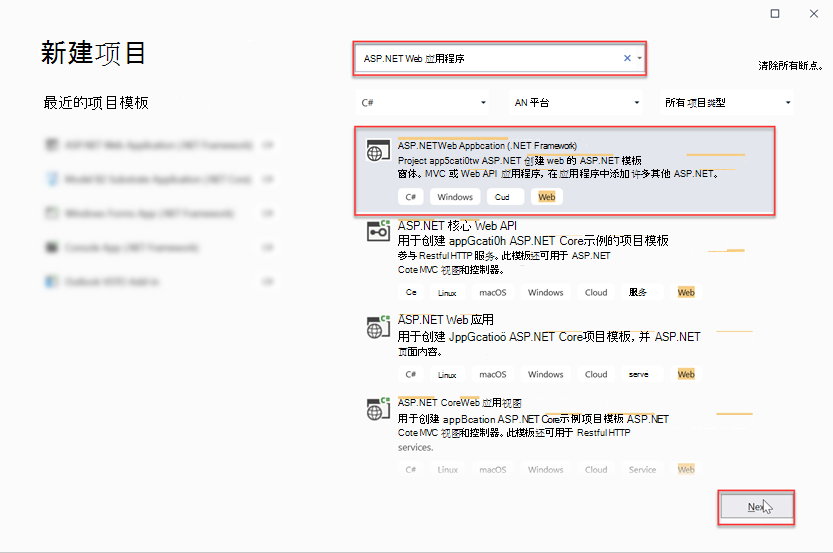

    1. 输入 **EmailMetrics** 作为项目名称。
    1. 选择 **.NET Framework 4.7.2** 作为框架选项。
    1. 选择 **创建**。

    > [!IMPORTANT]
    > 确保为此快速启动说明中指定的Visual Studio Project输入完全相同的名称。 Visual Studio 项目名称在代码中成为了命名空间的一部分。 在这些说明里的代码依赖于匹配在这些说明中指定的 Visual Studio 项目名称的命名空间。 如果你使用不同的项目名称，代码不会编译，除非你调整所有的命名空间来匹配你在创建项目时输入的 Visual Studio 项目名称。

    1. 在"新建 web **ASP.NET** 项目"对话框中，选择"MVC"。
    1. 选择 **创建**。

    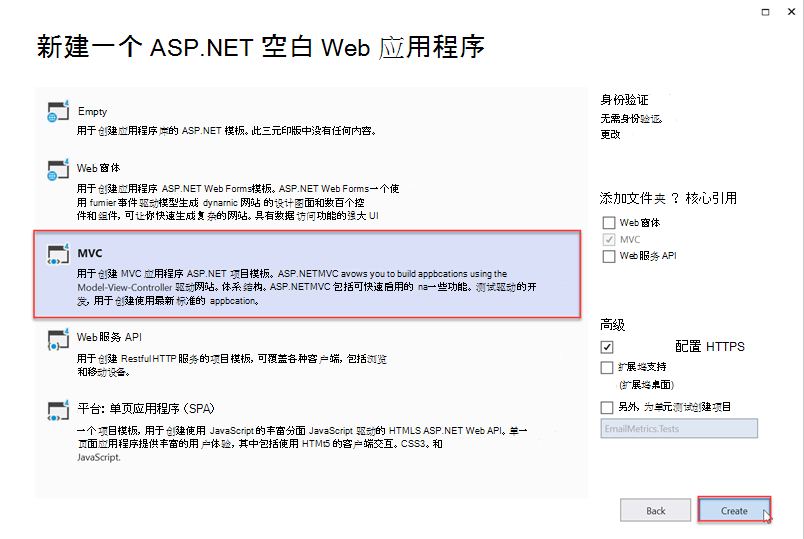

## <a name="add-and-configure-your-azure-storage-as-a-connected-service"></a>添加和配置Azure 存储连接服务

1. 在"**解决方案资源管理器**"工具窗口中，右键单击"连接的 **服务**"节点，然后选择"**添加已连接服务"。**

    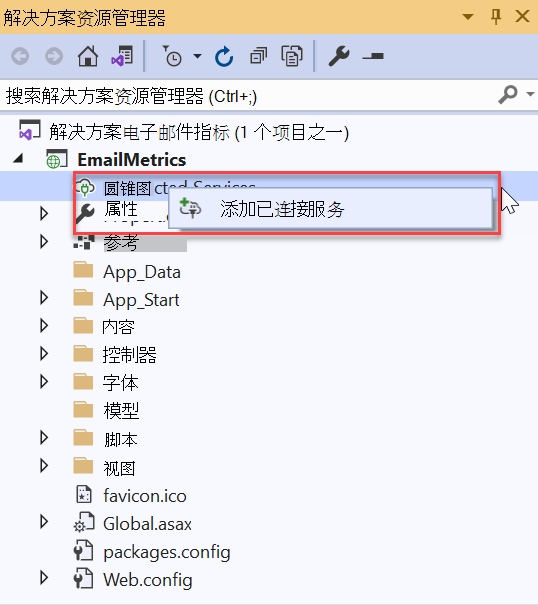

1. 在" **连接的服务** "对话框中，选择位于对话框右上角 **+** 的绿色符号。

1. 在"**添加依赖关系"** 对话框中，**选择"Azure 存储"** 下一 **步"。**

    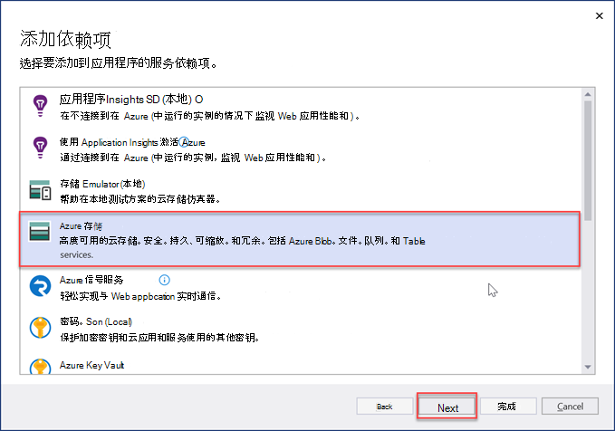

1. 在 **"Azure 存储"** 对话框中，选择在上一练习中导出数据的订阅和存储帐户，选择"下一 **步"。**

    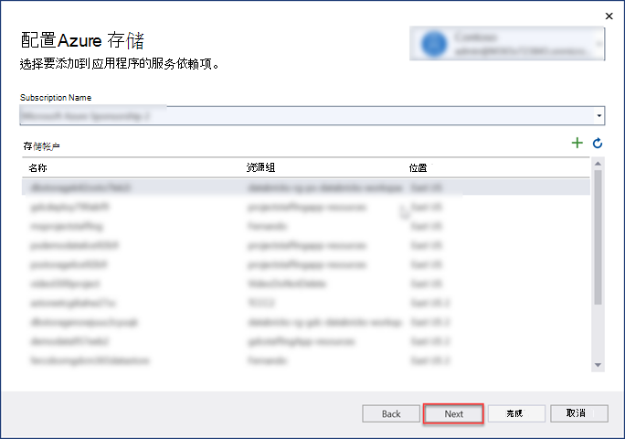

1. 为连接 **Azure 存储** **AzureStorageConnectionString 的名称，然后选择**"下一 **步"。**
1. 选择 **“完成”**。

    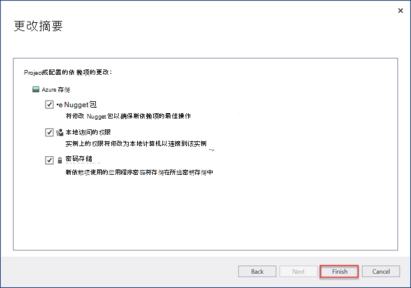

## <a name="create-a-new-model-class-that-will-be-used-to-store-the-email-metrics"></a>创建将用于存储电子邮件指标的新模型类

1. 在"**解决方案资源管理器**"工具窗口中，右键单击 **"模型**"文件夹，然后选择"**添加>类"。**

    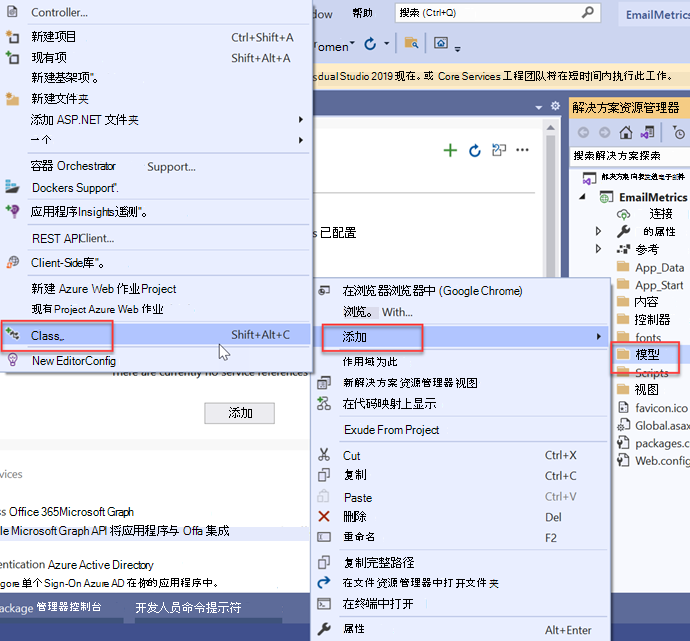

1. 在"**添加新项"对话框中**，选择 **"类**"，将文件名称设置为 _EmailMetric.cs，_ 然后选择"**添加"。**

1. 将以下代码添加到刚创建的 EmailMetric 类。

    ```csharp
    public string Email;
    public double RecipientsToEmail;
    ```

## <a name="create-a-new-controller-that-will-calculate-and-display-the-results"></a>创建一个将计算和显示结果的新控制器

1. 右键单击 **Controllers** 文件夹，然后选择"**添加>控制器"。**

1. 在"**添加基** 架"对话框中，选择 **"MVC 5 控制器 - 空"，** 然后选择"**添加"。**

1. 当系统提示时，命名控制器 **EmailMetricsController，** 然后选择"确定 **"。**

1. 在包含 **EmailMetricsController** 类的文件顶部的现有 using 语句后添加以下 using 语句。

    ```csharp
    using System.Collections.Generic;
    using System.Configuration;
    using System.IO;
    using System.Linq;
    using System.Threading.Tasks;
    using System.Web.Mvc;
    using Azure.Storage.Blobs;
    using Azure.Storage.Blobs.Models;
    using Newtonsoft.Json.Linq;
    ```

1. 将以下代码添加到 **EmailMetricsController** 类。 这些将用于连接到包含导出 **Azure 存储** 的用户帐户。

    ```csharp
    private const string connectionStringName = "AzureStorageConnectionString";
    private const string emailBlobName = "m365mails";

    ```

1. 将以下方法添加到 **EmailMetricsController** 类。 这将处理 **Azure Blob** 并更新一个集合，该集合代表电子邮件帐户以及为提取的帐户找到的所有电子邮件中合并的收件人数。

    ```csharp
    private async Task ProcessBlobEmails(List<Models.EmailMetric> emailMetrics, BlobClient emailBlob)
    {
        using (var stream = new MemoryStream())
        {
            var response = await emailBlob.DownloadToAsync(stream);
            var pos = stream.Seek(0, SeekOrigin.Begin);

            using (var reader = new StreamReader(stream))
            {

                string line;
                while ((line = reader.ReadLine()) != null)
                {
                    var jsonObj = JObject.Parse(line);

                    // extract sender
                    var sender = jsonObj.SelectToken("Sender.EmailAddress.Address")?.ToString();
                    // No sender - skip this one
                    if (string.IsNullOrEmpty(sender)) continue;

                    // extract and count up recipients
                    var totalRecipients = 0;
                    totalRecipients += jsonObj.SelectToken("ToRecipients")?.Children().Count() ?? 0;
                    totalRecipients += jsonObj.SelectToken("CcRecipients")?.Children().Count() ?? 0;
                    totalRecipients += jsonObj.SelectToken("BccRecipients")?.Children().Count() ?? 0;

                    var emailMetric = new Models.EmailMetric();
                    emailMetric.Email = sender;
                    emailMetric.RecipientsToEmail = totalRecipients;

                    // if already have this sender...
                    var existingMetric = emailMetrics.FirstOrDefault(metric => metric.Email == emailMetric.Email);
                    if (existingMetric != null)
                    {
                        existingMetric.RecipientsToEmail += emailMetric.RecipientsToEmail;
                    }
                    else
                    {
                        emailMetrics.Add(emailMetric);
                    }
                }
            }
        }
    }
    ```

1. 将以下方法添加到 **EmailMetricsController** 类。 这将枚举指定帐户的指定Azure 存储中所有 blob，并将每个 blob 发送到上一步 `ProcessBlobEmails()` 中添加的方法。

    ```csharp
    private async Task<List<Models.EmailMetric>> ProcessBlobFiles()
    {
        var emailMetrics = new List<Models.EmailMetric>();
        var connectionString = ConfigurationManager.ConnectionStrings[connectionStringName];

        // Connect to the storage account
        var containerClient = new BlobContainerClient(connectionString.ConnectionString, emailBlobName);

        foreach (var blob in containerClient.GetBlobs())
        {
            if (blob.Properties.BlobType == BlobType.Block &&
                // Don't process blobs in the metadata folder
                !blob.Name.StartsWith("metadata/"))
            {
                var blobClient = containerClient.GetBlobClient(blob.Name);
                await ProcessBlobEmails(emailMetrics, blobClient);
            }
        }

        return emailMetrics;
    }
    ```

1. 将以下操作添加到 **EmailMetricsController，** 它将使用添加此类的方法处理电子邮件并将结果发送到视图。

    ```csharp
    [HttpPost, ActionName("ShowMetrics")]
    [ValidateAntiForgeryToken]
    public async Task<ActionResult> ShowMetrics()
    {
        var emailMetrics = await ProcessBlobFiles();

        return View(emailMetrics);
    }
    ```

## <a name="create-a-new-view-for-the-emailmetrics-index-action"></a>为 EmailMetrics 索引操作创建新视图

1. 在"**解决方案资源管理器**"工具窗口中，右键单击"视图 **">"EmailMetrics"** 文件夹，然后选择"添加>**视图"。**

1. 在"**添加新基架项目**"对话框中，选择 **"MVC 5** 视图"，然后选择"添加 **"。**

1. 在"**添加视图"** 对话框中，将"**视图** 名称"设置为 **"索引**"，将其余输入控件保留为默认值，然后选择"添加 **"。**

    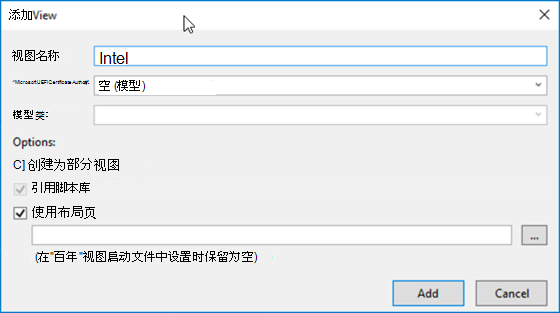

1. 将 EmailMetrics 中的新 **Views > _Index.cshtml >中的标记_** 更新为以下内容。 这将添加一个表单，该表单具有一个按钮，该按钮将 HTTP POST 提交到上一步添加的自定义控制器操作。

    ```html
    @{
    ViewBag.Title = "Index";
    }

    <h2>Email Metrics</h2>
    ```

1. 此应用程序将查看提取到 **Azure Blob** 帐户存储电子邮件的电子邮件数据，并显示每个发件人的收件人总数。

    ```html
    @using (Html.BeginForm("ShowMetrics", "EmailMetrics", FormMethod.Post))
    {
    @Html.AntiForgeryToken()
    <div>
        <button type="submit">View email metrics</button>
    </div>

    <div>
        <em>Please be patient as this can take a few moments to calculate depending on the size of the exported data...</em>
    </div>
    }
    ```

## <a name="create-a-new-view-for-the-emailmetrics-showmetrics-action"></a>为 EmailMetrics ShowMetrics 操作创建新视图

1. 在"**解决方案资源管理器**"工具窗口中，右键单击"视图 **">"EmailMetrics"** 文件夹，然后选择"添加>**视图"。**

1. 在"**添加视图"** 对话框中，设置以下值，将其余输入控件保留为默认值，然后选择"添加 **"。**

    - **视图名称**：ShowMetrics
    - **模板**：列表
    - **Model 类**：EmailMetric (EmailMetric.Models) 

        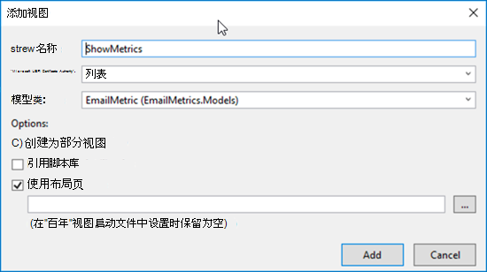

    >[!TIP]
    > 如果你看不到下拉框中的 **EmailMetric** 模型，请生成解决方案。

1. 将 **_ShowMetrics.cshtml_** 中新的 Views > EmailMetrics >中的标记更新为以下内容。 这将显示计算结果。

    ```html
    @model IEnumerable<EmailMetrics.Models.EmailMetric>

    @{
    ViewBag.Title = "ShowMetrics";
    }

    <h2>Email Metrics</h2>

    <table class="table">
    <tr>
        <th>Sender</th>
        <th>Number of Recipients</th>
    </tr>

    @foreach (var item in Model)
    {
    <tr>
        <td>@Html.DisplayFor(modelItem => item.Email)</td>
        <td>@Html.DisplayFor(modelItem => item.RecipientsToEmail)</td>
    </tr>
    }

    </table>
    ```

## <a name="update-the-navigation-to-have-a-way-to-get-to-the-new-controller"></a>更新导航以具有到达新控制器的方法

1. 在" **解决方案资源管理器** "工具窗口中，找到并打开文件 Views **> Shared > _Layout.cshtml_**。
1. 用以下代码替换内容。

    ```html
    <!-- new code -->
    <li>@Html.ActionLink("Email Metrics", "Index", "EmailMetrics")</li>
    ```

## <a name="test-the-application"></a>测试应用程序

1. In Visual Studio， select **Debug > Start Debugging**.

1. 构建应用程序并加载到新的浏览器窗口中时，选择顶部导航栏中的"电子邮件指标"项。

1. 在" **电子邮件指标"** 页上，选择" **查看电子邮件指标"** 按钮。

    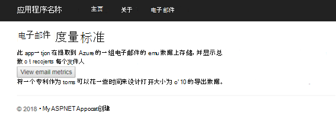

1. 加载页面时，你将看到在所有电子邮件中找到的电子邮件地址列表，其中包含在两者之间发送的所有收件人的总和，如下图测试电子邮件提取中的一个小示例集所示。

    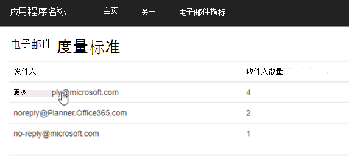
