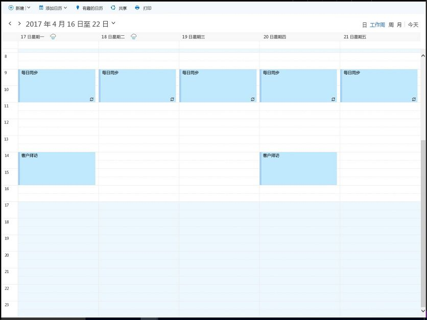
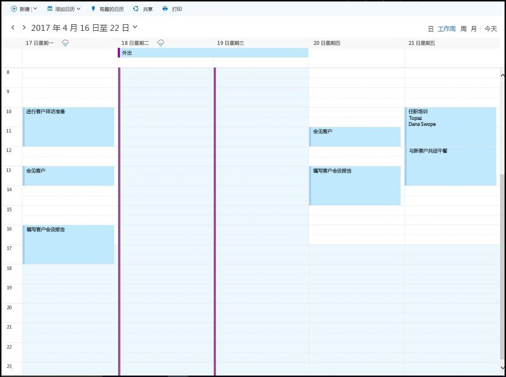

# <a name="find-possible-meeting-times-on-the-outlook-calendar"></a><span data-ttu-id="48a0b-104">在 Outlook 日历上找到可能的会议时间</span><span class="sxs-lookup"><span data-stu-id="48a0b-104">Find possible meeting times on the Outlook calendar</span></span>

<span data-ttu-id="48a0b-p102">在工作场所或学校，寻找开会的公共时间和场所经常会产生开销。Microsoft Graph 应用程序可使用 [findMeetingTimes](/graph/api/user-findmeetingtimes?view=graph-rest-1.0) 标识满足时间、位置和其他限制条件要求的可能的会议时间。</span><span class="sxs-lookup"><span data-stu-id="48a0b-p102">In a workplace or school, looking for a common time and place to meet often incurs overhead. Microsoft Graph applications can use [findMeetingTimes](/graph/api/user-findmeetingtimes?view=graph-rest-1.0) to identify any possible meeting times that satisfy time, location, and other constraints.</span></span>   

<span data-ttu-id="48a0b-p103">**FindMeetingTimes** 操作使你可以指定条件，如会议日期/时间范围、持续时间、可选或必选的与会者，以及活动性质 (**activityDomain**)。该操作考虑到与会者和组织者正常的工作计划和忙/闲状态，并建议适合参与者和活动类型的时间。例如，建议列表会首先列出组织者和与会者工作时间经常发生的与工作相关的活动的建议，以及所需与会者的位置的建议。</span><span class="sxs-lookup"><span data-stu-id="48a0b-p103">The **findMeetingTimes** action lets you specify conditions such as the meeting date/time range, duration, optional or required attendees, and nature of the activity (**activityDomain**). The action takes into account the attendees' and organizer's normal work schedules and free/busy status, and suggests times that are appropriate for the participants and type of activity. For instance, suggestions for a work-related activity always occur during the work hours of the organizer and attendees, and suggestions where required attendees are available are ordered higher up in the suggested list.</span></span>

<span data-ttu-id="48a0b-p104">在 Microsoft 365 中，可以为每个邮箱配置工作时间和时区。**FindMeetingTimes** 操作处理组织者和与会者之间的时区变化。默认情况下，**findMeetingTimes** 返回 UTC 格式的建议。你可以使用下列请求头，让 **findMeetingTimes** 返回以特定时区表达的建议。</span><span class="sxs-lookup"><span data-stu-id="48a0b-p104">In Microsoft 365, work hours and time zones are configurable per mailbox. The **findMeetingTimes** action handles time zone variations among the organizer and attendees. By default, **findMeetingTimes** returns suggestions in UTC. You can use the following request header to have **findMeetingTimes** return suggestions expressed in a specific time zone.</span></span>
``` http
Prefer: outlook.timezone="{time-zone-string}}"
```

<span data-ttu-id="48a0b-114">这对于大型会议特别有用，你可以为仲裁指定一个百分比 (**minimumAttendeePercentage**)，并且让 **findMeetingTimes** 仅在满足最低与会者可用性时返回建议。</span><span class="sxs-lookup"><span data-stu-id="48a0b-114">Especially useful for larger meetings, you can specify a percentage (**minimumAttendeePercentage**) for a quorum and have **findMeetingTimes** return suggestions only if that minimum attendee availability is met.</span></span>

<span data-ttu-id="48a0b-p105">如果 **findMeetingTimes** 无法提出任何会议时间建议，则它指示某个特定原因 (**emptySuggestionsReason**)，如组织者或需要的与会者没有空。根据此值，可以更好地调整参数，并重新调用 **findMeetingTimes**。</span><span class="sxs-lookup"><span data-stu-id="48a0b-p105">If **findMeetingTimes** cannot suggest any meeting times, it indicates a specific reason (**emptySuggestionsReason**), such as the organizer or a required attendee not available. Based on this value, you can better adjust the parameters and call **findMeetingTimes** again.</span></span>

><span data-ttu-id="48a0b-117">**注意** **findMeetingTimes** 操作当前仅对 Microsoft 365 工作或学校邮箱可用，对个人 outlook.com 邮箱不可用。</span><span class="sxs-lookup"><span data-stu-id="48a0b-117">**Note** The **findMeetingTimes** action is currently available to Microsoft 365 work or school mailboxes, but not personal, outlook.com mailboxes.</span></span>

## <a name="example"></a><span data-ttu-id="48a0b-118">示例</span><span class="sxs-lookup"><span data-stu-id="48a0b-118">Example</span></span>

<span data-ttu-id="48a0b-p106">以下示例显示了如何使用 **findMeetingTimes** 返回 2 个用户可以开会几小时的可能时间，并将用户的闲/忙和工作计划以及与会者离开了某段时间纳入考虑之中。因为仅有 2 个用户参与此会议，建议要求出席率达到 100%。下面显示了用户的忙/闲计划。</span><span class="sxs-lookup"><span data-stu-id="48a0b-p106">The following example shows how to use **findMeetingTimes** to return possible times for 2 users to meet for a couple of hours, taking into account the users' free/busy and work schedules, and the attendee being away for part of the time. Because there are only 2 users for this meeting, suggestions require 100% attendance. The following shows the users' free/busy schedule.</span></span>

### <a name="organizers-calendar"></a><span data-ttu-id="48a0b-122">组织者的日历</span><span class="sxs-lookup"><span data-stu-id="48a0b-122">Organizer's calendar</span></span>

<span data-ttu-id="48a0b-123"></span><span class="sxs-lookup"><span data-stu-id="48a0b-123"></span></span>

### <a name="attendees-calendar"></a><span data-ttu-id="48a0b-124">与会者的日历</span><span class="sxs-lookup"><span data-stu-id="48a0b-124">Attendee's calendar</span></span>

<span data-ttu-id="48a0b-125"></span><span class="sxs-lookup"><span data-stu-id="48a0b-125"></span></span>

<span data-ttu-id="48a0b-126">该示例调用 **findMeetingTimes** 两次：</span><span class="sxs-lookup"><span data-stu-id="48a0b-126">The example makes 2 calls to **findMeetingTimes**:</span></span>

1. <span data-ttu-id="48a0b-p107">第一次调用在 4 月 18 到 20 日的时间范围内查找。由于与会者在 4 月 18 到 19 日期间外出，4 月 20 日一般不会有空，第一次调用不会返回建议，原因 (**emptySuggestionsReason**) 是与会者没有空。</span><span class="sxs-lookup"><span data-stu-id="48a0b-p107">The first call looks in the date range of April 18-20. As the attendee is out-of-office on April 18-19, and there is no commonly available time on April 20, the first call returns no suggestions with the reason (**emptySuggestionsReason**) that attendees are not available.</span></span>
2. <span data-ttu-id="48a0b-129">第二次调用查找 4 月 21 日的可用性并返回下午 2-4 点的建议。</span><span class="sxs-lookup"><span data-stu-id="48a0b-129">The second call looks for availability on April 21 and returns a suggestion of 2-4pm.</span></span>

<span data-ttu-id="48a0b-p108">两次 **findMeetingTimes** 调用包含以下参数。**findMeetingTimes** 的所有 [参数](/graph/api/user-findmeetingtimes?view=graph-rest-1.0#request-body)都是可选的。</span><span class="sxs-lookup"><span data-stu-id="48a0b-p108">The two calls to **findMeetingTimes** include the following parameters. All [parameters](/graph/api/user-findmeetingtimes?view=graph-rest-1.0#request-body) for **findMeetingTimes** are optional.</span></span>

- <span data-ttu-id="48a0b-132">**与会者**：一位与会者 Samantha Booth 的 **类型** 属性设置为 `required`</span><span class="sxs-lookup"><span data-stu-id="48a0b-132">**attendees**: one attendee, Samantha Booth, set as `required` for the **type** property</span></span>
- <span data-ttu-id="48a0b-133">**locationConstraint**：不需要任何位置建议</span><span class="sxs-lookup"><span data-stu-id="48a0b-133">**locationConstraint**: does not require any location suggestion</span></span>
- <span data-ttu-id="48a0b-134">**timeConstraint**：第一次调用查找日期/时间范围 4 月 18 日上午 9 点到 4 月 20 日下午 5 点；如果第一次调用未能建议任何时间，第二次调用查找范围 4 月 21 日上午 9 点到下午 5 点</span><span class="sxs-lookup"><span data-stu-id="48a0b-134">**timeConstraint**: the first call looks in the date/time range of April 18, 9am to April 20, 5pm; after the first call fails to suggest any times, the second call looks at April 21, 9am to 5pm</span></span>
- <span data-ttu-id="48a0b-135">**meetingDuration**：两个小时</span><span class="sxs-lookup"><span data-stu-id="48a0b-135">**meetingDuration**: two hours</span></span>
- <span data-ttu-id="48a0b-136">**returnSuggestionReasons**：本示例要求为每个建议提供一个原因</span><span class="sxs-lookup"><span data-stu-id="48a0b-136">**returnSuggestionReasons**: this example requires a reason for each suggestion</span></span>
- <span data-ttu-id="48a0b-137">**minimumAttendeePercentage**：100%，因为与会者必须能够在任何建议的时间出席</span><span class="sxs-lookup"><span data-stu-id="48a0b-137">**minimumAttendeePercentage**: 100%, as the attendee must be able to attend for any suggested time</span></span>

### <a name="first-request"></a><span data-ttu-id="48a0b-138">第一个请求</span><span class="sxs-lookup"><span data-stu-id="48a0b-138">First request</span></span>

<span data-ttu-id="48a0b-139">为两个用户查找 4 月 18 到 20 日之间 2 小时的空闲时间空挡。</span><span class="sxs-lookup"><span data-stu-id="48a0b-139">Look for a 2-hour free time slot for both users over April 18-20.</span></span>

<!-- {
  "blockType": "ignored",
  "name": "findmeetingtimes_example_first"
}-->
```http
POST https://graph.microsoft.com/v1.0/me/findMeetingTimes
Prefer: outlook.timezone="Pacific Standard Time"
Content-type: application/json

{ 
  "attendees": [ 
    { 
      "type": "required",  
      "emailAddress": { 
        "name": "Samantha Booth",
        "address": "samanthab@contoso.onmicrosoft.com" 
      } 
    }
  ],  
  "locationConstraint": { 
    "isRequired": false,  
    "suggestLocation": false,  
    "locations": [ 
      { 
        "resolveAvailability": false,
        "displayName": "Conf room Hood" 
      } 
    ] 
  },  
  "timeConstraint": {
    "activityDomain":"work", 
    "timeslots": [ 
      { 
        "start": { 
          "dateTime": "2017-04-18T09:00:00",  
          "timeZone": "Pacific Standard Time" 
        },  
        "end": { 
          "dateTime": "2017-04-20T17:00:00",  
          "timeZone": "Pacific Standard Time" 
        } 
      } 
    ] 
  },  
  "meetingDuration": "PT2H",
  "returnSuggestionReasons": true,
  "minimumAttendeePercentage": 100
}
```

### <a name="first-response"></a><span data-ttu-id="48a0b-140">第一个响应</span><span class="sxs-lookup"><span data-stu-id="48a0b-140">First response</span></span>
<span data-ttu-id="48a0b-141">当这两个用户均有空时，4 月 18 到 20 日工作时间内没有 2 小时的时间空挡。</span><span class="sxs-lookup"><span data-stu-id="48a0b-141">There is no 2-hour time slot during the work hours of April 18-20 when both users are available.</span></span>
<!-- {
  "blockType": "ignored",
  "truncated": true,
  "@odata.type": "microsoft.graph.meetingTimeSuggestionsResult",
  "isCollection": false
} -->
```http
HTTP/1.1 200 OK
Content-type: application/json
Preference-Applied: outlook.timezone="Pacific Standard Time"
Content-Length: 184

{
    "@odata.context":"https://graph.microsoft.com/v1.0/$metadata#microsoft.graph.meetingTimeSuggestionsResult",
    "emptySuggestionsReason":"AttendeesUnavailable",
    "meetingTimeSuggestions":[

    ]
}
```

### <a name="second-request"></a><span data-ttu-id="48a0b-142">第二个请求</span><span class="sxs-lookup"><span data-stu-id="48a0b-142">Second request</span></span>
<span data-ttu-id="48a0b-143">在 4 月 21 日寻找 2 小时的时间空挡。</span><span class="sxs-lookup"><span data-stu-id="48a0b-143">Look for a 2-hour time slot on April 21.</span></span>
<!-- {
  "blockType": "ignored",
  "name": "findmeetingtimes_example_second"
}-->
```http
POST https://graph.microsoft.com/v1.0/me/findMeetingTimes
Prefer: outlook.timezone="Pacific Standard Time"
Content-type: application/json

{ 
  "attendees": [ 
    { 
      "type": "required",  
      "emailAddress": { 
        "name": "Samantha Booth",
        "address": "samanthab@contoso.onmicrosoft.com" 
      } 
    }
  ],  
  "locationConstraint": { 
    "isRequired": false,  
    "suggestLocation": false,  
    "locations": [ 
      { 
        "resolveAvailability": false,
        "displayName": "Conf room Hood" 
      } 
    ] 
  },  
  "timeConstraint": {
    "activityDomain":"work", 
    "timeslots": [ 
      { 
        "start": { 
          "dateTime": "2017-04-21T09:00:00",  
          "timeZone": "Pacific Standard Time" 
        },  
        "end": { 
          "dateTime": "2017-04-21T17:00:00",  
          "timeZone": "Pacific Standard Time" 
        } 
      } 
    ] 
  },  
  "meetingDuration": "PT2H",
  "returnSuggestionReasons": true,
  "minimumAttendeePercentage": 100
}
```

### <a name="second-response"></a><span data-ttu-id="48a0b-144">第二个响应</span><span class="sxs-lookup"><span data-stu-id="48a0b-144">Second response</span></span>
<span data-ttu-id="48a0b-145">第二个 **findMeetingTimes** 请求建议两个用户在 4 月 21 日下午 2-4 点开会。</span><span class="sxs-lookup"><span data-stu-id="48a0b-145">The second **findMeetingTimes** request suggests April 21, 2-4pm for both users to meet.</span></span>
<!-- {
  "blockType": "ignored",
  "truncated": true,
  "@odata.type": "microsoft.graph.meetingTimeSuggestionsResult",
  "isCollection": false
} -->
```http
HTTP/1.1 200 OK
Content-type: application/json
Preference-Applied: outlook.timezone="Pacific Standard Time"
Content-Length: 714

{
    "@odata.context":"https://graph.microsoft.com/v1.0/$metadata#microsoft.graph.meetingTimeSuggestionsResult",
    "emptySuggestionsReason":"",
    "meetingTimeSuggestions":[
        {
            "confidence":100.0,
            "organizerAvailability":"free",
            "suggestionReason":"Suggested because it is one of the nearest times when all attendees are available.",
            "meetingTimeSlot":{
                "start":{
                    "dateTime":"2017-04-21T14:00:00.0000000",
                    "timeZone":"Pacific Standard Time"
                },
                "end":{
                    "dateTime":"2017-04-21T16:00:00.0000000",
                    "timeZone":"Pacific Standard Time"
                }
            },
            "attendeeAvailability":[
                {
                    "availability":"free",
                    "attendee":{
                        "type":"required",
                        "emailAddress":{
                            "address":"samanthab@contoso.onmicrosoft.com"
                        }
                    }
                }
            ],
            "locations":[
                {
                    "displayName":"Conf room Hood"
                }
            ]
        }
    ]
}
```


## <a name="next-steps"></a><span data-ttu-id="48a0b-146">后续步骤</span><span class="sxs-lookup"><span data-stu-id="48a0b-146">Next steps</span></span>

<span data-ttu-id="48a0b-p109">有时，不是所有与会者都可以参加会议。如果与会者的 _置信度_ 达到某个百分比（可指定 **minimumAttendeePercentage** 可选参数），你可以让 **findMeetingTimes** 建议一个时间。了解有关 [会议建议置信度](/graph/api/user-findmeetingtimes?view=graph-rest-1.0#the-confidence-of-a-meeting-suggestion)和其他 [参数](/graph/api/user-findmeetingtimes?view=graph-rest-1.0#request-body)的详细信息，并根据需要将其用于大型会议。</span><span class="sxs-lookup"><span data-stu-id="48a0b-p109">There are times when not all attendees can attend a meeting. You can have **findMeetingTimes** suggest a time if the _confidence_ for attendance reaches a certain percentage, by specifying the **minimumAttendeePercentage** optional parameter. Learn more about the [confidence of a meeting suggestion](/graph/api/user-findmeetingtimes?view=graph-rest-1.0#the-confidence-of-a-meeting-suggestion) and other [parameters](/graph/api/user-findmeetingtimes?view=graph-rest-1.0#request-body), and apply them as appropriate for meetings of larger sizes.</span></span>

<span data-ttu-id="48a0b-150">获取会议时间建议后，可能需要：</span><span class="sxs-lookup"><span data-stu-id="48a0b-150">After getting meeting time suggestions, you may want to:</span></span>

1. <span data-ttu-id="48a0b-151">[创建事件并将其作为会议请求发送](/graph/api/user-post-events?view=graph-rest-1.0)。</span><span class="sxs-lookup"><span data-stu-id="48a0b-151">[Create an event and send it as a meeting request](/graph/api/user-post-events?view=graph-rest-1.0).</span></span>
2. <span data-ttu-id="48a0b-152">在事件中[添加附件](/graph/api/event-post-attachments?view=graph-rest-1.0)。</span><span class="sxs-lookup"><span data-stu-id="48a0b-152">[Add an attachment](/graph/api/event-post-attachments?view=graph-rest-1.0) to the event.</span></span>

<span data-ttu-id="48a0b-153">了解更多关于[与 Outlook 日历集成](outlook-calendar-concept-overview.md)的信息。</span><span class="sxs-lookup"><span data-stu-id="48a0b-153">Find out more about [integrating with Outlook calendar](outlook-calendar-concept-overview.md).</span></span>
