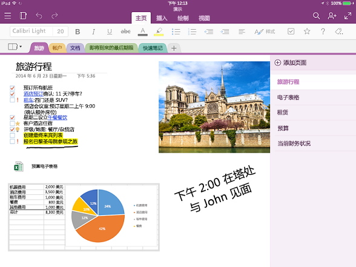

# OneNote API 概述OneNote API overview

OneNote 是一个数字笔记本，可让客户通过在 Web、手机、平板电脑或桌面上键入、草绘或语音来跟踪家庭、学校或工作方面的想法和笔记。OneNote is a digital notebook that lets customers track ideas and notes for home, school, or work, by typing, sketching, or voice, on the web, phone, tablet, or desktop. 用户可以随意整理笔记、切换设备、接续之前的工作，以及通过与他人实时交互笔记展开协作。They can freely organize notes, switch devices and pick up where they leave off, and collaborate on notes with others in real time.

## 为什么与 OneNote 集成？Why integrate with OneNote?

通过将应用与 OneNote 集成，可以在服务于全球数百万用户的多个平台中创建强大的体验。By integrating your apps with OneNote, you can create empowering experiences across multiple platforms that reach millions of users worldwide. 可以使用 Microsoft Graph 访问 OneNote 中的笔记本、节和页面，从而创建可帮助用户计划和管理想法和信息的解决方案。You can use Microsoft Graph to access notebooks, sections, and pages in OneNote to create solutions that help your users plan and organize ideas and information.

### 收集并整理笔记和想法Collect and organize notes and ideas  

将 OneNote 用作画布，用户可以在其中添加和排列他们的内容。Use OneNote as a canvas where users can add and arrange their content. 借助 Microsoft Graph，可以轻松地编写应用，让学生做笔记并进行研究、让家庭分享计划和想法或让购物者分享图片。Microsoft Graph makes it easy to write apps that enable students to take notes and do research, families to share plans and ideas, or shoppers to share pictures. 应用可以捕获用户所需的信息，将其发送到 OneNote，然后帮助用户管理这些信息。Your app can grab the information people want, send it to OneNote, and then help them organize it.

### 以多种格式捕获信息Capture information in many formats

捕获 HTML、嵌入的图像（源自本地或公共 URL）、视频、音频、电子邮件和其他常见的文件类型。Capture HTML, embed images (sourced locally or at a public URL), video, audio, email messages, and other common file types. OneNote 甚至还能够以快照的形式呈现网页和 PDF 文件。OneNote can even render webpages and PDF files as snapshots. Microsoft Graph 支持 OneNote 页面布局的一组标准 HTML 和 CSS，因此，用户可以使用表、内嵌图像和基本格式以获取所需的外观。Microsoft Graph supports a set of standard HTML and CSS for OneNote page layout, so you can use tables, inline images, and basic formatting to get the look you want. 

### 使用 OneNote 生态系统增强核心方案Use the OneNote ecosystem to enhance your core scenarios

了解 OneNote 其他强大的功能。Tap into other powerful OneNote features. Microsoft Graph 中的 OneNote API 在图像上运行 OCR、支持全文搜索、自动同步客户端、处理图像和提取名片捕获、联机产品以及方法列表。The OneNote APIs in Microsoft Graph run OCR on images, support full-text search, auto-syncs clients, process images, and extract business card captures and online product and recipe listings. 针对笔记和轻型媒体，在云中将 OneNote 用作数字内存存储，或针对特定于域的数据用作数据馈送。Use OneNote as your digital memory store in the cloud for notes and lightweight media, or as a data feed for domain-specific data. 

### 服务于所有主要平台上的数百万 OneNote 用户Reach millions of OneNote users on all major platforms

使用 OneNote 提高应用使用率。Use OneNote to increase your app usage. 在新的 Windows 设备上预安装了 OneNote，可作为 Office 365 的一部分联机用于大部分平台。OneNote is preinstalled on new Windows devices, and is available for most platforms, online, and as part of Office 365. 发布使用功能丰富的 OneNote 环境的应用时，可以获得广泛的跨平台市场潜力。When you publish apps that use the feature-rich OneNote environment, you have access to broad cross-platform market potential.

<!-- Might be good to show a few examples of Microsoft Graph API calls here, similar to what we have in the featured scenarios topic: https://developer.microsoft.com/en-us/graph/docs/concepts/featured_scenarios. You could have an H2 section called "What can I do with OneNote APIs in Microsoft Graph?"-->

## 可以通过 Microsoft Graph 中的 OneNote API 实现什么功能？What can I do with OneNote APIs in Microsoft Graph?

以下是使用 OneNote 资源的一些最热门的请求。The following are some of the most popular requests for working with OneNote resources.

|操作Operation|URLURL|
|:--------|:--|
|获取我的笔记本GET my notebooks|[https://graph.microsoft.com/v1.0/me/onenote/notebooks](https://developer.microsoft.com/en-us/graph/graph-explorer?request=me/onenote/notebooks&version=1.0)|
|获取我的部分GET my sections|[https://graph.microsoft.com/v1.0/me/onenote/sections](https://developer.microsoft.com/en-us/graph/graph-explorer?request=me/onenote/sections&version=1.0)|
|获取我的页面GET my pages|[https://graph.microsoft.com/v1.0/me/onenote/pages](https://developer.microsoft.com/en-us/graph/graph-explorer?request=me/onenote/pages&version=1.0)|

## 详细了解 OneNote APILearn more about OneNote APIs

深入探索 Microsoft Graph API 以了解 OneNote 内容更新功能。Take an in-depth look at Microsoft Graph APIs to learn about the OneNote content updating capabilities. 以下列表中的主题说明如何创建新的 OneNote 页并用新内容更新现有页。The topics in the following list show you how to create new OneNote pages and update existing pages with new content. 此外，还将了解使用 Microsoft Graph 更新 OneNote 笔记本的最佳做法。You'll also learn about best practices in using Microsoft Graph to update OneNote notebooks. 

### 使用 OneNoteWork with OneNote

* [使用 OneNote REST APIUse the OneNote REST API](../api-reference/v1.0/resources/onenote-api-overview.md)
* [最佳做法Best practices](onenote_best_practices.md)
* [品牌塑造准则Branding guidelines](onenote-branding.md)
* [打开 OneNote 客户端Open the OneNote client](open_onenote_client.md)
* [在 OneNote 页中使用笔记标记Use note tags in OneNote pages](onenote-note-tags.md)
* [Microsoft Graph 中的 OneNote API 错误代码Error codes for OneNote APIs in Microsoft Graph](onenote_error_codes.md)

### 使用 OneNote 页Work with OneNote pages

* [OneNote 页中的输入和输出 HTMLInput and output HTML in OneNote pages](onenote_input_output_html.md)
* [使用 Microsoft Graph 获取 OneNote 内容和结构Get OneNote content and structure with Microsoft Graph](onenote-get-content.md)
* [创建 OneNote 页Create OneNote pages](onenote-create-page.md)
* [更新 OneNote 页内容Update OneNote page content](onenote_update_page.md)

### 使用 OneNote 页内容Work with OneNote page content

* [在 OneNote 页中创建绝对定位的元素Create absolute positioned elements in OneNote pages](onenote-abs-pos.md)
* [将图像、视频和文件添加到 OneNote 页Add images, videos, and files to OneNote pages](onenote_images_files.md)
* [使用 OneNote API div 标签从捕获内容中提取数据Use OneNote API div tags to extract data from captures](onenote-extract-data.md)

## 探索 OneNote APIExplore the OneNote APIs

使用 [Microsoft Graph 浏览器](https://developer.microsoft.com/zh-CN/graph/graph-explorer)在你自己的 OneNote 笔记本中试用 OneNote API。Use the [Microsoft Graph Explorer](https://developer.microsoft.com/zh-CN/graph/graph-explorer) to try out the OneNote APIs with your own OneNote notebooks.

若要在 Graph 浏览器中进行 OneNote API 调用，请选择左侧栏中的“显示更多示例”****。To make OneNote API calls from the Graph Explorer, choose **Show more samples** in the column on the left. 使用菜单将 OneNote 切换至“打开”****。Use the menu to toggle OneNote **On**. 还需要启用相应的权限。You will also need to enable the appropriate permissions. 在左侧菜单中的帐户名称中，选择“修改权限”****。Under your account name in the menu on the left, choose **modify permissions**. 有关 OneNote 权限的详细信息，请参阅[笔记权限](permissions_reference.md#notes-permissions)。For more information about OneNote permissions, see [Notes permissions](permissions_reference.md#notes-permissions).

若要开始在 Microsoft Graph 中使用 OneNote API，请参阅 [OneNote 参考内容](../api-reference/v1.0/resources/onenote-api-overview.md)。To get started with OneNote APIs in Microsoft Graph, see the [OneNote reference content](../api-reference/v1.0/resources/onenote-api-overview.md).

## 另请参阅See also

- [OneNote 开发OneNote development](https://docs.microsoft.com/zh-CN/previous-versions/office/office-365-api/how-to/onenote-landing)
- [处理课堂笔记本Work with class notebooks](https://docs.microsoft.com/zh-CN/previous-versions/office/office-365-api/how-to/onenote-classnotebook)
- [使用异步课堂笔记本Work with class notebooks](https://docs.microsoft.com/zh-CN/previous-versions/office/office-365-api/how-to/onenote-classnotebook-asynchronous)
- [使用教职员工笔记本Work with staff notebooks](https://docs.microsoft.com/zh-CN/previous-versions/office/office-365-api/how-to/onenote-staffnotebook)
- [复制笔记本、节和页面Copy notebooks, sections, and pages](https://docs.microsoft.com/zh-CN/previous-versions/office/office-365-api/how-to/onenote-copy)
- [管理 OneNote 实体的权限Manage permissions on OneNote entities](https://docs.microsoft.com/zh-CN/previous-versions/office/office-365-api/how-to/onenote-manage-perms)
- [使用网页上的 OneNote 保存对话框Use the OneNote save dialog on your web pages](https://docs.microsoft.com/zh-CN/previous-versions/office/office-365-api/how-to/onenote-save-dialog)
- [订阅 WebhookSubscribe to webhooks](https://docs.microsoft.com/zh-CN/previous-versions/office/office-365-api/how-to/onenote-sync)
