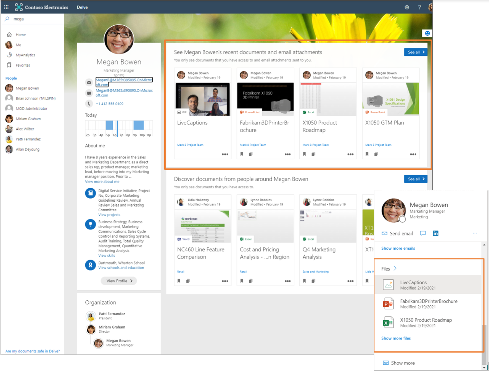

# 项见解概述

项见解是基于你在 Microsoft 365 中的协作工作，向你和与你协作的人员提供的以用户为中心的建议。

> [!VIDEO https://www.microsoft.com/en-us/videoplayer/embed/RWPGbr] 

## 项见解的计算
Microsoft 365 是面向全球的生产力云，其中许多功能都是围绕你即用户而设计的。 通过与资源（如 Microsoft 365 中的文件）进行交互，可以生成 Microsoft 聚合并汇集到组织图形中的信号。 在图中，信号数据表示为你和其他资源之间的关系。 从图中信号派生的是支持一些 Microsoft 365 体验的见解。 体验示例包括建议下一次团队会议的最佳时间、帮助你整理手机上的个人和工作信息，以及许多其他智能方案。 

什么是与 Microsoft 365 资源的交互？项见解是如何从中产生的？ 通过 Microsoft 365，可以通过多种方式与同事协作 - 在 Teams 聊天或频道对话中与同事针对 SharePoint 中的列表、OneDrive for Business 中的 PowerBI 报表、SharePoint 网站、Teams 或 Outlook 电子邮件等文档进行聊天。 Microsoft 从分析活动（如修改、评论或共享）中获取见解，并应用这些见解，通过针对 Microsoft 365 用户的建议提供以用户为中心的体验，从而提高公司的整体工作效率。 项见解是 Microsoft 使用高级机器学习技术计算得出的一种见解，并作为内容建议应用于你和组织内的同事。

> [!NOTE]
> 本文不处理 Microsoft 365 中其他基于见解的体验，例如 Viva Insights、适用于 Outlook 的 Insights 加载项、WorkWith 功能、MyAnalytics 和 Insights 仪表板。 

## Microsoft 365 中的项见解 
项见解支持 Microsoft 365 中一些基于文件的突出体验。

### 推荐文件 
项见解支持的体验的一个示例是 Office.com 中 **建议** 下的文件。 Microsoft Graph 收集你可以访问的、具有持续活动的文件信号，并根据这些信号获取项见解，以及应用这些见解来推荐文件，以便快速找到对你最重要的文件。 借助项见解，可以快速访问最相关的文档。

### 用于发现的文件 
你可以在 Delve 或 Outlook Mobile 的 **发现** 下发现可以访问但以前可能未看到过的可能有用的内容。 这些文档是你周围的趋势，是根据组织中和你最亲密的人际网络中人员活动来计算的。 它们包括存储在 OneDrive for Business 和 SharePoint Online 中的文件。  

### 基于卡片的界面中最近使用的文件 
在基于卡片的界面（如 Delve、Microsoft 365 应用中的角色卡片和必应工作结果中的人员卡片）中，项见解将显示你最近修改的或与查看你个人资料的人员（有权访问该内容）共享的 OneDrive、SharePoint 或 Outlook 文件。这种个性化见解可帮助你的同事节省搜索合适人员或信息的时间。  

## Microsoft 基于信任运行
Microsoft 仅在组织内的共享工作区中使用你的活动（如共享、修改、注释操作等活动）来为其他人计算建议。 这意味着，如果只是浏览了共享文档或单击共享文档而未对其进行更改或注释，同事将不会因为你浏览了文档而将该文档视为建议。 

Microsoft 不会使用你在专用空间中工作的活动来为其他人计算建议。 这意味着任何人都无法从你的私人文档获取见解。  

最后，你的同事只能看到基于他们已有权访问的内容而生成的建议。 如果 Alice 与 Robert 协作编写文档，Alice 和 Robert 都可以基于此协作工作获取建议。 没有该文档访问权限的 Kate 看不到与此文件或 Alice 和 Robert 之间的协作相关联的建议。 此规则适用于组织中的所有用户。 在我们的示例中包括了 Kate 的经理和管理员，他们也看不到基于他们无权访问的内容的建议。 

## 禁用项见解
通过允许 Microsoft 根据共享工作区中的信号计算项见解，可以将活动和内容转换为可用的建议，并使此知识易于被你和组织中的同事发现和使用。这样做的话，你可以帮助提高整个组织的工作效率。  

即使 Microsoft 从不披露你的私人文档，并且仅使用用户已有权访问的内容的见解，但在某些情况下，不良用户发现内容的风险会超过可能的好处。 在这些情况下，应考虑关闭项见解。 请记住，禁用项见解不是一种安全措施，你应当始终首先查看工作模式，并确保已按预期配置安全访问。 如果要降低内容和活动的可发现性，可以通过使用 [MyAccount 中“设置和隐私”下提供的切换](https://myaccount.microsoft.com/settingsandprivacy/privacy) 禁用项见解。  

### 禁用或重新启用项见解 
默认情况下，启用项见解。 管理员使用特定设置来控制项见解。 如果管理员禁用项目见解，则只能通过与管理员协作来重新启用。 
[详细了解管理员控制项见解的方法](insights-customize-item-insights-privacy.md)。

更新设置可能需要长达 24 小时才能在用户组织内跨 Microsoft 365 体验应用。

禁用项见解后，会发生以下情况： 
* 当为其他人计算建议时，Microsoft 停止使用你的信号。 你的同事停止接收基于你在共享工作区中所执行活动的项见解，而同事在某些基于见解的体验在某些地点（如 Office.com 和 Delve 中的 **建议** 文件）将变得不那么丰富。

* 在例如 Delve、Microsoft 365 中的人员卡片和必应结果等体验中，你的同事将不再可以看到见解（如你从 OneDrive for Business 和 SharePoint 中与其共享的最近使用的文件）。 虽然仍然可以通过 Microsoft 搜索或其他适当的体验来访问这些内容，但是它们会更难以发现，你的同事必须花费更多的时间来进行查找。  

* 在 Delve 和 Outlook mobile 的 **发现** 部分等位置，显示你周围内容趋势的体验会受到阻止，并且其他人无法访问这些体验。 缺少趋势见解也会影响你在 Microsoft 搜索中的个性化相关性，因为它无法将趋势内容用作相关性的信号。

* 禁用项见解将停止计算 [建议会议时间](https://support.microsoft.com/office/update-your-meeting-hours-using-the-profile-card-0613d113-d7c1-4faa-bb11-c8ba30a78ef1)，并且不再将其显示到用户的角色卡片上。 
* 对于已禁用项见解的用户，在 Microsoft Graph API 中查询 [趋势](/graph/api/resources/insights-trending) 和 [已使用](/graph/api/resources/insights-used) 的资源将返回 `HTTP 403 Forbidden`。

## API 参考

在查找此服务的 API 参考？

- [Microsoft Graph v1.0 中的见解 API](/graph/api/resources/officegraphinsights)
- [Microsoft Graph beta 版中的见解 API](/graph/api/resources/iteminsights?view=graph-rest-beta&preserve-view=true)

## 后续步骤

- 使用 [Graph 管理器](https://developer.microsoft.com/graph/graph-explorer) 来通过自己的文件试用见解 API。 登录，在左侧列中展开 **见解**，然后尝试其示例查询。
- 详细了解 [为用户自定义项见解隐私（预览版）](insights-customize-item-insights-privacy.md) 和支持自定义的 [见解设置 API（预览版）](/graph/api/resources/insightssettings?view=graph-rest-beta&preserve-view=true)。
