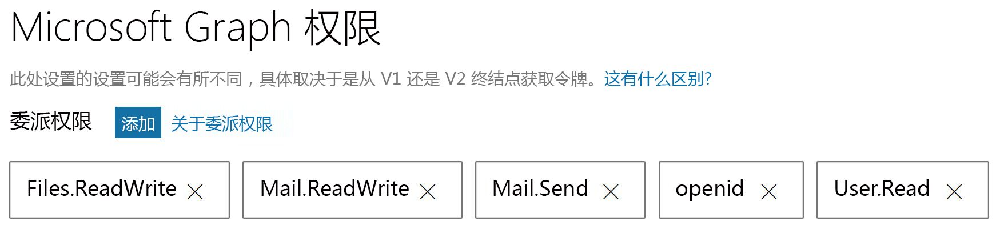

# <a name="get-started-with-microsoft-graph-in-a-java-app"></a><span data-ttu-id="596ca-101">在 Java 应用中开始使用 Microsoft Graph</span><span class="sxs-lookup"><span data-stu-id="596ca-101">Get started with Microsoft Graph in a PHP app</span></span>

<span data-ttu-id="596ca-102">本文使用 [console-java-connect-sample](https://github.com/microsoftgraph/console-java-connect-sample) 来逐步完成通过 Microsoft Graph 从 Java 控制台应用程序发送邮件。</span><span class="sxs-lookup"><span data-stu-id="596ca-102">This article uses the [console-java-connect-sample](https://github.com/microsoftgraph/console-java-connect-sample) to walk through sending mail via Microsoft Graph from a Java console application.</span></span> <span data-ttu-id="596ca-103">本文介绍了需要添加到 Java 应用的代码，以便可以使用 Microsoft Graph API。</span><span class="sxs-lookup"><span data-stu-id="596ca-103">The article shows you the code that you need to add to your Java app so that you can use the Microsoft Graph API.</span></span> <span data-ttu-id="596ca-104">该应用通过使用 [适用于 Java 的 Microsoft Graph SDK](https://github.com/microsoftgraph/msgraph-sdk-java) 来访问 Microsoft Graph。</span><span class="sxs-lookup"><span data-stu-id="596ca-104">The app accesses Microsoft Graph by using the [Microsoft Graph SDK for Java](https://github.com/microsoftgraph/msgraph-sdk-java).</span></span>

## <a name="choose-an-authentication-library"></a><span data-ttu-id="596ca-105">选择身份验证库</span><span class="sxs-lookup"><span data-stu-id="596ca-105">Choosing an authentication library</span></span>

<span data-ttu-id="596ca-106">Microsoft Graph 采用了 OAuth 2.0 和 Open ID Connect 标准，它允许你从多个可用的开源 OAuth 2 Java 库中进行选择。</span><span class="sxs-lookup"><span data-stu-id="596ca-106">Microsoft Graph adopted the OAuth 2.0 and Open ID Connect standards, which lets you choose from many available open source OAuth 2 Java libraries.</span></span> <span data-ttu-id="596ca-107">Azure AD 团队建议使用 [ScribeJava](https://github.com/scribejava/scribejava)，它是 Java 的一个简单 OAuth2 库。</span><span class="sxs-lookup"><span data-stu-id="596ca-107">The Azure AD team recommends using [ScribeJava](https://github.com/scribejava/scribejava), a simple OAuth2 library for Java.</span></span>

<span data-ttu-id="596ca-108">此示例实现了授权代码授予流，这对于客户端授权方案、用户以及启用了 OAuth 2 的终结点来说是恰当的选择。</span><span class="sxs-lookup"><span data-stu-id="596ca-108">The sample implements the Authorization Code Grant flow which is the right choice for a client authorization scenario, a user, and an OAuth 2-enabled endpoint.</span></span> <span data-ttu-id="596ca-109">在生产服务器间 Java 应用程序中，使用的是客户端凭据授权流。</span><span class="sxs-lookup"><span data-stu-id="596ca-109">In production server-to-server Java applications, the Client Credentials authorization flow is used.</span></span> <span data-ttu-id="596ca-110">**ScribeJava** 处理这两个授权流。</span><span class="sxs-lookup"><span data-stu-id="596ca-110">**ScribeJava** handles both of these authorization flows.</span></span> <span data-ttu-id="596ca-111">为了使本示例容易进行注册、身份验证和运行，我们演示了最简单的流程。</span><span class="sxs-lookup"><span data-stu-id="596ca-111">To make this sample easy to register, authenticate, and run, we demonstrate the simplest flow.</span></span>

<span data-ttu-id="596ca-112">在应用可以在 Microsoft Graph 上执行调用之前，应用必须从 Azure Active Directory (Azure AD) 获得一个访问令牌。</span><span class="sxs-lookup"><span data-stu-id="596ca-112">Before your app can make calls on Microsoft Graph, the app must get an access token from Azure Active Directory (Azure AD).</span></span> <span data-ttu-id="596ca-113">每次调用 Microsoft Graph 时，此令牌必须出现在 HTTP 身份验证标头中。</span><span class="sxs-lookup"><span data-stu-id="596ca-113">This token must be present in an HTTP authentication header with each call to Microsoft Graph.</span></span> <span data-ttu-id="596ca-114">在你实施 [IAuthenticationProvider](https://github.com/microsoftgraph/msgraph-sdk-java/blob/dev/src/main/java/com/microsoft/graph/authentication/IAuthenticationProvider.java) 时，**Microsoft Graph SDK** 负责插入标头和添加每个调用令牌。</span><span class="sxs-lookup"><span data-stu-id="596ca-114">The **Microsoft Graph SDK** takes care of inserting the header and adding the token for each call when you implement [IAuthenticationProvider](https://github.com/microsoftgraph/msgraph-sdk-java/blob/dev/src/main/java/com/microsoft/graph/authentication/IAuthenticationProvider.java).</span></span> <span data-ttu-id="596ca-115">**ScribeJava** 处理身份验证和获取访问令牌。</span><span class="sxs-lookup"><span data-stu-id="596ca-115">**ScribeJava** handles authentication and getting an access token.</span></span> <span data-ttu-id="596ca-116">应用通过 **IAuthenticationProvider** 界面向 Microsoft Graph SDK 提供访问令牌。</span><span class="sxs-lookup"><span data-stu-id="596ca-116">Your app provides the access token to the Microsoft Graph SDK via the **IAuthenticationProvider** interface.</span></span>

## <a name="install-and-run-the-sample"></a><span data-ttu-id="596ca-117">安装并运行示例</span><span class="sxs-lookup"><span data-stu-id="596ca-117">Install and run the solution</span></span>

<span data-ttu-id="596ca-118">若要安装和配置示例应用，请按照 GitHub 上 **console-java-connect-sample** 存储库中的 [README](https://github.com/microsoftgraph/console-java-connect-sample/blob/master/README.md) 文档中的说明操作。</span><span class="sxs-lookup"><span data-stu-id="596ca-118">To install and configure the sample app, follow the instructions in the [README](https://github.com/microsoftgraph/console-java-connect-sample/blob/master/README.md) document in the **console-java-connect-sample** repository on GitHub.</span></span> <span data-ttu-id="596ca-119">可以通过此命令克隆示例并逐步完成你最喜爱的 Java IDE 中的代码来克隆存储库：</span><span class="sxs-lookup"><span data-stu-id="596ca-119">You can clone the sample and walk through the code in your favorite Java IDE by using this command to clone the repository:</span></span>

```
git@github.com:microsoftgraph/console-java-connect-sample.git
```

<span data-ttu-id="596ca-120">在[注册 Console Java Connect 应用](https://github.com/microsoftgraph/console-java-connect-sample/blob/master/README.md#register-your-app)时，向示例分配委派作用域（权限）。</span><span class="sxs-lookup"><span data-stu-id="596ca-120">When you [register the Console Java Connect app](https://github.com/microsoftgraph/console-java-connect-sample/blob/master/README.md#register-your-app), assign delegated scopes (permissions) to the sample.</span></span> <span data-ttu-id="596ca-121">确保作用域如中下图所示：</span><span class="sxs-lookup"><span data-stu-id="596ca-121">Be sure to scopes as shown in the following image:</span></span>



<span data-ttu-id="596ca-123">在注册应用程序并为从应用程序注册获取的**应用程序 ID** [配置示例](https://github.com/microsoftgraph/console-java-connect-sample/blob/master/README.md#configure-your-app)后，可以生成并运行示例。</span><span class="sxs-lookup"><span data-stu-id="596ca-123">After you register the application and [configure the sample](https://github.com/microsoftgraph/console-java-connect-sample/blob/master/README.md#configure-your-app) for the **Application Id** you get from the application registration, you can build and run the sample.</span></span>

## <a name="console-java-connect-code"></a><span data-ttu-id="596ca-124">Console-Java-Connect 代码</span><span class="sxs-lookup"><span data-stu-id="596ca-124">Console-Java-Connect code</span></span> 

<span data-ttu-id="596ca-125">在查看示例逻辑流之前，请花几分钟时间了解一下[示例项目的结构](#sample-project-structure)。</span><span class="sxs-lookup"><span data-stu-id="596ca-125">Before you look at the sample logic flow, take a few minutes to learn about the [sample project's structure](#sample-project-structure).</span></span> <span data-ttu-id="596ca-126">如果已准备就绪，则可以逐步完成示例中的逻辑：</span><span class="sxs-lookup"><span data-stu-id="596ca-126">When you're ready, lets step through the logic in the sample:</span></span>


   
### <a name="walk-through-the-code"></a><span data-ttu-id="596ca-127">演练代码</span><span class="sxs-lookup"><span data-stu-id="596ca-127">Walk through the code</span></span>
<span data-ttu-id="596ca-128">我们将先概括性地查看示例代码，然后再深入了解有关创建电子邮件和发送邮件的详细信息。</span><span class="sxs-lookup"><span data-stu-id="596ca-128">We'll look at the sample code at a high level and then dive into the details of creating an email message and sending it.</span></span>

#### <a name="the-user-experience"></a><span data-ttu-id="596ca-129">用户体验</span><span class="sxs-lookup"><span data-stu-id="596ca-129">The user experience</span></span>

<span data-ttu-id="596ca-130">本节将介绍启动应用程序的逻辑，然后向你展示用户在运行示例时看到的示例输出。</span><span class="sxs-lookup"><span data-stu-id="596ca-130">This section takes a look at the logic that starts up the application and then shows you the sample output that the user sees when they run the sample.</span></span>

<span data-ttu-id="596ca-131">[PublicClient](https://github.com/microsoftgraph/console-java-connect-sample/blob/master/src/main/java/com/microsoft/graphsample/PublicClient.java) **主**静态方法创建一个 **PublicClient** 实例，然后启动登录和身份验证过程。</span><span class="sxs-lookup"><span data-stu-id="596ca-131">The [PublicClient](https://github.com/microsoftgraph/console-java-connect-sample/blob/master/src/main/java/com/microsoft/graphsample/PublicClient.java) **main** static method creates an instance of **PublicClient** and then kicks off the sign in and authentication process.</span></span>  

<span data-ttu-id="596ca-132">[AuthenticationManager](https://github.com/microsoftgraph/console-java-connect-sample/blob/master/src/main/java/com/microsoft/graphsample/connect/AuthenticationManager) 提供了用于将用户连接到 Microsoft Graph 的单一实例。</span><span class="sxs-lookup"><span data-stu-id="596ca-132">[AuthenticationManager](https://github.com/microsoftgraph/console-java-connect-sample/blob/master/src/main/java/com/microsoft/graphsample/connect/AuthenticationManager) provides a singleton instance which is used to connect the user to Microsoft Graph.</span></span> <span data-ttu-id="596ca-133">**AuthenticationManager** 以字符串属性形式公开**访问令牌**。</span><span class="sxs-lookup"><span data-stu-id="596ca-133">**AuthenticationManager** exposes an **access token** as a string property.</span></span> <span data-ttu-id="596ca-134">当对用户进行身份验证并授予示例权限来访问请求的 Microsoft Graph 资源时，将由 **Azure AD** 返回访问令牌。</span><span class="sxs-lookup"><span data-stu-id="596ca-134">The access token is returned by **Azure AD** when the user is authenticated and gives the sample permission to access requested Microsoft Graph resources.</span></span> 

<span data-ttu-id="596ca-135">**PublicClient.startSendMail** 方法执行以下步骤：</span><span class="sxs-lookup"><span data-stu-id="596ca-135">The **PublicClient.startSendMail** method performs the following steps:</span></span>

- <span data-ttu-id="596ca-136">创建 [GraphSendMail](https://github.com/microsoftgraph/console-java-connect-sample/blob/master/src/main/java/com/microsoft/graphsample/msgraph/GraphSendMail.java) 类的新实例。</span><span class="sxs-lookup"><span data-stu-id="596ca-136">Creates a new instance of the  [ActivityComponentAttempt](https://github.com/microsoftgraph/console-java-connect-sample/blob/master/src/main/java/com/microsoft/graphsample/msgraph/GraphSendMail.java) class.</span></span> 
- <span data-ttu-id="596ca-137">调用 **GraphSendMail.getMeUser()**，以返回当前用户的 **Azure AD** 配置文件，以便示例控制台对象可个性化设置向用户显示的提示。</span><span class="sxs-lookup"><span data-stu-id="596ca-137">Calls **GraphSendMail.getMeUser()** to return the **Azure AD** profile of the current user so that the sample console object can personalize the prompts that it displays to the user.</span></span> 
- <span data-ttu-id="596ca-138">控制台会显示：</span><span class="sxs-lookup"><span data-stu-id="596ca-138">The console displays:</span></span>

   `Hello, Laura Steele. Would you like to send an email to yourself or someone else?`

   `Enter the address to which you'd like to send a message. If you enter nothing, the message will go to your address`

- <span data-ttu-id="596ca-139">调用 **GraphSendMail.sendMail** 方法，这将接受用户输入。</span><span class="sxs-lookup"><span data-stu-id="596ca-139">Calls the **GraphSendMail.sendMail** method which takes the user's input.</span></span> <span data-ttu-id="596ca-140">如果提供电子邮件地址，**sendMail** 会将邮件发送到此地址。</span><span class="sxs-lookup"><span data-stu-id="596ca-140">If an email address is provided, **sendMail** sends a message to that address.</span></span> <span data-ttu-id="596ca-141">否则，邮件会被发送给当前用户。</span><span class="sxs-lookup"><span data-stu-id="596ca-141">Otherwise, the message is sent to the current user.</span></span> 

- <span data-ttu-id="596ca-142">提示用户发送另一封电子邮件或退出控制台应用。</span><span class="sxs-lookup"><span data-stu-id="596ca-142">Prompts the user to send another email or quit the console app.</span></span>

   `Email sent!`

   `Want to send another message? Type 'y' for yes and any other key to exit.`

#### <a name="the-send-mail-logic"></a><span data-ttu-id="596ca-143">发送邮件逻辑</span><span class="sxs-lookup"><span data-stu-id="596ca-143">The send mail logic</span></span>

<span data-ttu-id="596ca-144">邮件发送逻辑将执行以下步骤：</span><span class="sxs-lookup"><span data-stu-id="596ca-144">The mail sending logic takes the following steps:</span></span>


1. <span data-ttu-id="596ca-145">**获取个人资料图片**：</span><span class="sxs-lookup"><span data-stu-id="596ca-145">**Get profile picture**:</span></span><br/> <span data-ttu-id="596ca-146">调用 **GraphServiceController.getUserProfilePicture()**，以获取表示已登录到示例的 **Azure AD** 用户的个人资料图片的字节数组。</span><span class="sxs-lookup"><span data-stu-id="596ca-146">Calls **GraphServiceController.getUserProfilePicture()** to get an array of bytes representing the profile picture of the **Azure AD** user who signed into the sample.</span></span>

   <span data-ttu-id="596ca-147">**API 调用**</span><span class="sxs-lookup"><span data-stu-id="596ca-147">**The API call**</span></span>

```java
            photoStream = mGraphServiceClient
                    .me()
                    .photo()
                    .content()
                    .buildRequest()
                    .get();

```
2. <span data-ttu-id="596ca-148">**将图片上传到 OneDrive**：</span><span class="sxs-lookup"><span data-stu-id="596ca-148">**Upload picture to OneDrive**:</span></span>
<br/><span data-ttu-id="596ca-149">调用 **GraphServiceController.uploadPictureToOneDrive(bytes)**，以在用户的 OneDrive 根文件夹中发布个人资料图片。</span><span class="sxs-lookup"><span data-stu-id="596ca-149">Calls **GraphServiceController.uploadPictureToOneDrive(bytes)** to POST the profile picture in the user's OneDrive root folder.</span></span> <span data-ttu-id="596ca-150">将返回 Microsoft Graph SDK **DriveItem** 对象。</span><span class="sxs-lookup"><span data-stu-id="596ca-150">A Microsoft Graph SDK **DriveItem** object is returned.</span></span> 

   <span data-ttu-id="596ca-151">**API 调用**</span><span class="sxs-lookup"><span data-stu-id="596ca-151">**The API call**</span></span>
```java
            driveItem = mGraphServiceClient
                    .me()
                    .drive()
                    .root()
                    .itemWithPath("me2.png")
                    .content()
                    .buildRequest()
                    .put(picture);

```
3. <span data-ttu-id="596ca-152">**使 OneDrive 共享该图片链接**：</span><span class="sxs-lookup"><span data-stu-id="596ca-152">**Get the OneDrive sharing link for the picture**:</span></span><br/><span data-ttu-id="596ca-153">调用 **GraphServiceController.getPermissionSharingLink**，以创建新的共享链接。</span><span class="sxs-lookup"><span data-stu-id="596ca-153">Calls **GraphServiceController.getPermissionSharingLink** to create a new sharing link.</span></span> <span data-ttu-id="596ca-154">将返回 Microsoft Graph SDK **Permission** 对象。</span><span class="sxs-lookup"><span data-stu-id="596ca-154">A Microsoft Graph SDK **Permission** object is returned.</span></span>

   <span data-ttu-id="596ca-155">**API 调用**</span><span class="sxs-lookup"><span data-stu-id="596ca-155">**The API call**</span></span>
```java
            permission = mGraphServiceClient
                    .me()
                    .drive()
                    .items(id)
                    .createLink("view", "organization")
                    .buildRequest()
                    .post();

```
4. <span data-ttu-id="596ca-156">使用上一步中共享链接的 **webUrl** **替换 HTML 模板定位标记的内容**。</span><span class="sxs-lookup"><span data-stu-id="596ca-156">**Replace the contents of the HTML template anchor tag** with the **webUrl** for the sharing link in the previous step.</span></span> 
> <span data-ttu-id="596ca-157">**注意：** 应用程序发送的邮件正文源自作为静态字符串存储在 [Constants.java](https://github.com/microsoftgraph/console-java-connect-sample/blob/master/src/main/java/com/microsoft/graphsample/connect/Constants.java) 中的 HTML 模板。</span><span class="sxs-lookup"><span data-stu-id="596ca-157">**Note:** The body of the message sent by the application originates as an HTML template stored in [Constants.java](https://github.com/microsoftgraph/console-java-connect-sample/blob/master/src/main/java/com/microsoft/graphsample/connect/Constants.java) as a static string.</span></span> <span data-ttu-id="596ca-158">发送时，邮件正文包含一个公共共享超链接，指向示例上传到用户的 OneDrive 根文件夹的图片。</span><span class="sxs-lookup"><span data-stu-id="596ca-158">When sent, the body of the message contains a public sharing hyperlink to a picture that the sample uploads to the user's OneDrive root folder.</span></span> 
5. <span data-ttu-id="596ca-159">**创建草稿邮件**：</span><span class="sxs-lookup"><span data-stu-id="596ca-159">**Create** a draft of a new message.</span></span> <br/><span data-ttu-id="596ca-160">调用 **GraphServiceController.createDraftMail**，传递收件人电子邮件地址、主题文本和更新的 HTML 模板。</span><span class="sxs-lookup"><span data-stu-id="596ca-160">Calls **GraphServiceController.createDraftMail**, passing the recipient email address, subject text, and the updated HTML template.</span></span> <span data-ttu-id="596ca-161">将创建草稿邮件并发布到用户的草稿邮件文件夹。</span><span class="sxs-lookup"><span data-stu-id="596ca-161">A draft message is created and POSTed to the user's draft message folder.</span></span>

   <span data-ttu-id="596ca-162">**API 调用**</span><span class="sxs-lookup"><span data-stu-id="596ca-162">**The API call**</span></span>
```java
            message = mGraphServiceClient
                    .me()
                    .messages()
                    .buildRequest()
                    .post(message);

```
6. <span data-ttu-id="596ca-163">**将图片附加到草稿邮件**：</span><span class="sxs-lookup"><span data-stu-id="596ca-163">**Attach picture to draft message**:</span></span> <br/><span data-ttu-id="596ca-164">调用 **GraphServiceController.addPictureToDraftMessage**，以获取草稿邮件，并将图片作为对象附件添加到邮件。</span><span class="sxs-lookup"><span data-stu-id="596ca-164">Calls **GraphServiceController.addPictureToDraftMessage** to get the draft message and add the picture to the message as an object attachment.</span></span>

   <span data-ttu-id="596ca-165">**API 调用**</span><span class="sxs-lookup"><span data-stu-id="596ca-165">**The API call**</span></span>
```java
            FileAttachment fileAttachment = new FileAttachment();
            fileAttachment.oDataType = "#microsoft.graph.fileAttachment";
            fileAttachment.contentBytes = attachementBytes;
            fileAttachment.name = "me.png";
            fileAttachment.size = attachementBytes.length;
            fileAttachment.isInline = false;
            fileAttachment.id = "my profile picture";

            attachment = mGraphServiceClient
                    .me()
                    .messages(messageId)
                    .attachments()
                    .buildRequest()
                    .post(fileAttachment);

```
7. <span data-ttu-id="596ca-166">**发送草稿邮件**：</span><span class="sxs-lookup"><span data-stu-id="596ca-166">**Send the draft message**:</span></span><br/><span data-ttu-id="596ca-167">调用 **GraphServiceController.sendDraftMessage**，以便向预期用户发送已更新的草稿邮件。</span><span class="sxs-lookup"><span data-stu-id="596ca-167">Calls **GraphServiceController.sendDraftMessage** to send the updated draft message to the intended user.</span></span>

   <span data-ttu-id="596ca-168">**API 调用**</span><span class="sxs-lookup"><span data-stu-id="596ca-168">**The API call**</span></span>
```java
            mGraphServiceClient
                    .me()
                    .mailFolders("Drafts")
                    .messages(messageId)
                    .send()
                    .buildRequest()
                    .post();

```


### <a name="sample-project-structure"></a><span data-ttu-id="596ca-169">示例项目结构</span><span class="sxs-lookup"><span data-stu-id="596ca-169">Sample project structure</span></span>

### <a name="connect-package"></a><span data-ttu-id="596ca-170">连接包</span><span class="sxs-lookup"><span data-stu-id="596ca-170">connect package</span></span>
<span data-ttu-id="596ca-171">此包包含 OAuth2 身份验证流逻辑和将要更新的配置。</span><span class="sxs-lookup"><span data-stu-id="596ca-171">This package contains the OAuth2 authentication flow logic and the configuration that you'll be updating.</span></span>

- <span data-ttu-id="596ca-172">[AuthenticationManager.java](https://github.com/microsoftgraph/console-java-connect-sample/blob/master/src/main/java/com/microsoft/graphsample/connect/AuthenticationManager.java)：此类导入用于授权代码授予流的 **ScribeJava** 对象。</span><span class="sxs-lookup"><span data-stu-id="596ca-172">[AuthenticationManager.java](https://github.com/microsoftgraph/console-java-connect-sample/blob/master/src/main/java/com/microsoft/graphsample/connect/AuthenticationManager.java):  This class imports the  **ScribeJava** objects used for the Authorization Code Grant flow.</span></span>
- <span data-ttu-id="596ca-173">[Constants.java](https://github.com/microsoftgraph/console-java-connect-sample/blob/master/src/main/java/com/microsoft/graphsample/connect/Constants.java)：保留提供应用注册相关值的公共静态字符串和应用程序发送的电子邮件的模板。</span><span class="sxs-lookup"><span data-stu-id="596ca-173">[Constants.java](https://github.com/microsoftgraph/console-java-connect-sample/blob/master/src/main/java/com/microsoft/graphsample/connect/Constants.java): Holds public static strings for providing app registration related values and the template for the email message that the application sends.</span></span>
- <span data-ttu-id="596ca-174">[Debug.java](https://github.com/microsoftgraph/console-java-connect-sample/blob/master/src/main/java/com/microsoft/graphsample/connect/Debug.java)：公共调试级别标志。</span><span class="sxs-lookup"><span data-stu-id="596ca-174">[Debug.java](https://github.com/microsoftgraph/console-java-connect-sample/blob/master/src/main/java/com/microsoft/graphsample/connect/Debug.java): Public debug level flag.</span></span> <span data-ttu-id="596ca-175">设置其值以更改示例应用的日志记录行为。</span><span class="sxs-lookup"><span data-stu-id="596ca-175">Set it's value to change the logging behavior of the sample app.</span></span>
- <span data-ttu-id="596ca-176">[DebugLogger.java](https://github.com/microsoftgraph/console-java-connect-sample/blob/master/src/main/java/com/microsoft/graphsample/connect/DebugLogger.java)：根据调试级别设置将信息写入控制台的日志记录实用工具。</span><span class="sxs-lookup"><span data-stu-id="596ca-176">[DebugLogger.java](https://github.com/microsoftgraph/console-java-connect-sample/blob/master/src/main/java/com/microsoft/graphsample/connect/DebugLogger.java): Logging utility that writes information to the console according to the debug level set.</span></span>
- <span data-ttu-id="596ca-177">[IConnectCallback](https://github.com/microsoftgraph/console-java-connect-sample/blob/master/src/main/java/com/microsoft/graphsample/connect/IConnectCallback.java)：定义回调方法，如果你调用 **ScribeJava.getAccessToken** 方法的异步重载，将会使用它。</span><span class="sxs-lookup"><span data-stu-id="596ca-177">[IConnectCallback](https://github.com/microsoftgraph/console-java-connect-sample/blob/master/src/main/java/com/microsoft/graphsample/connect/IConnectCallback.java): Defines the callback method that you'd use if you call the asynchronous overload of the **ScribeJava.getAccessToken** method.</span></span>
- <span data-ttu-id="596ca-178">[SendMailException](https://github.com/microsoftgraph/console-java-connect-sample/blob/master/src/main/java/com/microsoft/graphsample/msgraph/SendMailException.java)：从**异常**中派生的类，并封装 Microsoft Graph 特定的异常信息。</span><span class="sxs-lookup"><span data-stu-id="596ca-178">[SendMailException](https://github.com/microsoftgraph/console-java-connect-sample/blob/master/src/main/java/com/microsoft/graphsample/msgraph/SendMailException.java): A class that is derived from **Exception** and encapsulates Microsoft Graph-specific exception information.</span></span> <span data-ttu-id="596ca-179">**GraphSendMail** 包中的类可引发此类异常。</span><span class="sxs-lookup"><span data-stu-id="596ca-179">Classes in the **GraphSendMail** package can throw this type of exception.</span></span>

### <a name="msgraph-package"></a><span data-ttu-id="596ca-180">msgraph 包</span><span class="sxs-lookup"><span data-stu-id="596ca-180">msgraph package</span></span>

<span data-ttu-id="596ca-181">此包包含在 Microsoft Graph 上进行调用的所有逻辑。</span><span class="sxs-lookup"><span data-stu-id="596ca-181">This package contains all of the logic that makes calls on Microsoft Graph.</span></span>

- <span data-ttu-id="596ca-182">[GraphSendMail](https://github.com/microsoftgraph/console-java-connect-sample/blob/master/src/main/java/com/microsoft/graphsample/msgraph/GraphSendMail.java)：链接在一起调用 **GraphServiceController**（Microsoft Graph API 示例帮助程序类），以创建和发送包含图片附件的电子邮件。</span><span class="sxs-lookup"><span data-stu-id="596ca-182">[GraphSendMail](https://github.com/microsoftgraph/console-java-connect-sample/blob/master/src/main/java/com/microsoft/graphsample/msgraph/GraphSendMail.java): Chains together calls into **GraphServiceController** (a Microsoft Graph API sample helper class) to create and send an email message with a picture attachment.</span></span>
- <span data-ttu-id="596ca-183">[GraphServiceClientManager.java](https://github.com/microsoftgraph/console-java-connect-sample/blob/master/src/main/java/com/microsoft/graphsample/msgraph/GraphServiceClientManager.java)：实例化 Microsoft Graph SDK [GraphServiceClient](https://github.com/microsoftgraph/msgraph-sdk-java/blob/dev/src/main/java/com/microsoft/graph/requests/extensions/GraphServiceClient.java)，并将访问令牌添加到 Microsoft Graph 终结点上的所有出站 API 调用。</span><span class="sxs-lookup"><span data-stu-id="596ca-183">[GraphServiceClientManager.java](https://github.com/microsoftgraph/console-java-connect-sample/blob/master/src/main/java/com/microsoft/graphsample/msgraph/GraphServiceClientManager.java): Instantiates the Microsoft Graph SDK [GraphServiceClient](https://github.com/microsoftgraph/msgraph-sdk-java/blob/dev/src/main/java/com/microsoft/graph/requests/extensions/GraphServiceClient.java) and adds an access token to all outgoing API calls on the Microsoft Graph endpoint.</span></span>

- <span data-ttu-id="596ca-184">[GraphServiceController.java](https://github.com/microsoftgraph/console-java-connect-sample/blob/master/src/main/java/com/microsoft/graphsample/msgraph/GraphServiceController.java)：使用 Microsoft Graph SDK 以完成对 **GraphServiceClient** 的所有调用。</span><span class="sxs-lookup"><span data-stu-id="596ca-184">[GraphServiceController.java](https://github.com/microsoftgraph/console-java-connect-sample/blob/master/src/main/java/com/microsoft/graphsample/msgraph/GraphServiceController.java): Uses the Microsoft Graph SDK to make all of the calls on the **GraphServiceClient**.</span></span> <span data-ttu-id="596ca-185">调用包括：</span><span class="sxs-lookup"><span data-stu-id="596ca-185">Calls include:</span></span>

   - <span data-ttu-id="596ca-186">**createDraftMail**：创建草稿电子邮件并将其保存在草稿邮件文件夹中。</span><span class="sxs-lookup"><span data-stu-id="596ca-186">**createDraftMail**: creates a draft email message and saves it in your draft messages folder.</span></span>
   - <span data-ttu-id="596ca-187">**sendNewMessageAsync**：创建和发送电子邮件。</span><span class="sxs-lookup"><span data-stu-id="596ca-187">**sendNewMessageAsync**: Creates and sends an email message.</span></span>
   - <span data-ttu-id="596ca-188">**addPictureToDraftMessage**：根据邮件 ID 发布草稿邮件中的文件附件</span><span class="sxs-lookup"><span data-stu-id="596ca-188">**addPictureToDraftMessage**: Posts a file attachment in a draft message by message Id</span></span>
   - <span data-ttu-id="596ca-189">**addAttachmentToDraftAsync**：将附件添加到草稿邮件。</span><span class="sxs-lookup"><span data-stu-id="596ca-189">**addAttachmentToDraftAsync**: Adds an attachment to a draft message.</span></span>
   - <span data-ttu-id="596ca-190">**sendDraftMessage**：从草稿文件夹发送邮件。</span><span class="sxs-lookup"><span data-stu-id="596ca-190">**sendDraftMessage**: Sends a message from the drafts folder.</span></span>
   - <span data-ttu-id="596ca-191">**getDraftMessage**：从用户邮件集中根据邮件 ID 获取邮件。</span><span class="sxs-lookup"><span data-stu-id="596ca-191">**getDraftMessage**: Gets a message from the user' message collection by message id.</span></span>
   - <span data-ttu-id="596ca-192">**getUser**：获取通过 Microsoft Graph API 终结点进行身份验证的本地用户。</span><span class="sxs-lookup"><span data-stu-id="596ca-192">**getUser**: Gets the local user who is authenticated with the Microsoft Graph API endpoint.</span></span>
   - <span data-ttu-id="596ca-193">**getUserProfilePicture**：从 Microsoft Graph 获取已登录用户的个人资料图片。</span><span class="sxs-lookup"><span data-stu-id="596ca-193">**getUserProfilePicture**: Gets the signed in user's profile picture from the Microsoft Graph.</span></span>
   - <span data-ttu-id="596ca-194">**uploadPictureToOneDrive**：将图片以字节数组形式上传到用户的 OneDrive 根文件夹。</span><span class="sxs-lookup"><span data-stu-id="596ca-194">**uploadPictureToOneDrive**: Uploads a picture as byte array to the user's OneDrive root folder.</span></span>
   - <span data-ttu-id="596ca-195">**getPermissionSharingLink**：请求 OneDrive 创建指向存储在 OneDrive 中的图片的公用共享链接。</span><span class="sxs-lookup"><span data-stu-id="596ca-195">**getPermissionSharingLink**: Requests OneDrive to create a public sharing link to a picture stored in OneDrive.</span></span>

## <a name="other-microsoft-graph-samples"></a><span data-ttu-id="596ca-196">其他 Microsoft Graph 示例</span><span class="sxs-lookup"><span data-stu-id="596ca-196">Other Microsoft Graph Snippets samples</span></span>

<span data-ttu-id="596ca-197">若要查看某个特定示例，请通过[提交问题](https://github.com/microsoftgraph/console-java-connect-sample/issues)告诉我们。</span><span class="sxs-lookup"><span data-stu-id="596ca-197">If there's a particular sample you'd like to see, please let us know by [submitting an issue](https://github.com/microsoftgraph/console-java-connect-sample/issues).</span></span> <span data-ttu-id="596ca-198">我们非常期待收到大家就希望在 Java 中生成的任何 Microsoft Graph 方案提供的反馈！</span><span class="sxs-lookup"><span data-stu-id="596ca-198">We're very interested in your feedback on any Microsoft Graph scenario you'd like to build in Python!</span></span>

<span data-ttu-id="596ca-199">Microsoft Graph API 的功能非常强大，统一了可用于与各种 Microsoft 数据进行交互的 API。</span><span class="sxs-lookup"><span data-stu-id="596ca-199">The Microsoft Graph API is a very powerful, unifiying API that can be used to interact with all kinds of Microsoft data.</span></span> <span data-ttu-id="596ca-200">请查看[开发人员文档](https://developer.microsoft.com/zh-CN/graph/docs/concepts/overview)或 [Graph 浏览器](https://developer.microsoft.com/zh-CN/graph/graph-explorer)，了解还可以使用 Microsoft Graph 做什么。</span><span class="sxs-lookup"><span data-stu-id="596ca-200">Check out the [developer documentation](https://developer.microsoft.com/zh-CN/graph/docs/concepts/overview) or the [Graph Explorer](https://developer.microsoft.com/zh-CN/graph/graph-explorer) to explore what else you can accomplish with Microsoft Graph.</span></span>
