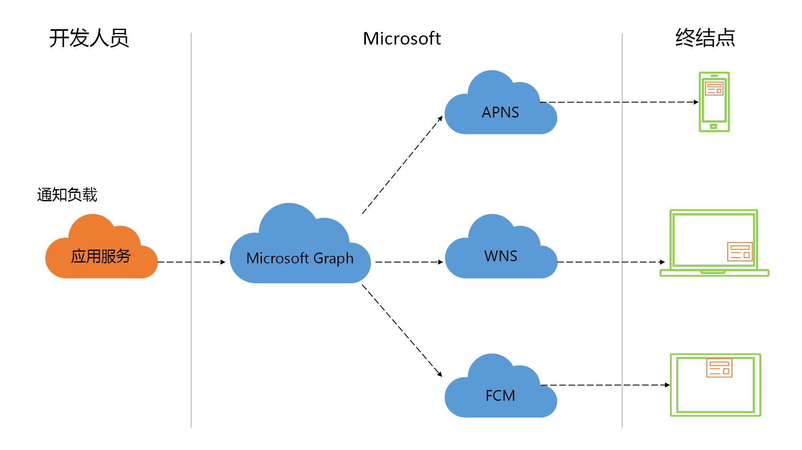

# 利用 Microsoft Graph 通知实现以人为中心的通知体验（已弃用）

> [!IMPORTANT]
> Microsoft Graph 通知 API 已弃用，将在 2022 年 1 月底停止返回数据。 有关其他通知体验，请参阅 [Microsoft Azure 通知中心](/azure/notification-hubs)，并[查看此博客文章](https://devblogs.microsoft.com/microsoft365dev/retiring-microsoft-graph-notifications/)了解详细信息。

通知是与应用程序用户再次交互的最有效的方式之一。 绝佳的通知体验有助于在你和你的用户之间开启一个近乎实时的沟通渠道，这转而可在适当的时间提高应用参与度、帮助用户提升工作效率，并就重要事件或必需操作提醒他们。

> [!VIDEO https://www.youtube-nocookie.com/embed/cmpPFhrS8ZA]

如今，用户可通过各种各样的平台，在各种外观设置下访问你的应用程序和服务。 设备如此多样，就需要你了解和支持多平台通知系统、将用户映射到终结点，并保证不同设备的通知状态一致。 

其他的大部分通知系统都消除了理解和定向平台专用推送通知系统的需求，但仍然设计为针对每款设备。 Microsoft Graph 通知平台提供了一种以人为中心的方法，让你能够应对所有设备终结点中的应用。

## 为何要与 Microsoft Graph 通知集成？

Microsoft Graph 通知平台提供了一个以用户为中心的通知产品，给你的应用程序带去五大关键优势。

### 轻松实现用户定向，跨不同终结点提供通知

可借助通知 API，定向 Microsoft 个人帐户或 Azure Active Directory (Azure AD) 工作/学校帐户来发送通知。 该平台将此通知分发给运行你的应用程序或服务的所有用户终结点，例如 Windows UWP、iOS、Android 和 Web 终结点。 这一功能可确保无论用户身在何处，都有相应的通知可发送给他们，从而最大限度扩大触及范围。

### 跨终结点轻松管理通知

借助客户端应用程序中新的和改进的[通知客户端 SDK](https://aka.ms/GNSDK)，可更新通知的状态并跨所有终结点同步该状态。 例如，当用户对一个设备上的通知执行操作时，你可以更新此通知的状态（例如将其设置为已读或已消除），并向所有其他终结点分发同一状态更改。 Microsoft Graph 通知 API 可集中性地跟踪用户通知的状态，让你能够确保你的通知在被处理过一次后在所有位置关闭，从而减少冗余，同时确保极佳的客户体验。

### 检索通知状态和历史记录

可使用通知 API 根据所定义的过期时间（最多 30 天）来检索通知历史记录。 标记为“已读”或“已关闭”的通知仍能在历史记录中检索到，从而能在应用内查看通知历史记录，并可在见解和智能的基础上进行构建。

### 高优先级通知的保证传递

在如 iOS 的平台上，在特定电源条件下，原始数据通知可能由于批处理而延迟传递，或者根本无法到达目标终结点。 为了向 iOS 上的用户传递高优先级通知，Microsoft Graph 通知平台允许你指定原始到可视 toast 通知“回退”选项，该选项会自动向目标 iOS 设备发送可视 toast 通知，从而确保你的用户近实时获得通知。   

### 隐私与合规性

我们的推送到拉取模型可确保通知永远不会离开可信边界。 平台特定的推送服务用于将肩式分接发送到用户的设备，在该设备上，客户端 SDK 安全地从 Microsoft Graph 通知服务中获取相应的有效负载。 我们满足大部分企业合规性要求，包括 ISO 27001、ISO 27018、EUMC、HIPAA、FERPA、SOC 1 和 SOC 2，当然也符合 GDPR。

## 如何开始使用？

首先，请查看[集成概述](notifications-integration-e2e-overview.md)部分，了解可如何在应用程序中集成以用户为中心的通知。

## API 参考
在查找此服务的 API 参考？

- [使用 Microsoft Graph 的通知 REST API](/graph/api/resources/notifications-api-overview?view=graph-rest-beta&preserve-view=true)
