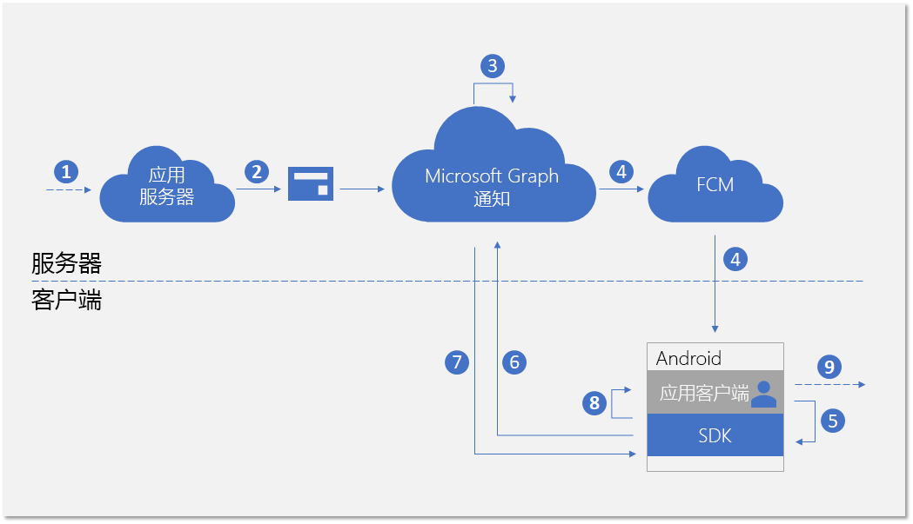
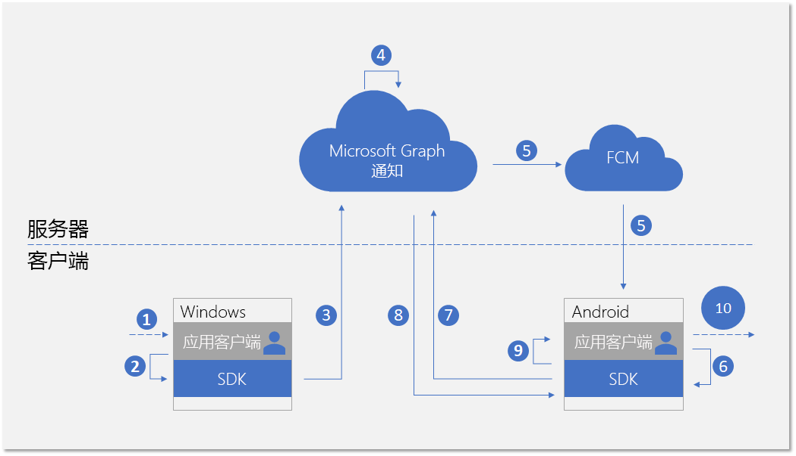

# <a name="integrate-your-android-app-with-the-client-side-sdk-for-user-notifications"></a>将 Android 应用与用户通知客户端 SDK 相集成

在 Azure 门户[注册你的应用](notifications-integration-app-registration.md)并在合作伙伴开发人员中心载入你的[跨设备体验](notifications-integration-cross-device-experiences-onboarding.md)之后，下一步是将客户端应用与适用于 Android 应用的客户端 SDK 相集成。  

借助客户端 SDK，你的应用可以执行所需的注册步骤，以开始接收从应用服务器发布的面向当前登录用户的通知。 SDK 随后会管理客户端上的通知，包括接收新传入的通知，管理通知状态以实现全局消除等方案，以及检索完整的通知历史记录。 

## <a name="new-incoming-notification-flow"></a>新传入的通知流

对于接收新传入的通知，数据流如下图所示。



该过程涉及几个组件：

* 应用服务器 - 应用程序的后端
* 应用客户端 - 应用程序的前端（UWP 应用、Android 应用或 iOS 应用）
* Microsoft Graph 通知 - 一种服务组件，支持在跨设备和平台的各种应用客户端实例中发布、存储和同步用户通知
* FCM - Firebase Cloud Messaging，Android 作为 Google Play Services 一部分提供的推送通知服务。 Microsoft Graph 通知使用此服务向 Android 应用客户端发送有关用户通知数据更改的信号。  

该图显示了以下步骤： 

1. 应用逻辑。这一步抓住了触发通知发布给用户的因素。这是特定于应用的逻辑，它可以是 Microsoft Graph 中的事件或其他内容的数据更新（例如新的日历事件或任务分配），也可以是应用服务希望向用户通知的其他内容。
2. 应用服务器通过 Microsoft Graph 通知 API 向目标用户发布通知。 有关详细信息，请参阅[服务器端集成](notifications-integrating-app-server.md)。
3. 在收到包含新通知的 Web 请求后，Microsoft Graph 通知会在此应用和此用户的云中安全地保留通知内容。
4. 对于订阅接收此用户通知的每个应用客户端实例，Microsoft Graph 通知会通过操作系统提供的本机推送服务发送信号以通知应用客户端。 在这种情况下，应用程序为 Android 应用程序，它使用 [FCM 数据消息](https://firebase.google.com/docs/cloud-messaging/concept-options)发送信号。 
5. 由传入的推送通知向应用程序发出信号后，它会要求 SDK 获取用户通知存储中的更改。 
6. SDK 将与 Microsoft Graph 中的用户通知存储区建立安全且合规的连接。
7. SDK 将获取数据更改 - 在本例中为新通知内容。 
8. SDK 会触发事件回调，以在成功检索到更改后通知该应用。 
9. 应用程序逻辑。 此步骤可捕获你的应用选择在事件回调内执行的操作。 通常，这会导致本地应用数据更改和本地 UI 更新。 在这种情况下，该应用通常会构建定制通知弹出窗口，以通知用户有关通知内容的信息。

## <a name="notification-update-flow"></a>更新通知流

使用 Microsoft Graph 通知的主要好处之一是它可以安全地在云中保留通知，并将其转换为有状态资源类型。 因此，它可以帮助你的应用在跨设备方案中为同一登录用户跨不同设备管理和同步通知的正确状态。 当某台设备上的通知已标记为“已消除”或“已读”时，可以实时通知其他设备。 作为用户通知体验的一部分，可以真正实现“处理一次，每处均消除”的效果。 

下图显示了在一台设备上更改通知状态或删除通知，以及在另一台设备上接收/处理状态更改或删除的数据流。



请注意，流程的第二部分与处理新传入通知的流程类似。这是设计使然 - 设计的 SDK 编程模式使应用程序客户端可以相似的方式处理所有类型的用户通知数据更改 (新传入的通知、通知状态更改、已删除的通知)。  

该图显示了以下步骤：

1. 应用程序逻辑。 某事件触发了要更改或删除的通知。 一般来说，任何事件均可触发更改通知。 
2. 调用客户端 SDK 以更新或删除通知的应用。 目前，我们公布了两种与状态更改相关的属性 - **userActionState** 和 **readState**，但是，应用程序可以定义这些状态以及何时需要更新它们。 例如，当用户消除通知弹出窗口时，你可以将 **userActionState** 更新为“已消除”。 当用户单击通知弹出窗口并启动应用以使用相应的应用内容时，你可以将 **userActionState** 更新为“已激活”和并将 **readState** 更新为“已读”。 
3. 调用相应的 API 以更新或删除通知后，SDK 将调用云中的用户通知存储区，以将此更改扇出至同一登录用户的其他应用客户端实例。 
4. 从客户端接收更新/删除请求时，Microsoft Graph 通知将更新通知存储区，并标识已订阅此更改的其他应用客户端实例。
5. 对于每个应用客户端订阅，Microsoft Graph 通知会通过操作系统提供的本机推送服务发送信号以通知应用客户端。 在这种情况下，这是 Android 应用程序，它使用 [FCM 数据消息](https://firebase.google.com/docs/cloud-messaging/concept-options)发送信号。 
6. 由传入的推送通知向应用程序发出信号后，它会要求 SDK 获取用户通知存储中的更改。 
7. SDK 将与 Microsoft Graph 中的用户通知存储区建立安全且合规的连接。
8. SDK 获取数据更改 - 在这种情况下，更改为通知状态更新或通知删除。 
9. SDK 会触发事件回调，以在成功检索到更改后通知该应用。 
10. 应用程序逻辑。 此步骤可捕获你的应用选择在事件回调内执行的操作。 通常，这会导致本地应用数据更改和本地 UI 更新。 在这种情况下，由于存在通知更新，因此应用应本地更新 UI 以反映状态更改。 例如，如果通知已标记为“已激活”，则你可以删除 Android 通知托盘中的相应通知消息，以实现“处理一次，每处均消除”的效果。 

有关 Microsoft Graph 通知的详细信息，请参阅 [Microsoft Graph 通知概述](notifications-concept-overview.md)。 与 Microsoft Graph 通知进行端到端集成所需步骤相关的详细信息，请参阅 Microsoft Graph 通知[集成概述](notifications-integration-e2e-overview.md)。

## <a name="development-environment-and-requirements"></a>开发环境和要求

若要使用 Microsoft Graph 通知，你需要使用采用受支持架构（**armeabi-v7a**、**arm64-v8a**、**x86** 或 **x86_64**）之一或枚举器的 Android 应用开发 IDE 和 Android 设备。 系统必须运行 Android 4.4.2 或更高版本。

## <a name="adding-the-sdk-to-your-project"></a>向项目添加 SDK

将以下存储库引用插入到项目根处的 *build.gradle* 文件中。

```Java
allprojects {
    repositories {
    jcenter()
    maven { url 'https://maven.google.com' }
    maven { url 'https://projectrome.bintray.com/maven/' }
    }
}
```

然后，将以下依赖项插入到项目文件夹中的 _build.gradle_ 文件中。

```Java
dependencies { 
    ...
    implementation 'com.microsoft.connecteddevices:connecteddevices-sdk:+'
}
```

如果想要在应用中使用 ProGuard，请为这些新 API 添加 ProGuard 规则。 在项目的 *App* 文件中创建名为 *proguard-rules.txt* 的文件，然后粘贴到 [ProGuard_Rules_for_Android_Rome_SDK.txt](https://github.com/Microsoft/project-rome/blob/master/Android/ProGuard_Rules_for_Android_Rome_SDK.txt) 目录中。
在项目的 *AndroidManifest.xml* 文件中，在 `manifest` 元素内添加以下权限（如果尚不存在）。 这为你的应用提供了连接至 Internet 和在设备上启用蓝牙发现功能的权限。
请注意，只有使用蓝牙发现功能时才需要蓝牙相关权限；对于连接设备平台中的其他功能，无需此权限。 此外，只有 Android SDK 21 或更高版本才需要 `ACCESS_COARSE_LOCATION`。 在 Android SDK 23 及更高版本上，还必须提示用户授予运行时位置访问权限。

```xml
<uses-permission android:name="android.permission.INTERNET" />
<uses-permission android:name="android.permission.BLUETOOTH" />
<uses-permission android:name="android.permission.BLUETOOTH_ADMIN" />
<uses-permission android:name="android.permission.ACCESS_COARSE_LOCATION" />
<uses-permission android:name="android.permission.ACCESS_NETWORK_STATE" />
```
接着，转至所希望找到连接设备功能的活动类。导入以下命名空间。

```java
import com.microsoft.connecteddevices;
import com.microsoft.connecteddevices.userdata;
import com.microsoft.connecteddevices.userdata.usernotifications;
```

## <a name="initializing-the-connected-device-platforms"></a>初始化连接设备平台

客户端 SDK 构建在称为“连接设备平台”的基础结构之上。 在使用任何功能之前，必须在你的应用中初始化该平台。 应该通过主类 **OnCreate** 方法执行初始化步骤，因为在通知方案发生之前必须执行这些步骤。

你必须通过实例化 [**ConnectedDevicesPlatform**](/java/api/com.microsoft.connecteddevices.connecteddevicesplatform?view=rome-android-latest) 类来构建并初始化该平台。 执行此操作之前，请确保连接事件处理程序，因为启动平台之后，可能会开始触发事件。 

```java
ConnectedDevicesPlatform platform = new ConnectedDevicesPlatform(context);

platform.getAccountManager().accessTokenRequested().subscribe((accountManager, args) -> onAccessTokenRequested(accountManager, args));
platform.getAccountManager().accessTokenInvalidated().subscribe((accountManager, args) -> onAccessTokenInvalidated(accountManager, args));
platform.getNotificationRegistrationManager().notificationRegistrationStateChanged().subscribe((notificationRegistrationManager, args) -> onNotificationRegistrationStateChanged(notificationRegistrationManager, args));

platform.start();
```

### <a name="handling-account-access-token"></a>处理帐户访问令牌

SDK 发起的所有 Web 调用（包括检索新传入通知的内容、更新通知状态等）都会读取或写入用户的数据，因此始终需要有效的访问令牌。 SDK 要求你处理以下事件 - 在请求访问令牌或访问令牌失效时调用 - 以确保在初始化平台后正确处理用户的访问令牌。 

#### <a name="accesstokenrequested"></a>accessTokenRequested 

有关完整实施，请参阅 [Android 示例应用](https://github.com/Microsoft/project-rome/blob/release/1.3.0/Android/samples/graphnotificationssample/app/src/main/java/com/microsoft/connecteddevices/graphnotifications/ConnectedDevicesManager.java)。 

```Java
private void onAccessTokenRequested(ConnectedDevicesAccountManager sender, ConnectedDevicesAccessTokenRequestedEventArgs args) {
    ConnectedDevicesAccessTokenRequest request = args.getRequest();
    List<String> scopes = request.getScopes();

    // We always need to complete the request, even if a matching account is not found
    if (account == null) {
        request.completeWithErrorMessage("The app could not find a matching ConnectedDevicesAccount to get a token");
        return;
    }

    // Complete the request with a token
    account.getAccessTokenAsync(scopes)
        .thenAcceptAsync((String token) -> {
            request.completeWithAccessToken(token);
        }).exceptionally(throwable -> {
            request.completeWithErrorMessage("The Account could not return a token with those scopes");
            return null;
    });
}
```

#### <a name="accesstokeninvalidated"></a>accessTokenInvalidated

有关完整实施，请参阅 [Android 示例应用](https://github.com/Microsoft/project-rome/blob/release/1.3.0/Android/samples/graphnotificationssample/app/src/main/java/com/microsoft/connecteddevices/graphnotifications/ConnectedDevicesManager.java)。 

```Java
private void onAccessTokenInvalidated(ConnectedDevicesAccountManager sender, ConnectedDevicesAccessTokenInvalidatedEventArgs args, List<Account> accounts) {
    Log.i(TAG, "Token invalidated for account: " + args.getAccount().getId());
}
```

### <a name="handling-push-registration-expiration"></a>处理推送注册过期 

Microsoft Graph 通知使用 FCM（Android 上的本机推送平台）向客户端应用程序发送有关用户通知数据更改的信号。 当从应用服务器发布新传入的通知时，或者在跨设备方案中的具有同一登录用户的其他设备上更新任何通知状态时，会发生这种情况。 

因此，需要一个允许数据通知消息成功通过的有效 FCM 令牌。 以下事件回调处理 FCM 推送令牌到期。 

#### <a name="notificationregistrationstatechanged"></a>notificationRegistrationStateChanged

有关完整实施，请参阅 [Android 示例应用](https://github.com/Microsoft/project-rome/blob/release/1.3.0/Android/samples/graphnotificationssample/app/src/main/java/com/microsoft/connecteddevices/graphnotifications/ConnectedDevicesManager.java)。 

## <a name="signing-in-your-user"></a>登录用户

与 Microsoft Graph 中的许多其他资源类型一样，Microsoft Graph 通知也以用户为中心。 为了让你的应用订阅并开始接收已登录用户的通知，你首先需要获取在注册过程中使用的有效 OAuth 令牌。 你可以使用生成和管理 OAuth 令牌的首选方法。 示例应用使用 ADAL。 

如果你使用的是 Microsoft 帐户，则需要在登录请求中包含以下权限：`wl.offline_access"`、`ccs.ReadWrite`、`wns.connect`、`asimovrome.telemetry` 和 `https://activity.windows.com/UserActivity.ReadWrite.CreatedByApp`。 

如果你使用的是 Azure AD 帐户，则需要请求以下受众：`https://cdpcs.access.microsoft.com`。

## <a name="adding-the-user-account-to-the-platform"></a>将用户帐户添加到平台 

你需要使用 SDK 注册已登录用户的帐户，这涉及添加帐户并注册推送通道以通过 FCM 接收初始推送通知。 

```Java
public AsyncOperation<Boolean> prepareAccountAsync(final Context context) {
    // Accounts can be in 3 different scenarios:
    // 1: cached account in good standing (initialized in the SDK and our token cache).
    // 2: account missing from the SDK but present in our cache: Add and initialize account.
    // 3: account missing from our cache but present in the SDK. Log the account out async

    // Subcomponents (e.g. UserDataFeed) can only be initialized when an account is in both the app cache
    // and the SDK cache.
    // For scenario 1, initialize our subcomponents.
    // For scenario 2, subcomponents will be initialized after InitializeAccountAsync registers the account with the SDK.
    // For scenario 3, InitializeAccountAsync will unregister the account and subcomponents will never be initialized.
    switch (mState) {
        // Scenario 1
        case IN_APP_CACHE_AND_SDK_CACHE:
            mUserNotificationsManager = new UserNotificationsManager(context, mAccount, mPlatform);
            return registerAccountWithSdkAsync();
        // Scenario 2
        case IN_APP_CACHE_ONLY: {
            // Add the this account to the ConnectedDevicesPlatform.AccountManager
            return mPlatform.getAccountManager().addAccountAsync(mAccount).thenComposeAsync((ConnectedDevicesAddAccountResult result) -> {
                // We failed to add the account, so exit with a failure to prepare bool
                if (result.getStatus() != ConnectedDevicesAccountAddedStatus.SUCCESS) {
                    result.getStatus());
                    return AsyncOperation.completedFuture(false);
                }

                // Set the registration state of this account as in both app and sdk cache
                mState = AccountRegistrationState.IN_APP_CACHE_AND_SDK_CACHE;
                mUserNotificationsManager = new UserNotificationsManager(context, mAccount, mPlatform);
                return registerAccountWithSdkAsync();
            });
        }
        // Scenario 3
        case IN_SDK_CACHE_ONLY:
            // Remove the account from the SDK since the app has no knowledge of it
            mPlatform.getAccountManager().removeAccountAsync(mAccount);
            // This account could not be prepared
            return AsyncOperation.completedFuture(false);
        default:
            // This account could not be prepared
            Log.e(TAG, "Failed to prepare account " + mAccount.getId() + " due to unknown state!");
            return AsyncOperation.completedFuture(false);
    }
}
```

```Java
public AsyncOperation<Boolean> registerAccountWithSdkAsync() {
    if (mState != AccountRegistrationState.IN_APP_CACHE_AND_SDK_CACHE) {
        AsyncOperation<Boolean> toReturn = new AsyncOperation<>();
        toReturn.completeExceptionally(new IllegalStateException("Cannot register this account due to bad state: " + mAccount.getId()));
        return toReturn;
    }

    // Grab the shared GCM/FCM notification token from this app's BroadcastReceiver
    return RomeNotificationReceiver.getNotificationRegistrationAsync().thenComposeAsync((ConnectedDevicesNotificationRegistration notificationRegistration) -> {
        // Perform the registration using the NotificationRegistration
        return mPlatform.getNotificationRegistrationManager().registerAsync(mAccount, notificationRegistration)
            .thenComposeAsync((result) -> {
                if (result.getStatus() == ConnectedDevicesNotificationRegistrationStatus.SUCCESS) {
                    Log.i(TAG, "Successfully registered account " + mAccount.getId() + " for cloud notifications");
                } else {
                    // It would be a good idea for apps to take a look at the different statuses here and perhaps attempt some sort of remediation.
                    // For example, token request failed could mean that the user needs to sign in again. An app could prompt the user for this action 
                    // and retry the operation afterwards.
                    Log.e(TAG, "Failed to register account " + mAccount.getId() + " for cloud notifications!");
                    return AsyncOperation.completedFuture(false);
                }

                return mUserNotificationsManager.registerForAccountAsync();
            });
    });
}
```

## <a name="subscribing-to-receive-users-notifications"></a>订阅以接收用户的通知 

你需要为此已登录用户实例化应用程序的 **UserDataFeed** 对象。 你的应用程序由你在[跨设备体验载入](notifications-integration-cross-device-experiences-onboarding.md)过程中提供的跨平台应用 ID 进行标识。

```Java
public UserNotificationsManager(@NonNull Context context, @NonNull ConnectedDevicesAccount account, @NonNull ConnectedDevicesPlatform platform)
{
    Context context = new Context;
    UserDataFeed feed = UserDataFeed.getForAccount(account, platform, Secrets.APP_HOST_NAME);
    UserNotificationChannel channel = new UserNotificationChannel(feed);
    UserNotificationReader reader = channel.createReader();
    reader.dataChanged().subscribe((reader, aVoid) -> readFromCache(reader));
    }
}
```

## <a name="receiving-and-managing-user-notifications"></a>接收和管理用户通知

本主题前面的流程图显示，处理来自应用服务器的新传入通知的编程模式与处理从另一个应用客户端实例启动的通知更新或删除的编程模式类似。以下是处理这些数据更改的步骤。 

### <a name="handling-incoming-push-notification-signal"></a>处理传入推送通知信号

所有类型的用户通知数据更改均会生成一个作为推送通知传递至应用客户端的信号。 对于 Android 应用，信号将作为 FCM 推送数据消息的一部分传递。 接收数据消息信号时，应用应调用 **TryParse** 以触发 SDK 从 Microsoft Graph 通知服务中提取实际数据更改。

```Java
public void onMessageReceived(RemoteMessage message) {
    Map data = message.getData();
    ConnectedDevicesNotification notification = ConnectedDevicesNotification.tryParse(data);

    if (notification != null) {
        try {
            ConnectedDevicesPlatform platform = ConnectedDevicesManager.getConnectedDevicesManager(getApplicationContext()).getPlatform();

            // NOTE: it may be useful to attach completion to this async in order to know when the notification is done being processed.
            // This would be a good time to stop a background service or otherwise cleanup.
            platform.processNotificationAsync(notification);
        } catch (Exception e) {
            Log.e(TAG, "Failed to process FCM notification" + e.getMessage());
        }
    }
}
```

### <a name="handling-user-notification-data-changes"></a>处理用户通知数据更改

SDK 成功完成数据更改提取之后，将会调用事件回调且应用客户端有望处理通知创建、更新或删除。

```Java
private void readFromCache(final UserNotificationReader reader)
{
    reader.readBatchAsync(Long.MAX_VALUE).thenAccept(notifications -> {
        synchronized (this) {
            for (final UserNotification notification : notifications) {
                if (notification.getStatus() == UserNotificationStatus.ACTIVE) {
                    removeIf(mNewNotifications, item -> notification.getId().equals(item.getId()));

                    if (notification.getUserActionState() == UserNotificationUserActionState.NO_INTERACTION) {
                        mNewNotifications.add(notification);
                        if (notification.getReadState() != UserNotificationReadState.READ) {
                            clearNotification(mContext.getApplicationContext(), notification.getId());
                            addNotification(mContext.getApplicationContext(), notification.getContent(), notification.getId());
                        }
                    } else {
                        clearNotification(mContext.getApplicationContext(), notification.getId());
                    }

                    removeIf(mHistoricalNotifications, item -> notification.getId().equals(item.getId()));
                    mHistoricalNotifications.add(0, notification);
                } else {
                    removeIf(mNewNotifications, item -> notification.getId().equals(item.getId()));
                    removeIf(mHistoricalNotifications, item -> notification.getId().equals(item.getId()));
                    clearNotification(mContext.getApplicationContext(), notification.getId());
                }
            }
        }

    });
}
```

### <a name="update-state-of-a-notification"></a>更新通知状态

如果从此应用客户端实例发起通知状态更改（例如，如果此设备上的定制通知弹出窗口由用户激活），则应用需要调用 SDK 更新通知状态，以便在同一用户使用的所有设备中同步此状态更改操作。 

```Java
notification.setUserActionState(UserNotificationUserActionState.ACTIVATED);
notification.saveAsync().whenCompleteAsync((userNotificationUpdateResult, throwable) -> {
    if (throwable == null && userNotificationUpdateResult != null && userNotificationUpdateResult.getSucceeded()) {
        Log.d(TAG, "Successfully activated the notification");
    }
});
```

### <a name="delete-a-notification"></a>删除通知

如果从此应用客户端实例发起通知删除（例如，如果此通知对应的任务标记为“完成”并从应用数据库中删除），则应用需要调用 SDK 删除通知，以便在同一用户使用的所有设备中同步此删除操作。 

仅当通知过期或者被显式删除时，它才会从用户通知存储区中删除。 将 **UserActionState** 更新为“已消除”时，用户通知不会删除，因为 **UserActionState** 的语义定义是由应用程序本身定义。

```Java
channel.deleteUserNotificationAsync(notification.getId()).whenCompleteAsync((userNotificationUpdateResult, throwable) -> {
    if (throwable == null && userNotificationUpdateResult != null && userNotificationUpdateResult.getSucceeded()) {
        Log.d(TAG, "Successfully deleted the notification");
    }
});
```

## <a name="see-also"></a>另请参阅

- [API 参考](/windows/project-rome/notifications/api-reference-for-android)，以获取与 SDK 中的通知功能相关的整套 API。 
- 适用于 Android 应用的[客户端示例](https://github.com/Microsoft/project-rome/tree/master/Android/samples/graphnotificationssample)。
- 适合于发布通知的[应用服务器示例](notifications-integrating-app-server.md)。
