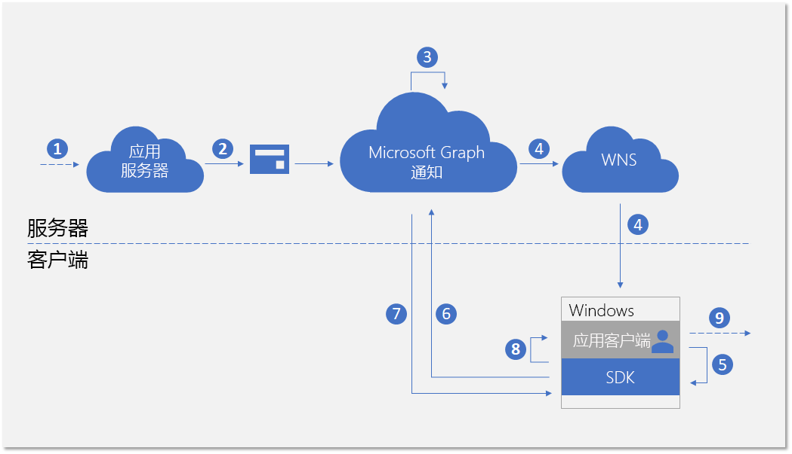
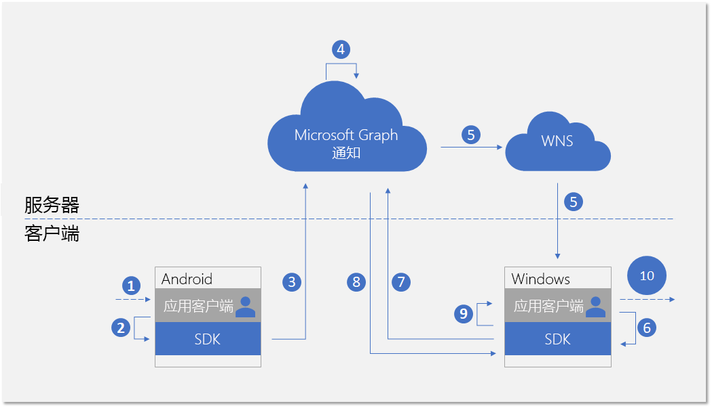
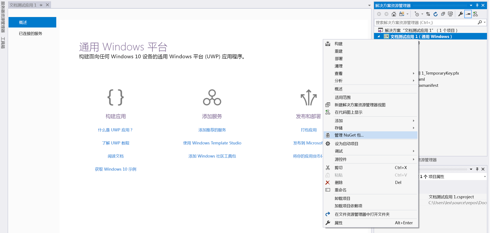
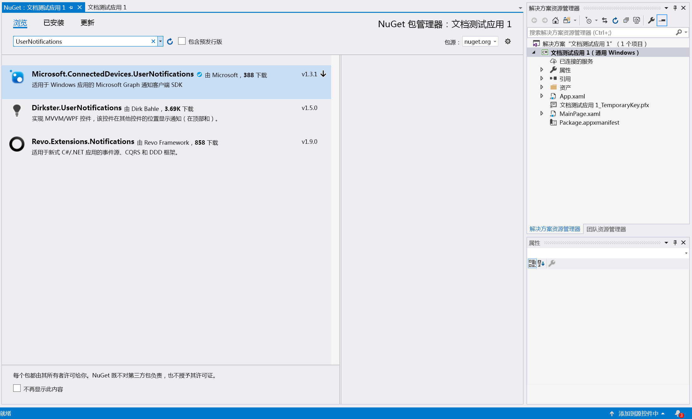
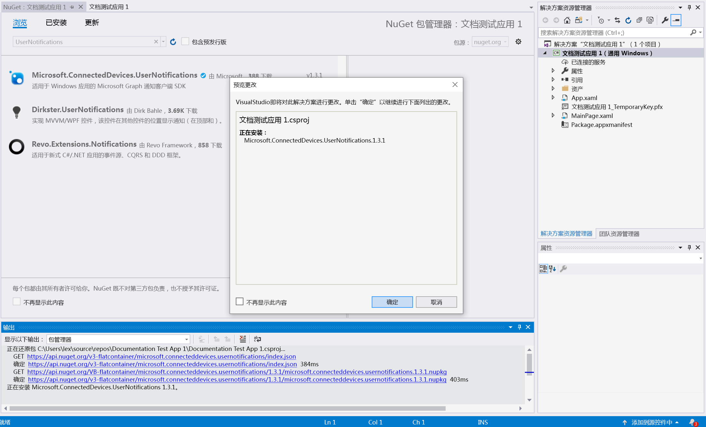

# <a name="integrate-your-windows-uwp-app-with-the-client-side-sdk-for-user-notifications"></a>将 Windows UWP 应用与用户通知客户端 SDK 相集成

在 Azure 门户[注册你的应用](notifications-integration-app-registration.md)并在合作伙伴开发人员中心载入你的[跨设备体验](notifications-integration-cross-device-experiences-onboarding.md)之后，下一步是将客户端应用与适用于 Windows UWP 应用的客户端 SDK 相集成。  

借助客户端 SDK，你的应用可以执行所需的注册步骤，以开始接收从应用服务器发布的面向当前登录用户的通知。 SDK 随后会管理客户端上的通知，包括接收新传入的通知，管理通知状态以实现全局消除等方案，以及检索完整的通知历史记录。 

## <a name="new-incoming-notification-flow"></a>新传入的通知流

对于接收新传入的通知，数据流如下图所示。



该过程涉及几个组件：

* 应用服务器 - 应用程序的后端
* 应用客户端 - 应用程序的前端（UWP 应用、Android 应用或 iOS 应用）
* Microsoft Graph 通知 - 一种服务组件，支持在跨设备和平台的各种应用客户端实例中发布、存储和同步用户通知
* WNS - Microsoft Graph 通知用于向客户端发送信号的 Windows 推送通知服务

该图显示了以下步骤： 

1. 应用程序逻辑。 此步骤可捕获用于触发向用户发布通知的事件。 这是特定于应用的逻辑，它可以是 Microsoft Graph 中的事件或其他内容的数据更新（例如新的日历事件或任务分配），也可以是应用服务希望向用户通知的其他内容。
2. 应用服务器通过 Microsoft Graph 通知 API 向目标用户发布通知。 有关详细信息，请参阅[服务器端集成](notifications-integrating-app-server.md)。
3. 在收到包含新通知的 Web 请求后，Microsoft Graph 通知会在此应用和此用户的云中安全地保留通知内容。
4. 对于订阅接收此用户通知的每个应用客户端实例，Microsoft Graph 通知会通过操作系统提供的本机推送服务发送信号以通知应用客户端。 在这种情况下，应用程序是 Windows 上的 UWP 应用，它使用“[WNS 推送原始通知](/windows/uwp/design/shell/tiles-and-notifications/raw-notification-overview)”来发送信号。 
5. 由传入的推送通知向应用程序发出信号后，它会要求 SDK 获取用户通知存储区中的更改。 
6. SDK 将与 Microsoft Graph 中的用户通知存储区建立安全且合规的连接。
7. SDK 将获取数据更改 - 在本例中为新通知内容。 
8. SDK 会触发事件回调，以在成功检索到更改后通知该应用。 
9. 应用程序逻辑。 此步骤可捕获你的应用选择在事件回调内执行的操作。 通常，这会导致本地应用数据更改和本地 UI 更新。 在这种情况下，该应用通常会构建定制通知弹出窗口，以通知用户有关通知内容的信息。

## <a name="notification-update-flow"></a>更新通知流

使用 Microsoft Graph 通知的主要好处之一是它可以安全地在云中保留通知，并将其转换为有状态资源类型。 因此，它可以帮助你的应用在跨设备方案中为同一登录用户跨不同设备管理和同步通知的正确状态。 当某台设备上的通知已标记为“已消除”或“已读”时，可以实时通知其他设备。 作为用户通知体验的一部分，可以真正实现“处理一次，每处均消除”的效果。 

下图显示了在一台设备上更改通知状态或删除通知，以及在另一台设备上接收/处理状态更改或删除的数据流。



请注意，流的第二部分与用于处理新传入通知的流相似。 这是设计使然 - 设计的 SDK 编程模式使应用程序客户端可以相似的方式处理所有类型的用户通知数据更改（新传入的通知、通知状态更改、已删除的通知）。  

该图显示了以下步骤：

1. 应用程序逻辑。 某事件触发了要更改或删除的通知。 一般来说，任何事件均可触发更改通知。 
2. 调用客户端 SDK 以更新或删除通知的应用。 目前，我们公布了两种与状态更改相关的属性 - **userActionState** 和 **readState**，但是，应用程序可以定义这些状态以及何时需要更新它们。 例如，当用户消除通知弹出窗口时，你可以将 **userActionState** 更新为“已消除”。 当用户单击通知弹出窗口并启动应用以使用相应的应用内容时，你可以将 **userActionState** 更新为“已激活”和并将 **readState** 更新为“已读”。 
3. 调用相应的 API 以更新或删除通知后，SDK 将调用云中的用户通知存储区，以将此更改扇出至同一登录用户的其他应用客户端实例。 
4. 从客户端接收更新/删除请求时，Microsoft Graph 通知将更新通知存储区，并标识已订阅此更改的其他应用客户端实例。
5. 对于每个应用客户端订阅，Microsoft Graph 通知会通过操作系统提供的本机推送服务发送信号以通知应用客户端。 在这种情况下，它是 Windows 上的 UWP 应用，它使用“[WNS 推送原始通知](/windows/uwp/design/shell/tiles-and-notifications/raw-notification-overview)”来发送信号。 
6. 由传入的推送通知向应用程序发出信号后，它会要求 SDK 获取用户通知存储区中的更改。 
7. SDK 将与 Microsoft Graph 中的用户通知存储区建立安全且合规的连接。
8. SDK 获取数据更改 - 在这种情况下，更改为通知状态更新或通知删除。 
9. SDK 会触发事件回调，以在成功检索到更改后通知该应用。 
10. 应用程序逻辑。 此步骤可捕获你的应用选择在事件回调内执行的操作。 通常，这会导致本地应用数据更改和本地 UI 更新。 在这种情况下，由于存在通知更新，因此应用应本地更新 UI 以反映状态更改。 例如，如果通知已标记为“已激活”，则你可以删除 Windows 操作中心内的相应定制通知弹出窗口，以实现“处理一次，每处均消除”的效果。 

有关 Microsoft Graph 通知的详细信息，请参阅 [Microsoft Graph 通知概述](notifications-concept-overview.md)。 与 Microsoft Graph 通知进行端到端集成所需步骤相关的详细信息，请参阅 Microsoft Graph 通知[集成概述](notifications-integration-e2e-overview.md)。

## <a name="adding-the-sdk-to-your-project"></a>向项目添加 SDK

在 Windows 上，客户端 SDK 是一个在 Windows 操作系统之外发布的 NuGet 程序包。 此 API 采用 C#、C++ 和 WinJS 语言。 

从 [nuget](https://www.nuget.org/packages/Microsoft.ConnectedDevices.UserNotifications) 下载适用于 Windows 应用的 Microsoft Graph 通知 SDK 的 NuGet 程序包，或按照以下步骤从 Visual Studio 中的应用解决方案下载它： 

在 Visual Studio 中，右键单击项目以显示上下文菜单，然后单击“**管理 NuGet 程序包…**”。



转到“**浏览**”选项卡，并搜索 Microsoft.ConnectedDevices.UserNotifications。



你将在搜索结果中看到 Microsoft Graph 通知客户端 SDK。 单击“**安装**”按钮以安装它。 



安装完成后，程序包将显示在解决方案资源管理器中的“**引用**”下。 

有关在 UWP 应用中包含和使用 NuGet 程序包的更多详细信息，请参阅：

* [使用来自 nuget.org 的程序包](/azure/devops/artifacts/nuget/upstream-sources?tabs=new-nav&view=vsts)
* [快速入门：在 Visual Studio 中安装和使用程序包](/nuget/quickstart/install-and-use-a-package-in-visual-studio)


## <a name="initializing-the-connected-device-platforms"></a>初始化连接设备平台

客户端 SDK 构建在称为“连接设备平台”的基础结构之上。 在使用任何功能之前，必须在你的应用中初始化该平台。 应该通过主类 **OnLaunched** 或 **onActivated** 方法执行初始化步骤，因为在通知方案发生之前必须执行这些步骤。

你必须通过实例化 **ConnectedDevicesPlatform** 类来构建并初始化该平台。 在执行此操作之前，请确保挂接事件处理程序，如图所示，因为在启动平台后，事件可能会开始触发。 


```C#
var platform = new ConnectedDevicesPlatform();
platform.AccountManager.AccessTokenRequested += AccountManager_AccessTokenRequestedAsync;
platform.AccountManager.AccessTokenInvalidated += AccountManager_AccessTokenInvalidated;
platform.NotificationRegistrationManager.NotificationRegistrationStateChanged += NotificationRegistrationManager_NotificationRegistrationStateChanged;
platform.Start();
```

### <a name="handling-account-access-token"></a>处理帐户访问令牌

SDK 发起的所有 Web 调用（包括检索新传入通知的内容、更新通知状态等）都会读取或写入用户的数据，因此始终需要有效的访问令牌。 SDK 要求你处理以下事件 - 在请求访问令牌或访问令牌失效时调用 - 以确保在初始化平台后正确处理用户的访问令牌。 

#### <a name="accountmanager_accesstokenrequestedasync"></a>AccountManager_AccessTokenRequestedAsync

有关完整实施，请参阅 [Windows 应用示例](https://github.com/Microsoft/project-rome/blob/master/Windows/samples/GraphNotificationsSample/ConnectedDevicesManager.cs)。 

```C#
private async void AccountManager_AccessTokenRequestedAsync(ConnectedDevicesAccountManager sender, ConnectedDevicesAccessTokenRequestedEventArgs args)
{
    private List<Account> accounts = new List<Account>();
    var account = accounts.Find((x) => x.EqualsTo(args.Request.Account));
    if (account != null)
    {
        try
        {
            var accessToken = await account.GetAccessTokenAsync(args.Request.Scopes);
            args.Request.CompleteWithAccessToken(accessToken);
        }
        catch (Exception ex)
        {
            args.Request.CompleteWithErrorMessage(ex.Message);
        }
    }
}
```

#### <a name="accountmanager_accesstokeninvalidated"></a>AccountManager_AccessTokenInvalidated

有关完整实施，请参阅 [Windows 应用示例](https://github.com/Microsoft/project-rome/blob/master/Windows/samples/GraphNotificationsSample/ConnectedDevicesManager.cs)。 

```C#
private void AccountManager_AccessTokenInvalidated(ConnectedDevicesAccountManager sender, ConnectedDevicesAccessTokenInvalidatedEventArgs args)
{
    Logger.Instance.LogMessage($"Token Invalidated. AccountId: {args.Account.Id}, AccountType: {args.Account.Id}, scopes: {string.Join(" ", args.Scopes)}");
}
```

### <a name="handling-push-registration-expiration"></a>处理推送注册过期 

Microsoft Graph 通知使用 WNS（Windows 上的本机推送平台）向客户端应用程序发送有关用户通知数据更改的信号。 当从应用服务器发布新传入的通知时，或者在跨设备方案中的具有同一登录用户的其他设备上更新任何通知状态时，会发生这种情况。 

因此，需要一个允许原始推送通知成功通过的有效 WNS 通道。 以下事件回调负责处理 WNS 推送通道过期。 

#### <a name="notificationregistrationmanager_notificationregistrationstatechanged"></a>NotificationRegistrationManager_NotificationRegistrationStateChanged

有关完整实施，请参阅 [Windows 应用示例](https://github.com/Microsoft/project-rome/blob/master/Windows/samples/GraphNotificationsSample/ConnectedDevicesManager.cs)。 

```C#
private async void NotificationRegistrationManager_NotificationRegistrationStateChanged(ConnectedDevicesNotificationRegistrationManager sender, ConnectedDevicesNotificationRegistrationStateChangedEventArgs args)
{
    if ((args.State == ConnectedDevicesNotificationRegistrationState.Expired) || (args.State == ConnectedDevicesNotificationRegistrationState.Expiring))
    {
        var account = m_accounts.Find((x) => x.EqualsTo(args.Account));
        if (account != null)
        {
            await account.RegisterAccountWithSdkAsync();
        }
    }
}
```

## <a name="signing-in-your-user"></a>登录用户

与 Microsoft Graph 中的许多其他资源类型一样，Microsoft Graph 通知也以用户为中心。 为了让你的应用订阅并开始接收已登录用户的通知，你首先需要获取在注册过程中使用的有效 OAuth 令牌。 你可以使用生成和管理 OAuth 令牌的首选方法。 示例应用使用 ADAL。 

如果你使用的是 Microsoft 帐户，则需要在登录请求中包含以下权限：`wl.offline_access"`、`ccs.ReadWrite`、`wns.connect`、`asimovrome.telemetry` 和 `https://activity.windows.com/UserActivity.ReadWrite.CreatedByApp`。 

如果你使用的是 Azure AD 帐户，则需要请求以下受众：`https://cdpcs.access.microsoft.com`。


## <a name="adding-the-user-account-to-the-platform"></a>将用户帐户添加到平台 

你需要使用 SDK 注册已登录用户的帐户。 这涉及添加帐户并注册推送通道以通过 WNS 接收初始推送通知。 

```C#
var account = new ConnectedDevicesAccount(accountId, accountType);           
var addResult = await platform.AccountManager.AddAccountAsync(account);
if (addResult.Status != ConnectedDevicesAccountAddedStatus.Success)
{
    throw new Exception("Add account failed with " + addResult.Status + "!");
}            

var pushChannel = await PushNotificationChannelManager.CreatePushNotificationChannelForApplicationAsync();
ConnectedDevicesNotificationRegistration registration = new ConnectedDevicesNotificationRegistration();
registration.Type = ConnectedDevicesNotificationType.WNS;
registration.Token = pushChannel.Uri;
var registerResult = await platform.NotificationRegistrationManager.RegisterAsync(account, registration);
if (registerResult.Status != ConnectedDevicesNotificationRegistrationStatus.Success)
{
    throw new Exception("Register push channel failed with " + registerResult.Status + "!");
}
```

## <a name="subscribing-to-receive-users-notifications"></a>订阅以接收用户的通知 

你需要为此已登录用户实例化应用程序的 **UserDataFeed** 对象。 你的应用程序由你在[跨设备体验载入](notifications-integration-cross-device-experiences-onboarding.md)过程中提供的跨平台应用 ID 进行标识。

```C#
UserDataFeed feed = UserDataFeed.GetForAccount(account, platform, "YOUR_HOST_HERE");

var scopes = new List<UserDataFeedSyncScope> { UserNotificationChannel.SyncScope };
var subscribeResult = await feed.SubscribeToSyncScopesAsync(scopes);
if (!subscribeResult)
{
    throw new Exception("Subsribe failed!");
}
var channel = new UserNotificationChannel(feed);
var reader = channel.CreateReader();
reader.DataChanged += Reader_DataChanged;
```

## <a name="receiving-and-managing-user-notifications"></a>接收和管理用户通知

本主题前面的流程图显示，处理来自应用服务器的新传入通知的编程模式与处理从另一个应用客户端实例启动的通知更新或删除的编程模式类似。 以下是处理这些数据更改的步骤。 

### <a name="handling-incoming-push-notification-signal"></a>处理传入推送通知信号

所有类型的用户通知数据更改均会生成一个作为推送通知传递至应用客户端的信号。 对于 Windows UWP 应用程序，作为 WNS 推送原始通知提供信号。 接收原始推送信号时，应用应调用 **TryParse** 以触发 SDK 从 Microsoft Graph 通知服务中提取实际数据更改。

```C#
public async Task ReceiveNotificationAsync(string content)
{
    ConnectedDevicesNotification notification = ConnectedDevicesNotification.TryParse(content);
    if (notification != null)
    {
        await platform.ProcessNotificationAsync(notification);
    }
}
```

### <a name="handling-user-notification-data-changes"></a>处理用户通知数据更改

SDK 成功提取数据更改之后，将会调用事件回调且应用客户端有望处理通知创建、更新或删除。

```C#
private async void Reader_DataChanged(UserNotificationReader reader, object args)
{
    var notifications = await reader.ReadBatchAsync(UInt32.MaxValue);

    foreach (var notification in notifications)
    {
        // Handle notification changes based on change type;
    }
}
```


### <a name="update-state-of-a-notification"></a>更新通知状态

如果从此应用客户端实例发起通知状态更改（例如，如果此设备上的定制通知弹出窗口由用户激活），则应用需要调用 SDK 更新通知状态，以便在同一用户使用的所有设备中同步此状态更改操作。 

```C#
notification.UserActionState = UserNotificationUserActionState.Activated;
await notification.SaveAsync();
```

### <a name="delete-a-notification"></a>删除通知

如果从此应用客户端实例发起通知删除（例如，如果此通知对应的任务标记为“完成”并从应用数据库中删除），则应用需要调用 SDK 删除通知，以便在同一用户使用的所有设备中同步此删除操作。 

仅当通知过期或者被显式删除时，它才会从用户通知存储区中删除。 将 **UserActionState** 更新为“已消除”时，用户通知不会删除，因为 **UserActionState** 的语义定义是由应用程序本身定义。

```C#
await channel.DeleteUserNotificationAsync(notification.Id);
```

## <a name="see-also"></a>另请参阅

- [API 参考](/windows/project-rome/notifications/api-reference-for-windows/)，以获取与 SDK 中的通知功能相关的整套 API。 
- 适用于 Windows UWP 应用的[客户端示例](https://github.com/Microsoft/project-rome/tree/master/Windows/samples/GraphNotificationsSample)。
- 适合于发布通知的[应用服务器示例](notifications-integrating-app-server.md)。
