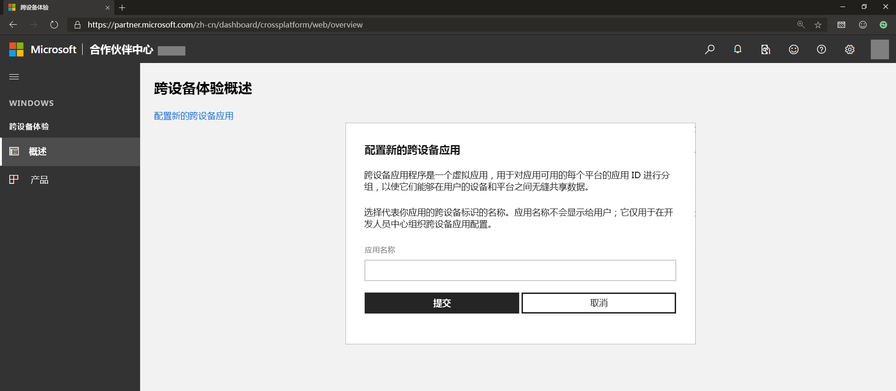
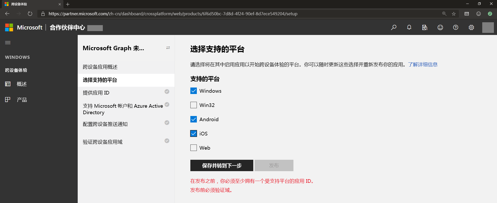
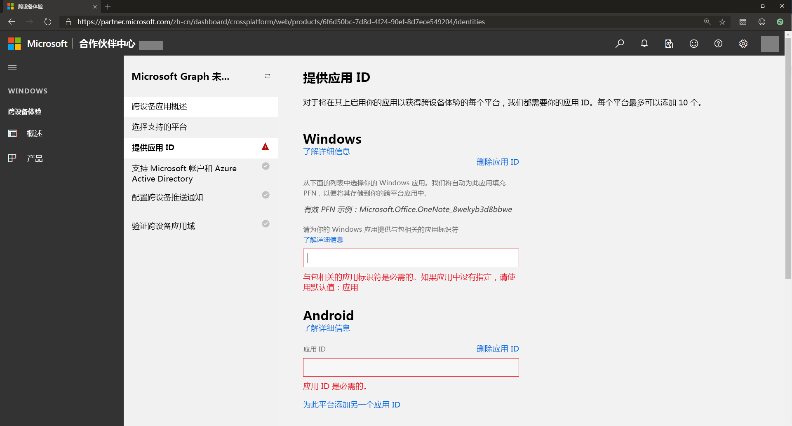
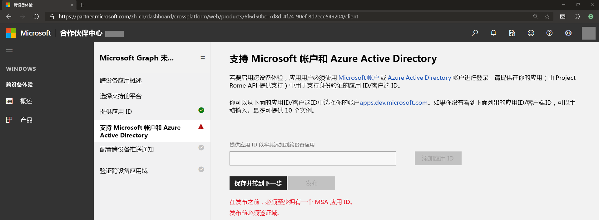
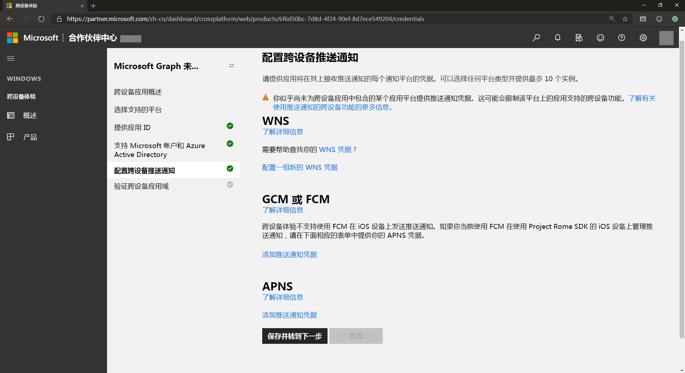
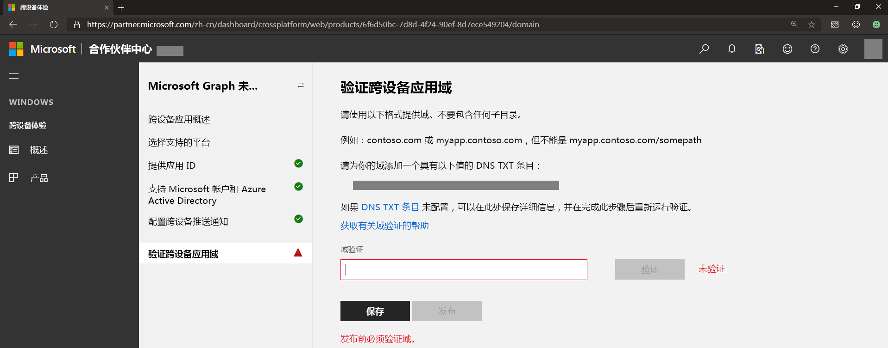

# 载入跨设备 Microsoft Graph 通知体验

除了[在 Azure 门户上](notifications-integration-app-registration.md)注册应用外，应用程序还需要登记跨设备信息，如跨平台应用程序 ID 和跨平台推送凭据，以授权 Microsoft Graph 通过预每个操作系统（Windows、iOS 和 Android）对应的本机推送通知服务发送通知。 这可通过[合作伙伴仪表板（先前的 Windows 开发人员中心仪表板）](https://partner.microsoft.com/dashboard/)完成。 

> [!NOTE]
> 如果没有 Windows 开发人员帐户，则需要创建一个。 有关详细信息，请参阅[开立开发人员帐户](https://docs.microsoft.com/en-us/windows/uwp/publish/opening-a-developer-account)。 即便未计划构建 Windows UWP 应用程序，也需要进行此操作。 如果作为企业的一部分构建学校或工作应用程序，则可以将开发人员帐户与用于管理企业提交的相应 Azure AD 帐户关联在一起。 有关详细信息，请参阅[关联 Azure Active Directory 与合作伙伴中心帐户](https://docs.microsoft.com/en-us/windows/uwp/publish/associate-azure-ad-with-partner-center)。

若要开始使用，请使用 Windows 开发人员帐户（不能使用 Azure AD 帐户）登录到[合作伙伴中心仪表板](https://partner.microsoft.com/en-us/dashboard)：

1.  在左侧菜单上，转至“**跨设备体验**”，选择“**配置新的跨设备应用**”，然后提供应用名称，如下面的屏幕截图所示。

2.  选择应用具有状态且可以接收通知的所有受支持平台。 可以从受支持平台（包括 Windows、Android 和 iOS）中进行选择，如图所示。 

3.  为应用具有状态的每个平台提供应用 ID，如图所示。

 

> [!NOTE] 
> 可以为每个平台添加不同 ID（最多十个） – 这是为了以防同一应用的多个版本或者不同应用希望接收由应用服务器发送的针对相同用户的相同通知。

4.  从 Microsoft 帐户和/或 Azure AD 应用注册提供或选择应用 ID。 此客户端 ID 对应于 Microsoft 帐户或在 Azure 门户中注册时获取的 Azure AD 应用注册。

5.  Microsoft Graph 通知使用所有主要平台上的各个本机通知平台向应用客户端终结点（也就是 WNS - Windows UWP、FCM - Android 和 APNS - iOS）发送通知。 提供这些通知平台的凭据，使 Microsoft Graph 通知在你发布针对用户的通知时传递应用服务器通知，如图所示。

 

> [!NOTE]
> 对于 Windows UWP 应用，启用 WNS 推送通知是使用 Microsoft Graph 通知的前提条件。 有关详细信息，请查阅 [WNS 概述](https://docs.microsoft.com/en-us/windows/uwp/design/shell/tiles-and-notifications/windows-push-notification-services--wns--overview)。 载入后，可以通过合作伙伴中心向连接设备平台提供推送凭据。

6.  验证跨设备应用域，这将用作验证流程以证明你的应用程序拥有此域的所有权。 这就好比所注册的应用的跨设备应用标识，如图所示。
    
    

搞定！ 你现在已注册应用程序以接收通知。 接下来，将 [Microsoft Graph 通知 SDK](https://github.com/microsoft/project-rome) 添加到所选平台的项目中并开始集成。 
