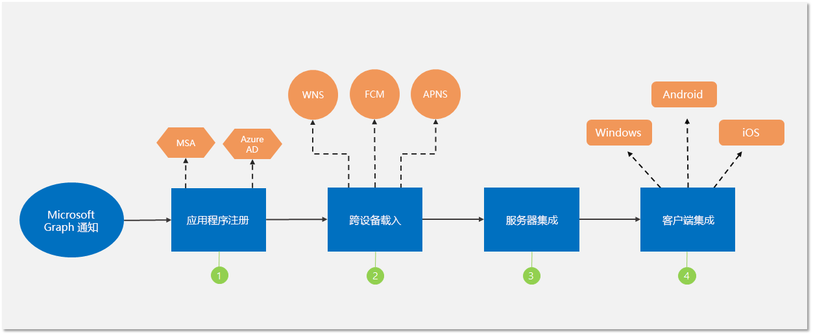

# 与 Microsoft Graph 通知集成（已弃用）

> [!IMPORTANT]
> Microsoft Graph 通知 API 已弃用，并且已于 2022 年 1 月停止返回数据。 有关其他通知体验，请参阅 [Microsoft Azure 通知中心](/azure/notification-hubs)。 更多相关信息，请参阅博客文章 [停用 Microsoft Graph 通知 API (beta 版本)](https://devblogs.microsoft.com/microsoft365dev/retiring-microsoft-graph-notifications/)。

可以通过几个简单的步骤（如下图所示）将应用程序与 Microsoft Graph 通知集成。

1.  在 Microsoft Azure 门户中[注册](notifications-integration-app-registration.md)应用程序。

2. [载入](notifications-integration-cross-device-experiences-onboarding.md)到合作伙伴中心/Windows 开发人员中心，以获取 Windows、iOS 和 Android 的跨平台应用程序标识和推送通知凭据。

3.  [将应用程序服务器](notifications-integrating-app-server.md)设置为通过 Microsoft Graph 发送通知。

4.  [将](notifications-integrating-with-windows.md)新的[通知客户端 SDK](https://aka.ms/GNSDK) 集成到 Windows、iOS、Android 或 Web 客户端，以接收和管理通知。

> [!NOTE]
> 我们建议使用新增和改进的轻型[通知 SDK](https://aka.ms/GNSDK)，而不是跨设备 [Project Rome SDK](https://github.com/microsoft/project-rome)。
