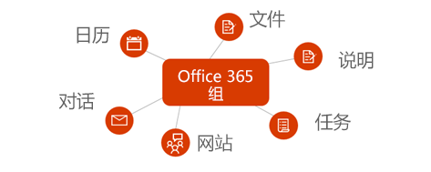
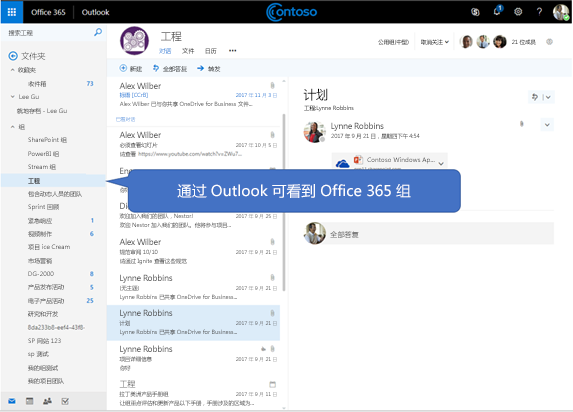

# Microsoft Graph中的Microsoft 365组概述

Office 365 组提供了基本成员身份服务，让用户能够共享对话、文件、笔记、日历、计划和多项其他资产。 

> [!VIDEO https://www.youtube-nocookie.com/embed/WB9w6QM9xIU]

## 为什么要与Microsoft 365组集成？   

各个组会形成一个基础，让用户能够跨服务进行协作和集成，以支持任务计划、团队合作、教育等丰富的应用场景。 与Microsoft 365组集成时，应用程序可以支持数百万用户，因为他们在Microsoft 365套件及更高版本中跨各种体验进行转换。  
 
### 创建组以促进跨服务的团队合作 
 
可以使用Microsoft Graph API 在整个协作生命周期内创建、管理或删除组。例如，可以执行以下操作：  
 
- 使用[创建组](/graph/api/group-post-groups?view=graph-rest-1.0) API 预配一个新组。 然后，该组可用于一系列应用程序，例如 Outlook、SharePoint、Microsoft Teams、Planner，甚至 Microsoft Stream。 Microsoft Graph 可跨这些连接的服务进行同步，以对所有组成员无缝提供访问权限。  
 
    **Microsoft 365组与一组默认Microsoft 365服务集成**

      

- 允许成员指示某个组是他们的[收藏夹](/graph/api/group-addfavorite?view=graph-rest-1.0)之一，或者在他们选择时[将其从收藏夹中删除](/graph/api/group-removefavorite?view=graph-rest-1.0)。 
- 从自定义应用程序中[创建](/graph/api/group-post-conversations?view=graph-rest-1.0)、[获取](/graph/api/group-get-conversation?view=graph-rest-1.0)或[删除](/graph/api/group-delete-conversation?view=graph-rest-1.0)组对话。 
- 在组日历上计划日历[事件](/graph/api/resources/event?view=graph-rest-1.0)。 
- 获取与组关联的 [SharePoint 网站](/graph/api/resources/site?view=graph-rest-1.0)的相关信息，如文档库[列表](/graph/api/list-list?view=graph-rest-1.0)或[子网站](/graph/api/site-list-subsites?view=graph-rest-1.0)。 
- 在 Planner 中[创建一个属于组的计划](/graph/api/planner-post-buckets?view=graph-rest-1.0)。 该计划通过允许[创建任务](/graph/api/planner-post-tasks?view=graph-rest-1.0)（可以[跨存储桶进行组织](/graph/api/planner-post-buckets?view=graph-rest-1.0)），提供了一种直观的方式来跟踪团队合作。 
- 访问与组关联的 [OneNote](/graph/api/resources/onenote?view=graph-rest-1.0) 笔记本，这可用于收集会议记录和整理想法。 
  
    **Outlook 网页中的 Office 365 组和对话**

     

- [为 Microsoft Teams 启用组](/graph/api/team-put-teams?view=graph-rest-beta)（预览版），以允许组成员参与持久聊天。  
- [删除组](/graph/api/group-delete?view=graph-rest-1.0)。 删除组时，所有关联的内容也会一并删除，从而防止孤立的站点、对话或计划。 
 
### 无缝管理组成员身份 
 
Microsoft 365组是共享对Microsoft 服务或应用中资源的访问权限的用户的集合。 由于组成员身份是集中管理的，因此，对成员身份的任何更改都会影响与该组关联的所有服务。 你可使用 Microsoft Graph 执行以下组成员身份任务：
 
- 从现有组中[添加](/graph/api/group-post-members?view=graph-rest-1.0)和[删除](/graph/api/group-delete-members?view=graph-rest-1.0)成员。 
- 获取组的[所有者列表](/graph/api/group-list-owners?view=graph-rest-1.0)或[成员列表](/graph/api/group-list-members?view=graph-rest-1.0)。 这有助于传达哪些人员可以访问组内容，或者哪些人员可能需要执行管理职责，如续订组或批准加入请求。 
- 通过 [更新组](/graph/api/group-update?view=graph-rest-1.0)操作，可将组指定为 **公开**（其中组内容对同一组织中的任何人都可见），或者 **私人**（其中组内容仅对成员可见）。 
- 从组所有者列表中[删除不再参与特定组所有权职责的所有者](/graph/api/group-delete-owners?view=graph-rest-1.0)。 
 
### 建立和维护组策略设置 
 
随着组织内创建的组数量开始增长，Microsoft Graph 支持管理组的使用情况和生命周期的能力。 你可以跨组织中的所有组强制执行组策略。 可以使用 Microsoft Graph API 执行以下操作：

- 配置广泛的[组策略设置](/graph/api/resources/groupsetting?view=graph-rest-1.0)，从而帮助定义行为，例如，除非所有者续订组并对 Office 365 组强制执行命名策略，否则会自动删除组。 
- [续订](/graph/api/group-renew?view=graph-rest-1.0)即将到期的组，以让团队成员继续协作和访问内容。 如果未根据已建立的过期策略续订组，则会自动删除该组。 
- [还原](/graph/api/directory-deleteditems-restore?view=graph-rest-1.0)已删除组。

## API 参考
在查找此服务的 API 参考？

- [Microsoft Graph v1.0 中的组 API](/graph/api/resources/groups-overview?view=graph-rest-1.0)
- [Microsoft Graph beta 中的组 API](/graph/api/resources/groups-overview?view=graph-rest-beta)

## 后续步骤

- 在 [Graph Explorer](https://developer.microsoft.com/graph/graph-explorer) 中尝试一些示例 API 请求。 
- 详细了解如何在 Microsoft Graph 中[使用组 API](/graph/api/resources/groups-overview?view=graph-rest-1.0)。
