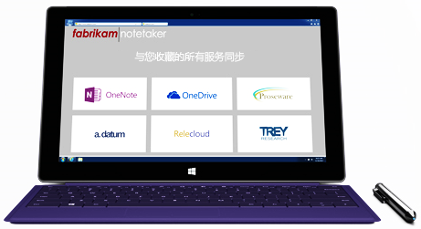

# 针对 OneNote API 开发人员的品牌准则Branding guidelines for OneNote API developers 
 
*__适用于：__ OneDrive 上的消费者笔记本 | Office 365 上的企业级笔记本**__Applies to:__ Consumer notebooks on OneDrive | Enterprise notebooks on Office 365*

请按照本文的指导，将 OneNote 品牌以最佳方式集成到你的产品中，且满足 OneNote 的品牌要求。Follow the guidance in this article to best integrate the OneNote brand within your product and satisfy OneNote branding requirements.

## 可下载的徽标Downloadable logos
可从[针对 OneNote API 开发人员的品牌准则](https://www.microsoft.com/download/details.aspx?id=42977)的下载页面下载本文所示的徽标以及本准则的 PDF 副本。You can download the logos shown in this article and a PDF copy of these guidelines from our [Branding guidelines for OneNote API developers](https://www.microsoft.com/download/details.aspx?id=42977) download page.

## 徽标变体Logo variations

**图标和名称锁定**（首选）**Icon and name lockup** (Preferred)  
图标符号与名称锁定在一起。The icon symbol is locked with the name. 这是 OneNote 徽标的首选图形表示。This is the preferred graphic representation of the OneNote logo.

  

**图标符号****Icon symbol**  
某些情况下，如小型设备，不能为整个锁定徽标提供足够空间。Certain environments, such as on small devices, don't provide enough room for the entire logo lockup. 在这些情况下，可能会在应用或数字营销中使用单独的图标符号。In those cases, the icon symbol alone may be used in an app or in digital marketing. 如果需要在应用中使用一个图标或网站图标来表示 OneNote，可只使用图标符号。The icon symbol alone may be used in an app or in digital marketing. Within an app, use the icon symbol by itself only when you need an icon or favicon to represent onnvshort.

  

## 净空间Clear space 
尊重徽标，并给它足够的空间。徽标四周必须留出相当于符号高度的最小净空间。Treat the logo with respect and give it room to breathe. A minimum clear space equivalent to the height of the symbol must surround the logo.

  

## 最小尺寸Minimum size 
徽标出现在屏幕上时，最低高度应为 16 像素，出现在打印中时，最低高度应为 5 毫米（0.2 英寸）。The logo should be at least 16 pixels high when it appears on-screen and at least 5 mm (0.2 inches) high when it appears in print.

**屏幕：**&nbsp;&nbsp;16 像素**Screen:**&nbsp;&nbsp;16 pixels  
**打印：**&nbsp;&nbsp;5 毫米（0.2 英寸）**Print:**&nbsp;&nbsp;5 mm (0.2 inches) 

  

## 颜色Color
在白色或浅色背景上使用 OneNote 徽标时，首选徽标颜色是其品牌色紫色。When the onnvshort logo is used on white or light backgrounds, the preferred logo color is its brand color, purple: 如果在紫色背景上使用，徽标应转用白色。When it appears on a purple background, the logo should be knocked out to white.

**屏幕：**&nbsp;&nbsp;R128 G57 B123 或 Hex #80397B**Screen:**&nbsp;&nbsp;R128 G57 B123 or Hex #80397B  
**打印：**&nbsp;&nbsp;C75 M100 Y0 K0Print: C75 M100 Y0 K0 

  
 
在有颜色限制的环境和单色设计中，徽标可以显示为黑色。但是，徽标绝不能显示为灰色。In color-limited environments and one-color designs, the logo can appear in black. However, the logo should never appear in gray.
<!--or white?-->

## 徽标禁忌Logo don’ts

**不要将徽标或图标放置在彩色背景上****Don’t place the logo or icon on a color background.**  

**不要更改缩放比例或比例**  Don’t change the scale or the proportions.  

**不要使用投影****Don’t use a drop shadow.**  

**除了黑色或白色以外，不要更改为其他颜色**（参见[颜色](#color)）Don’t change the color, except to black or white. (See Preferred logo color.)  
 

**不要旋转徽标或图标** Don’t rotate the logo or icon.  

**不要重新排列徽标元素****Don’t rearrange the logo elements.**  

**不要使用效果，如延伸和棱台效果****Don’t use an effect such as extrude and bevel.**  

**不要创建新的徽标或图标****Don’t create a new logo or icon.**  

 

## 引用 OneNote 名称Referencing the OneNote name

**全称：**&nbsp;&nbsp;Microsoft OneNote**Full name:**&nbsp;&nbsp;Microsoft OneNote  
**简称：**&nbsp;&nbsp;OneNote**Short name:**&nbsp;&nbsp;OneNote
 
有关在不同上下文中如何引用 OneNote 的详细信息，请参见下表。Refer to the table below for details about how to refer to onnvshort in various contexts.

| 上下文Context | 用法Usage |
|------|------|
| 应用名称App names | 为了不使消费者在应用商店内感到迷惑，我们希望你的应用名称中不包含 *OneNote*。To avoid confusing consumers within the app stores, we prefer that  onnvshort  not be included in the name of your app. If it’s determined that  onnvshort  must be used in the app name,  onnvshort  must be modified by a preposition (for example, for or with): 如果必须在应用名称中使用 OneNote，*OneNote* 之前必须使用介词加以修饰（例如，*for Onenote* 或 *with OneNote*）。If it’s determined that OneNote must be used in the app name, *OneNote* must be modified by a preposition (for example, *for OneNote* or *with OneNote*).  示例：&nbsp;&nbsp;*用于 Onenote 的 Proseware*Example:&nbsp;&nbsp;*Proseware for OneNote*  在任何情况下，应用名称都不能以 OneNote 开头。Under no circumstances can the name of your app begin with onnvshort.
| 发布者名称Publisher names | 发布者的名称不可包括对 OneNote 的引用。The publisher’s name may not include a reference to OneNote. 发布者的名称不可侵犯 Microsoft 的任何商标。The publisher’s name may not include a reference to onnvshort. The publisher’s name may not infringe upon any Microsoft trademarks. |
| 指明与 OneNote 的互操作性Indicating interoperability with onnvshort | **建议：**&nbsp;&nbsp;发送到 OneNote**Recommended:**&nbsp;&nbsp;Send to OneNote  **可接受：**&nbsp;&nbsp;与 OneNote 共享**Acceptable:**&nbsp;&nbsp;Share with OneNote &nbsp;&nbsp;如果引用目的是与其他应用程序“共享”，则可以接受 - 例如，*与 OneNote、Facebook 或 Twitter 共享。*）&nbsp;&nbsp;Acceptable when used in reference to "sharing" with other applications—for example, *Share with OneNote, Facebook, or Twitter.*)  **绝不允许：**&nbsp;&nbsp;保存到 OneNote**Never:**&nbsp;&nbsp;Save to OneNote &nbsp;&nbsp;技术上不支持。This is technically incorrect. |
| 常规市场营销（包括应用描述）General marketing (including app descriptions) | 在通讯中第一次提到时应使用全称：*Microsoft OneNote*。The first mention in a communication should use the full name (onnvlong).  通讯中的后续引用可以使用简称：*OneNote*。Subsequent references in the communication can use the short name (*onnvshort*).
 

## 示例Examples

**应用程序****Applications**

**广告****Advertising**

**网站****website**

**包装****Packaging**

## 另请参阅See also
如果对于此准则有任何疑问，或正在使用此处所示的品牌资产创建新的通讯，请通过 [@onenotedev](http://twitter.com/onenotedev) 与我们联系。If you have any questions about these guidelines or are creating new communications using the brand assets shown here, please submit a request through the  Microsoft Brand Tools Help Center https://brandtools.microsoft.com/HelpCenter/Pages/HelpCenter.aspx .

- [针对 OneNote API 开发人员的品牌准则](https://www.microsoft.com/download/details.aspx?id=42977)（下载页面）Branding guidelines for OneNote API developers
- [与 OneNote 集成Integrate with OneNote](integrate_with_onenote.md)
- [OneNote 开发者博客OneNote Developer Blog](http://go.microsoft.com/fwlink/?LinkID=390183)
- [关于 Stack Overflow 的 OneNote 开发问题OneNote development questions on Stack Overflow](http://go.microsoft.com/fwlink/?LinkID=390182)
- [OneNote GitHub 存储库OneNote GitHub repos](http://go.microsoft.com/fwlink/?LinkID=390178)  

