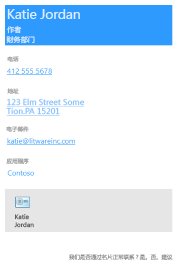
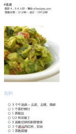
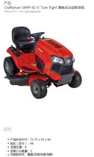

# <a name="use-onenote-api-div-tags-to-extract-data-from-captures"></a>使用 OneNote API div 标记从捕获中提取数据 

**适用于** OneDrive 上的消费者笔记本 | Microsoft 365 上的企业级笔记本

使用 OneNote API 从图像中提取名片数据，或从 URL 中提取食谱和产品数据。

<a name="attributes"></a>

## <a name="extraction-attributes"></a>提取属性

若要提取和转换数据，只需在 [create-page](onenote-create-page.md) 或 [update-page](onenote-update-page.md) 请求中包含一个指定源内容、提取方法和回退行为的 div。 API 以易于阅读的格式在页面上呈现提取的数据。 

```html
<div
  data-render-src="image-or-url"
  data-render-method="extraction-method"
  data-render-fallback="fallback-action">
</div>
```

### <a name="data-render-src"></a>data-render-src

内容源。 这可以是名片的图像或来自许多热门食谱或产品网站的绝对 URL。 必需。

为在指定 URL 时获得最佳结果，请使用源网页的 HTML 中定义的规范 URL（如果已定义）。 例如，规范 URL 可能会在源网页中定义，如下所示：

`<link rel="canonical" href="www.domainname.com/page/123/size12/type987" />` 


### <a name="data-render-method"></a>data-render-method

要运行的提取方法。 必需。

| 值 | 说明 |
|:------|:------|
| extract.businesscard | 名片提取。 |
| extract.recipe | 食谱提取。 |
| extract.product | 产品列表提取。 |
| 提取 | 未知的提取类型。 |

为获得最佳结果，如果你知道的话，请指定内容类型（`extract.businesscard`、`extract.recipe` 或 `extract.product`）。 如果类型未知，请使用 `extract` 方法，OneNote API 将尝试自动检测类型。

### <a name="data-render-fallback"></a>data-render-fallback

提取失败时的回退行为。 如果省略，默认值为 **render**。 

| 值 | 说明 |
|:------|:------|
| 呈现 | 呈现源图片或食谱或产品网页的快照。 |
| 无 | 不执行任何操作。<br /><br />如果希望除任何提取内容外，在页面上始终包含名片或网页的快照，此选项非常有用。 请务必在请求中发送单独的 `img` 元素，如示例中所示。 |

<a name="biz-card"></a>

## <a name="business-card-extractions"></a>名片提取

OneNote API 尝试基于个人或公司的名片图片，查找和呈现以下联系人信息。

- 名称
- 标题
- 组织
- 电话和传真号码
- 邮寄和实际地址
- 电子邮件地址
- 网站




带有提取联系人信息的 vCard（.VCF 文件）也会嵌入到页面中。检索页面 HTML 内容时，vCard 是获取联系人信息的便捷方式。

### <a name="common-scenarios-for-business-card-extractions"></a>名片提取的常见情况

#### <a name="extract-business-card-information-and-also-render-the-business-card-image"></a>提取名片信息，并且呈现名片图像

指定 `extract.businesscard` 方法和 `none` 回退。 此外，发送 `src` 属性同样引用图像的 `img` 元素。 如果 API 无法提取任何内容，则只会呈现名片图像。

```html 
<div
    data-render-src="name:scanned-card-image"
    data-render-method="extract.businesscard"
    data-render-fallback="none">
</div>

```


#### <a name="extract-business-card-information-and-render-the-business-card-image-only-if-the-extraction-fails"></a>提取名片信息，并且仅在提取失败时呈现名片图像

指定 `extract.businesscard` 方法并使用默认的 `render` 回退。 如果 API 无法提取任何内容，则会改为呈现名片图像。

```html
<div
    data-render-src="name:scanned-card-image"
    data-render-method="extract.businesscard">
</div>
```
 
对于名片提取，图像作为多部分请求中的指定部件发送。 请参阅[添加图像和文件](onenote-images-files.md)，查看有关说明如何在请求中发送图像的示例。


<a name="recipe"></a>

## <a name="recipe-extractions"></a>食谱提取

OneNote API 尝试基于食谱的 URL 查找和呈现以下信息。

- 主图
- 评级
- 食材
- 说明
- 准备时间、烹饪时间和总时间
- 份数




API 已针对很多热门网站（如 *Allrecipes.com*、*FoodNetwork.com* 和 *SeriousEats.com*）上的食谱进行了优化。

### <a name="common-scenarios-for-recipe-extractions"></a>食谱提取的常见情况

#### <a name="extract-recipe-information-and-also-render-a-snapshot-of-the-recipe-webpage"></a>提取食谱信息，并呈现食谱网页的快照

指定 `extract.recipe` 方法和 `none` 回退。 此外，发送 `data-render-src` 属性设置为食谱 URL 的 `img` 元素。 如果 API 无法提取任何内容，则只会呈现食谱网页的快照。

本方案提供的信息可能最多，因为网页可能包含客户评论和建议等其他信息。

```html 
<div
    data-render-src="https://allrecipes.com/recipe/guacamole/"
    data-render-method="extract.recipe"
    data-render-fallback="none">
</div>

```
 

#### <a name="extract-recipe-information-and-render-a-snapshot-of-the-recipe-webpage-only-if-the-extraction-fails"></a>提取食谱信息，并且仅在提取失败时呈现食谱网页的快照

指定 `extract.recipe` 方法，并使用默认呈现回退。 如果 API 无法提取任何内容，则会改为呈现食谱网页的快照。

```html  
<div
    data-render-src="https://www.foodnetwork.com/recipes/alton-brown/creme-brulee-recipe.html"
    data-render-method="extract.recipe">
</div>
```


#### <a name="extract-recipe-information-and-also-render-a-link-to-the-recipe"></a>提取食谱信息，并呈现指向食谱的链接

指定 `extract.recipe` 方法和 `none` 回退。 此外，发送 `src` 属性设置为食谱 URL 的 `a` 元素（也可以发送要添加到页面的任何其他信息）。 如果 API 无法提取任何内容，则只会呈现食谱链接。

```html  
<div
    data-render-src="https://www.seriouseats.com/recipes/2014/09/diy-spicy-kimchi-beef-instant-noodles-recipe.html"
    data-render-method="extract.recipe"
    data-render-fallback="none">
</div>
<a href="https://www.seriouseats.com/recipes/2014/09/diy-spicy-kimchi-beef-instant-noodles-recipe.html">Recipe URL</a>
``` 


<a name="product"></a>

## <a name="product-listing-extractions"></a>产品列表提取

- 标题
- 评级
- 原始图象
- 说明
- 功能
- 规格




API 已针对很多热门网站（如 *Amazon.com* 和 *HomeDepot.com*）上的产品进行了优化。

### <a name="common-scenarios-for-recipe-extractions"></a>食谱提取的常见情况

#### <a name="extract-product-information-and-also-render-a-snapshot-of-the-product-webpage"></a>提取产品信息，并呈现产品网页的快照

指定 `extract.product` 方法和 `none` 回退。 此外，发送 `data-render-src` 属性设置为产品 URL 的 `img` 元素。 如果 API 无法提取任何内容，则只会呈现产品网页的快照。

本方案提供的信息可能最多，因为网页可能包含客户评论和建议等其他信息。

```html 
<div
    data-render-src="https://www.amazon.com/Microsoft-Band-Small/dp/B00P2T2WVO"
    data-render-method="extract.product"
    data-render-fallback="none">
</div>

```


#### <a name="extract-product-information-and-render-a-snapshot-of-the-product-webpage-only-if-the-extraction-fails"></a>提取产品信息，并且仅在提取失败时呈现产品网页的快照

指定 `extract.product` 方法，并使用默认呈现回退。 如果 API 无法提取任何内容，则会改为呈现产品网页的快照。

```html 
<div
    data-render-src="https://www.sears.com/craftsman-19hp-42-8221-turn-tight-174-hydrostatic-yard-tractor/p-07120381000P"
    data-render-method="extract.product">
</div>
```
 

#### <a name="extract-product-information-and-also-render-a-link-to-the-product"></a>提取产品信息，并呈现指向产品的链接

指定 `extract.product` 方法和 `none` 回退。 此外，发送 `src` 属性设置为产品 URL 的 `a` 元素（也可以发送要添加到页面的任何其他信息）。 如果 API 无法提取任何内容，则只会呈现页面链接。

```html 
<div
    data-render-src="https://www.homedepot.com/p/Active-Ventilation-5-Watt-Solar-Powered-Exhaust-Attic-Fan-RBSF-8-WT/204203001"
    data-render-method="extract.product"
    data-render-fallback="none">
</div>
<a href="https://www.homedepot.com/p/Active-Ventilation-5-Watt-Solar-Powered-Exhaust-Attic-Fan-RBSF-8-WT/204203001">Product URL</a>
```


<a name="unknown"></a> 

## <a name="unknown-content-type-extractions"></a>未知内容类型提取

如果不知道要发送的内容类型（名片、食谱还是产品），可以使用未限定的 `extract` 方法，让 OneNote API 自动检测类型。 如果你的应用发送不同的捕获类型，则你可能需要这样做。

> [!NOTE]
> 如果知道要发送的内容类型，则应使用`extract.businesscard``extract.recipe`该方法或`extract.product`方法。 在某些情况下，这将有助于优化提取结果。
 
### <a name="common-scenarios-for-unknown-extractions"></a>未知提取的常见情况

#### <a name="send-an-image-or-a-url-and-render-the-supplied-image-or-a-snapshot-of-the-webpage-if-the-extraction-fails"></a>发送图像或 URL，并在提取失败时呈现提供的网页图像或快照

指定 `extract` 方法，以便 API 自动检测内容类型，并使用默认呈现回退。 如果 API 无法提取任何内容，则会改为呈现提供的图像或网页快照。

```html 
<div
    data-render-src="some image or url"
    data-render-method="extract">
</div>
```


<a name="request-response-info"></a>

## <a name="response-information"></a>响应信息

| 响应数据 | 说明 |  
|------|------|  
| 成功代码 | 成功的 POST 请求的 HTTP 状态代码为 201，成功的 PATCH 请求的 HTTP 状态代码为 204。 |  
| 错误| 请阅读 [Microsoft Graph 中 OneNote API 的错误代码](onenote-error-codes.md)，以了解 Microsoft Graph 可以返回的 OneNote 错误。 |  


<a name="permissions"></a>

## <a name="permissions"></a>权限

若要创建或更新 OneNote 页面，需要请求相应的权限。 选择应用运行所需的最低级别的权限。

#### <a name="permissions-for-post-pages"></a>POST 页面的权限

- Notes.Create
- Notes.ReadWrite
- Notes.ReadWrite.All  

#### <a name="permissions-for-patch-pages"></a>PATCH 页面的权限

- Notes.ReadWrite
- Notes.ReadWrite.All

有关权限范围及其工作方式的详细信息，请参阅 [Microsoft Graph 权限引用](permissions-reference.md)。


<a name="see-also"></a>

## <a name="see-also"></a>另请参阅

- [创建 OneNote 页](onenote-create-page.md)
- [更新 OneNote 页内容](onenote-update-page.md)
- [添加图像和文件](onenote-images-files.md)
- [与 OneNote 集成](integrate-with-onenote.md)
- [OneNote 开发者博客](https://go.microsoft.com/fwlink/?LinkID=390183)
- [Microsoft Q&A 上的 OneNote 开发问题](/answers/topics/microsoft-graph-notes.html)
- [OneNote GitHub 存储库](https://go.microsoft.com/fwlink/?LinkID=390178)
