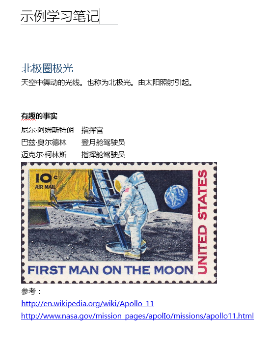

# <a name="input-and-output-html-in-onenote-pages"></a>OneNote 页中的输入和输出 HTML

[创建](onenote-create-page.md)或 [更新](onenote-update-page.md) OneNote 页时定义页面内容和结构的 HTML 被称为 *输入 HTML*。 

[获取页面内容](onenote-get-content.md)时返回的 HTML 被称为 *输出 HTML*。 输出 HTML 与输入 HTML 存在差别。

Microsoft Graph 中的 OneNote API 保留输入 HTML 的语义内容和基本结构，但会将其转换为一组[受支持的 HTML 元素和 CSS 属性](onenote-create-page.md#supported-html-and-css-for-onenote-pages)。 API 还添加支持 OneNote 功能的自定义属性。
 
本文介绍输入和输出 HTML 的主体元素和属性。 它可以帮助你理解创建或更新页面内容时的输入 HTML 以及分析返回的页面内容时的输出 HTML。 

## <a name="body-element"></a>body 元素

页面正文中的 HTML 内容表示页面内容和结构，包括图像和文件资源。**body** 元素可以在输入和输出 HTML 中包含下列属性。

#### <a name="input-attributes"></a>输入属性

|输入属性|说明|
|:------|:------|
| data-absolute-enabled | 指示输入正文是否支持[绝对定位](onenote-abs-pos.md)元素。 |
| style | <p>正文的 CSS [style](#styles) 属性。 在输出 HTML 中，可能在相应的子元素上内嵌返回输入设置。</p><p>**body** 元素当前不支持背景色。</p> |
 

#### <a name="output-attributes"></a>输出属性

|输出属性|说明|
|:------|:------|
| data-absolute-enabled | 指示正文是否支持[绝对定位](onenote-abs-pos.md)元素。 在输出 HTML 中始终为 **true**。 |
| style | 正文的 **font-family** 和 **font-size** 属性。 |


## <a name="div-elements"></a>div 元素

**Div** 元素包含文本、图像和其他内容。 **div** 元素可以在输入和输出 HTML 中包含下列属性。

#### <a name="input-attributes"></a>输入属性

|输入属性|说明|
|:------|:------|
| data-id | 元素的引用。<br/><br/>用于[更新页面内容](onenote-update-page.md)。 |
| data-render-fallback | [提取](onenote-extract-data.md)失败时的回退操作：**render**（默认）或 **none** |
| data-render-method | 要执行的[提取](onenote-extract-data.md)方法，例如：<br/>`extract.businesscard` 或 `extract.recipe` |
| data-render-src | [提取](onenote-extract-data.md)的内容源。 |
| style | div 的位置、大小、字体和颜色属性： <ul><li>**位置**（仅限 **绝对**）、**左侧**、**顶部** 和 **宽度**（会为 div 自动配置高度）<br/><br/>用于创建[绝对定位](onenote-abs-pos.md) div（仅在正文设置 `data-absolute-enabled="true"` 且 div 是正文的直接子级时）。<br/><br/>示例：`<div style="position:absolute;width:360px;top:350px;left:300px" ... />`</li><li>元素的 CSS [样式](#styles)属性。在输出 HTML 中，这些值在适当的子元素上内嵌返回。</li></ul> |
 

Microsoft Graph 中的 OneNote API 至少在一个 div 中包装所有正文内容。 在以下情况下，API 创建一个默认 div（使用 `data-id="_default"` 设定属性）以包含正文内容：

- 将输入 body 元素的 **data-absolute-enabled** 属性省略或设置为 **false**。在这种情况下，所有的正文内容都放置在默认 div 中。

- 输入 body 元素的 **data-absolute-enabled** 属性为 **true**，但输入 HTML 包含的直接子级不是 [绝对定位](onenote-abs-pos.md)  **div**、**img** 或 **object** 元素。 在此情况下，不是 [绝对定位](onenote-abs-pos.md)  **div**、**img** 或 **object** 元素的直接子级被设置为默认的 div。


#### <a name="output-attributes"></a>输出属性

|输出属性|说明|
|:------|:------|
| data-id | 元素的引用。<br/><br/>用于[更新页面内容](onenote-update-page.md)。 |
| id | 元素的唯一生成的 ID。 使用 `includeIDs=true` 查询选项时，由 [对页面的 *content* 终结点的 GET 请求](/graph/api/page-get?view=graph-rest-1.0)返回。<br/><br/>用于[更新页面内容](onenote-update-page.md)。 |
| style | div 的位置和大小属性。 |
 
### <a name="non-contributing-divs"></a>非贡献 div

当输入 HTML 中的 **div** 元素不对页面结构做出贡献或带有 OneNote 所使用的信息时，此 API 将 div 的内容移动到父 div 或默认 div。 下面的示例对此进行了说明。

#### <a name="input-html"></a>输入 HTML

包含非贡献嵌套 div。

```html
<html>
    <head>
        <title>Page Title</title>
    </head>
    <body>
        <div>
            <p>Some text</p>
            <div>
                <p>More text inside a div that doesn't define page structure</p>
            </div>
        </div>
    </body>
</html>
```

#### <a name="output-html"></a>输出 HTML

> **注意**：div 的内容已被移至父 div 且嵌套的 `<div>` 标记已被删除。 如果 div 定义了任何语义信息，例如 **data-id**（示例：`<div data-id="keep-me">`），则保留该 div。

```html
<html htmlns="https://www.w3.org/1999/xhtml" lang="en-US">
    <head>
        <title>Page Title</title>
    </head>
    <body data-absolute-enabled="true" style="font-family:Calibri;font-size:11px">
        <div data-id="_default" style="position:absolute;left:48px;top:120px;width:624px">
            <p>Some text</p>
            <p>More text inside a nested div</p>
        </div>
    </body>
</html>
```


## <a name="img-elements"></a>img 元素

OneNote 页上的图像由 **img** 元素表示。 **img** 元素可以在输入和输出 HTML 中包含下列属性。

#### <a name="input-attributes"></a>输入属性

|输入属性|说明|
|:------|:------|
| alt | 为此图像提供的替换文字。 |
| data-id | 元素的引用。<br/><br/>用于[更新页面内容](onenote-update-page.md)。 |
| data-render-src |需要 **data-render-src** 或 **src**。<br/><br/>在 OneNote 页上显示为位图图像的网页：<br/><br/> - `data-render-src="https://..."` 表示公共 URL。<br/><br/> - `data-render-src="name:BlockName"` 表示[多部分请求](/graph/api/section-post-pages?view=graph-rest-1.0#example)的“演示文稿”块中的图像部分。<br/><br/>如果网页比 OneNote 页能够忠实呈现的内容更为复杂，或者页面需要登录凭据，则此方法很有用。|
| data-tag | 元素上的[笔记标记](onenote-note-tags.md)。 |
| style |图像的位置和大小属性：**位置**（仅限 **绝对**）、**左侧**、**顶部**、**宽度** 和 **高度**。<br/><br/>可在任何图像上设置大小。<br/><br/>位置属性用于创建[绝对定位](onenote-abs-pos.md)图像（仅在正文设置 `data-absolute-enabled="true"` 且图像是正文的直接子级时）。<br/><br/>示例：``<br/><br/>在输出 HTML 中，图像大小分别以 **width** 和 **height** 属性返回。 |
| src |需要 **src** 或 **data-render-src**。<br/><br/>要在 OneNote 页上呈现的图像：<br/><br/>- `src="https://..."` 表示 Internet 上公开可用图像的 URL。<br/><br/> - `src="name:BlockName"` 表示代表此图像的多部分请求中的已命名部分。|
| width，height | 图像的宽度或高度，以不带 px 的像素为单位。 示例：`width="400"` |
 
> **注意：** OneNote API 自动检测输入图像类型，并在输出 HTML 中将其返回为 **data-fullres-src-type**。 此外，API 还会在 **data-src-type** 中返回优化图像的图像类型。
 

#### <a name="output-attributes"></a>输出属性

|输出属性|说明|
|:------|:------|
| alt | 为此图像提供的替换文字。 |
| data-id | 元素的引用。<br/><br/>用于[更新页面内容](onenote-update-page.md)。 |
| data-index | 此图像的位置。用于支持[拆分图像](#split-images)。 |
| data-fullres-src | 最初嵌入在页面中的图像资源版本的终结点。 |
| data-fullres-src-type | **data-fullres-src** 资源的媒体类型，例如：`image/png` 或 `image/jpeg`。 |
| data-options | 源类型：PDF 文件的源类型为 **printout**，而所有其他文件的源类型为 **splitimage**。仅适用于使用 **data-render-src** 属性创建的 [拆分图像](#split-images)。 |
| data-render-original-src | 此图像的原始源 URL，前提是该源图像来自公共 Internet，且使用 **data-render-src** 属性创建。 |
| data-src-type | **src** 资源的媒体类型，例如：`image/png` 或 `image/jpeg`。 |
| data-tag | 元素上的[笔记标记](onenote-note-tags.md)。 |
| id | 元素的唯一生成的 ID。 使用 `includeIDs=true` 查询选项时，由 [对页面的 *content* 终结点的 GET 请求](/graph/api/page-get?view=graph-rest-1.0)返回。<br/><br/>用于[更新页面内容](onenote-update-page.md)。 |
| src | 已针对 Web 浏览器以及移动设备和平板电脑外形规格进行优化的图像资源版本的终结点。 |
| style | 此图像的位置属性。 |
| width、height | 此图像的宽度或高度，以像素为单位。 |
 

### <a name="output-html-examples-for-images"></a>图像的输出 HTML 示例

输出 **img** 元素包含图像文件资源的终结点和图像类型，如下所示。 可以发出单独的[图像资源终结点的 GET 请求](/graph/api/resource-get?view=graph-rest-1.0)，以检索其二进制内容。

```html

```

以下示例说明 **img** 元素在输出 HTML 中可能包含的信息。

#### <a name="image-with-web-ready-and-high-resolution-resources"></a>带有 Web 安全和高分辨率资源的图像

```html

```

#### <a name="image-created-by-using-the-data-render-src-attribute"></a>通过使用 *data-render-src* 属性创建的图像

```html

```

### <a name="split-images"></a>拆分图像

由于性能和呈现原因，使用 **data-render-src** 属性从网页 URL 或已命名部件创建的图像可能拆分为多个组件图像。为所有组件图像分配相同的 **data-id** 值。每个组件图像都具有基于零的 data-index 属性，该属性定义原始的垂直布局。

#### <a name="split-image-with-three-component-images"></a>带有三个组件图像的拆分图像

```html
<div data-id="multi-component-image" style="position:absolute;left:48px;top:120px;width:624px">
    
    
    
</div>
```

用户可以在页面上移动图像，因此返回的索引可能是无序的。 排序方法应采用从上到下的 Y 轴排序，如果 Y 轴顺序存在冲突，则从左到右按 X 轴进行排序。

## <a name="iframe-elements"></a>iframe 元素

OneNote 页可包含由 **iframe** 元素所表示的嵌入的视频。 

> **注意：** 也可以 [使用 **object** 元素附加视频文件](onenote-images-files.md#adding-files)。

#### <a name="input-attributes"></a>输入属性

|输入属性|说明|
|:------|:------|
| data-original-src | 必需。 视频源的 URL。 请参阅[受支持的视频源的列表](onenote-images-files.md#adding-videos)。 <br/><br/>示例：`data-original-src="https://www.youtube.com/watch?v=3Ztr44aKmQ8"` |
| width，height | iframe 的宽度或高度，以像素为单位。 示例：`width=300` |

#### <a name="output-attributes"></a>输出属性

|输出属性|说明|
|:------|:------|
| data-original-src | 视频源的 URL。 |
| src | 在 OneNote 页中嵌入的视频的链接。 |
| width，height | iframe 的宽度或高度，以像素为单位。<br/><br/>示例：`width=300` |
 
### <a name="output-html-example-for-videos"></a>视频的输出 HTML 示例

输出 **iframe** 元素包含链接到源页面和视频的终结点，如下所示。 

```html
<iframe 
    width="340" height="280" 
    data-original-src="https://www.youtube.com/watch?v=3Ztr44aKmQ8" 
    src="https://www.youtube.com/embed/3Ztr44aKmQ8?feature=oembed&autoplay=true" />
``` 

## <a name="object-elements"></a>object 元素

OneNote 页可包含由 **object** 元素表示的文件附件。 **object** 元素可以在输入和输出 HTML 中包含下列属性。

> **注意：** 将文件发送为图像并使用 **data-render-src** 属性时，OneNote API 还可以将此文件的内容呈现为页面中的图像。
> 示例：``
 

#### <a name="input-attributes"></a>输入属性

|输入属性|说明|
|:------|:------|
| data | 必需。表示 [多部分请求](/graph/api/section-post-pages?view=graph-rest-1.0#example) 中文件的部件的名称。 |
| data-attachment | 必需。文件名。 |
| data-id | 元素的引用。<br/><br/>用于[更新页面内容](onenote-update-page.md)。 |
| style | 对象的位置和大小属性：**位置**（仅限 **绝对**）、**左侧**、**顶部** 和 **宽度**。<br/><br/>用于创建[绝对定位](onenote-abs-pos.md)对象（仅在正文设置 `data-absolute-enabled="true"` 且对象是正文的直接子级时）。<br/><br/>示例：`<object style="position:absolute;top:350px;left:300px" ... />` |
| type | 必需。<br/><br/>标准媒体文件类型。 已知文件类型显示与 OneNote 页上的文件类型相关联的图标。 已知文件类型显示通用文件图标。 |
<!--todo: add link to known file types--> 

#### <a name="output-attributes"></a>输出属性

|输出属性|说明|
|:------|:------|
| data | 文件资源的终结点。 |
| data-attachment | 文件名。 |
| data-id | 元素的引用。<br/><br/>用于[更新页面内容](onenote-update-page.md)。 |
| id | 元素的唯一生成的 ID。 使用 `includeIDs=true` 查询选项时，由 [对页面的 *content* 终结点的 GET 请求](/graph/api/page-get?view=graph-rest-1.0)返回。<br/><br/>用于[更新页面内容](onenote-update-page.md)。 |
| style | 此对象的位置属性。 |
| type | 标准媒体文件类型。 |
 

#### <a name="output-html-example-for-objects"></a>对象的输出 HTML 示例

输出 **object** 元素包含链接到页面中的文件资源的终结点，如下所示。 可以发出单独的[文件资源终结点的 GET 请求](/graph/api/resource-get?view=graph-rest-1.0)，以检索其二进制内容。

```html
<object
    data="https://graph.microsoft.com/v1.0/me/onenote/resources/{file-id}/$value"
    data-attachment="fileName.pdf" 
    type="application/pdf" 
    [style="..."] />
``` 

## <a name="paragraphs-and-headings"></a>段落和标题

段落、标题和其他文本容器可以在输入和输出 HTML 中包含下列属性。

#### <a name="input-attributes"></a>输入属性

|输入属性|说明|
|:------|:------|
| data-id | 元素的引用。<br/><br/>用于[更新页面内容](onenote-update-page.md)。 |
| data-tag | **p** 或 **h1** - **h6** 元素上的 [笔记标记](onenote-note-tags.md)。 |
| style | 此元素的 CSS [style](#styles) 属性。 |
 

#### <a name="output-attributes"></a>输出属性

|输出属性|说明|
|:------|:------|
| data-id | 元素的引用。<br/><br/>用于[更新页面内容](onenote-update-page.md)。 |
| data-tag | **p** 或 **h1** - **h6** 元素上的 [笔记标记](onenote-note-tags.md)。 |
| id | 元素的唯一生成的 ID。 使用 `includeIDs=true` 查询选项时，由 [对页面的 *content* 终结点的 GET 请求](/graph/api/page-get?view=graph-rest-1.0)返回。<br/><br/>用于[更新页面内容](onenote-update-page.md)。 |
| style | 此元素的 CSS [style](#styles) 属性。 在输出 HTML 中，可能在相应的子元素或 **span** 元素上内嵌返回这些值。 |
 

以下示例显示使用不同方法定义文本容器样式的输入 HTML 和返回的输出 HTML。

#### <a name="input-html-with-styles-defined-using-inline-character-styles-in-the-start-tag-and-within-a-span-element"></a>在 span 元素的起始标记中使用内联字符样式定义样式的输入 HTML。

```html
<h1>Heading <i>One</i> text</h1>
<p style="font-size:8pt;color:green;font-family:Courier;text-align:center">Some text</p>
<p>Some <span  style="font-size:16px;color:#ff0000;font-family:Segoe UI Black">more</span> text</p>
``` 

#### <a name="output-html-with-the-i-character-style-and-the-font-settings-in-the-p-start-tag-returned-as-inline-css-styles-on-span-elements"></a>带有 `<i>` 字符样式以及 `<p>` 起始标记中的字体设置的输出 HTML 作为 span 元素上的内联 CSS 样式返回。

```html
<h1 style="font-size:16pt;color:#1e4e79;margin-top:11pt;margin-bottom:11pt">Heading <span style="font-style:italic">One</span> text</h1>
<p style="text-align:center"><span style="font-family:Courier;font-size:8pt;color:green">Some text</span></p>
<p>Some <span style="font-family:Segoe UI Black;font-size:12pt;color:red">more</span> text</p>
``` 


## <a name="lists"></a>列表

列表表示为包含由 **li** 元素所表示的列表项的 **ol** 或 **ul** 元素。

列表和列表项可以在输入和输出 HTML 中包含下列属性。

#### <a name="input-attributes"></a>输入属性

|输入属性|说明|
|:------|:------|
| data-id | 元素的引用。<br/><br/>用于[更新页面内容](onenote-update-page.md)。 |
| data-tag | **ul**、**ol** 或 **li** 元素上的 [笔记标记](onenote-note-tags.md)。 |
| style | 列表或列表项的 **list-style-type** 和 CSS [style](#styles) 属性。 |
 

#### <a name="output-attributes"></a>输出属性

|输出属性|说明|
|:------|:------|
| data-id | 元素的引用。<br/><br/>用于[更新页面内容](onenote-update-page.md)。 |
| data-tag |  **li** 元素中的 span 上的 [笔记标记](onenote-note-tags.md)。 |
| id | 元素的唯一生成的 ID。 使用 `includeIDs=true` 查询选项时，由 [对页面的 *content* 终结点的 GET 请求](/graph/api/page-get?view=graph-rest-1.0)返回。<br/><br/>用于[更新页面内容](onenote-update-page.md)。 |
| style | 元素的 **list-style-type** 和 CSS [style](#styles) 属性。 在输出 HTML 中，在列表项上返回列表级别设置。 不会返回默认属性。 |
 
### <a name="list-styles"></a>列表样式

Microsoft Graph 中的 OneNote API 支持以下列表样式：

|已排序列表|未排序列表|
|:------|:------|
| 无 | 无 |
| decimal (default) | disc (default) |
| lower-alpha | circle |
| lower-roman | square |
| upper-alpha | &nbsp; |
| upper-roman | &nbsp; |
 
您可以在输入 HTML 中对 **ol** 或 **ul** 元素上的列表应用全局样式，但样式在 **li** 元素上返回。

#### <a name="homogenous-list-style"></a>同源列表样式

本示例显示了在 **ol** 元素上设置列表样式类型以及在单独列表项上设置 CSS 样式的输入 HTML。

```html
<ol style="list-style-type:upper-roman;color:blue">
    <li style="font-weight:bold">Jacksonville</li>
    <li style="text-decoration:line-through">Orlando</li>
    <li style="font-family:Courier">Naples</li>
</ol>
``` 

这是输出 HTML。请注意，这些样式在单独 **li** 或 **span** 元素上内嵌返回。

```html
<ol>
    <li style="list-style-type:upper-roman"><span style="color:blue;font-weight:bold">Jacksonville</span></li>
    <li style="list-style-type:upper-roman"><span style="color:blue;text-decoration:line-through">Orlando</span></li>
    <li style="list-style-type:upper-roman"><span style="font-family:Courier;color:blue">Naples</span></li>
</ol>
``` 

#### <a name="variable-list-styles"></a>变量列表样式

本示例显示了在 **li** 元素上设置不同列表样式类型的输入 HTML。

```html
<ul style="font-style:italic">
    <li style="list-style-type:square">square style</li>
    <li style="list-style-type:circle">circle style</li>
    <li style="list-style-type:disc">disc style (default)</li>
</ul>
``` 

这是输出 HTML。请注意，这些样式在单独 **li** 或 **span** 元素上内嵌返回。

```html
<ul>
    <li style="list-style-type:square"><span style="font-style:italic">square style</span></li>
    <li style="list-style-type:circle"><span style="font-style:italic">circle style</span></li>
    <li><span style="font-style:italic">disc style (default)</span></li>
</ul>
``` 


## <a name="tables"></a>表

这些表表示为可以包含 **tr** 和 **td** 元素的 **table** 元素。支持嵌套表。

表可以在输入和输出 HTML 中包含下列属性。 OneNote API 不支持 **rowspan** 或 **colspan** 属性。 

#### <a name="input-attributes"></a>输入属性

|输入属性|说明|
|:------|:------|
| data-id | 元素的引用。<br/><br/>用于[更新页面内容](onenote-update-page.md)。 |
| style | 此元素的 CSS [style](#styles) 属性，以及：<br/> - **width**。 受 **table** 和 **td** 支持作为页面宽度的像素或百分比。<br/><br/>示例：`width="100px"` 或 `width="60%"` |
| 边框 | 添加边框至指定宽度的表格 |
| 宽度 | 表格宽度 |
| bgcolor | 表格背景色 |

**注意：** 在输入 html 中不支持使用表格样式属性中“**边框**”属性。 
 

#### <a name="output-attributes"></a>输出属性

|输出属性|说明|
|:------|:------|
| data-id | 元素的引用。<br/><br/>用于[更新页面内容](onenote-update-page.md)。 |
| id | 元素的唯一生成的 ID。 使用 `includeIDs=true` 查询选项时，由 [对页面的 *content* 终结点的 GET 请求](/graph/api/page-get?view=graph-rest-1.0)返回。<br/><br/>用于[更新页面内容](onenote-update-page.md)。 |
| style | 此元素的 CSS [style](#styles) 属性。 |
 

以下示例显示使用不同方法定义表样式的输入 HTML和返回的输出 HTML。

#### <a name="input-html-with-optional-settings-at-different-levels"></a>具有不同级别可选设置的输入 HTML

```html
<table border="1"; Width="500"; bgcolor = "green">
    <tr> 
        <td>Cell 1</td> 
        <td>Cell 2</td> 
        <td>Cell 3</td> 
    </tr> 
    <tr style="background-color:blue"> 
        <td style="text-align:right;background-color:red">Left</td> 
        <td style="text-align:center">Middle</td> 
        <td>Right</td> 
    </tr> 
</table>
```
 
#### <a name="output-html-with-css-styles-returned-inline-on-the-td-elements"></a>具有 CSS 样式的输出 HTML 在 td 元素上内嵌返回

```html
<table style="border:0px">
    <tr>
        <td style="background-color:green;width:166;border:0px">Cell 1</td>
        <td style="background-color:green;width:166;border:0px">Cell 2</td>
        <td style="background-color:green;width:166;border:0px">Cell 3</td>
    </tr>
    <tr>
        <td style="background-color:red;width:166;border:0px;text-align:right">Left</td>
        <td style="background-color:blue;width:166;border:0px;text-align:center">Middle</td>
        <td style="background-color:blue;width:166;border:0px">Right</td>
    </tr>
</table>
``` 


## <a name="styles"></a>样式

Microsoft Graph 中的 OneNote API 支持页面正文中元素的以下内联 CSS **style** 属性，如 **body**、**div**、**p**、**li** 和 **span**。

|属性|示例|
|:------|:------|
| background-color | `style="background-color:#66cc66"`（默认为白色）<br/><br/>支持十六进制格式和命名颜色。 |
| color | `style="color:#ffffff"`（默认为黑色） |
| font-family | `style="font-family:Courier"`（默认为 Calibri） |
| font-size | `style="font-size:10pt"`（默认为 11pt）<br/><br/>API 接受 *pt* 或 *px* 的字体大小，但会将 *px* 转换为 *pt*。 十进制值被四舍五入为最接近的 n.0pt 或 n.5pt。 |
| font-style | `style="font-style:italic"`（正常或仅倾斜） |
| font-weight | `style="font-weight:bold"`（正常或仅加粗） |
| strike-through | `style="text-decoration:line-through"` |
| text-align | `style="text-align:center"`（仅适用于块元素） |
| text-decoration | `style="text-decoration:underline"`（无或仅加下划线） |
 

另外，还支持下列内联字符样式：

<table id="simpletable">
<tr>
<td id="simplecell"><b></td>
<td id="simplecell"><i></td>
<td id="simplecell"><u></td>
</tr>
<tr>
<td id="simplecell"><em></td>
<td id="simplecell"><strong></td>
<td id="simplecell"><strike></td>
</tr>
<tr>
<td id="simplecell"><sup></td>
<td id="simplecell"><sub></td>
<td id="simplecell"><del></td>
</tr>
<tr>
<td id="simplecell"><cite></td>
<td id="simplecell">&nbsp;</td>
<td id="simplecell">&nbsp;</td>
</tr>
</table>

 
## <a name="input-and-output-html-example"></a>输入和输出 HTML 示例

下图显示了使用 Microsoft Graph 创建的简单页面。



这是在创建页面的邮件正文中发送的输入 HTML。

```html
<html lang="en-US">
    <head>
        <title>Sample Study Notes</title>
        <meta name="created" content="2015-01-01T01:01"/>
    </head>
    <body>
        <h1>Aurora Borealis</h1>
        <p>Dancing lights in the sky. Also called <i>Northern Lights</i>. Caused by solar radiation.</p>
        <br />
        <p><b>Intersting facts</b></p>
        <table>
            <tr>
                <td>Neil Armstrong</td>
                <td>Commander</td>
            </tr>
            <tr>
                <td>Buzz Aldrin</td>
                <td>LM Pilot</td>
            </tr>
            <tr>
                <td>Michael Collins</td>
                <td>Command Module Pilot</td>
            </tr>
        </table>
        
        <p>References:</p>
        <p><a href="https://en.wikipedia.org/wiki/Apollo_11">https://en.wikipedia.org/wiki/Apollo_11</a></p>
        <p><a href="https://www.nasa.gov/mission_pages/apollo/missions/apollo11.html">https://www.nasa.gov/mission_pages/apollo/missions/apollo11.html</a></p>
    </body>
</html>
``` 

<br/>

这是[获取页面内容](onenote-get-content.md)时 Microsoft Graph 返回的输出 HTML。

> **注意：**[创建页面](onenote-create-page.md)或 [获取页面元数据](/graph/api/page-get?view=graph-rest-1.0)时，API 返回 **contentUrl** 属性中的页面的 *content* 终结点 URL。

```html
<html htmlns="https://www.w3.org/1999/xhtml" lang="en-US">
    <head>
        <title>Sample Study Notes</title>
    </head>
    <body data-absolute-enabled="true" style="font-family:Calibri;font-size:11pt">
        <div data-id="_default" style="position:absolute;left:48px;top:120px;width:624px">
            <h1 style="font-size:16pt;color:#1e4e79;margin-top:11pt;margin-bottom:11pt">American History 101: Moon Landing</h1>
            <p>First moon landing - July 20, 1969 with Apollo 11 (Eagle)</p>
            <br />
            <p><span style="font-weight:bold">Apollo 11 Astronauts</span></p>
            <table style="border:0px">
                <tr>
                    <td style="border:0px">Neil Armstrong</td>
                    <td style="border:0px">Commander</td>
                </tr>
                <tr>
                    <td style="border:0px">Buzz Aldrin</td>
                    <td style="border:0px">LM Pilot</td>
                </tr>
                <tr>
                    <td style="border:0px">Michael Collins</td>
                    <td style="border:0px">Command Module Pilot</td>
                </tr>
            </table>
            <br />
            
            <p>References:</p>
            <p><a href="https://en.wikipedia.org/wiki/Apollo_11">https://en.wikipedia.org/wiki/Apollo_11</a></p>
            <p><a href="https://www.nasa.gov/mission_pages/apollo/missions/apollo11.html">https://www.nasa.gov/mission_pages/apollo/missions/apollo11.html</a></p>
        </div>
    </body>
</html>
``` 

## <a name="see-also"></a>另请参阅

- [获取 OneNote 内容和结构](onenote-get-content.md)
- [创建 OneNote 页](onenote-create-page.md)
- [更新 OneNote 页内容](onenote-update-page.md)
- [添加图像、视频和文件](onenote-images-files.md)
